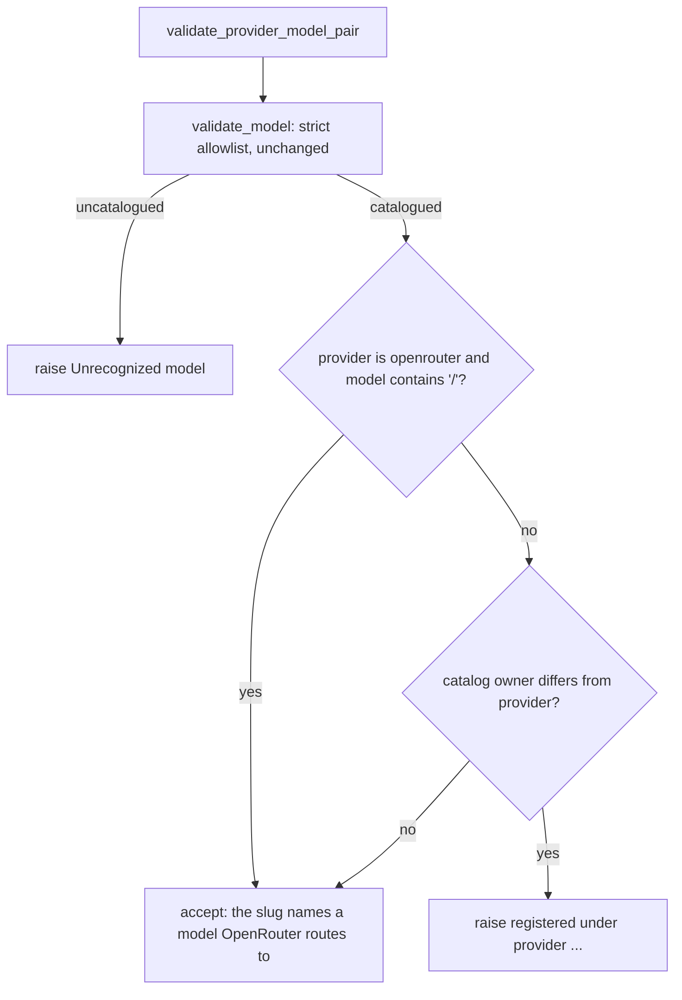

# OpenRouter Slug Ownership

## Summary

OpenRouter names upstream models as `vendor/model` slugs such as `anthropic/claude-sonnet-5`, and the runner accepts them (#663). The YAML path still rejected them: `ProviderModelRegistry.validate_provider_model_pair` looked the slug up, found the catalog key `anthropic/claude-sonnet-5`, and raised because its owner `anthropic` is not `openrouter`. An OpenRouter slug now skips the ownership check, so YAML and the Python constructor agree.

## Flow chart



## Usage example

```yaml
type: base
name: router
system_prompt: Route requests.
provider: openrouter
model_name: anthropic/claude-sonnet-5
```

```python
from vidbyte.config import YamlLoader

settings = YamlLoader().load_agent("router.yaml")  # provider openrouter, model anthropic/claude-sonnet-5
```

## How it works

`validate_provider_model_pair` returns after the allowlist check when the declared provider is OpenRouter and the model contains a slash, tagged `@intent openrouter-slugs-pass-ownership-check`. This mirrors the runner's `vendor-slug-ids-resolve-by-bare-name` and `openrouter-keeps-its-own-model-ids` rules. `validate_model` is unchanged, so an uncatalogued slug such as `meta-llama/llama-4-maverick` is still rejected, and every other provider still gets the ownership check.

## Files

- `vidbyte/lib/registries/models.py`: the OpenRouter early return in `validate_provider_model_pair`.
- `tests/test_agent_settings_validation.py`: one regression test for the slug, `openrouter/auto`, an uncatalogued slug, and a non-router mismatch.

## Risks

A bare cross-vendor name under OpenRouter (`claude-sonnet-5`) still fails the ownership check, which is intended: OpenRouter needs the vendor slug on the wire.

## Verification

Run the new test, `python lint/run.py`, and `python scripts/run_ci.py`.
