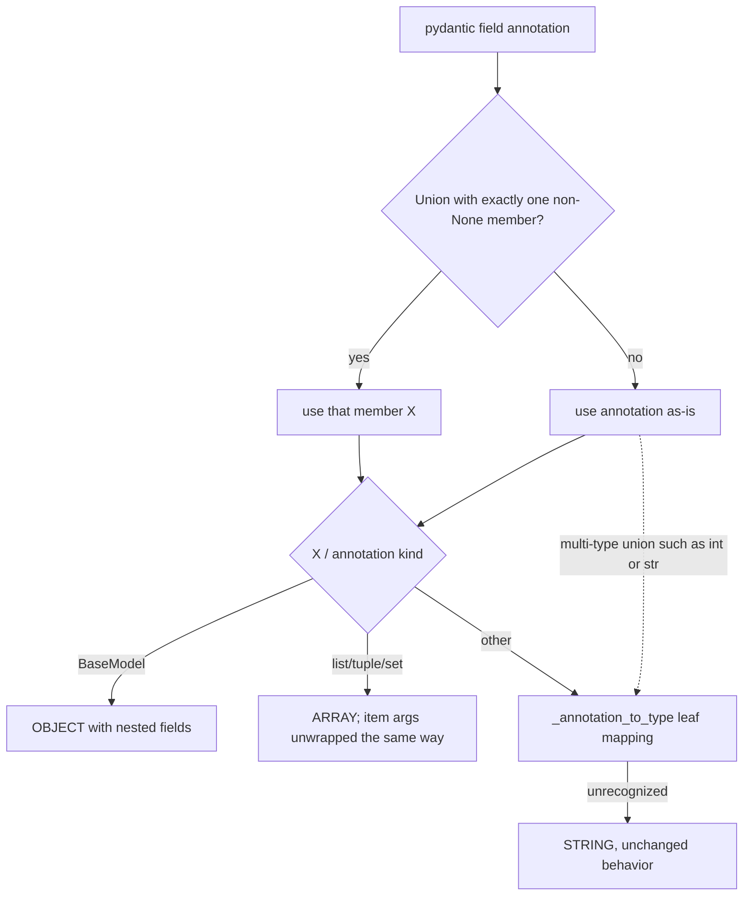

# Optional trace fields keep their declared type

## Summary

`TraceSchema.from_model` maps each pydantic field annotation to a `TraceFieldType`, but it never unwrapped `Optional[X]` / `X | None`. The union's origin (`typing.Union` / `types.UnionType`) matched no branch, so every optional field fell through to `STRING`. Trace fields always start at `None` (`initial_artifact()`), so developers naturally annotate custom trace models as optional; with the bug, `UpdateTraceTool` then rejected every correctly typed update (`output shape mismatch: confidence expected string`), optional arrays lost their append merge, and optional submodels lost their nested shape. The fix unwraps a union whose only non-`None` member is one type to that type before mapping it.

## Flow chart



## Usage example

```python
from typing import Optional
from pydantic import BaseModel, Field
from vidbyte import TraceSchema

class Owner(BaseModel):
    name: str = Field(description="Owner name.")

class SreTrace(BaseModel):
    summary: str | None = Field(None, description="One-line summary.")
    confidence: float | None = Field(None, description="Confidence 0-1.")
    blockers: list[str] | None = Field(None, description="Open blockers.")
    owner: Optional[Owner] = Field(None, description="Current owner.")
    pages: int | None = Field(None, description="Pages sent.")

schema = TraceSchema.from_model(SreTrace)
# summary -> string, confidence -> number, blockers -> array (append merge),
# owner -> object with fields {name: string}, pages -> integer
```

## How it works

A small static helper `TraceSchema._unwrap_optional(annotation)` returns `X` when the annotation is a `typing.Union` / `types.UnionType` whose non-`None` members are exactly one type, and returns the annotation unchanged otherwise. `_field_from_annotation` applies it to the field annotation before any inspection (so `_annotation_to_type` never sees a union class) and to each list item argument before handing them to `_item_field_from_args`. Multi-type unions such as `int | str` are left alone and still map to `STRING`; no general union support is added.

## Files changed

- `vidbyte/lib/dataclasses/trace.py` — the helper and two call sites in `_field_from_annotation`.
- `tests/test_continual_trace.py` — regression tests.

## Risks

- Prebuilt schemas use `str | None` in a few submodel fields; those already mapped to `STRING` and still do (verified by diffing every prebuilt schema's declared shape before and after).

## Verification

Regression tests assert the declared types of an optional-annotated model (number/array/object-with-fields/integer/string), that `int | str` still maps to string, and that an `UpdateTraceTool` built from the schema accepts `{"confidence": 0.8, "blockers": ["x"], "owner": {"name": "a"}}`. Then `python lint/run.py` and `python scripts/run_ci.py`.
