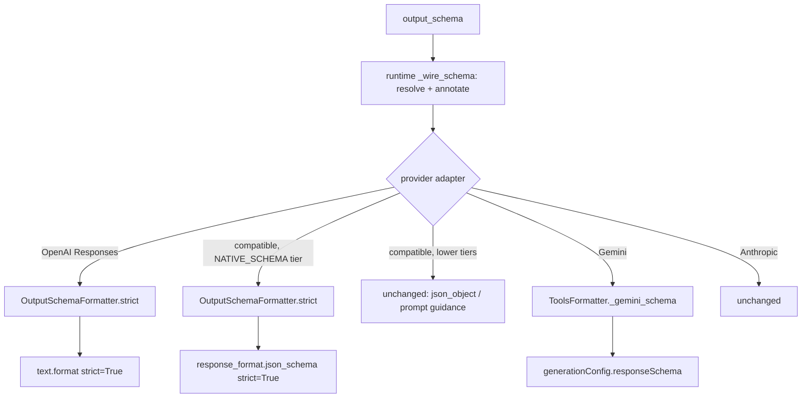

# Output Schema Provider Dialect

## Summary

A `BaseAgent.output_schema` reaches providers as Pydantic's raw `model_json_schema()` (plus constraint
annotation). Two providers reject that dialect outright:

- **OpenAI strict mode** (Responses `text.format` and the compatible adapter's `NATIVE_SCHEMA` tier) needs
  every object to set `additionalProperties: false` and list every property in `required`. Pydantic emits
  neither, so every structured call fails with 400 `invalid_json_schema`, even for `answer: str`.
- **Gemini `responseSchema`** is an OpenAPI subset; the `$defs`/`$ref` Pydantic emits for any nested model
  or Enum fail the request.

The fix rewrites the schema into each dialect at the adapter that sends it.

## Flow chart



## Usage example

```python
from typing import Optional
from pydantic import BaseModel
from vidbyte import Agent

class Tag(BaseModel):
    label: str

class Ticket(BaseModel):
    title: str
    assignee: Optional[str] = None
    tags: list[Tag]

agent = Agent(name="triage", system_prompt="Triage.", provider="openai",
              model_name="gpt-5.4-mini", output_schema=Ticket)
result = agent.run("Login page 500s for SSO users")
result.structured.assignee  # None when the model returns null; the request is no longer rejected
```

## How it works

- `OutputSchemaFormatter.strict(schema)` deep-copies the schema and, for every node with `properties`,
  sets `additionalProperties: false` when absent and, when the node is closed, sets `required` to every
  property key in declaration order. It walks the same children as `annotate()` (properties, items,
  `$defs`/`definitions`, anyOf/oneOf/allOf), now shared through `_child_nodes`. A node that explicitly
  declares `additionalProperties` other than `false` is left alone.
- Only adapters that send `strict: True` call it. Response validation is unchanged: Pydantic still
  validates, and Optional fields arrive as `null`.
- Gemini passes `response_format` through the existing `ToolsFormatter._gemini_schema` reducer that tool
  declarations already use. No second reducer.

## Files

- `vidbyte/providers/output_schema.py`: add `strict()`, `_strict_node()`, `_child_nodes()`.
- `vidbyte/providers/openai.py`, `vidbyte/providers/compatible.py`: apply `strict()` where `strict: True` is sent.
- `vidbyte/providers/gemini.py`: reduce `responseSchema` with `ToolsFormatter._gemini_schema`.
- `tests/test_output_schema_provider_dialect.py`: regression tests.

Not changed: the Anthropic adapter and the runtime's `_wire_schema`.

## Risks

- Making defaulted fields required means the model must emit them; Pydantic accepts the emitted value.
- Schemas with open maps (`dict[str, X]`) remain unsupported by OpenAI strict mode, as before.

## Verification

- New tests: strict rules hold at every object node (including `$defs`) for the OpenAI and compatible
  payloads; Gemini payload has no `$defs`/`$ref`.
- `python lint/run.py`, `python scripts/run_ci.py`, and the a95 probe (`ok` on every line).
