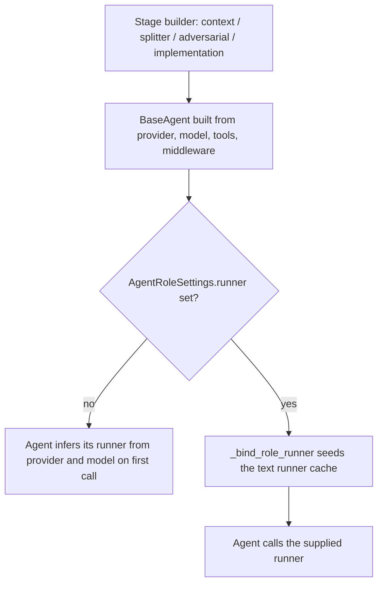

# Context-minimal fanout: drop the removed `runner=` argument

## Summary

`ContextMinimalFanoutParadigm` built every stage agent with `BaseAgent(..., runner=...)`, an argument `BaseAgent` stopped accepting in #257. Every run therefore raised `TypeError` before any model call. The fix stops passing `runner=` and, when `AgentRoleSettings.runner` is set, seeds it into the agent's runner cache, the mechanism the SDK already uses to hand a pre-built runner to another agent (`ContinualTraceAgent.from_source_agent`, handoff generators, the offline test fixtures).

## Flow chart



## Usage example

```python
from vidbyte.paradigms import AgentRoleSettings, ContextMinimalFanoutParadigm, ContextMinimalFanoutSettings

role = AgentRoleSettings(provider="deepseek", model_name="deepseek-v4-flash", api_key="sk-...", runner=my_runner)
paradigm = ContextMinimalFanoutParadigm(ContextMinimalFanoutSettings(context=role, splitter=role, adversarial=role, implementation=role))
result = await paradigm.arun("Add retry support to the HTTP client.")
```

## How it works

- The three `BaseAgent(...)` calls in `paradigm.py` no longer pass `runner=`.
- A new helper, `_bind_role_runner(agent, role_settings)`, is called by all three builders. When `role_settings.runner` is not `None` it sets `agent._runner_cache[RUNNER_TYPE_TEXT]`. Every stage agent is a text agent, and `BaseAgent._runner_for_model` returns the cached runner for the resolved text runner type, so the supplied runner is used instead of a newly built one.
- Raising a `ConfigurationError` instead (option b) was rejected: the cache seed is a one-line use of an existing mechanism and keeps the public `runner` field meaningful.

## Files

- `vidbyte/paradigms/context_minimal_fanout/paradigm.py`: drop `runner=`, add `_bind_role_runner`.
- `tests/test_context_minimal_fanout_agents.py`: offline regression tests.

## Risks

- `BaseAgent` still resolves the runner type from provider and model before reading the cache, so a role with a supplied runner must still name a text model. That was already true of every other pre-built-runner path.
- Model fallback runners are built by `AgentFallback`, not this cache, and are unaffected.

## Verification

- New tests build the planning and implementation agents with and without a supplied runner, and run the context stage end to end on a scripted runner. They fail with the original `TypeError` on `main`.
- `python lint/run.py` and `python scripts/run_ci.py`.
