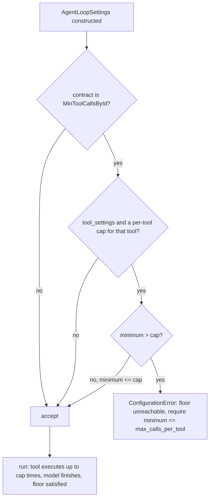

# Per-tool floor may equal its per-tool cap

## Summary

`AgentLoopSettings` rejects a `MinToolCallsById(tool_name, minimum)` floor when
`minimum >= ToolSettings.max_calls_per_tool[tool_name]`, calling the floor
"unreachable". That is an off-by-one. The strict `minimum < ceiling` rule is right
for the global ceilings (`max_iterations`, `max_tokens`, `max_tool_calls`,
`timeout_seconds`), because reaching one of them stops the run before the model can
finish. A per-tool cap does not stop the run: `ToolSettings.denial()` only refuses a
call to that tool once it has already run `limit` times. So with a cap of 2 the agent
can run the tool exactly twice and then finish, which satisfies a floor of 2. The fix
rejects only floors that truly cannot be met: `minimum > limit`.

## Flow chart



## Usage example

```python
from vidbyte.agents.contracts import MinToolCallsById
from vidbyte.agents.settings import AgentLoopSettings, ToolSettings

# Accepted now: the agent may call web_search exactly twice and must call it twice.
settings = AgentLoopSettings(
    tool_settings=ToolSettings(max_calls_per_tool={"web_search": 2}),
    output_contracts=(MinToolCallsById("web_search", 2),),
    max_iterations=6,
)

# Still rejected: three calls can never happen when only two are allowed.
AgentLoopSettings(
    tool_settings=ToolSettings(max_calls_per_tool={"web_search": 2}),
    output_contracts=(MinToolCallsById("web_search", 3),),
)  # ConfigurationError: ... (require minimum <= max_calls_per_tool)
```

## How it works

`_validate_tool_calls_by_id_ceiling` in `vidbyte/agents/settings/loop.py` changes its
comparison from `minimum >= limit` to `minimum > limit` and its message to
"(require minimum <= max_calls_per_tool)". `_validate_contract_ceiling`, which guards
the run-stopping global ceilings, is unchanged.

### `on_deny` interaction

`on_deny` (`"continue"` or `"abort"`) only matters once a call is denied. The per-tool
denial in `ToolSettings.denial()` fires when `executed_counts[tool] >= limit`, that is
on call number `limit + 1`. With `minimum == limit` the model needs only `limit` calls,
none of which is denied, so the `"abort"` path in `AgentRuntime._apply_tool_denial`
is never taken on the way to satisfying the floor. The floor is reachable under both
modes. A regression test runs this exact case with `on_deny="abort"`.

## Files changed

- `vidbyte/agents/settings/loop.py`: the comparison, its message, an `@intent` comment.
- `tests/features/sdk_loop_settings/test_contract.py`: equality accepted, `limit + 1` rejected.
- `tests/features/sdk_loop_settings/FEATURE.md`: historical regression note.
- `tests/test_agent_tool_loop.py`: offline run with cap 2, floor 2, `on_deny="abort"`
  finishing with `final_response`.
- `skills/agentic-loop-settings/SKILL.md`: the validation table row stated `>=`.

## Risks

Low. The change only accepts a configuration that used to raise. No runtime path changes.

## Verification

`python lint/run.py` and `python scripts/run_ci.py`, then the required CI checks on the PR.
