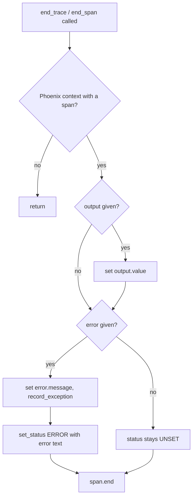

# Phoenix Error Span Status

## Summary

`PhoenixTracer.end_trace` and `end_span` record a failure with `record_exception`, but in OpenTelemetry that only adds an `exception` event; the span status stays `UNSET`, which Phoenix and every other OTel backend show as a success. A failed agent run (`agent.run`) and a failed provider call (`llm.call`) therefore look healthy, and filtering Phoenix for errors finds nothing. The Langfuse and LangSmith adapters already mark failures explicitly. This change sets the span status to `ERROR`, with the error text as its description, whenever an error is passed.

## Flow chart



## Usage example

```python
from vidbyte import Agent
from vidbyte.providers.tracing import PhoenixTracer

agent = Agent(system_prompt="You are helpful.", tracer=PhoenixTracer())
try:
    agent.run("Summarize this.")
except Exception:
    pass
# In Phoenix, the agent.run span and the failing llm.call span now show
# status ERROR with the error message, and appear under error filters.
```

## How it works

When `error is not None`, both methods additionally call
`context.span.set_status(self._trace_module.Status(self._trace_module.StatusCode.ERROR, str(error)))`.
`self._trace_module` is the `opentelemetry.trace` module already captured in `__init__`, so OpenTelemetry stays an optional, lazily imported dependency. The existing `error.message` attribute, `record_exception` call, and swallow-all `except Exception` are unchanged. Successful spans are left `UNSET` (not set to `OK`), matching OTel guidance for instrumentation libraries.

## Files changed

- `vidbyte/providers/tracing/phoenix.py`: one `set_status` call (plus a comment) in `end_trace` and in `end_span`.
- `tests/test_tracing.py`: regression tests. A fake-span suite runs everywhere (CI does not install OpenTelemetry); a real-SDK test using `InMemorySpanExporter` runs when `opentelemetry-sdk` is installed and is skipped otherwise.

## Risks and open questions

- Out of scope: how the runtime ends tool spans.
- If `set_status` itself raised, the span would not be ended; this matches the existing behavior of every other call in that `try` block and is not expected with real OTel spans.

## Verification

- New tests fail without the fix and pass with it.
- `python lint/run.py` and `python scripts/run_ci.py` pass locally; required CI checks pass on the PR.
