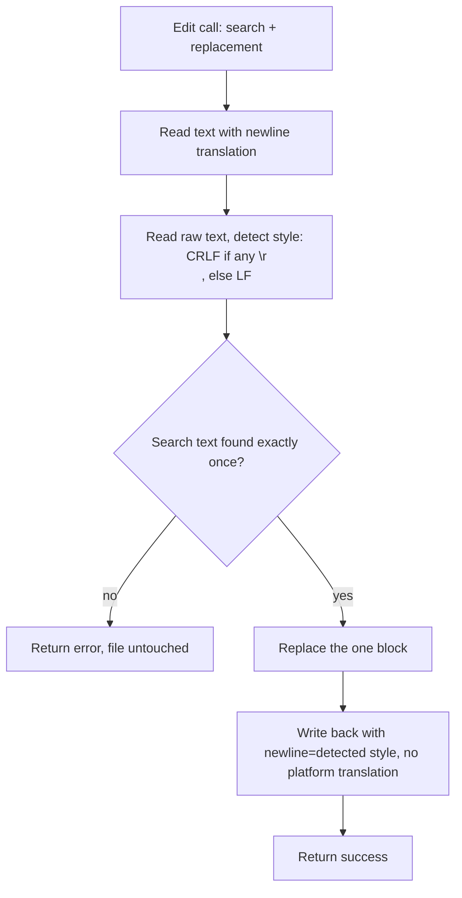

# Preserve Line Endings On In-Place Edits

## Summary

`PatchTool` (`patch_file`) and the filesystem `ReplaceTextTool` (`replace_text`) read a file with universal-newline translation (`\r\n` becomes `\n`) and write it back with platform translation (`\n` becomes `os.linesep`). Replacing one block therefore rewrites every line ending in the file: on Windows an LF file becomes CRLF, and on Linux/macOS a CRLF file becomes LF. That produces whole-file VCS diffs from a one-line edit and breaks shell scripts that pick up CRLF. This change makes both tools write the file back with the newline style it already had.

## Flow chart



## Usage example

```python
from pathlib import Path
from vidbyte.tools.builtins.editing import PatchTool
from vidbyte.tools.types import ToolCall

Path("repo/run.sh").write_bytes(b"#!/bin/sh\necho 2\n")  # LF file
await PatchTool("repo").execute(
    ToolCall("patch_file", {"file_path": "run.sh", "search_block": "echo 2\n", "replace_block": "echo 3\n"})
)
assert Path("repo/run.sh").read_bytes() == b"#!/bin/sh\necho 3\n"  # still LF on every OS
```

## How it works

- New helper `detect_newline(text) -> str` in `vidbyte/lib/tools/filesystem/newlines.py`: returns `"\r\n"` when the untranslated text contains `"\r\n"`, else `"\n"`.
- `PatchTool.execute` keeps `read_text` (so model-supplied `\n` search blocks still match CRLF files), detects the style from `read_bytes().decode(encoding)`, and writes with `path.open("w", encoding=..., newline=style)`.
- `BaseFileSystemBackend.write_text` / `LocalFileSystemBackend.write_text` gain an optional keyword `newline: str | None = None`; `None` keeps today's behavior. `ReplaceTextTool` detects the style via `backend.read_binary(...)` and passes it.
- `write_text` / `append_text` tools that write brand-new content are unchanged.

## Files

- `vidbyte/lib/tools/filesystem/newlines.py` (new), `vidbyte/lib/tools/filesystem/backends/base.py`, `vidbyte/lib/tools/filesystem/backends/local.py`
- `vidbyte/tools/builtins/editing/patch.py`, `vidbyte/tools/filesystem/replace_text.py`
- `tests/test_patch_tool.py`, `tests/test_filesystem_tools.py`

## Risks / open questions

- Mixed-ending files are normalized to CRLF if any CRLF line exists (same as today on Windows); a majority-vote rule is out of scope.
- Third-party backends that override `write_text` without the new keyword would get a `TypeError` from `ReplaceTextTool`; none exist in this repo.

## Verification

Regression tests write LF and CRLF files as bytes, run one single-block edit through each tool, and assert the resulting bytes exactly (unchanged lines keep their endings) — platform-independent, so they hold on Linux CI and Windows. Then `python scripts/run_ci.py` and `python lint/run.py`.
