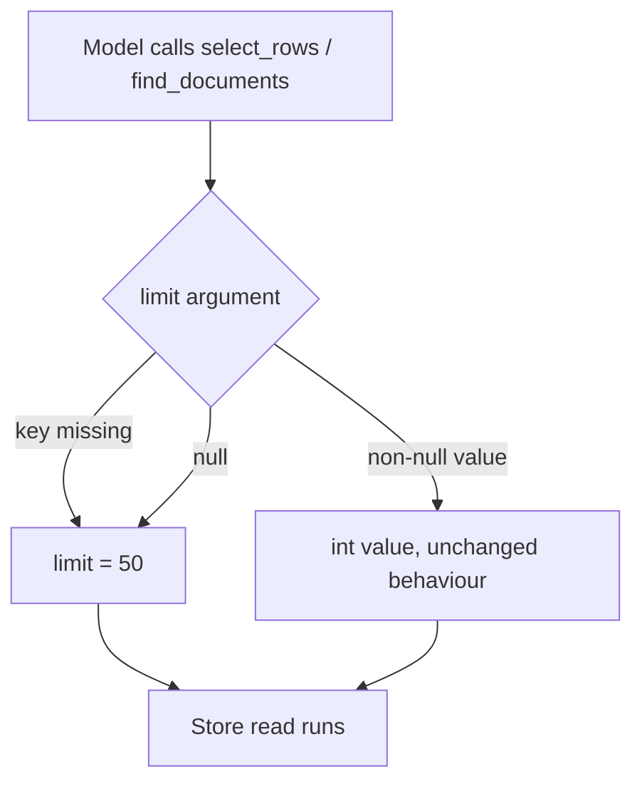

# Null Limit on Provider Read Tools Means the Default

## Summary

Since #701, an explicit JSON `null` on a declared-optional tool argument means its documented default
(`BaseTool._optional_argument`, intent `null-optional-arg-means-default`). Two provider read tools were
missed: `ProviderSelectRowsTool` (`<provider>_select_rows`) and `MongoFindDocumentsTool`
(`mongodb_find_documents`) read `limit` with `int(call.arguments.get("limit", 50))`, so `limit: null`
became `int(None)` and the read failed with a `TypeError` tool error. `limit` is optional and documented
as "defaults to fifty when omitted". On the same call, a null `where`/`query` and a null `schema` were
already treated as omitted; this change gives `limit` the same rule.

## Flow chart



## Usage example

```python
from vidbyte.lib.providers.sqlite import SqliteSessionStore
from vidbyte.tools.builtins import ProviderSelectRowsTool
from vidbyte.tools.types import ToolCall

store = SqliteSessionStore(path="inventory.db")
select = ProviderSelectRowsTool(store, provider_name="sqlite")
# Behaves exactly like {"table": "items"}: up to fifty rows, no filter, default schema.
await select.execute(ToolCall("sqlite_select_rows", {"table": "items", "where": None, "limit": None, "schema": None}))
```

## How it works

Both call sites read `limit` through `self._optional_argument(call, "limit", default=50)` before the
existing `int(...)` conversion. Missing or null yields 50; any other value passes through unchanged, so
non-null behaviour (including the error for a non-integer limit) is identical.

## Files changed

- `vidbyte/tools/builtins/providers/rows.py` — `ProviderSelectRowsTool.execute`.
- `vidbyte/tools/builtins/providers/mongodb.py` — `MongoFindDocumentsTool.execute`.
- `tests/test_provider_row_tools.py` (new) — SQLite `select_rows` with `limit: null` returns rows like an omitted limit.
- `tests/test_mongodb_tools.py` — `find_documents` with `limit: null` passes `limit=50` to the fake store.

## Risks

None beyond the two lines: the default value and non-null handling are unchanged.

## Verification

New regression tests, `python lint/run.py`, `python scripts/run_ci.py`, remote CI, and the bug-hunt probe
`a309_rows_null_limit.py` printing `BAD total 0`.
