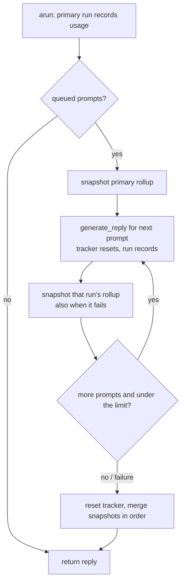

# Queued Prompt Drain Keeps Usage

## Summary

`BaseAgent._generate_reply` drains queued prompts (from the `run_prompts_sequentially` builtin or `enqueue_prompts`) after the primary reply by calling `generate_reply` once per prompt. Each of those runs starts with `self._usage_tracker.reset()`, so after one `arun()` the tracker held only the last drained run. `get_usage()` and `get_cost_usd()` under-reported, and a nested agent merged only that last run into its parent ledger, which breaks `@intent every-call-is-recorded-or-counted`. The fix keeps each run's rollup during the drain and restores all of them onto the tracker when the drain ends.

## Flow chart



## Usage example

```python
agent.enqueue_prompts(["first follow-up", "second follow-up"])
reply = await agent.arun("primary")
usage = agent.get_usage()
assert usage.model_call_count == 3          # primary + two drained runs
assert agent.get_cost_usd() == usage.cost_usd
```

## How it works

In `_drain_queued_prompts`, take `self._usage_tracker.rollup()` before the loop, and after each drained `generate_reply` (in a `finally`, so a failed run's recorded usage is kept). In the outer `finally`, `reset()` the tracker and `merge()` every snapshot in order. `UsageTracker.merge` reindexes call indices and carries unaccounted counts and the corruption flag, so nothing is repriced or lost. The parent-ledger merge in `generate_reply` reads `get_usage()` after the drain, so it now sees every run.

## Files

- `vidbyte/agents/base.py`: `_drain_queued_prompts` only.
- `tests/test_queued_prompt_usage.py`: new regression tests.

## Risks and scope

The speed tracker and the `behavior` view are untouched and still reflect the last drained run. The primary reply's metadata keeps the usage it captured before the drain.

## Verification

New tests prove call count, tokens, and cost cover the primary run plus every drained run, that a failing drained run keeps the earlier runs, and that a parent ledger receives all of them. Then `python lint/run.py` and `python scripts/run_ci.py`.
