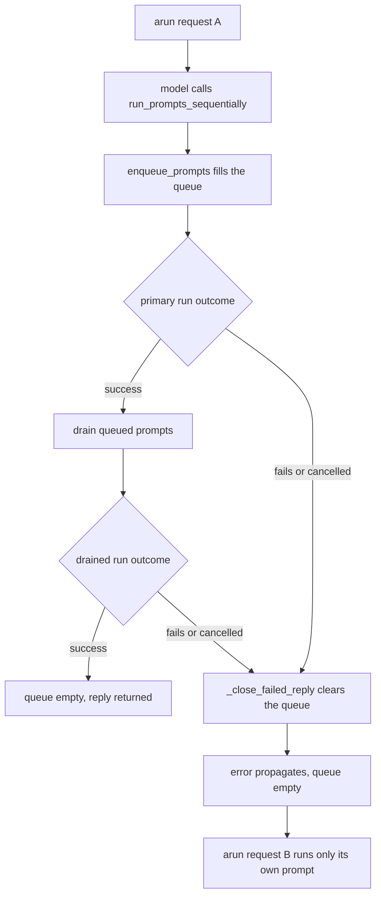

# Queued Prompts Cleared on Failure

## Summary

`run_prompts_sequentially` lets the model queue follow-up prompts on its own agent mid-run. The queue (`BaseAgent._queued_prompts`) is drained only when the primary run succeeds. When the primary run fails (`AgentExecutionError`) or is cancelled (`CancelledError`, `asyncio.wait_for` timeout), the queue is left populated, and the next unrelated `arun()` on the same agent silently runs those stale follow-ups after its own reply. That breaks the contract in `docs/design/run-prompts-sequentially-tool.md` that the queue is always empty when the outer call returns and that no stale prompts leak into the next user-initiated run. The fix empties the queue on every failed or cancelled reply.

## Flow chart



## Usage example

```python
import asyncio
from vidbyte import Agent, RunPromptsSequentiallyTool

agent = Agent(system_prompt="Assistant.", tools=[RunPromptsSequentiallyTool()])

try:
    # The model queues follow-ups, then the next model call fails or times out.
    await asyncio.wait_for(agent.arun("plan the launch"), timeout=30)
except Exception:
    pass

# The queued follow-ups from the failed request are gone; this run only answers "hello".
reply = await agent.arun("hello")
assert "queued_prompt_runs" not in reply.metadata
```

## How it works

Both failure branches of `BaseAgent._generate_reply` (the `except Exception` branch that raises `AgentExecutionError` and the `except BaseException` branch for cancellation) already call `_close_failed_reply`. That helper gains one line, `self._queued_prompts.clear()`, so every failed or cancelled reply leaves the queue empty.

It composes with `_drain_queued_prompts`: a drained run is a nested `generate_reply`, so when it fails its own `_close_failed_reply` clears the remaining prompts; the drain's `except Exception` still records `queued_prompt_error` on the primary reply's metadata and its `finally` still restores usage. A drained run that is cancelled now also empties the queue, which it did not before.

## Files changed

- `vidbyte/agents/base.py`: clear the queue in `_close_failed_reply`.
- `tests/test_queued_prompt_usage.py`: regression tests for a failed primary run, a cancelled primary run, and a cancelled drained run.

## Risks and open questions

- An agent instance shared by concurrent `arun()` calls shares one queue; a failure in one call now also discards prompts another call queued. The queue was never safe to share across concurrent runs, so this is not a new hazard.
- A failure raised after the success path's try block but before the drain (for example in automatic handoff) is out of scope here.

## Verification

- New regression tests fail on current `main` and pass with the fix.
- `python lint/run.py` and `python scripts/run_ci.py` pass; PR CI is green.
