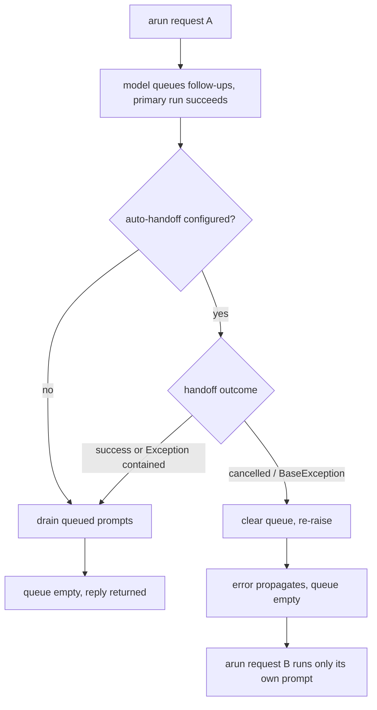

# Queued Prompts Cleared on Handoff Cancel

## Summary

PR #598 made every failed or cancelled reply empty `BaseAgent._queued_prompts`, so prompts queued by `run_prompts_sequentially` never leak into the next, unrelated request. It left one window open: after the primary run succeeds, `_generate_reply` runs the automatic handoff before it drains the queue, and that step sits outside the guarded block. `_run_auto_handoff` contains `Exception` but not `CancelledError`, so a caller timeout or disconnect during the handoff model call propagates with the queue still full, and the next `arun()` on the same agent runs the stale follow-ups. This change clears the queue when the handoff is interrupted that way.

## Flow chart



## Usage example

```python
import asyncio
from vidbyte import Agent, MinimalHandoff, RunPromptsSequentiallyTool

agent = Agent(system_prompt="Assistant.", tools=[RunPromptsSequentiallyTool()], handoff=MinimalHandoff())

try:
    # The model queues follow-ups and answers; the caller times out while the handoff is generating.
    await asyncio.wait_for(agent.arun("ship v3"), timeout=1.0)
except TimeoutError:
    pass

# This run answers only "hello"; the follow-ups from the cancelled request never run.
reply = await agent.arun("hello")
assert "queued_prompt_runs" not in reply.metadata
```

## How it works

In `BaseAgent._generate_reply`, the `await self._run_auto_handoff(metadata)` call is wrapped in `try/except BaseException` that clears `self._queued_prompts` and re-raises. `_run_auto_handoff` still contains ordinary `Exception`s itself, so only cancellation and other `BaseException`s reach the new handler; the reply, history, and handoff-error metadata behave exactly as before.

A cancellation during `_drain_queued_prompts` is already covered and needs no change: each drained prompt is a nested `generate_reply`, so a cancellation inside its model run hits that run's `_close_failed_reply`, and a cancellation inside its own auto-handoff hits this same new handler. Both clear the shared queue.

## Files changed

- `vidbyte/agents/base.py`: clear the queue when the automatic handoff is interrupted by a `BaseException`.
- `tests/test_queued_prompt_usage.py`: regression test that cancels during a slow auto-handoff after the model queued follow-ups.

## Risks and open questions

- The successful reply is already in `history` when the handoff is cancelled; that is unchanged. Only the queued follow-ups are dropped, which matches #598's rule for cancelled requests.

## Verification

- The new test fails on `main` (both follow-ups remain queued) and passes with the fix.
- `python lint/run.py` and `python scripts/run_ci.py` pass; PR CI is green.
