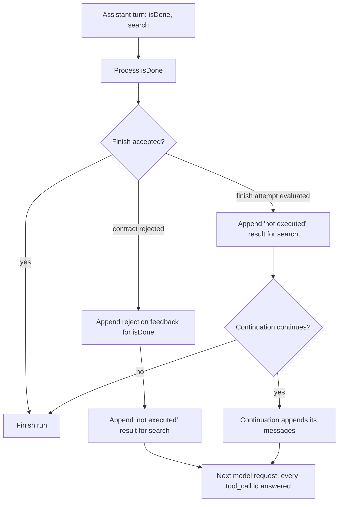

# Answer Tool Calls Skipped by a Turned-Down Finish

## Summary

When one assistant turn holds several tool calls and `isDone` is not the last one (normal for parallel tool calling), a turned-down finish attempt (output-contract rejection or a specialized-runtime continuation such as Jev's) breaks out of the turn's tool-call loop. The calls after `isDone` never get a tool-result message, so the next request carries an assistant turn with unanswered `tool_call` ids, and OpenAI-compatible chat APIs and Anthropic reject it with HTTP 400. The fix answers every remaining call of that turn with a short error tool result, without running it.

## Flow chart



## Usage example

```python
from vidbyte import Agent
from vidbyte.agents import AgentLoopSettings, MinToolCalls

agent = Agent(
    name="worker",
    system_prompt="Work.",
    tools=[search],
    agent_loop_settings=AgentLoopSettings(output_contracts=[MinToolCalls(2)]),
)
# If the model returns [isDone(...), search(q="a")] in one turn and the contract
# rejects the finish, `search` is not run; the model instead sees a tool result
# "tool call not executed: ... call it again if it is still needed" and the run continues.
agent.run("task")
```

## How it works

- `AgentRuntime` loop in `vidbyte/agents/runtime.py` iterates the turn's calls with `enumerate`.
- A small helper `_answer_skipped_tool_calls` appends a `ToolResult.error(...)` (metadata `error: not_executed`) through the existing `_append_tool_result_message` for each call after `isDone`.
- Contract rejection: called right after the rejection feedback, before `break`.
- Continuation: called before `_continue_finish_attempt`, so the results sit directly after the turn's other tool results and before any continuation message. If the run then finishes, the extra messages are unused.
- Unchanged: `isDone` last in the turn, accepted finishes, and the skipped tools are never executed.

## Files

- `vidbyte/agents/runtime.py` - helper plus two call sites.
- `tests/test_agent_tool_loop.py` - regression test for the contract-rejection path.

## Risks

- Low. Only adds tool-result messages for ids that previously had none. The Jev continuation path is covered by the same helper but not by a dedicated test.

## Verification

- New test fails on `main` (only one tool message after the assistant turn) and passes with the fix.
- `python scripts/run_ci.py --stage source` locally, then PR CI.
