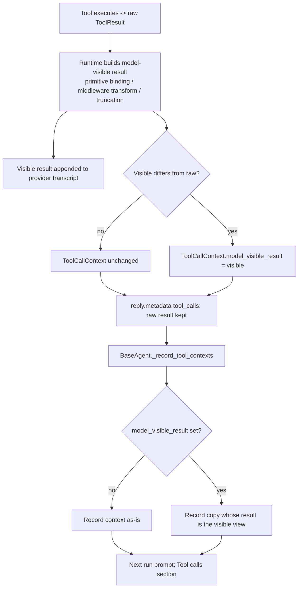

# Replay Model-Visible Tool Output Across Runs

## Summary

`ToolSettings.result_max_chars` truncation, middleware `model_visible_tool_result`
transforms (for example redaction), and primitive binding all change what the model
sees of a tool result, while the raw `ToolResult` is kept for traces, behavior probes,
output contracts and reply metadata. Within one run this works. But `BaseAgent`
remembers tool calls across runs (`_tool_call_contexts`) and renders them into the next
run's prompt as `Tool calls: name: args=... output=...`, using the raw output. So one
turn later the model sees the full, unredacted output and both protections are lost.

The fix records the model-visible result on the tool-call record when the runtime
computes it, and makes the cross-run memory keep that view. Everything that reads the
current run's raw result is unchanged.

## Flow chart



## Usage example

```python
from vidbyte.agents import Agent
from vidbyte.agents.settings import AgentLoopSettings
from vidbyte.agents.settings.tool import ToolSettings

agent = Agent(
    name="support",
    system_prompt="Help customers.",
    tools=[lookup_customer],
    agent_loop_settings=AgentLoopSettings(tool_settings=ToolSettings(result_max_chars=200)),
)
first = agent.run("look up ann")          # model sees at most 200 chars of the record
agent.run("what are your hours?")         # replayed tool call is still capped at 200 chars

raw = first.metadata["tool_calls"][0].result.output  # full raw output is still here
```

## How it works

- `ToolCallContext` gains an optional `model_visible_result: ToolResult | None = None`.
  `None` means the model saw `result` itself. `result` stays raw.
- `AgentRuntime._append_tool_result_message` returns the visible result it appended.
  `_process_tool_call` attaches it to the context record (only when it differs from the
  raw result) before appending the record to the run's call contexts. Denied, error and
  internal `isDone` calls are untouched because their visible result is the raw one.
- `BaseAgent._record_tool_contexts` stores, for each context with a visible result, a
  copy whose `result` is that visible result. The prompt renderer (`build_context_body`)
  and the handoff digest already read `context.output`, so they now see the visible view.

## Files changed

- `vidbyte/lib/dataclasses/tools.py`: new optional field on `ToolCallContext`.
- `vidbyte/agents/runtime.py`: return the visible result and record it on the context.
- `vidbyte/agents/base.py`: cross-run record keeps the visible view.
- `tests/test_tool_result_replay.py`: regression tests.

## Risks and open questions

- The in-run `reply.metadata["tool_calls"]` objects now carry an extra attribute; their
  `result` and `output` are unchanged, so existing consumers are unaffected.
- Contexts made by other code paths without a visible result keep today's behavior.

## Verification

- New tests: truncated output is not replayed uncapped; middleware-redacted output is not
  replayed raw; the raw result is still on `reply.metadata["tool_calls"]`.
- `python lint/run.py` and `python scripts/run_ci.py`, then required CI checks on the PR.
