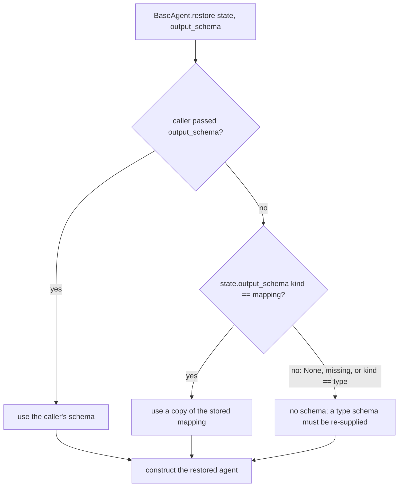

# Restore Keeps a Mapping Output Schema

## Summary

`BaseAgent.export_state()` already records the agent's output schema in the checkpoint: a JSON-Schema mapping is stored in full as `{"kind": "mapping", "schema": {...}}`, and a Pydantic model or other type is stored only as a name marker `{"kind": "type", "name": ...}`. `BaseAgent.restore()` never read that field. It passed only the caller's `output_schema` argument, so a restored agent had no schema unless the caller supplied one again. `Session.resume`, `Session.continue_` and `Session.fork_from` all go through `restore`, so every resumed or forked agent with a mapping schema quietly lost its structured-output guarantee: `reply.structured` came back `None` and no `SchemaConformance` contract ran. YAML-declared agents can only declare mapping schemas, so all of them were affected.

The fix makes `restore` rebuild a stored mapping schema, the same way it already rebuilds loop settings, trace options and the permission policy from plain data.

## Flow chart



## Usage example

```python
from vidbyte import Agent
from vidbyte.sessions import Session

schema = {
    "type": "object",
    "properties": {"queue": {"type": "string", "enum": ["billing", "tech"]}},
    "required": ["queue"],
}
agent = Agent(name="classify", system_prompt="Classify.", output_schema=schema, provider="openai", model_name="gpt-4.1")
session = agent.persist()
session.checkpoint()

resumed = Session.resume(session._store, session.id)
assert resumed.agent.output_schema == schema           # now kept

assert Agent.restore(agent.export_state()).output_schema == schema
override = {"type": "object"}
assert Agent.restore(agent.export_state(), output_schema=override).output_schema == override
```

## How it works

A new static helper `BaseAgent._restore_output_schema(state, supplied)` sits next to `_restore_trace_option`. It returns the caller's schema when one is given. Otherwise, when `state.output_schema` is a mapping marker whose `schema` is a mapping, it returns a deep copy of that schema so the restored agent never shares nested dicts with the frozen checkpoint. In every other case (no marker, an older checkpoint without the field, or a `type` marker) it returns `None`, which is the current behavior. `restore` passes the helper's result to the constructor instead of the raw argument.

## Files changed

- `vidbyte/agents/base.py`: add `_restore_output_schema` and call it from `restore`.
- `tests/test_restore_output_schema.py`: regression tests.

## Risks and open questions

- A `type` marker still restores no schema; a Pydantic model cannot be rebuilt from its name, so the caller keeps re-supplying it.
- The checkpoint serializer strips mapping keys that look like credentials (for example `token`, `password`, `auth`). A schema whose property names match those tokens is already persisted without them; that is a separate serializer issue and is not changed here.

## Verification

- `BaseAgent.restore(agent.export_state())` keeps a mapping schema, and a caller-supplied schema overrides it.
- The schema survives a `SessionSerializer` dict round trip, and `Session.resume`, `Session.continue_` and `Session.fork_from` all yield an agent whose `output_schema` equals the original.
- A checkpoint with `output_schema=None`, or with the key removed, still restores with no schema; a `type` marker restores with no schema.
- `python lint/run.py` and `python scripts/run_ci.py` pass.
