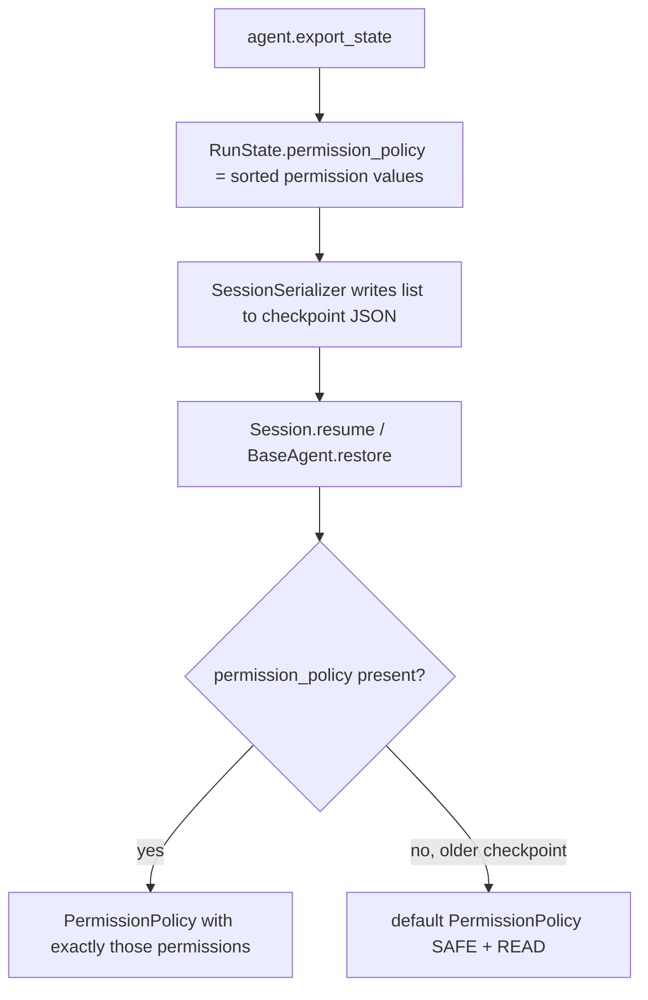

# Restore keeps the permission policy

## Summary

`BaseAgent.export_state()` did not record the agent's `PermissionPolicy`, and `BaseAgent.restore()` always built the agent with the default policy (`{SAFE, READ}`). Because `Session.resume` and `Session.fork_from` rebuild agents through `restore()`, every cold resume ran tools under a different policy than the one configured: a narrower policy was widened, and `allow_all()` was narrowed. A `PermissionPolicy` is plain data (a set of `ToolPermission` values), so under the durable-session rehydration contract ("only data persists, live objects are re-supplied") it belongs in `RunState`. This change persists it and applies it on restore.

## Flow chart



## Usage example

```python
from vidbyte import Agent
from vidbyte.tools.security import PermissionPolicy

agent = Agent(name="ops", system_prompt="...", tools=[deploy], permission_policy=PermissionPolicy.allow_all())
state = agent.export_state()           # state.permission_policy == ("execute", "read", "safe", "write")
restored = Agent.restore(state, tools=[deploy])
assert restored.permission_policy == agent.permission_policy
```

## How it works

- `RunState` gains `permission_policy: tuple[str, ...] | None = None`, the sorted `ToolPermission` values the policy allows. `None` means the checkpoint predates this field; an empty tuple is a real deny-all policy.
- `export_state()` fills it from `self.permission_policy.allowed`.
- `restore()` turns it back into `PermissionPolicy(allowed=...)`, or passes `None` (the constructor default) for older states.
- `SessionSerializer` writes the field as a list and reads it back, treating a missing key as `None`. The file store and portable bundles go through the serializer; the in-memory store keeps the `RunState` object.
- `SESSION_SCHEMA_VERSION` stays at 1, following the precedent of `output_schema`, `trace_option`, and the other optional fields added without a bump: older payloads still load, and the version check would otherwise reject them.

## Files changed

- `vidbyte/lib/dataclasses/sessions.py`: new optional `RunState` field.
- `vidbyte/agents/base.py`: export and restore the policy.
- `vidbyte/sessions/serialization.py`: persist the field.
- `tests/test_restore_permission_policy.py`: regression tests.

## Risks and open questions

- A custom `PermissionPolicy` subclass with its own `check()` is restored as a plain `PermissionPolicy` with the same `allowed` set. Its custom logic is code, not data, and is out of scope; callers needing it can still set `restored.permission_policy` after restore.
- An unknown permission string in a stored state raises `ValueError` on restore rather than silently widening or narrowing the policy.

## Verification

Regression tests cover: a narrower-than-default policy surviving `export_state`/`restore`; `allow_all()` surviving; a cold `Session.resume` through `FileSessionStore` keeping the policy; and an older `RunState` without the field restoring with the default. Then `python lint/run.py`, the session tests, and the full `pytest` suite.
