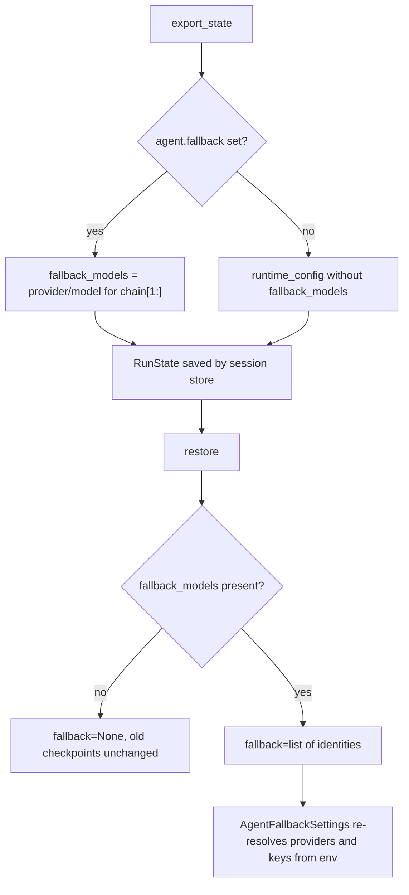

# Resume Keeps the Model Fallback Chain

## Summary

`BaseAgent.export_state()` did not record the agent's model fallback chain, and `BaseAgent.restore()` (and so `Session.resume()`) had no way to rebuild it. A resumed agent therefore lost its failover: when the primary returned a 503, the run raised `AgentExecutionError` instead of switching to the backup model. This change stores the backup models as credential-free `provider/model` strings in `runtime_config["fallback_models"]` and passes them back as `fallback=` on restore, following the precedent PR #545 set for `runner_timeout_seconds`.

## Flow chart



## Usage example

```python
agent = Agent(name="support", system_prompt="Help.", provider="deepseek",
              model_name="deepseek-v4-pro", fallback=["anthropic/claude-sonnet-4-6"])
restored = Agent.restore(agent.export_state())
restored.fallback  # AgentFallback(deepseek/deepseek-v4-pro -> anthropic/claude-sonnet-4-6)
```

## How it works

- `_export_runtime_config` adds `fallback_models`: one `provider/model` string per backup, skipping index 0 (the primary, already stored as `provider`/`model_name`). The provider enum value is used so an entry built with `ModelProvider.X` still writes `x/...`.
- `restore` passes `state.runtime_config.get("fallback_models") or None` as `fallback=`. `AgentFallbackSettings._split_provider_prefix` parses each string back, including `openrouter/openrouter/auto` -> model `openrouter/auto` and `openrouter/anthropic/claude-sonnet-5` -> model `anthropic/claude-sonnet-5`.
- No API key is written. On restore, keys come from the existing inheritance and environment rules.

## Files

- `vidbyte/agents/base.py`: export and restore the chain.
- `tests/test_durable_sessions.py`: one file-store resume regression test.

## Risks

- Per-entry `temperature`, explicit per-entry `api_key`, and custom `fallback_on` are not carried; entries inherit the restored primary's temperature and the default error filter. This matches how plain-string entries already behave.
- A disabled chain (`enabled=False`) has `fallback=None` and stays disabled on restore.

## Verification

- New test: resume from a `FileSessionStore`, then check the chain identities, the two OpenRouter model ids, and that the primary key never appears in the saved files.
- `python lint/run.py` and `python scripts/run_ci.py`.
