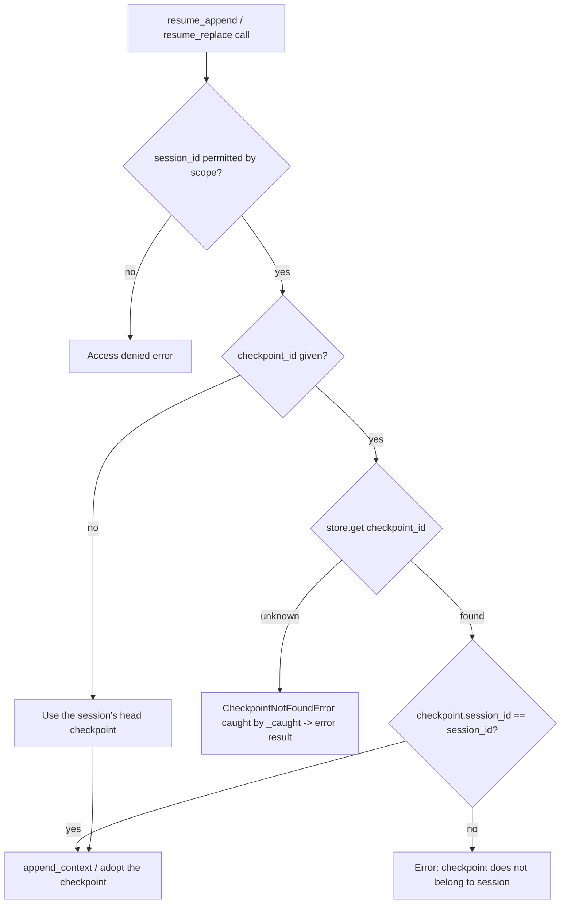

# Design Doc: Resume Tools Keep Checkpoints In Scope

## Summary

`resume_append` and `resume_replace` scope-check only the `session_id` argument. When the model also passes a `checkpoint_id`, that checkpoint is used as-is, so a model can name a permitted session plus a checkpoint from a forbidden session and pull the forbidden transcript into its own history. This change adds the same ownership check `fork` already has: a checkpoint passed with a session must belong to that session, or the tool returns an error and touches nothing.

## Flow chart



## Usage example

```python
tool = ResumeAppendTool(store, scope=SessionScope.sessions([public.id]))
tool.bind_session(bound)

# Allowed: a checkpoint that belongs to the permitted session.
await tool.execute(ToolCall(tool_name="resume_append", arguments={"session_id": public.id, "checkpoint_id": public_cp}))

# Refused: a permitted session paired with a checkpoint from an out-of-scope session.
result = await tool.execute(ToolCall(tool_name="resume_append", arguments={"session_id": public.id, "checkpoint_id": hr_cp}))
assert result.status.value == "error"  # bound history unchanged
```

## How it works

- `ResumeAppendTool._perform` and `ResumeReplaceTool._replace_other` look up a supplied `checkpoint_id` in the store and compare its `session_id` with the resolved, permitted session id before the checkpoint is used. A mismatch returns `Checkpoint <id> does not belong to session <id>.`, matching `ForkTool._fork_other`.
- An unknown checkpoint makes `store.get` raise `CheckpointNotFoundError`, a `SessionError`, which the existing `_caught` wrapper turns into an error result.
- The own-session path of `resume_replace` goes through `Session.rewind`, which already validates ownership, so it is unchanged.

## Files changed

- `vidbyte/tools/builtins/sessions/resume_append.py`
- `vidbyte/tools/builtins/sessions/resume_replace.py`
- `tests/test_durable_sessions.py`

## Risks

A caller that relied on mixing a session id with another session's checkpoint loses that ability; that was the bypass. No other behavior changes.

## Verification

Regression tests in `tests/test_durable_sessions.py` cover both tools with a foreign checkpoint (error, history unchanged) and with the session's own checkpoint (success). Then `python lint/run.py` and `python scripts/run_ci.py`.
