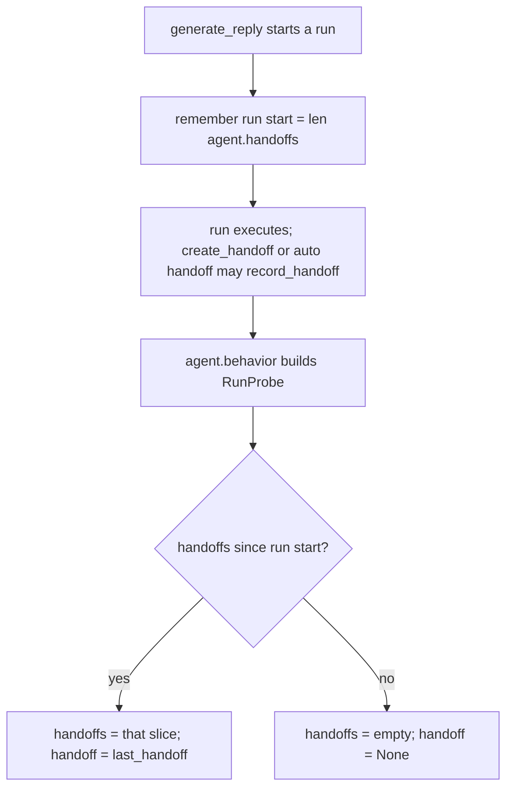

# Run probe handoffs are per run

## Summary

`RunProbe` is a snapshot of one completed run, but it copied `agent.last_handoff` and `agent.handoffs`, which grow across every run of the agent. After a turn that produced a handoff, the next turn without one still reported `handoff_occurred() == True` and `handoff_count() == 1`. The probe now reads only the handoffs recorded since the probed run began, while the public `agent.handoffs` / `last_handoff` stay cumulative (forks and `create_handoff` rely on that).

## Flow chart



## Usage example

```python
agent = Agent(name="a", system_prompt="...", tools=[CreateHandoffTool()])
agent.run("Summarize and hand off.")        # calls create_handoff
assert agent.behavior.handoff.handoff_occurred()
agent.run("Thanks, what is 2 + 2?")          # plain answer
assert not agent.behavior.handoff.handoff_occurred()
assert agent.behavior.handoff.handoff_count() == 0
assert len(agent.handoffs) == 1             # cumulative list unchanged
```

## How it works

- `BaseAgent.__init__` sets `_run_handoff_start = 0`; `_generate_reply` sets it to `len(self.handoffs)` where it resets `_behavior_view`. Auto handoffs recorded at the end of the run land after that index, so they still count for the run.
- `RunProbe._from_reply_and_agent` slices `agent.handoffs[start:]` (default `0` for agents without the field, e.g. stubs or a fresh agent) and reports `last_handoff` only when that slice is non-empty.
- A drained queued prompt is its own run and sets its own start, matching `last_reply`, which the tool view already reads.

## Files

- `vidbyte/agents/base.py`: record the run's handoff start index.
- `vidbyte/evals/behavior/probe.py`: slice handoffs to the probed run.
- `tests/test_agent_behavior.py`: two-run regression test.

## Risks

Concurrent runs on one agent share `last_reply` and the start index, as they already share the rest of the probe's agent-level state; out of scope here.

## Verification

New offline test (handoff in run 1, none in run 2) fails before the fix and passes after; `python lint/run.py` and `python scripts/run_ci.py`.
