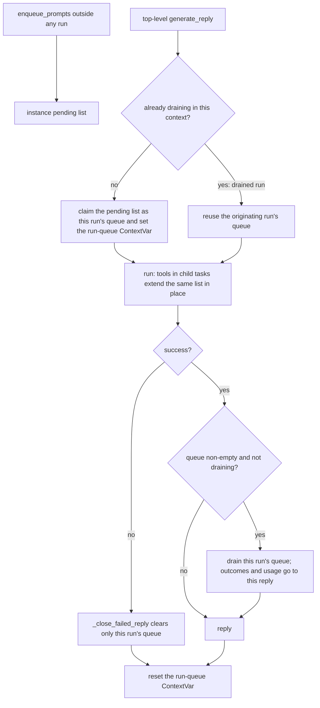

# Run-Scoped Prompt Queue

## Summary

`BaseAgent` lets one agent instance serve concurrent runs: `_active_prompt` is per-run through a `ContextVar`, and builtin middleware keeps per-run state in `ctx.run_state`. The `run_prompts_sequentially` queue was missed. `_queued_prompts` and `_draining_queued_prompts` live on the instance, so when two runs share an agent, whichever finishes first drains the other's follow-ups. Its reply gets the other run's `queued_prompt_runs` and usage, and the run that queued them gets nothing. Draining has the same problem: while one run drains, a concurrent run skips its own drain and its prompts are consumed by the wrong loop, and a failure in one run (#598) clears the other run's queue. This change gives each top-level run its own queue and draining flag through `ContextVar`s, the same pattern `_active_prompt_var` uses.

## Flow chart



## Usage example

```python
import asyncio
from vidbyte import Agent, RunPromptsSequentiallyTool

agent = Agent(system_prompt="Assistant.", tools=[RunPromptsSequentiallyTool()])

# Run X queues two follow-ups and then keeps working; run Y finishes first.
x_reply, y_reply = await asyncio.gather(agent.arun("plan the launch"), agent.arun("what is the date?"))

assert "queued_prompt_runs" not in y_reply.metadata  # Y never runs X's follow-ups
assert x_reply.metadata["queued_prompt_runs"] == 2  # X's follow-ups run after X and count toward X

# Prompts queued outside a run are still drained by the next run.
agent.enqueue_prompts(["summarize the launch plan"])
reply = await agent.arun("start")
assert reply.metadata["queued_prompt_runs"] == 1
```

## How it works

- `__init__` replaces the instance list with `_pending_prompts` (prompts enqueued outside any run) and adds two per-instance `ContextVar`s: the current run's queue (default `None`) and the draining flag (default `False`).
- `_queued_prompts` becomes a read-only property: the current run's queue, or `_pending_prompts` when no run is active in this context. `_draining_queued_prompts` becomes a read-only property over the draining `ContextVar`, which `_drain_queued_prompts` sets on entry and resets in its `finally`. Every existing read, `enqueue_prompts`, `_drain_queued_prompts`, `_close_failed_reply`, the handoff-cancel clear, and `MultiAgentPostRunner`, keeps its code and now acts on the current run's queue.
- `BaseAgent.generate_reply` is where a run starts and ends. When the context is not draining, it takes the pending list as this run's queue, sets the run-queue `ContextVar`, and resets it in `finally`. A drained run is a nested `generate_reply` awaited inside the originating run's drain, so it sees the draining flag, reuses the originating queue, and skips its own drain. The "join the same bounded drain" rule and the `max_queued_prompts` bound do not change.
- Tool calls that run in child tasks or threads get a copy of the context that holds the same list object, so `enqueue_prompts` extends it in place and never depends on `.set()` propagating back.
- A fork is a new instance with its own `ContextVar`s and pending list, and its cloned tool is bound to the fork, so fork isolation does not change.

## Files changed

- `vidbyte/agents/base.py`: the ContextVar-backed queue, the draining flag, and run-start claiming in `generate_reply`.
- `tests/test_queued_prompt_usage.py`: regression tests for concurrent runs (a finished run does not drain another run's follow-ups, a failed run does not clear another run's queue) and for prompts enqueued between runs in one task.

## Risks and open questions

- `MultiAgent` and `AggregateAgent` override `generate_reply` without calling the base version, so they keep using the pending list just as they used the instance list before. Their concurrency behavior does not change.
- A failure in `_ensure_mcp_connected`, which happens before the guarded block, now also discards prompts the run had claimed. That matches #598: a failed run leaves nothing for a later request.

## Verification

- The new concurrent-run test fails on `main` (Y reports `queued_prompt_runs=2`) and passes with the fix.
- The existing queue, failure-cleanup, handoff-cancel, and fork-isolation tests pass unchanged.
- `python lint/run.py` and `python scripts/run_ci.py` pass, and PR CI is green.
