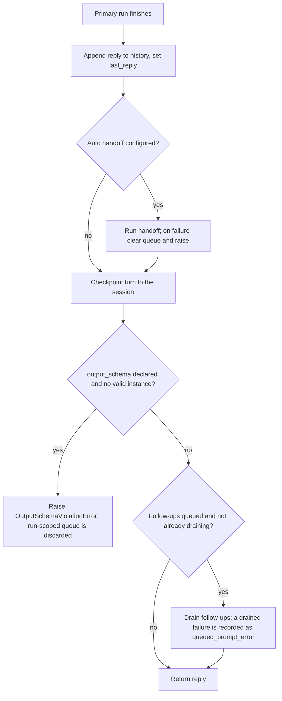

# Schema Failure Skips Queued Prompts

## Summary

When an agent declares an `output_schema` and its run produces no valid instance, `BaseAgent._generate_reply` raises `OutputSchemaViolationError`. It used to raise only after draining the follow-up prompts that run queued with `run_prompts_sequentially`, so every follow-up (and its tool side effects, such as sending an email) ran before the caller saw the failure. A caller retrying the failed request would repeat those side effects. This violates `@intent failed-run-leaves-no-queued-prompts`: follow-ups queued by a failed run must not run. The fix checks the schema before the drain.

## Flow chart



## Usage example

```python
from pydantic import BaseModel
from vidbyte import Agent, OutputSchemaViolationError, tool
from vidbyte.tools.builtins.run_prompts_sequentially import RunPromptsSequentiallyTool

class Ticket(BaseModel):
    summary: str

@tool
def send_email(to: str) -> str:
    """Send the refund email."""
    ...

agent = Agent(output_schema=Ticket, tools=[RunPromptsSequentiallyTool(), send_email])
try:
    ticket = await agent.arun("file the refund ticket")
except OutputSchemaViolationError:
    # The failed turn is in agent.history, but the queued "send the refund email"
    # follow-up never ran, so retrying the request cannot send the email twice.
    ...
```

## How it works

In the success tail of `_generate_reply`, `self._assert_schema_satisfied(result)` moves from after the drain to after `self._notify_session(reply)` and before the drain. The failed turn is still appended to history and checkpointed first (`@intent raise-after-the-turn-is-recorded` is kept). When it raises, `generate_reply`'s `finally` resets the run-scoped queue variable, discarding the queue that run claimed, so no explicit clear is needed. A drained run that fails its schema still raises inside `_drain_queued_prompts`, which records `queued_prompt_error` and clears the queue, unchanged. The auto-handoff placement is unchanged.

## Files changed

- `vidbyte/agents/base.py`: move one line and add an `@intent failed-run-leaves-no-queued-prompts` comment.
- `tests/test_queued_prompt_usage.py`: regression tests for a schema-failing primary run (follow-up never runs, queue empty, turn still in history) and a schema-passing run (follow-up still drains).

## Risks

A caller who relied on follow-ups running despite a schema failure will no longer see them run; that behavior was the bug. `last_queued_replies` is not reset by a failed run, matching other failure paths.

## Verification

`python -m pytest tests/test_queued_prompt_usage.py`, then `python lint/run.py` and `python scripts/run_ci.py`, then the GitHub CI checks.
