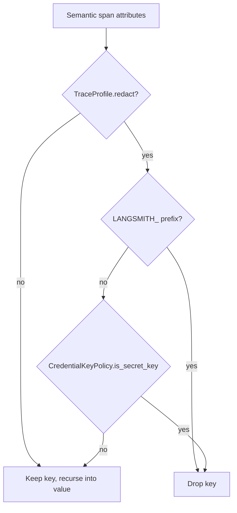

# Semantic Trace Precise Secret Keys

## Summary

PR #671 moved the agent trace scrubbers onto `CredentialKeyPolicy.is_secret_key`, but the semantic tracing layer kept its own substring copy. `vidbyte/trace/profiles.py::_is_secret_key` dropped any key containing `TOKEN` or `AUTH`, and `TraceController` applies it to every semantic span by default (`TraceProfile.redact=True`). Token usage counts (`prompt_tokens`, `total_tokens`) and ordinary tool arguments or metadata (`author`, `max_tokens`, `author_id`) vanished from LangSmith and Phoenix spans. This change points the semantic scrubber at the same shared classifier.

## Flow chart



## Usage example

```python
from vidbyte.trace.profiles import safe_trace_value

safe_trace_value(
    {"usage": {"prompt_tokens": 100, "total_tokens": 110},
     "metadata": {"author_id": "u-7", "auth_token": "t-REAL", "LANGSMITH_PROJECT": "p"}},
    max_chars=10000,
    redact=True,
)
# -> {"usage": {"prompt_tokens": 100, "total_tokens": 110}, "metadata": {"author_id": "u-7"}}
# Before this change: {"usage": {}, "metadata": {}}
```

## How it works

- `vidbyte/trace/profiles.py::_is_secret_key` keeps its `LANGSMITH_` prefix rule for env-style tracing config and otherwise returns `CredentialKeyPolicy.is_secret_key(key)`.
- `vidbyte/agents/runtime.py::AgentRuntime._is_secret_trace_key` gets the same one-line edit. Nothing calls `AgentRuntime._safe_trace_value` today (span payloads use the module-level `_safe_trace_mapping`), so this only removes the last substring copy on the agent trace path.
- Truncation and value recursion are unchanged. `vidbyte/sessions/serialization.py` and `FailureSafety` keep their deliberate rules.

## Files

- `vidbyte/trace/profiles.py`
- `vidbyte/agents/runtime.py`
- `tests/test_semantic_tracing.py` (one regression test)

## Risks

A key that only contains a credential word mid-name (for example `myauththing`) is no longer dropped from semantic spans. This matches the policy already used for agent traces and session trace artifacts; exact names and suffixes such as `_token`, `_secret`, and `_api_key` are still caught.

## Verification

The new test runs the repro payload through `safe_trace_value(..., redact=True)` and checks that `api_key`, `auth_token`, and `LANGSMITH_PROJECT` are dropped while every other key survives. Then `python lint/run.py` and `python scripts/run_ci.py`.
