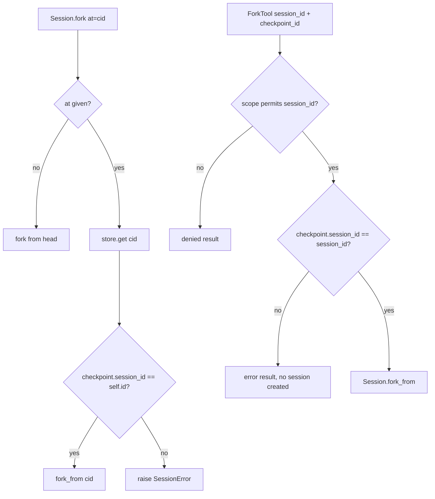

# Session fork checkpoint ownership

## Summary

`Session.rewind(to=...)` refuses a checkpoint that belongs to another session, but its sibling
`Session.fork(at=...)` forwarded any checkpoint id straight to `Session.fork_from`. The prebuilt
`fork` / `batch_fork` tools use `Session.fork` for "own thread" forks with a model-supplied id, and
`ForkTool._fork_other` scope-checked `session_id` but then forked from an unrelated `checkpoint_id`.
Both paths therefore escaped the session (and scope) they claim to be confined to. This change
applies the same ownership check `rewind` uses.

## Flow chart



## Usage example

```python
session = Session(agent, store=store)
await session.arun("one")
branch = session.fork(at=session.head)          # still works
session.fork(at="checkpoint-of-other-session")  # raises SessionError
```

## How it works

- `Session.fork`: when `at` is given, load it with `self._store.get(at)` and raise
  `SessionError("Cannot fork from a checkpoint from another session.")` when its `session_id`
  differs, mirroring `rewind`. `batch_fork` already turns that error into a `ForkOutcome` error.
- `ForkTool._fork_other`: when `checkpoint_id` is given, return an error result if the checkpoint's
  `session_id` is not the resolved, in-scope session.

## Files

- `vidbyte/sessions/session.py`
- `vidbyte/tools/builtins/sessions/fork.py`
- `tests/test_durable_sessions.py`

## Risks

Callers that deliberately forked a foreign checkpoint via the instance method must use the
classmethod `Session.fork_from(store, checkpoint_id)`, which stays unrestricted.

## Verification

Regression tests: own-checkpoint fork works; foreign-checkpoint fork raises; `ForkTool` with an
in-scope `session_id` plus a foreign `checkpoint_id` returns an error and creates no session.
Then `python scripts/run_ci.py` and `python lint/run.py`.
