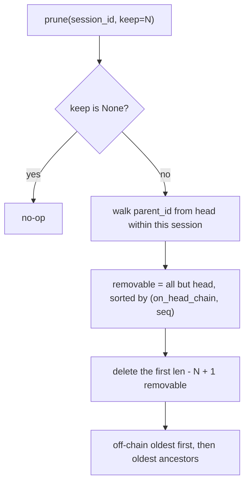

# Session Prune Preserves the Head Chain

## Summary

`BaseSessionStore.prune(keep=N)` only protected the head checkpoint itself and
deleted strictly oldest-by-seq among the rest. After `Session.rewind` the
checkpoint DAG branches, so the oldest checkpoints can be the head's live
ancestors while newer ones sit on an abandoned branch. Pruning then deleted the
head's parent (`store.get(head.parent_id)` raised `CheckpointNotFoundError`)
and broke `rewind(to=<ancestor>)`. The fix deletes off-head-chain checkpoints
first, then the oldest head-chain ancestors, matching the documented contract
"preserving the head chain". All stores share this method, so all are fixed.

## Flow chart



## Usage example

```python
store = FileSessionStore("./sessions")
session = Session(agent, store=store)
for msg in ("outline", "draft v1", "draft v2 bad", "draft v3 bad"):
    await session.arun(msg)          # cp0..cp3
session.rewind(to=cp1)
await session.arun("draft v2 good")  # cp4, parent cp1
store.prune(session.id, keep=3)      # keeps cp0, cp1, cp4; deletes cp2, cp3
session.rewind(to=cp1)               # still works
```

## How it works

Build `{id: checkpoint}` for the session, follow `parent_id` from `head_id`
(stopping at a missing id or a cycle) to collect the head chain, and sort the
removable list by `(id in head_chain, seq)` before slicing off the excess. The
head is always kept, `keep=None` stays a no-op, and the total kept still equals
`keep` when possible. A linear history is entirely on the head chain, so its
behavior is unchanged.

## Files

- `vidbyte/sessions/store.py`: `BaseSessionStore.prune` ordering.
- `tests/test_durable_sessions.py`: `PruneHeadChainTests` (in-memory and file
  stores; branched and linear histories).

## Risks

When `keep` is smaller than the head chain, the oldest ancestors are still
deleted, as before. Store-specific deletion code is untouched.

## Verification

`python scripts/run_ci.py` locally; the new branched test fails on the old
ordering and passes with the fix; CI and Static policy dispatched on the branch.
