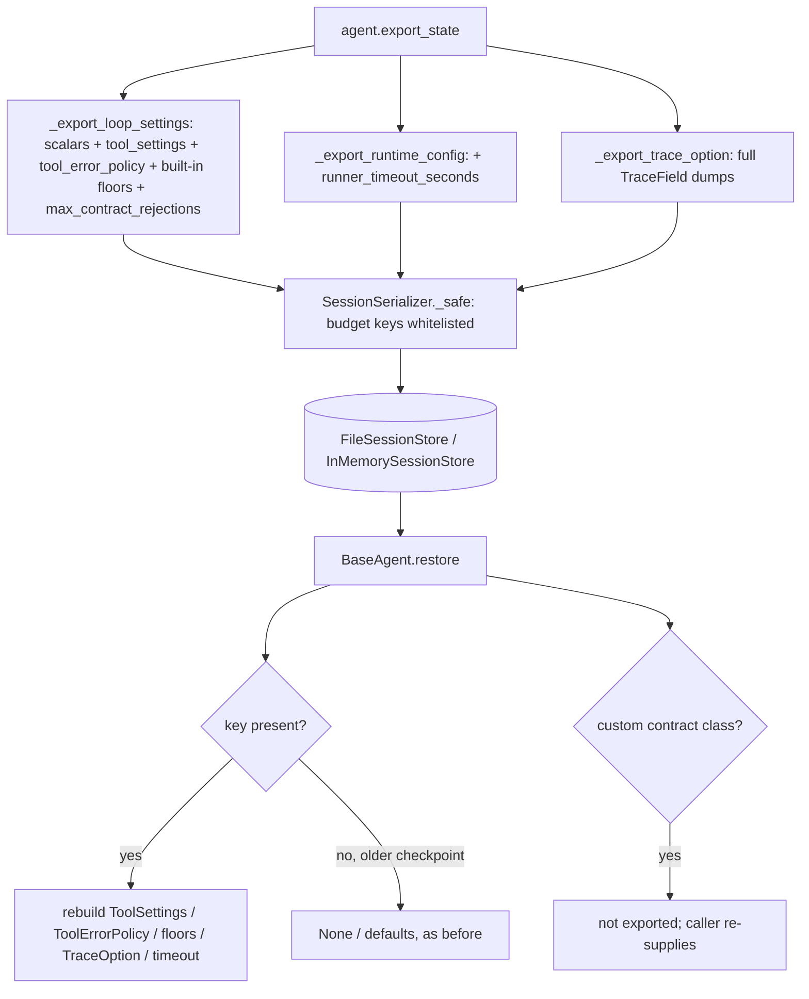

# Session Resume Keeps Loop Guardrails

## Summary

`BaseAgent.export_state()` -> `restore()` (and so `Session.resume` / `Session.fork_from`) silently dropped part of an agent's configuration. A resumed or forked agent lost its `tool_settings` deny-list and caps, its `tool_error_policy`, its `output_contracts`, its `max_contract_rejections`, its continual `trace_option`, and its runner `timeout_seconds`. Separately, the session serializer's secret-key filter removed every key containing `TOKEN`, so `max_tokens`, `compaction_*_tokens`, and `cost_per_million_tokens` never reached a store. In the reproduced case, a `denied_tools={"issue_refund"}` agent ran `issue_refund` after resume. This change exports those settings as JSON-safe data and rebuilds them on restore.

## Flow chart



## Usage example

```python
settings = AgentLoopSettings(
    max_iterations=5,
    output_contracts=[MinToolCalls(1)],
    tool_settings=ToolSettings(denied_tools={"issue_refund"}),
    tool_error_policy=ToolErrorPolicy(max_retries_per_tool_call=1),
)
agent = Agent(name="support", system_prompt="...", tools=[issue_refund], agent_loop_settings=settings, timeout_seconds=12.5)
session = Session(agent, store=FileSessionStore("./sessions"))
session.run("Help the customer")

resumed = Session.resume(FileSessionStore("./sessions"), session.id, tools=[issue_refund])
assert "issue_refund" in resumed.agent.agent_loop_settings.tool_settings.denied_tools  # still denied
assert resumed.agent.runner_config.timeout_seconds == 12.5
```

## How it works

- `_export_loop_settings` adds `tool_settings` and `tool_error_policy` as their constructor keyword arguments (sets become sorted lists, enums their values). It adds `output_contracts` as `{"type", "minimum", "tool_name"?, "cost_per_million_tokens"?}` for classes defined in `vidbyte.agents.contracts.floors`, and it adds `max_contract_rejections`. Custom contract subclasses are skipped, not failed.
- `_restore_loop_settings` rebuilds each value when its key is present. Missing keys behave as before.
- `_export_runtime_config` adds `runner_timeout_seconds`, and `restore()` passes it back as `timeout_seconds`.
- `_export_trace_option` now dumps each `TraceField` in full, including nested fields. The old `{description, type}` shape is a valid subset. `_restore_trace_option` rebuilds `TraceSchema` / `TraceOption`.
- `SessionSerializer._is_secret_key` whitelists four budget key names that contain `TOKEN` but never hold credentials.
- The fallback chain is still not exported, because it can carry API keys.

## Files

- `vidbyte/agents/base.py`: export/restore helpers only.
- `vidbyte/sessions/serialization.py`: one whitelist tuple.
- `tests/test_durable_sessions.py`: `ResumeGuardrailTests`.

## Risks

- `RunState` gains keys inside existing dicts. No schema version bump is needed, and older checkpoints restore unchanged.
- Custom `OutputContract` subclasses and `SchemaConformance` still need to be re-supplied by the caller. This is unchanged and now documented by the skip.

## Verification

`ResumeGuardrailTests` resumes through `FileSessionStore`. It asserts value equality of every guardrail, the timeout, and the trace option, and it asserts that a scripted `issue_refund` call does not execute. It also checks that an old-format checkpoint still restores. The full `python scripts/run_ci.py --stage source` gate and the CI workflows were run as well.
