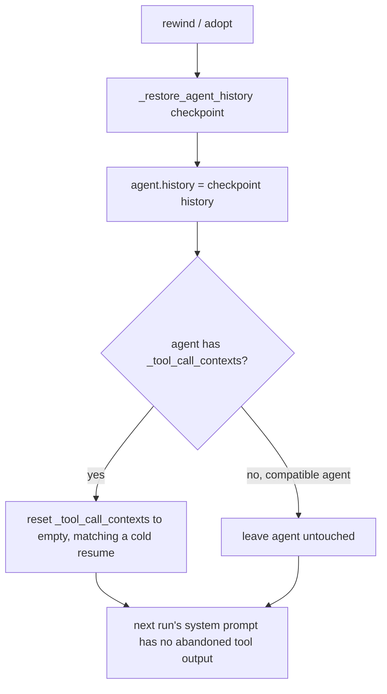

# Session rewind/adopt resets tool-call memory

## Summary

`Session.rewind()` and `Session.adopt()` replace the bound agent's `history` with a checkpoint's, but leave `BaseAgent._tool_call_contexts` untouched. That list is rendered into every later run's system prompt as the `Tool calls:` section, so after a rewind the new branch still sees the full tool outputs of the abandoned turns, and after an adopt it sees the agent's own pre-adopt tool outputs. A cold `Session.resume()` of the same checkpoint has no such leak, because `RunState` does not persist tool-call contexts. The fix makes `_restore_agent_history` also reset the agent's tool-call memory to what a cold resume would have (empty), so a live rewind/adopt matches a cold resume.

## Flow chart



## Usage example

```python
session = Session(agent, store=store)
await session.arun("fetch source A")
after_first = session.head
await session.arun("fetch source B")          # tool output SOURCE-B-CONTENT
session.rewind(to=after_first)
await session.arun("summarize")               # prompt no longer contains SOURCE-B-CONTENT
assert agent._tool_call_contexts[0].tool_name == "fetch"  # only turn 3's call
```

## How it works

`Session._restore_agent_history` gains one step: if the agent exposes `_tool_call_contexts` (every `BaseAgent` does; duck-typed compatible agents may not), it is replaced with a new empty list. Empty is what `Agent.restore()` produces for any checkpoint today, so the live and cold paths agree. Tool calls made before the checkpoint are dropped from the system prompt as well; their effects remain visible through the restored history, exactly as on a cold resume.

Out of scope: persisting tool contexts in `RunState`, and any change to `edit()`, `fork`, `append_context`, or `append_output`.

## Files changed

- `vidbyte/sessions/session.py`: `_restore_agent_history` resets tool-call memory.
- `tests/test_durable_sessions.py`: rewind and adopt regression tests with a real offline agent and a tool.

## Risks

- A rewind/adopt now also forgets tool outputs from turns *inside* the checkpoint. This is intentional: it matches cold resume, the only state the checkpoint can reproduce.

## Verification

- New tests: after rewind, `_tool_call_contexts` holds only the post-rewind call and the next run's prompt lacks the abandoned output; after adopt, the pre-adopt tool output is gone.
- `python lint/run.py` and `python scripts/run_ci.py`.
