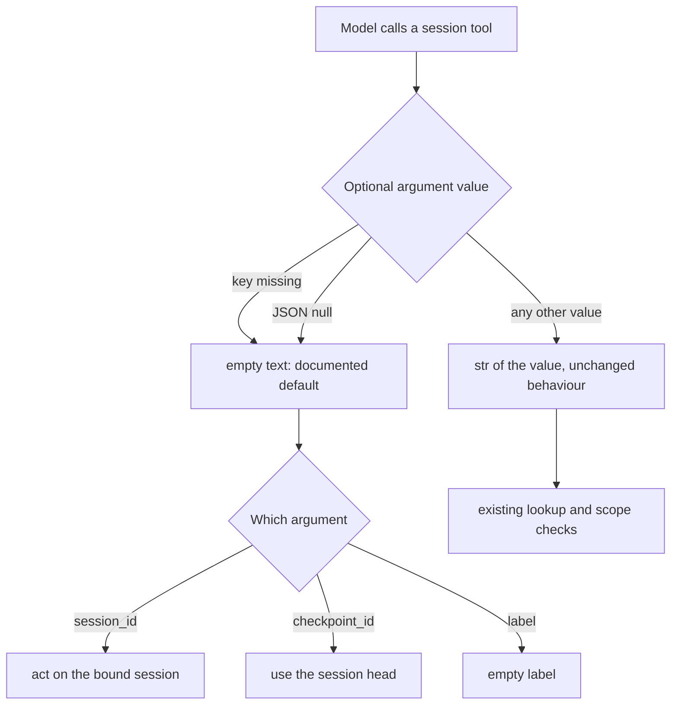

# Session tools: null optional arguments mean the default

## Summary

PR #701 settled that an explicit JSON `null` on a declared-optional tool argument
means the documented default, exactly like an omitted key (intent
`null-optional-arg-means-default`). The session builtin tools still read their
optional string ids as `str(arguments.get("x", "")).strip()`, so a `null` turns
into the text `"None"`. `checkpoint(session_id=null)` then fails with
"No session id or tag: None." instead of checkpointing the bound session, a
`null` label is stored as `"None"`, and `resume_append(checkpoint_id=null)`
fails with "Unknown checkpoint id: None." instead of resuming from the head.
This change makes those tools treat `null` like the missing key.

## Flow chart



## Usage example

```python
from vidbyte.sessions import InMemorySessionStore, Session
from vidbyte.tools.builtins.sessions import CheckpointTool
from vidbyte.tools.types import ToolCall

store = InMemorySessionStore()
session = Session(agent, store=store)
tool = CheckpointTool(store)
tool.bind_session(session)

# Same result as arguments={}: a checkpoint of the bound session with an empty label.
result = await tool.execute(ToolCall(tool_name="checkpoint", arguments={"session_id": None, "label": None}))
assert store.get(result.output).label == ""
```

## How it works

`_SessionBuiltinTool` gains one small static helper, `_optional_text(arguments, name)`,
that returns `""` when the key is missing or `None` and `str(value)` otherwise. It
carries the `@intent null-optional-arg-means-default` comment. Each read of a
declared-optional argument switches from `str(arguments.get(name, ""))` to the
helper; the following `.strip()` and `or None` stay as they are. Arguments listed
in a tool's `required` list (resume_append and resume_output `session_id`, rewind
`checkpoint_id`, batch_fork `count`, session `operation`) are out of scope and
keep their current behaviour.

## Files changed

- `vidbyte/tools/builtins/sessions/_base.py`: the helper.
- `checkpoint.py`: `session_id`, `label`.
- `resume_append.py`: `checkpoint_id`.
- `resume_replace.py`: `session_id`, `checkpoint_id`.
- `fork.py`: `session_id`, `checkpoint_id`.
- `batch_fork.py`: `checkpoint_id`.
- `session.py`: `label`, `session_id`.
- `tests/test_durable_sessions.py`: regression tests.

## Risks and open questions

- A caller that really wanted the literal string `"None"` as an id or label can no
  longer get it by sending `null`; it can still send the string `"None"`.
- Non-null values are unchanged, including non-string values that are stringified.

## Verification

- New tests: checkpoint with `session_id=None, label=None` checkpoints the bound
  session with an empty label; resume_append with `checkpoint_id=None` resumes from
  the head; fork with `checkpoint_id=None` forks from the head.
- `python lint/run.py`, `python scripts/run_ci.py`, and the external probes
  `a310_session_tools_null_ids.py` and `a17_session_tools.py`.
