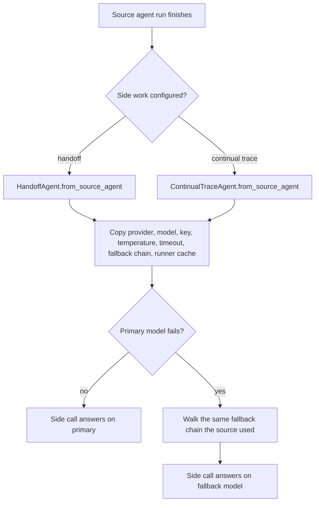

# Side Agents Keep the Source Agent's Routing

## Summary

`HandoffAgent.from_source_agent` and `ContinualTraceAgent.from_source_agent` build side agents that run on behalf of a source agent. They copied the provider, model, key, and temperature, but not the request timeout or the fallback chain. When the source run only succeeded through a fallback model, the auto-handoff and continual-trace side calls went to the dead primary model alone and failed. This change copies both, as `AgentFork` already does for fork children.

## Flow chart



## Usage example

```python
from vidbyte import Agent, EngineeringHandoff

agent = Agent(
    name="eng",
    system_prompt="Engineer.",
    provider="deepseek",
    model_name="deepseek-v4-pro",
    fallback=["anthropic/claude-sonnet-4-6"],
    timeout_seconds=30,
    handoff=EngineeringHandoff(),
)
result = agent.run("Fix the bug.")
# Even if deepseek is down, the handoff now falls back to anthropic too.
assert "handoff_error" not in result.metadata
```

## How it works

Both constructors now also pass `timeout_seconds=source_agent.runner_config.timeout_seconds` and `fallback=source_agent._fallback_spec` to `BaseAgent.__init__`. A source agent without a fallback passes `None`, which keeps the side agent's fallback `None`. The runner-cache copy is unchanged.

## Files changed

- `vidbyte/agents/handoff.py`: pass timeout and fallback in `from_source_agent`.
- `vidbyte/agents/continual_trace.py`: same, with an `@intent` note.
- `tests/test_handoff_agent.py`: one regression test covering both side agents.

## Risks

Side agents always use the default linear runtime, which supports fallback, so passing the spec cannot trip the non-linear-runtime guard.

## Verification

The new test fails without the fix and passes with it; `python lint/run.py` and `python scripts/run_ci.py` pass.
