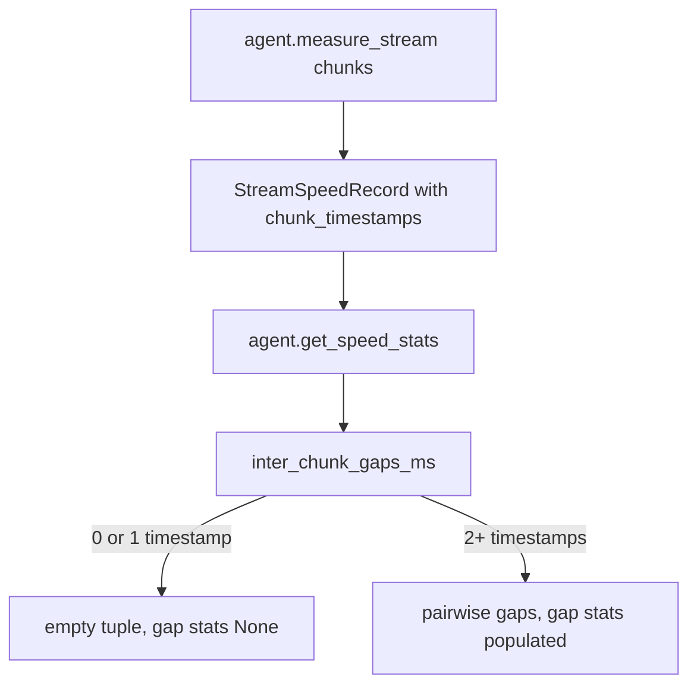

# Fix: inter-chunk gaps crash on metered streams

## Summary

`StreamSpeedRecord.inter_chunk_gaps_ms` paired the chunk timestamps with themselves offset by one using `zip(..., strict=True)`. The two sequences always differ in length by one, so any stream with at least one chunk raised `ValueError` inside `AgentSpeedTracker` rollup, and `agent.get_speed_stats()` crashed after `agent.measure_stream(...)`. The fix computes gaps with `itertools.pairwise`, which yields each consecutive pair and nothing for zero or one timestamp.

## Flow chart



## Usage example

```python
agent = Agent(name="worker", system_prompt="Work carefully.")
chunks = list(agent.measure_stream(iter(["a", "b", "c"])))
stats = agent.get_speed_stats().stream_stats
assert stats.chunk_count == 3
assert stats.inter_chunk_gap_ms_mean is not None
```

## Change

- `vidbyte/lib/dataclasses/speed.py`: replace `zip(ts, ts[1:], strict=True)` with `pairwise(ts)`. No other offset-zip exists in this file or `vidbyte/agents/speed/`.
- `tests/test_agent_speed.py`: regression test streaming three chunks and reading `stream_stats`.

## Risks

None beyond the property itself; gap values are unchanged for the cases that previously worked (zero chunks).

## Verification

New test fails on `main` with the `ValueError` and passes with the fix; `python lint/run.py` and `python scripts/run_ci.py` pass locally; CI `ci.yml` and `static-policy.yml` dispatched on the branch.
