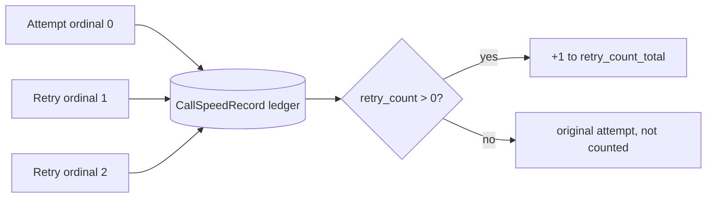

# Speed Stats: Count Retry Attempts, Not Summed Ordinals

## Summary

`CallSpeedStats.retry_count_total` and `ModelSpeedStats.retry_count_total` summed each
record's `retry_count`. Every model attempt is its own `CallSpeedRecord`, and its
`retry_count` is that attempt's retry ordinal (0 for the original, 1 for the first
retry, ...). Summing ordinals reports k(k+1)/2 for k retries: two retries showed as 3,
three as 6. The fix counts records whose ordinal is positive, so the total equals the
number of retry attempts. Per-record `retry_count` semantics are unchanged.

## Flow chart



## Usage example

```python
agent = Agent(..., middleware=[ModelRetryMiddleware(max_attempts=3)])
agent.run("hi")  # provider fails twice, then succeeds
stats = agent.get_speed_stats()
assert stats.call_stats.retry_count_total == 2  # was 3 before the fix
assert stats.model_stats[0].retry_count_total == 2
```

## How it works

Both aggregation sites in `AgentSpeedTracker` (`_build_call_stats`, `_build_model_stats`)
change from `sum(call.retry_count ...)` to counting calls with `retry_count > 0`.
The two dataclass fields gain an inline comment stating they count retry attempts.

## Files

- `vidbyte/agents/speed/tracker.py`: two aggregation lines.
- `vidbyte/lib/dataclasses/speed.py`: field comments only.
- `tests/test_agent_speed.py`: one regression test (ordinals 0, 1, 2 -> total 2).

## Risks

Callers that read `retry_count_total` see smaller, correct values once retries reach
two or more. No existing test asserted the summed value.

## Verification

New test fails on `main` and passes with the fix; `python scripts/run_ci.py` source
stage runs locally; PR CI must be green.
