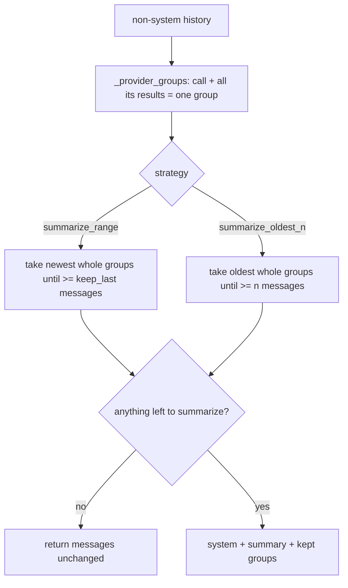

# Summary Compaction Keeps Tool-Call Groups Whole

## Summary

`SummarizeRangeCompaction` (`summarize_range`, default `keep_last=3`) and `SummarizeOldestNCompaction` (`summarize_oldest_n`) split non-system history by raw message count. In a tool loop, an odd split keeps a `tool` result whose assistant `tool_calls` turn was summarized away (or the reverse), and every OpenAI-compatible or Anthropic API rejects the next request with HTTP 400. With default settings, an agent doing four sequential tool calls fails on its third model request. The fix moves both split points to whole provider groups, using `_provider_groups` from #536, so a tool call and all of its results stay together.

Depends on #536, which makes `_provider_groups` pair one call with every following result. Merge #536 first.

## Flow chart



## Usage example

```python
from vidbyte.middleware.builtins import SummaryCompactionMiddleware

# keep_last=3 now keeps the newest whole groups covering at least 3 messages,
# e.g. [call c3, result c3, call c4, result c4], instead of an orphaned result c3.
middleware = SummaryCompactionMiddleware.summarize_range(summarizer, keep_last=3)
```

## How it works

Both strategies group `non_system` with `_provider_groups`. `summarize_range` walks back from the newest group, adding groups until at least `keep_last` messages are kept, and summarizes the rest. `summarize_oldest_n` walks forward, adding groups until at least `n` messages are summarized. Both counts round up to a group boundary, so a group is never split. System handling, the summary message shape, and the no-op cases (`keep_last` covering everything, `n=0`) stay as they were. The other strategies are unchanged.

## Files

- `vidbyte/middleware/compaction/strategies.py`: group-aware split in the two summary strategies, plus a docstring line on each.
- `tests/test_context_compaction_middleware.py`: regression tests on sequential and parallel tool histories for `keep_last`/`n` from 1 to 4.
- `tests/test_context_compaction_tools.py`: `summarize_oldest_n` with `n=2` now summarizes 3 messages, because rounding up keeps the call/result pair whole.

## Risks

Summaries can cover or keep a few more messages than requested, up to the size of one group. That is the intended trade, since the alternative is a request the provider rejects.

## Verification

Run the new tests and confirm they fail without the fix. Then run `python lint/run.py`, `python scripts/run_ci.py --stage source`, and the dispatched `ci.yml` and `static-policy.yml` workflows.
