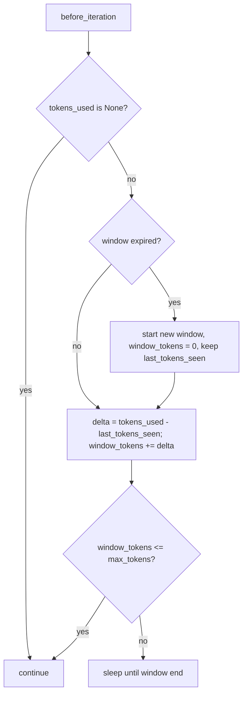

# TokenRateLimitMiddleware window baseline fix

## Summary

`TokenRateLimitMiddleware` throttles on tokens spent per time window. `ctx.tokens_used` is
cumulative for the run, so the middleware counts `tokens_used - last_tokens_seen`. On window
reset it cleared `last_tokens_seen` to `None`, so the first check of every new window charged the
run's entire history. Once a run's lifetime total passed `max_tokens`, every new window started
over budget and the agent slept before every iteration. The fix keeps the cumulative baseline
across window resets.

## Flow chart



## Usage example

```python
from vidbyte import Agent, TokenRateLimitMiddleware

# 400 tokens per iteration, one iteration per 61s: each window holds ~400 tokens,
# so the run never sleeps, even after its lifetime total passes 1000.
limiter = TokenRateLimitMiddleware(max_tokens=1000, per_seconds=60)
agent = Agent(system_prompt="...", middleware=[limiter])
```

## How it works and files changed

- `vidbyte/middleware/builtins/rate_limit.py`: drop `state.last_tokens_seen = None` from the
  window-reset branch. Nothing else changes; the over-budget sleep path already keeps the baseline.
- `tests/test_concurrent_middleware.py`: regression test with an injected clock: cumulative
  400/800/1200/1600/2000/2400 with 61s between checks all continue; a window with 1100 new tokens
  still sleeps.

## Risks

None material. A run whose middleware state is created lazily (no `before_run`) still starts from
baseline 0, as before.

## Verification

New test fails on `main` and passes with the fix; `python scripts/run_ci.py` locally; CI
`ci.yml` and `static-policy.yml` dispatched on the branch.
