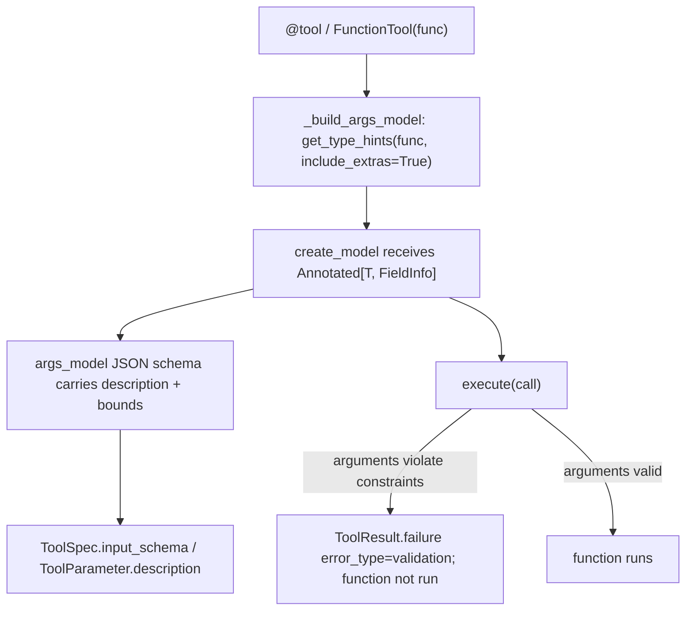

# Keep `Annotated` parameter metadata on function tools

## Summary

`FunctionTool` builds its pydantic argument model from `typing.get_type_hints(func)`. Without `include_extras=True`, that call strips `Annotated[T, Field(...)]` down to `T`, so the idiomatic Pydantic style silently loses both the parameter description (it never reaches the provider tool schema) and the validation constraints (`ge`, `le`, `min_length`, `pattern`, ...), letting out-of-range model arguments run the tool. The default-value style `x: int = Field(..., ge=1)` already works; this change makes the `Annotated` style behave the same.

## Flow chart



## Usage example

```python
from typing import Annotated
from pydantic import Field
from vidbyte import tool

@tool
def book(
    city: Annotated[str, Field(description="Destination city name", min_length=2)],
    nights: Annotated[int, Field(ge=1, le=9, description="Number of nights (1-9)")],
) -> str:
    """Book a stay."""
    return f"{city}:{nights}"

book.spec().input_schema["properties"]["nights"]
# {"description": "Number of nights (1-9)", "maximum": 9, "minimum": 1, "title": "Nights", "type": "integer"}
```

## How it works

Pass `include_extras=True` to the single `get_type_hints` call in `_build_args_model`. `create_model` then receives the `Annotated` type and Pydantic applies its `FieldInfo`. `_build_spec` already reads `description` from the JSON schema, so `ToolParameter.description` picks it up with no further change. String annotations (PEP 563) are still resolved by `get_type_hints`; plain types and `Optional`/defaults are unaffected because `include_extras` only changes `Annotated` handling.

## Files changed

- `vidbyte/tools/function_tool.py` — one-line change in `_build_args_model`.
- `tests/test_custom_function_tools.py` — regression tests for schema, rejection, and acceptance with `Annotated` parameters (the module uses `from __future__ import annotations`, so string annotations are covered).

`_build_args_model` is the only `get_type_hints` call under `vidbyte/`, so no other call site needs the same change.

## Risks

Low. A tool that previously declared `Annotated` constraints and relied on them being ignored will now reject out-of-range arguments, which is the documented Pydantic behaviour and the intent of the declaration.

## Verification

`python lint/run.py`, `python scripts/run_ci.py`, and the required GitHub checks.
