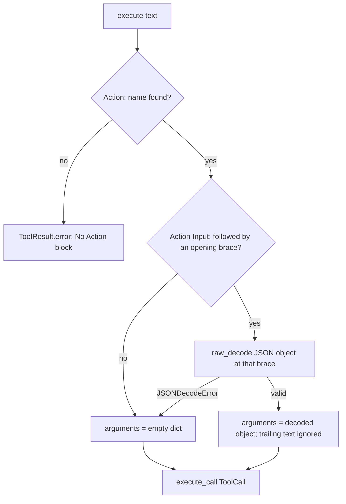

# ToolExecutor Nested Action Input

## Summary

`ToolExecutor.execute(text)` pulled the `Action Input:` JSON out of a ReAct block with the non-greedy regex `\{.*?\}`, which stops at the first `}`. Any input with a nested object (for example `{"query": "late", "filters": {"region": "EMEA", "days": 7}}`) was cut short, `json.loads` failed, and the arguments silently became `{}`, so the tool failed validation (or ran) with no arguments. The fix decodes the whole JSON object with `json.JSONDecoder().raw_decode`, so nested objects, arrays, and braces inside strings work, and trailing text such as `Observation: ...` is ignored.

## Flow chart



## Usage example

```python
from vidbyte import ToolExecutor
from vidbyte.tools import Tools

reply = (
    "Thought: need data\n"
    "Action: search_orders\n"
    'Action Input: {"query": "late", "filters": {"region": "EMEA", "days": 7}}\n'
    "Observation: pending"
)
result = await ToolExecutor(Tools([search_orders])).execute(reply)
# search_orders receives {"query": "late", "filters": {"region": "EMEA", "days": 7}}
```

## How it works

Find `Action Input:` followed by optional whitespace and an opening brace (regex with a lookahead), then call `json.JSONDecoder().raw_decode(text, index)` at that brace. `raw_decode` stops at the end of the first complete JSON value, so trailing text is ignored. Because decoding starts at `{`, a successful result is always an object. Any input the old regex parsed successfully parses to the same object.

Malformed input keeps its current meaning: a `JSONDecodeError` still yields `arguments = {}`, and the tool's own validation reports the missing parameters. An existing test pins that behavior, and turning it into a new error would change the public contract beyond this fix. A missing `Action Input` also still yields `{}`. `execute_call` is unchanged.

## Files

- `vidbyte/tools/executor.py`: replace the regex capture plus `json.loads` in `ToolExecutor.execute` with `raw_decode` at the opening brace.
- `tests/test_agent_abstractions.py`: regression test for a nested-object Action Input, braces inside a string, and trailing text.

## Risks

Low. The change is limited to argument extraction in `execute(text)`, and every input that parsed before still parses to the same value.

## Verification

The new test fails on `main` and passes with the fix. The existing parser test (flat input, unknown tool, malformed input) still passes. Run `python lint/run.py` and `python scripts/run_ci.py`.
