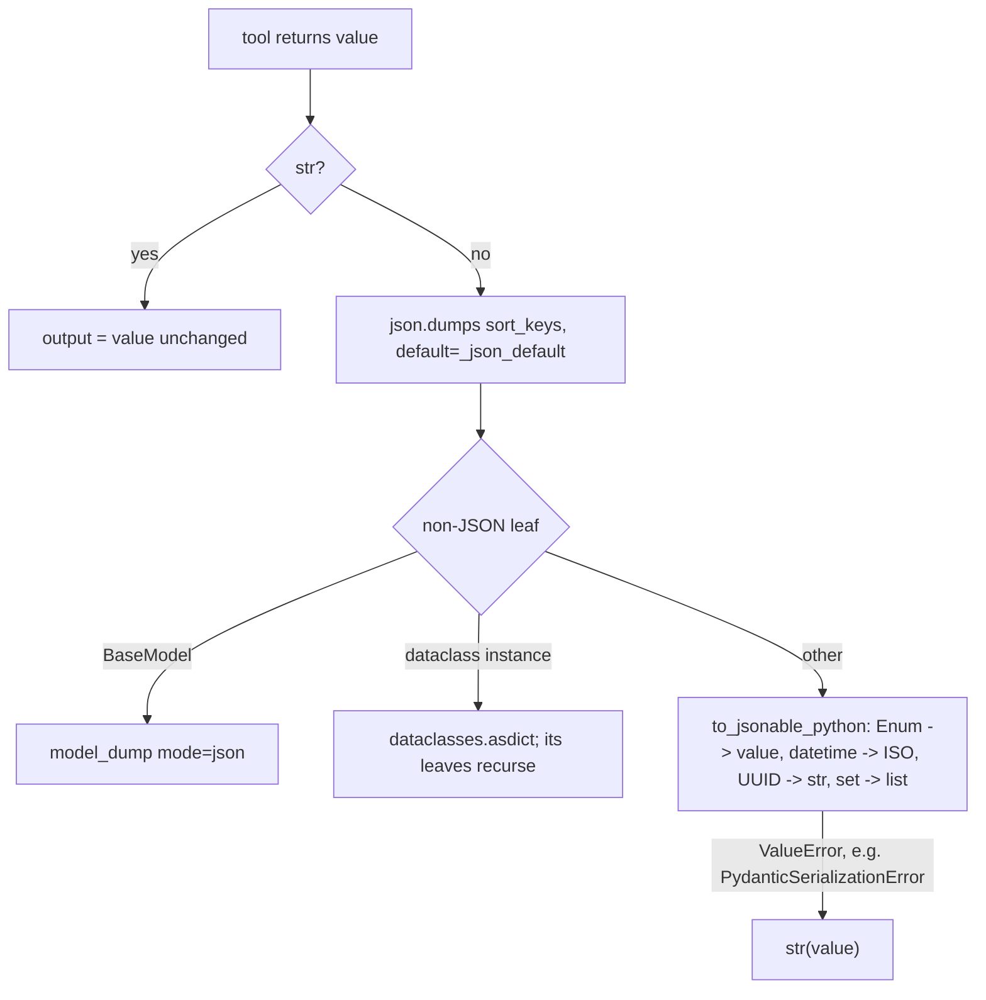

# Tool Output JSON Leaf Values

## Summary

`FunctionTool` turns a tool's return value into model-visible text with `json.dumps(value, default=_json_default, sort_keys=True)`. `_json_default` dumps models with `model_dump(mode="json")` and dataclasses with `dataclasses.asdict`, but every other non-JSON leaf fell back to `str(value)`. So an `Enum` member became `"Priority.HIGH"` instead of `"high"`, and a `datetime` became `"2026-10-09 15:00:00"` instead of ISO `"2026-10-09T15:00:00"`. The same data serialized differently depending on whether the tool returned a model, a dataclass, or a dict, and a valid dataclass or dict result failed the tool's `output_schema` check (`output_schema_violation: priority Input should be 'low' or 'high'`). The fix serializes those leaves with `pydantic_core.to_jsonable_python`, the same JSON-mode conversion `model_dump(mode="json")` uses, and keeps `str(value)` only for types pydantic cannot serialize.

## Flow chart



## Usage example

```python
from dataclasses import dataclass
from datetime import datetime
from enum import Enum

from pydantic import BaseModel

from vidbyte.tools import FunctionTool


class Priority(Enum):
    LOW = "low"
    HIGH = "high"


class Ticket(BaseModel):
    priority: Priority
    due: datetime


@dataclass
class TicketRecord:
    priority: Priority
    due: datetime


def create_ticket() -> TicketRecord:
    return TicketRecord(priority=Priority.HIGH, due=datetime(2026, 10, 9, 15))


create = FunctionTool.from_function(create_ticket, output_schema=Ticket)
# The model now sees {"due": "2026-10-09T15:00:00", "priority": "high"},
# the same text a Ticket(...) return produces, and output_schema accepts it.
```

## How it works

Only the final fallback of `_json_default` changes: instead of `return str(value)`, it returns `to_jsonable_python(value)` and falls back to `str(value)` when that raises `ValueError`. `PydanticSerializationError` (unknown types such as a class or a plain object) is a `ValueError` subclass, and so is the `UnicodeDecodeError` raised for non-UTF-8 bytes, so one clause covers both. String returns and values that are already JSON never reach `_json_default`, so their text is byte-identical. The model and dataclass branches are unchanged.

## Files

- `vidbyte/tools/function_tool.py`: the `_json_default` fallback and its `@intent` comment.
- `tests/test_custom_function_tools.py`: regression tests in `StructuredToolOutputTests`.

## Risks

Low. Leaves that used to become a Python repr now become their JSON-mode value; that is the intent of `tool-model-output-is-json`. Types pydantic does not know keep the old `str(value)` text, and the existing test that pins `str(QuoteRecord)` for a class still passes.

## Verification

New tests: a dict and a dataclass holding an `Enum` member and a `datetime` produce the same JSON as the equivalent `BaseModel`, and pass the tool's `output_schema` through `AgentRuntime.execute_tool_call`. They fail on `main` and pass with the fix. Run `python lint/run.py` and `python scripts/run_ci.py`.
