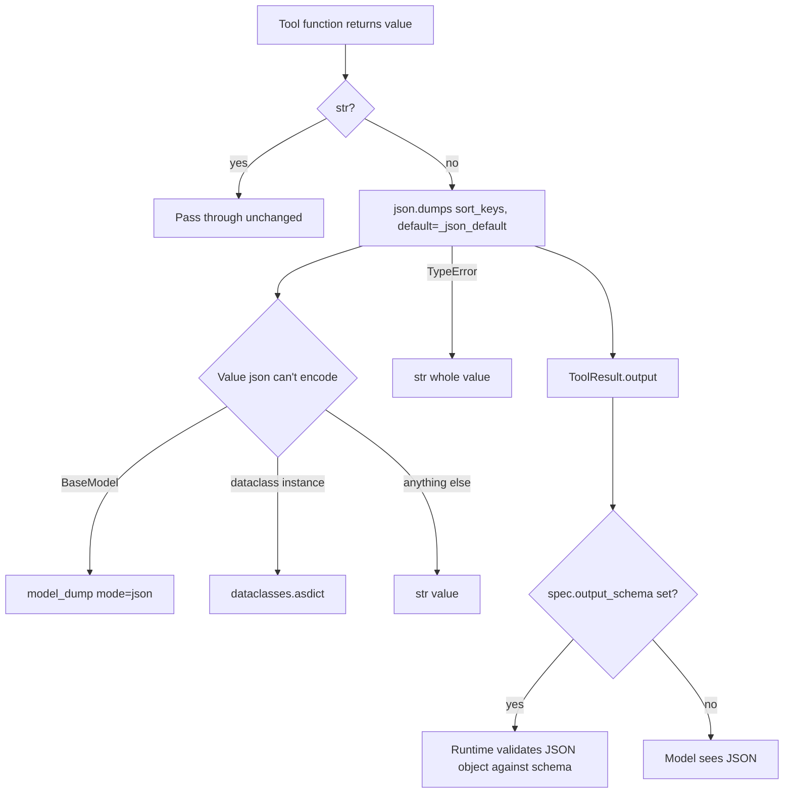

# Function Tool Model Output As JSON

## Summary

`FunctionTool` serializes a non-string return value with `json.dumps(value, default=str)`. A Pydantic
model or dataclass instance therefore became its Python repr (`"sku='A1' price=9.5"`) wrapped in a
JSON string. A tool declared with `output_schema=Quote` that returned a `Quote(...)` failed its own
output-schema check in `AgentRuntime` (`output_schema_violation`), and tools without a schema handed
the model a quoted repr instead of JSON. The fix serializes model and dataclass instances, at any
depth, as JSON objects.

## Flow chart



## Usage example

```python
from pydantic import BaseModel
from vidbyte.tools import FunctionTool

class Quote(BaseModel):
    sku: str
    price: float

def quote(sku: str) -> Quote:
    """Price one SKU."""
    return Quote(sku=sku, price=9.5)

# The runtime now receives '{"price": 9.5, "sku": "A1"}' and the output schema check passes.
tool = FunctionTool(quote, output_schema=Quote)
```

## How it works and files changed

- `vidbyte/tools/function_tool.py`: `_stringify_output` passes a new `_json_default` to `json.dumps`.
  It returns `model_dump(mode="json")` for a `BaseModel`, `dataclasses.asdict` for a dataclass
  instance (not a dataclass class), and `str(value)` otherwise. Because `json.dumps` calls `default`
  for every unencodable value it meets, nested models and dataclasses inside dicts and lists are
  handled too. String passthrough, `sort_keys=True`, and the `TypeError` fallback are unchanged.
- `tests/test_custom_function_tools.py`: regression tests.

## Risks

Tools that returned a model without an output schema now send the model a JSON object instead of a
repr string. That is the intended correction; no caller can rely on the repr format.

## Verification

Tests through `AgentRuntime.execute_tool_call`: a model and a dataclass return pass their
`output_schema`; nested models and dataclasses in a list serialize as objects; a wrong shape still
fails with `output_schema_violation`. Then `python lint/run.py` and `python scripts/run_ci.py`.
