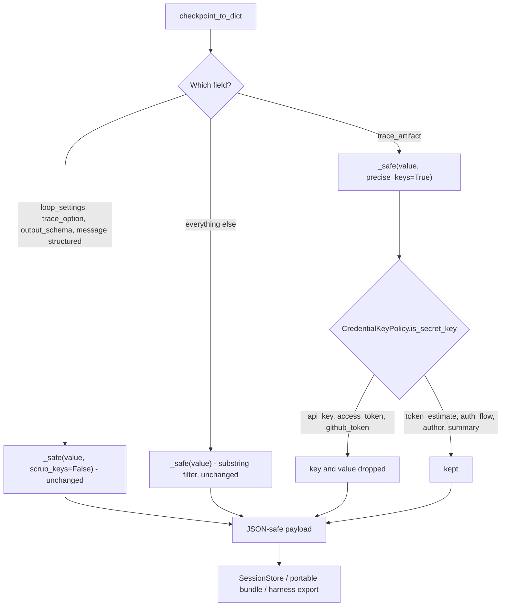

# Trace artifacts drop exact credential names

## Summary

PR #629 stopped `SessionSerializer.checkpoint_to_dict` from deleting declared
trace field names such as `token_estimate` and `auth_flow` from a checkpoint's
`trace_artifact`. It did this by turning the key filter off completely
(`scrub_keys=False`). That also removed a contract tested since PR #228: a
trace artifact key that really is a credential name, such as `api_key`, was
dropped before reaching the session store and portable session bundles. After
#629, that key and its value were persisted and exported.

This change keeps #629's fix and puts the protection back. The trace artifact
now goes through the precise classifier that harness capture already uses: it
drops exact credential names (`api_key`, `access_token`, `client_secret`,
`token`, `auth`, ...) and names ending in a credential suffix (`_token`,
`_secret`, `_api_key`, ...), and keeps everything else.

## Flow chart



## Usage example

```python
from dataclasses import replace

from vidbyte.sessions.serialization import SessionSerializer

serializer = SessionSerializer()
checkpoint = replace(checkpoint, trace_artifact={"api_key": "sk-live", "token_estimate": 1200, "auth_flow": "oauth"})
payload = serializer.checkpoint_to_dict(checkpoint)

assert payload["checkpoint"]["trace_artifact"] == {"token_estimate": 1200, "auth_flow": "oauth"}
```

## How it works

- The classifier moves down from `HarnessSecretPolicy`
  (`vidbyte/harnesses/serialization.py`) into a new lower-layer class,
  `CredentialKeyPolicy` in `vidbyte/lib/util/credential_keys.py`.
  `vidbyte.sessions` sits below `vidbyte.harnesses`, and lint rule A006
  rejects any import from sessions into harnesses (a local import included),
  so the shared rule has to live in `vidbyte/lib/`. `HarnessSecretPolicy` now
  subclasses it with no body of its own, so harness behavior and its public
  name do not change.
- `SessionSerializer._safe` (and `_dumped_model`) take a new keyword,
  `precise_keys=False`. When it is true, mapping keys are checked with
  `CredentialKeyPolicy.is_secret_key` instead of the substring check.
  `scrub_keys=False` still turns key filtering off and takes precedence.
- Only the `trace_artifact` call site passes `precise_keys=True`. The default
  substring policy and #627's `scrub_keys=False` fields are unchanged.
- The `# @intent` comment on `checkpoint_to_dict` is renamed to
  `trace-artifact-precise-secret-keys` and says why the artifact uses the
  precise filter.

## Files changed

- `vidbyte/lib/util/credential_keys.py` - new `CredentialKeyPolicy`.
- `vidbyte/lib/util/__init__.py` - re-exports it.
- `vidbyte/harnesses/serialization.py` - `HarnessSecretPolicy` subclasses it.
- `vidbyte/sessions/serialization.py` - `precise_keys` option, used for
  `trace_artifact`; comments updated.
- `tests/test_durable_sessions.py` - `test_export_scrubs_secret_keys_inside_trace_payloads`
  again asserts that a trace artifact `api_key` is dropped from a bundle while
  `token_estimate` is kept; a new checkpoint round-trip test asserts `api_key`
  and `client_secret` are dropped while `token_estimate`, `auth_flow`, and
  `summary` survive.
- `docs/design/checkpoint-keeps-trace-artifact-names.md` - points its Risks
  section at this doc.

## Risks

A trace schema that declares a field literally named after a credential (for
example `access_token` or `github_token`) loses that field from checkpoints.
That is intended: those were dropped before #629 too, and harness export
already drops them. Values are still not inspected here; a secret written
into an innocently named field is not caught by any key filter.

## Verification

The two tests above, then `python lint/run.py` and `python scripts/run_ci.py`.
