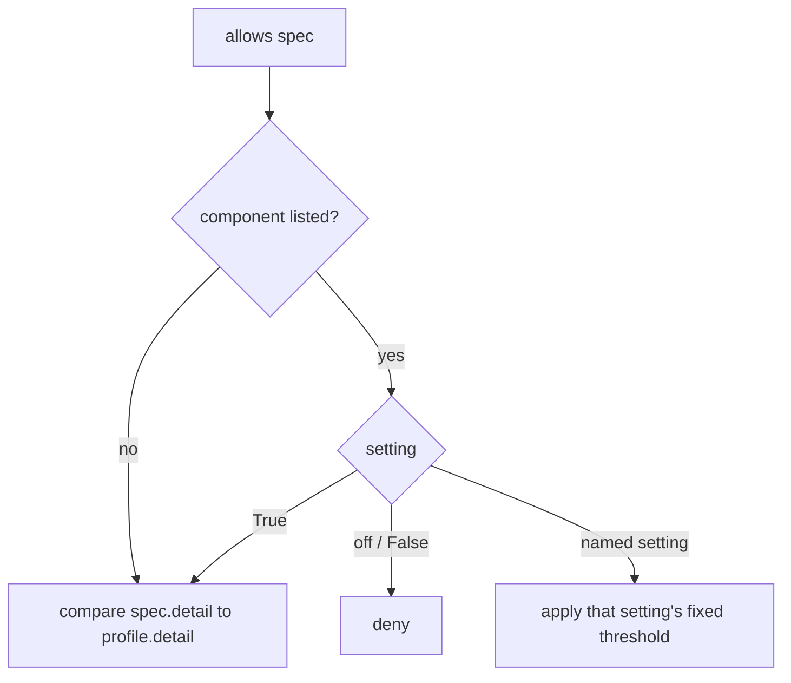

# Trace Profile Detail Fallback

## Summary

`TraceProfile.allows(spec)` treated any component missing from `components` as the `"default"` setting, which caps spans at STANDARD. A profile built as `TraceProfile(detail=TraceDetail.MINIMAL)` or `TraceProfile(detail=TraceDetail.VERBOSE)` therefore traced exactly like `TraceProfile.default()`, ignoring its own `detail`. The fix makes an unlisted component fall back to the profile's own detail threshold, so `detail` means what it says.

## Flow chart



## Usage example

```python
from vidbyte import TraceController, TraceProfile
from vidbyte.trace.schema import TraceDetail

# Keeps only MINIMAL spans (agent.run, llm.call, tool.call) for every component.
trace = TraceController(tracer, TraceProfile(detail=TraceDetail.MINIMAL))

# VERBOSE everywhere, except runtimes switched off explicitly.
trace = TraceController(tracer, TraceProfile(detail=TraceDetail.VERBOSE, components={"runtimes": "off"}))
```

## How it works

The component lookup in `allows` now defaults to `True` instead of `"default"`. `True` already means "use the profile's detail threshold", so no new branch is needed.

- Bare `TraceProfile()` has detail STANDARD, so it behaves exactly as before.
- The presets (`minimal()`, `default()`, `verbose()`, `diagnostic()`) list every component, so they are unchanged, as are `with_components(...)` overrides.
- `TraceComponentSettings.resolve` is unused by `allows` and is left unchanged.

## Files changed

- `vidbyte/trace/profiles.py`: lookup default in `TraceProfile.allows`.
- `tests/test_semantic_tracing.py`: regression test for unlisted components.

## Risks

Callers who built a non-STANDARD `TraceProfile(detail=...)` without components will now see more (VERBOSE/DIAGNOSTIC) or fewer (MINIMAL) spans. That is the documented intent of `detail`.

## Verification

`python lint/run.py` and `python scripts/run_ci.py`, plus the new test `test_profile_detail_applies_to_unlisted_components`.
