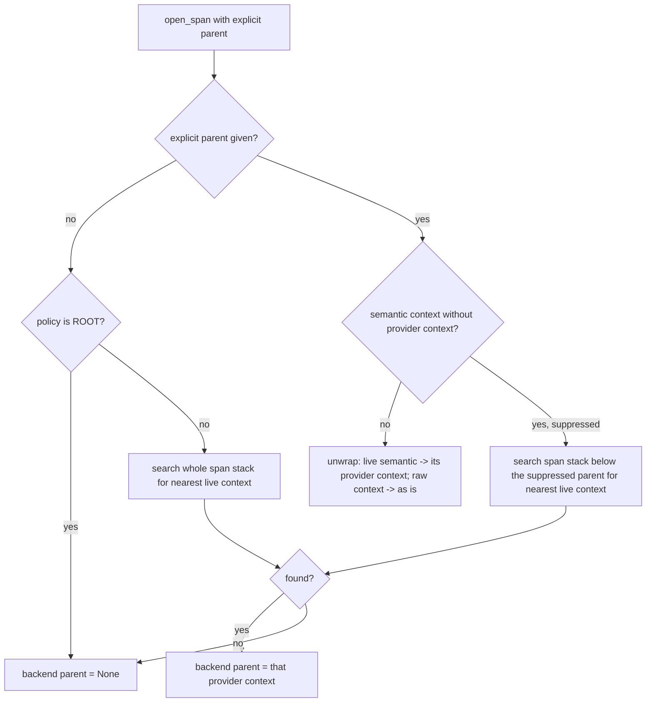

# Trace Suppressed Parent

## Summary

`TraceController` passed a suppressed `SemanticSpanContext` straight to the backend as a span parent whenever a caller named a profile-filtered span as the explicit parent. The runtime does exactly that under the default and minimal profiles: `llm.call`, `tool.call`, and `parser.*` are opened under `runtime.iteration`, which those profiles suppress. Real backends (Langfuse, LangSmith, Phoenix) do not recognise that object and start a new root, so the child spans became disconnected traces. The fix resolves a suppressed explicit parent to its nearest live ancestor on the context-local span stack.

## Flow chart



## Usage example

```python
from vidbyte import Trace, TraceProfile

tracer = Trace.profile(backend, TraceProfile.default())
root = tracer.start_trace("agent.run")
iteration = tracer.start_span("runtime.iteration", parent=root)  # suppressed by default profile
llm = tracer.start_span("llm.call", parent=iteration)
# The backend now receives parent=root.provider_context, not the suppressed iteration context.
tracer.end_span(llm)
tracer.end_span(iteration)
tracer.end_trace(root)
```

## How it works

`_provider_parent` keeps its current behaviour for a missing parent, a raw backend context, and a live semantic context. When the explicit parent is a semantic context with no provider context, it searches `_SPAN_STACK` for the nearest live context, starting just below the suppressed parent when that parent is on the stack (so the result is a true ancestor), or the whole stack otherwise. `SessionTraceController` inherits `_provider_parent`, so it gets the fix without its own change; `SessionTracer` never sees semantic contexts and is unaffected.

## Files

- `vidbyte/trace/controller.py`: `_provider_parent` resolution for suppressed explicit parents.
- `tests/test_semantic_tracing.py`: regression tests.

## Risks

A suppressed parent opened in another execution context is not on the current stack; it then resolves to the nearest live context of the current stack, or to no parent, which is still better than an object the backend never created.

## Verification

Unit tests on a recording tracer (suppressed explicit parent resolves to the live root; live explicit parent still used directly) and an agent run under the default profile asserting every backend span parent is a context the backend created. Then `python lint/run.py` and `python scripts/run_ci.py`.
