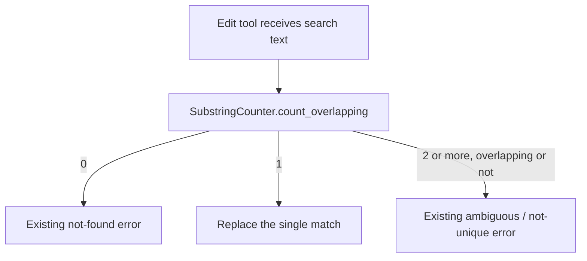

# Unique Edits Count Overlapping Matches

## Summary

`patch_file`, `replace_text`, and `context_edit` promise to edit only when the
search text occurs exactly once. They counted occurrences with `str.count`,
which skips overlapping matches, so a search such as `"}\n}\n"` inside
`"}\n}\n}\n"` counted as one match and the tool silently edited the first
position. The tools now count every start position and refuse such a search
as ambiguous with their existing error.

## Flow chart



## Usage example

```python
from vidbyte.lib.util import SubstringCounter

text = "func a() {\nif x {\nfor {\n}\n}\n}\n"
assert text.count("}\n}\n") == 1
assert SubstringCounter.count_overlapping(text, "}\n}\n") == 2
```

## How it works

`SubstringCounter.count_overlapping` in `vidbyte/lib/util/text.py` walks
`str.find` from one past each match, counting start positions. It lives in the
bottom layer so all three tools can import it. Each tool replaces its
`str.count` call with it; error messages and metadata keys are unchanged.

## Files

- `vidbyte/lib/util/text.py` (new), `vidbyte/lib/util/__init__.py`
- `vidbyte/tools/builtins/editing/patch.py`
- `vidbyte/tools/filesystem/replace_text.py`
- `vidbyte/tools/builtins/context_primitives/edit.py`
- Tests: `tests/test_patch_tool.py`, `tests/test_filesystem_tools.py`,
  `tests/test_context_primitives_builtins.py`

## Risks

The `matches` count in error metadata now reports overlapping start positions,
which can be higher than before for repetitive text. Non-overlapping single
matches behave exactly as before.

## Verification

A regression test per tool uses the brace example and asserts the error and an
unchanged target. `python lint/run.py` and `python scripts/run_ci.py` pass.
