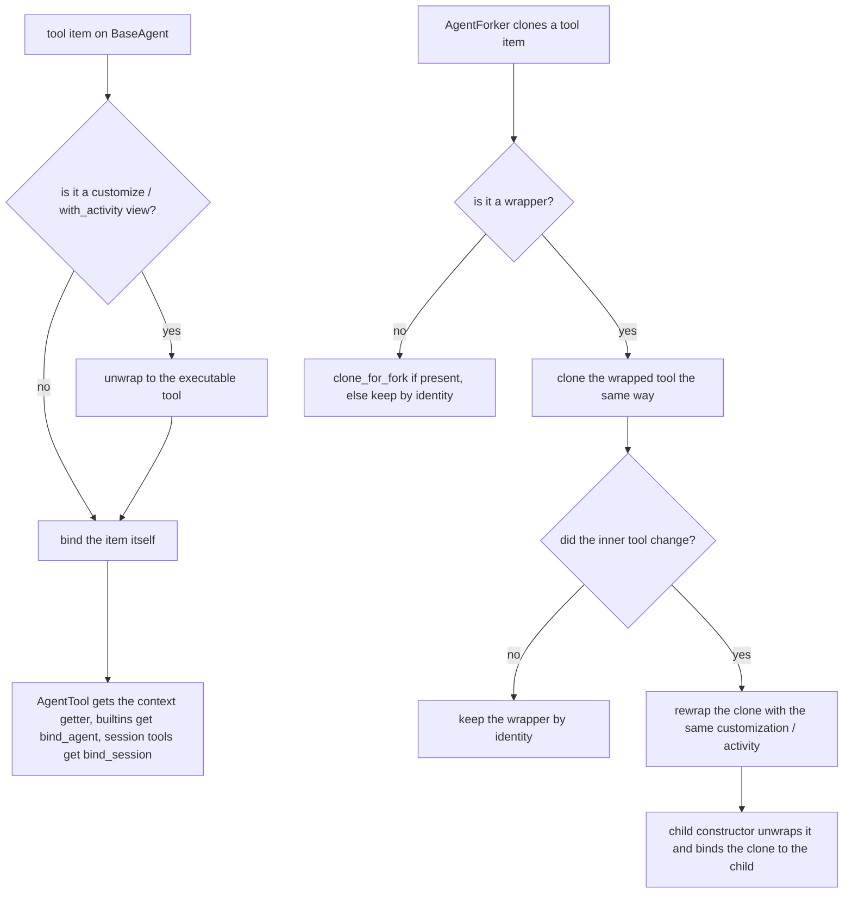

# Wrapped Tool Binding

## Summary

`tool.customize(description=...)` and `tool.with_activity(...)` return private `_ToolWrapper`
views that must keep the wrapped tool's runtime behavior. `BaseAgent` binds its live context
to builtins and `AgentTool` by checking the type of each tool item, and `AgentForker` clones
bound builtins by looking for `clone_for_fork()` on each item. A wrapper is neither, so a
customized `as_tool()` specialist never receives the parent's prompt, a customized
`run_prompts_sequentially` fails with "not bound", and a fork shares the parent's wrapped
bound tool by identity. This change looks through wrappers in both places.

## Flow chart



## Usage example

```python
billing = Agent(name="billing", ..., agent_metadata=AgentMetadata(name="billing", description="billing", use_cases="billing"))
desk = Agent(
    name="desk",
    tools=[
        billing.as_tool().customize(description="Ask the billing specialist (localized)."),
        RunPromptsSequentiallyTool().customize(description="Queue follow-up prompts (localized)."),
    ],
)
await desk.arun("CUSTOMER-ASKS: refund order 991")  # billing sees the request; follow-ups queue on desk
branch = desk.fork()  # branch gets its own bound copies, still with the localized descriptions
```

## How it works

- `BaseAgent._bind_agent_tool_context` and `BaseAgent._bind_session_tool` run their checks
  against `_unwrap_tool(tool)`. `_unwrap_tool` returns non-wrapper objects unchanged, so
  plain and protocol tools behave as before. `bind_session` goes through `_bind_session_tool`,
  so it is covered too.
- `_ToolWrapper` gains an abstract `_rewrap(tool)` that builds the same kind of view around a
  different inner tool: `_CustomizedTool` reuses its `ToolCustomization`, `_ActivityBoundTool`
  reuses its `ToolActivity`.
- `AgentForker._clone_tool` handles a wrapper by cloning its `wrapped_tool` with the same rule
  (so nested wrappers work) and rewrapping only when the inner tool actually changed. A wrapper
  around a custom tool is kept by identity, exactly like the unwrapped custom tool.
- No `clone_for_fork()` is added to `_ToolWrapper` itself: the independent-critic and
  prosecutor/defender/judge algorithms reject a `clone_for_fork()` that returns the same object,
  so a wrapper that answered `self` for an uncloneable tool would break them.

## Files

- `vidbyte/agents/base.py`
- `vidbyte/agents/fork.py`
- `vidbyte/tools/base.py`
- `vidbyte/tools/activity.py`
- `tests/test_agent_tool.py`, `tests/test_agent_fork_isolation.py` (regression tests)

## Risks

- Other places that inspect tool items by type or attribute (the session fallback for
  non-`BaseAgent` agents, and the owner-binding checks in the critic algorithms) still do not
  look through wrappers. They are outside the `BaseAgent` binding path and are left for a
  separate change.

## Verification

Regression tests for a customized `as_tool()` forwarding the parent prompt, a customized
`run_prompts_sequentially` queuing on its agent, and a fork cloning a customized bound tool;
then `python lint/run.py` and `python scripts/run_ci.py`.
