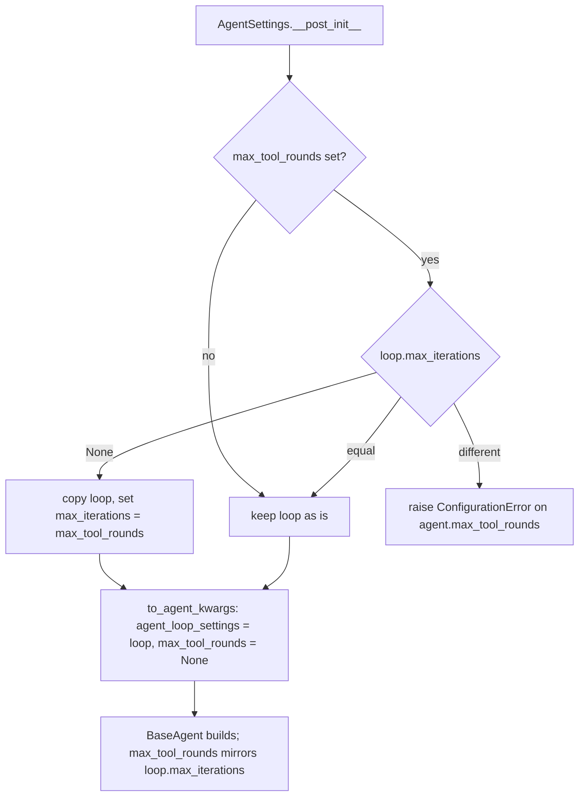

# YAML `max_tool_rounds` builds an agent

## Summary

An agent document that sets the documented top-level `max_tool_rounds:` field could never be built:
`YamlLoader.build_agent` always raised `ConfigurationError: Pass either agent_loop_settings= or
individual loop params (max_iterations), not both.` `AgentSettings` always hands `BaseAgent` a loop
object, and it also passed the round cap as a flat kwarg, which `BaseAgent` rejects. The fix folds
the round cap into a copy of the loop while the settings are validated, so `BaseAgent` receives one
consistent loop object.

## Flow chart



## Usage example

```yaml
type: base
name: support
system_prompt: Help.
provider: deepseek
model_name: deepseek-v4-flash
max_tool_rounds: 3
```

```python
from vidbyte import YamlLoader

loader = YamlLoader()
agent = loader.build_agent(loader.load_agent("support.yaml"))
assert agent.agent_loop_settings.max_iterations == 3 and agent.max_tool_rounds == 3
```

## How it works

- `AgentSettings._loop_with_tool_rounds` runs after `max_tool_rounds` is validated. It returns the
  loop unchanged when no cap is set or the loop already has the same `max_iterations`; returns a
  shallow copy with `max_iterations` set when the loop declares none; and raises when both are set
  to different values. The caller's loop object is never mutated.
- `to_agent_kwargs` keeps its key set but passes `max_tool_rounds: None`, because the cap now lives
  in `agent_loop_settings`.

## Files

- `vidbyte/lib/dataclasses/config.py`: the merge helper, its call, and the kwargs value.
- `tests/test_agent_settings_validation.py`: corrected kwargs assertion plus regression tests that
  build a `BaseAgent` from a document (twice from the same settings) and reject a conflicting cap.

## Risks

- Code that read `to_agent_kwargs()["max_tool_rounds"]` now sees `None`; the value is on
  `agent_loop_settings.max_iterations`, and the built agent's `max_tool_rounds` is unchanged.

## Verification

`python lint/run.py` and `python scripts/run_ci.py` locally, then the required CI checks on the PR.
