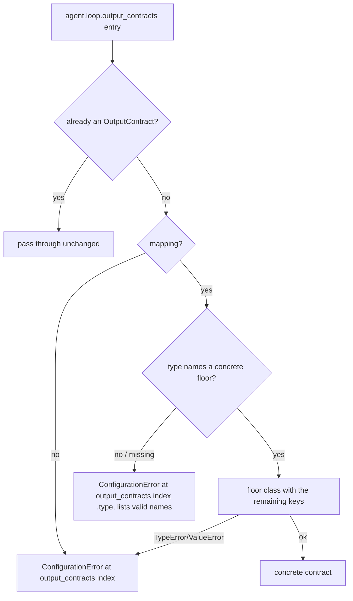

# YAML Output Contract Type

## Summary

`agent.loop.output_contracts` entries in an agent document were built as the abstract
`OutputContract` base. Its key is `""`, so a document contract read a counter that never moves and
could never be satisfied: every finish was rejected until `max_iterations`. Named floors
(`tool_name`, ...) failed with a constructor `TypeError`. That made the YAML-declared
`MinToolCallsById` path that `YamlLoader._contract_tool_names` checks unreachable. This change has
each entry name its concrete floor with a `type` key.

## Flow chart



## Usage example

```yaml
agent:
  name: researcher
  system_prompt: You are a careful research agent.
  loop:
    max_iterations: 8
    output_contracts:
      - {type: MinToolCalls, minimum: 1}
      - {type: MinToolCallsById, tool_name: search, minimum: 2}
```

## How it works

`AgentSettings._coerce_loop_members` builds a name-to-class map from
`vidbyte.agents.contracts.__all__`. It leaves out `OutputContract`, the abstract base, and
`SchemaConformance`, because a document declares schema conformance through `agent.output_schema`
and `BaseAgent` attaches that contract itself. `_coerce_contract` pops `type`, looks it up, and
passes the remaining keys to that class. A missing or unknown `type` raises `ConfigurationError`
with field `agent.loop.output_contracts[<i>].type` and the sorted valid names.

## Files

- `vidbyte/lib/dataclasses/config.py`: `_coerce_loop_members` / `_coerce_contract`.
- `tests/test_agent_settings_validation.py`: regression tests in `LoopValidationTests`.

## Risks

A document that used a bare mapping now fails to load. That shape was never satisfiable, so the
error replaces a silent stall that lasted until `max_iterations`.

## Verification

Run the new tests: a `type` builds the named floor with its kwargs; a missing type, the abstract
base, `SchemaConformance`, or an unknown name raises at `.type`. Then run
`python scripts/run_ci.py --stage source` and dispatch CI.
