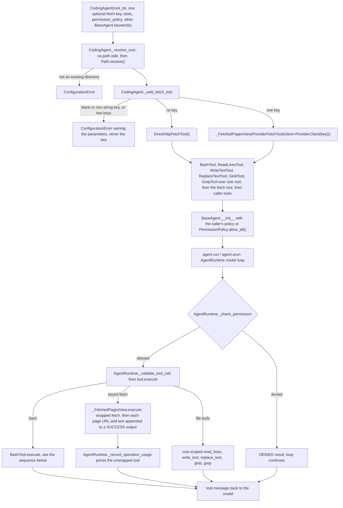
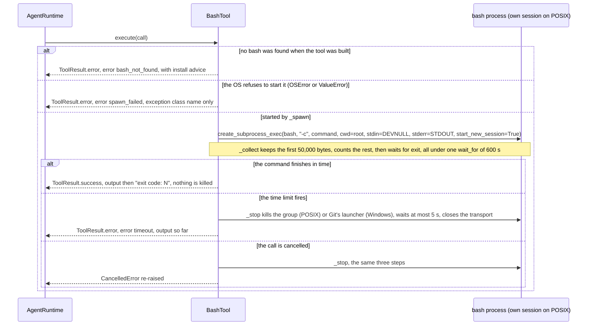

feat(agents): add CodingAgent, a BaseAgent with bash, file, search, and web-fetch tools
## Summary
This PR adds `CodingAgent` (`vidbyte/agents/coding.py`), a `BaseAgent` subclass that takes every `BaseAgent` keyword unchanged, plus a required `root_dir` and four optional fetch keys. It starts with seven tools over that one folder: `bash`, `read_lines`, `write_text`, `replace_text`, `glob`, `grep`, and one web-fetch tool. The key you pass picks the web-fetch tool, and with no key it is `direct_http_fetch`. `bash` is a new public `BashTool` (`vidbyte/tools/builtins/bash.py`). It runs each command as `bash -c` in a fresh process that is not sandboxed. Each command gets a 600-second limit and a 50,000-byte output cap. When a command has to be stopped, the call still returns within 5 more seconds. The decision that matters most is that the agent's own tools work by default. `CodingAgent` defaults to `PermissionPolicy.allow_all()`, and a policy you pass wins. A private view shows the model the text of each page a keyed provider fetched. `BaseAgent`'s SAFE+READ default and the existing fetch tools do not change for anyone else. Spec: `docs/spec/coding-agent/spec.md` (r3).

## How to use what this PR introduces
```python
from vidbyte import CodingAgent

agent = CodingAgent(
    name="coder",
    system_prompt="You are a careful software engineer. Make the smallest change that fixes the task.",
    root_dir="my-project",            # an existing folder; every file tool and every bash command starts here
    firecrawl_api_key="fc-your-key",  # optional; which key you pass picks the WebFetch provider
    provider="openai",
    model_name="gpt-4.1",
)

print(agent.root_dir)
# the absolute path of ./my-project
print(agent.tools.names())
# ('bash', 'read_lines', 'write_text', 'replace_text', 'glob', 'grep', 'firecrawl_fetch')

reply = agent.run("Run the tests with python -m pytest -q and fix the first failure.")
print(reply.content)
```
This is spec §4 unchanged. I ran it as written on this branch (Windows 11, Python 3.11.0, Git for Windows), from a temporary folder that holds an empty `my-project`. `fc-your-key` is a placeholder, and building the agent makes no network call. For the `agent.run(...)` line I did not call OpenAI. Instead I bound the feature pack's offline scripted model. It requested one `bash` call (`echo snippet-ran`) and then finished. The output was:
```
C:\Users\…\AppData\Local\Temp\tmpa5xwq7sc\my-project
('bash', 'read_lines', 'write_text', 'replace_text', 'glob', 'grep', 'firecrawl_fetch')
Fixed the first failure.
```
- The model was shown `snippet-ran\n\nexit code: 0`.
- Both calls ended `succeeded`.
- The policy allowed `execute`, `read`, `safe`, and `write`.

The developer no longer has to build seven tools, two root objects, and a permission policy by hand, or find a bash that works on Windows. With no key, the seventh tool is `direct_http_fetch`. For a read-only agent, pass `permission_policy=PermissionPolicy()`.

## Flow



Construction checks the root first, then the keys (blank keys, then how many), all before `BaseAgent.__init__` runs. `BaseAgent` then applies its own checks, such as the name, the prompt, and duplicate tool names. The only new state is `agent.root_dir`. At run time the existing runtime checks the policy and the tool's `validate_call` before any tool code runs. A denial becomes a DENIED result, and nothing raises. `BashTool.execute` returns the three failures it expects as error results: no bash, a command that could not start, and a timeout. A cancellation is re-raised after the stop. `_stop` suppresses `ProcessLookupError` and `PermissionError` and closes the transport in `finally`. So it never raises, and it closes the pipe even when a second cancellation lands during its wait. The keyed view changes only the `output` of a successful result. Its metadata passes through untouched, so billing is the same as for the bare tool.

## What changed
| File | Change |
|---|---|
| `vidbyte/tools/builtins/bash.py` | New `BashTool`. It runs one `bash -c` process per call in the root folder, under four `BASH_*` bounds that are read at call time. On Windows it looks for Git for Windows' `bin/bash.exe` next to `git`. Its stop is bounded and always closes the pipe. |
| `vidbyte/agents/coding.py` | New `CodingAgent`, which checks the root and the keys, builds the seven tools, and defaults to allow-all. Also the private `_FetchedPagesView`. |
| `vidbyte/tools/builtins/__init__.py` | Exports `BashTool`. |
| `vidbyte/agents/__init__.py` | Exports `CodingAgent`. |
| `vidbyte/__init__.py` | Exports `CodingAgent` from the root package. |
| `contracts/sdk-public-api.json` | Regenerated; gains `CodingAgent`. |
| `vidbyte/agents/README.md` | New "Coding Agent" section (usage, key choice, policy, bash limits, fork/restore, Windows caveat) and a Key Modules bullet. |
| `vidbyte/tools/README.md` | Lists bash under `builtins/`. Says that on `CodingAgent` a keyed fetch's `output` carries the page text. |
| `tests/features/coding_agent/conftest.py` | Offline fixtures: a scripted tool-calling model and a fake provider HTTP send. |
| `tests/features/coding_agent/test_coding_agent_acceptance.py` | End-to-end through `BaseAgent`'s loop. Covers the §4 snippet, the default and read-only policies, keyed fetch page text and billing, and a missing bash. |
| `tests/features/coding_agent/test_coding_agent_contract.py` | Covers exports, the signature, state parity with `BaseAgent`, restore, caller tools, name collisions, identity errors, a bad root, and `chdir`. |
| `tests/features/coding_agent/test_coding_agent_web_fetch.py` | Covers which tool each key picks, sending the key to the provider, keys never leaking, and two or blank keys being rejected. |
| `tests/features/coding_agent/test_bash_tool_contract.py` | Covers the spec, validation, both streams and the exit code, the working folder, argv, stdin, spawn errors, UTF-8, the cap, a missing bash, and the Windows lookup. |
| `tests/features/coding_agent/test_bash_tool_process_bounds.py` | Covers the timeout, the group kill, cancellation, `setsid`, background processes, endless output, and the pipe close. |
| `tests/features/coding_agent/FEATURE.md`, `README.md` | The feature pack's description and file index. |
| `docs/spec/coding-agent/` (20 files) | Spec r3, request, test plan, review, verify log, pipeline state, scout code map, stage reports, and this PR body. |

## Acceptance criteria → proof
Test files are in `tests/features/coding_agent/`.

| AC | What it checks (plain words) | Proven by |
|---|---|---|
| AC-1 | The §4 snippet runs as written: the root is absolute, the seven names are in order, and `run` goes through the loop. | `test_coding_agent_acceptance.py::test_spec_snippet_builds_seven_tools_over_an_absolute_root_and_runs_through_the_loop`, plus the manual run above |
| AC-2 | With no policy, `bash`, `write_text`, and `replace_text` run (not denied). | `test_coding_agent_acceptance.py::test_default_policy_lets_the_model_write_edit_and_run_bash_under_root` |
| AC-3 | A read-only policy you pass wins: no process starts and no file changes. | `test_coding_agent_acceptance.py::test_caller_read_only_policy_denies_bash_and_write_without_side_effects` |
| AC-4 | Two keys fail at construction, naming both parameters and neither key. | `test_coding_agent_web_fetch.py::test_two_fetch_keys_are_rejected_naming_both_parameters_but_neither_key` |
| AC-5 | A blank or non-string key fails without echoing it. | `test_coding_agent_web_fetch.py::test_blank_or_non_string_fetch_key_is_rejected_without_echoing_it` |
| AC-6 | Each key, or no key, picks the right seventh tool, with no network call and no process started. | `test_coding_agent_web_fetch.py::test_the_supplied_key_picks_the_last_tool_without_network_or_process` |
| AC-7 | A keyed fetch shows the model every page's text and is billed the same as the bare tool. | `test_coding_agent_acceptance.py::test_keyed_fetch_shows_every_page_to_the_model_and_bills_like_the_bare_tool`; `test_coding_agent_web_fetch.py::test_keyed_fetch_sends_the_parameter_key_to_its_provider_and_shows_the_page` |
| AC-8 | A caller tool named like one of the seven fails at construction. | `test_coding_agent_contract.py::test_caller_tool_named_like_a_coding_tool_is_rejected_at_construction` |
| AC-9 | Caller tools come after the seven, in the caller's order. | `test_coding_agent_contract.py::test_caller_tools_follow_the_seven_coding_tools_in_caller_order` |
| AC-10 | No default prompt or name; `BaseAgent`'s own errors pass through. | `test_coding_agent_contract.py::test_base_agent_identity_errors_pass_through_unchanged` |
| AC-11 | A root that is not an existing folder fails at construction. | `test_coding_agent_contract.py::test_root_dir_that_is_not_an_existing_directory_is_rejected_at_construction` (`""` is fixed in code by `64df91ce` but has no test case) |
| AC-12 | A finished command returns both streams in order and its exit code, as a success. | `test_bash_tool_contract.py::test_completed_command_returns_both_streams_in_order_and_its_exit_code_as_success` |
| AC-13 | Large output keeps the first 50,000 bytes, counts the rest, and keeps memory bounded. | `test_bash_tool_contract.py::test_large_output_keeps_the_first_bytes_counts_the_rest_and_memory_stays_bounded` |
| AC-14 | At the time limit the command and its child are killed, and output so far comes back. | `test_bash_tool_process_bounds.py::test_time_limit_kills_the_command_and_the_child_it_started`; `::test_command_past_the_time_limit_returns_timeout_with_output_so_far` |
| AC-15 | Cancellation kills the group, even after the shell has exited, and re-raises within the grace period. | `test_bash_tool_process_bounds.py::test_cancellation_kills_the_process_group_even_after_the_shell_has_exited`; `::test_agent_tool_timeout_cancels_bash_and_kills_the_background_child`; `::test_cancelled_call_reraises_cancellation_within_the_grace_period` |
| AC-16 | Commands run in the root folder, even when its path has spaces and Unicode. | `test_bash_tool_contract.py::test_command_runs_in_the_root_folder_even_when_its_path_has_spaces_and_unicode` |
| AC-17 | Without bash, only the bash call fails, with install advice; the other tools keep working. | `test_coding_agent_acceptance.py::test_missing_bash_fails_only_the_bash_call_and_the_other_tools_keep_working`; `test_bash_tool_contract.py::test_missing_bash_returns_bash_not_found_with_install_guidance` |
| AC-18 | A missing, blank, or non-string command is rejected before any process starts. | `test_bash_tool_contract.py::test_bash_rejects_a_missing_blank_or_non_string_command_before_spawning` |
| AC-19 | No lint rule rises above its `main` count. | Gate: `python lint/run.py` prints `SDK-LINT: PASS` |
| AC-20 | The three public imports work, the two `CodingAgent`s are the same object, and the API contract matches. | `test_coding_agent_contract.py::test_public_names_resolve_to_one_coding_agent_class_and_one_bash_tool_class`; the contract half is lint C016 (`generate-sdk-public-api.py --check`) inside `SDK-LINT: PASS` |
| AC-21 | `BaseAgent.restore(state, tools=agent.tools.all())` keeps the seven tools and allow-all. | `test_coding_agent_contract.py::test_restored_state_keeps_the_seven_tools_and_the_allow_all_policy` |
| AC-22 | On Windows, Git's `bin/bash.exe` is used, never the `bash` on `PATH`. | `test_bash_tool_contract.py::test_windows_lookup_runs_git_bin_bash_never_the_path_bash`; `::test_windows_lookup_stops_after_three_parent_folders_of_git` (both simulate win32 on POSIX). Also checked by hand on a real Git for Windows install, for 2 of the 3 layouts (see Verification). |
| AC-23 | The key never appears in exported state, the agent card, or a failed fetch result. | `test_coding_agent_web_fetch.py::test_key_is_absent_from_exported_state_and_agent_card`; `::test_failed_keyed_fetch_passes_through_unchanged_and_never_carries_the_key` |
| AC-24 | A command that closes its output and keeps running still times out and is killed. | `test_bash_tool_process_bounds.py::test_command_that_closes_its_output_still_times_out_and_is_killed` |
| AC-25 | A `setsid` descendant that holds the output cannot stretch the call past limit + grace. | `test_bash_tool_process_bounds.py::test_setsid_descendant_holding_the_output_cannot_stretch_the_call_past_limit_plus_grace` |
| AC-26 | A background process with both streams redirected survives a finished call. | `test_bash_tool_process_bounds.py::test_background_process_with_both_streams_redirected_survives_a_completed_call` |
| AC-27 | On Windows, a command that never ends still returns `timeout` within limit + grace. | `test_bash_tool_process_bounds.py::test_command_past_the_time_limit_returns_timeout_with_output_so_far`, run on Windows 3.11. The 3.13 half was a stub-import probe only (see Follow-ups). |
| AC-28 | A timed-out call closes its pipe, so shutting down the loop reports nothing. | `test_bash_tool_process_bounds.py::test_timed_out_call_closes_its_pipe_so_loop_shutdown_reports_nothing` |
| AC-29 | Endless output times out with the first bytes and a truncation line. | `test_bash_tool_process_bounds.py::test_endless_printer_times_out_with_the_first_bytes_and_a_truncation_marker` |

## Verification
The code last changed at `581fc272`. Every commit after it touches only `docs/spec/`.

| Gate | Command | Result |
|---|---|---|
| Feature pack, Windows 3.11 | `PYTHONPATH=$(pwd) python -m pytest -q tests/features/coding_agent/` | `86 passed, 11 skipped` (the 11 are POSIX-only cases) |
| Feature pack, WSL Ubuntu 3.12 | the same command in WSL | `97 passed` |
| Lint | `python lint/run.py` | `SDK-LINT: PASS` |
| Full local gate, source | `PYTHONPATH=$(pwd) python scripts/run_ci.py --stage source` | `2715 passed, 12 skipped` / `CI passed.` |
| Full local gate, package | `python scripts/run_ci.py --stage package` (`PYTHONPATH` unset) | `Installed vidbyte-sdk 0.2.0 passed smoke checks.` / `CI passed.` |
| Remote CI on `581fc272` | `gh workflow run ci.yml` → run `38075705506` | Source 3.11 `2718 passed, 9 skipped`; Source 3.12 `2718 passed, 9 skipped`; Package passed |
| Remote Semgrep on `581fc272` | `gh workflow run static-policy.yml` → run `38075707127` | `Ran 1 rule on 857 files: 0 findings.` |
| Windows bash lookup on a real Git for Windows install | `BashTool(...)._executable` and one call, from Python started in PowerShell and in Git Bash | Both picked `C:\Program Files\Git\bin\bash.exe`. From PowerShell, `git` was `cmd\git.EXE` and the `PATH` bash was `system32\bash.EXE`. From Git Bash, `git` was `mingw64\bin\git.EXE` and the `PATH` bash was `usr\bin\bash.EXE`. Both calls returned `success … exit code: 0`. |
| Scratch merge with `main` at `77084eb2` (contract conflict left unresolved) | the pack in Windows and WSL, plus full pytest on Windows | `86 passed, 11 skipped`; `97 passed`; `2857 passed, 12 skipped`. One earlier full run had one failure in the unrelated `tests/test_codex_tools.py::CodexSdkContractTests::test_cancelled_turn_releases_its_waiting_reader`, which passed alone 4 times and on a full re-run. |

## Adversarial review
4 findings were confirmed by an independent verifier across three lenses (spec conformance, repo conventions, engineering). All 4 were fixed and 0 were waived. Of the 5 Minors, R-5 to R-7 were fixed, and R-8 and R-9 are follow-ups. A conformance re-review after the repairs returned SOUND, with one Minor (R-C1, a follow-up). Full record: `docs/spec/coding-agent/review.md`.

| ID | Finding | Fixed in |
|---|---|---|
| R-1 (Blocker) | `_stop` could raise (a `PermissionError` from the kill or from `transport.close()`) and could skip closing the pipe on a second cancel. That could swallow a cancellation. | `415f7c22`: try/finally, `PermissionError` tolerated on the kill and on the close |
| R-2 (Blocker) | The stdin test could not fail, because pytest already puts the null device on fd 0. | `a49b7dd8`: the test gives the process a stdin that never ends |
| R-3 (Major) | `root_dir=""` was accepted and meant the current folder. | `64df91ce`: `os.path.isdir` instead of `Path.is_dir` |
| R-4 (Major) | The bash description said the exit code is always the last line, and it hid the Windows limit. | `977c7d23`: a five-sentence description with the Windows caveat |

## Deviations from the spec
- **`BashTool._spawn(executable, command)`** instead of `_spawn(command)` (§12.3 row 1). `execute` passes the executable it has just checked for `None`, so mypy sees a `str`. Behavior is the same (`25b5260b`; spec §17).
- **`_stop` tolerates `PermissionError`** next to `ProcessLookupError`, on the kill and on `transport.close()`, and it closes the transport in `finally`. D-14 named only `ProcessLookupError`. But `os.killpg` raises `PermissionError` when no group member can be signalled, and the stdlib `close()` re-kills a running child and lets that error through. Either error would replace a propagating `CancelledError` (`415f7c22`; spec §17).
- **Two test-tree edits after the tests were written**, both granted by the orchestrator: the EC-11 test body (R-2, `a49b7dd8`), and one line in the pack README that gave the wrong folder for the file tools (R-7, `581fc272`). No other test changed.
- **Spec §5's sequence diagram** did not show the transport close (D-18) or the `PermissionError` tolerance. It was updated in this PR to match the code (spec §17).

## Follow-ups
- **Before merging: this branch conflicts with `main`.** `main` is 45 commits past this branch's base `8f23fd67` (at `d7b25110` when checked). `contracts/sdk-public-api.json` conflicts, because `main` bumped the version to 0.2.1 and the source commit. To resolve it:
  1. Merge `main`.
  2. Regenerate the contract with `python scripts/generate-sdk-public-api.py`.
  3. Re-run `python lint/run.py`, because `main` added rules (A009, C006 to C015, S063, S064) that this branch has never run.
  4. Re-run the full gate and both remote workflows.

  `main` also changed files this agent builds on: `base.py`, `fork.py`, `runtime.py`, `glob.py`, `grep.py`, `fetch.py`, and `replace_text.py`. The scratch merge above passed.
- **R-C1:** the last sentence of the bash description says a background process "is killed". That is false on Windows. The fix is one clause: "…otherwise the call waits for the time limit and is then stopped as described above".
- **R-8:** consider moving `_FetchedPagesView` from `vidbyte/agents/coding.py` into the tools layer, where similar wrappers live. No AGENTS.md rule requires it.
- **R-9:** on Windows, `shutil.which("git")` can return a relative `.\git.EXE` from the current folder. A planted `git` plus `bin\bash.exe` there would then be used. This is hardening the spec did not ask for. A possible fix is to ignore a relative `git` path.
- **Regression tests for the R-1 paths** (an EPERM from `killpg`, and a second cancel during the grace wait). Out-of-repo probes proved both, but the tests were not added to the pack in this PR.
- **A `""` case in the AC-11 test.** R-3 is fixed in code, but no test pins it.
- **Import order (ruff I001)** in `tests/features/coding_agent/test_coding_agent_contract.py:14` and `test_coding_agent_web_fetch.py:14`. No gate scans `tests/` for this.
- **Known limits that stay:**
  - On Windows a timed-out or cancelled command may keep running, because killing Git's `bash.exe` launcher does not reach it (A-9, Q-6).
  - When no process in the group can be signalled (for example an `exec sudo …` leader), the timeout text still says "[command stopped: …]".
  - On Python 3.11, `asyncio.wait_for` can return the result instead of raising when a cancel lands exactly as the command finishes. This was already true before this PR.
- **Manual checks still open:**
  - AC-22 with `git` in `<G>\bin` was not checked on a real install. The `cmd` and `mingw64\bin` layouts were checked (see Verification).
  - AC-27 on Python 3.13 was checked only through a stub-import probe of the real `bash.py` (timeout 2.02 s with limit 1 s and grace 1 s; double cancel 0.81 s; transport closed). Pytest was not run under 3.13, because that interpreter lacks pytest-asyncio and PyYAML.
- **Not built, by decision** (spec §15 defaults): a configurable timeout or cap, an environment allow-list, a default `result_max_chars`, `CodingAgent.restore`, and a Windows job-object kill.

🤖 Generated with [Claude Code](https://claude.com/claude-code)
