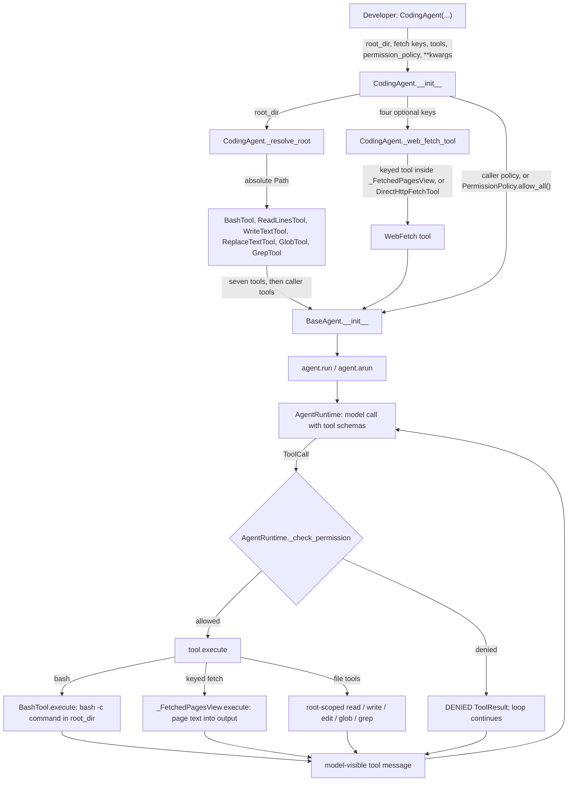
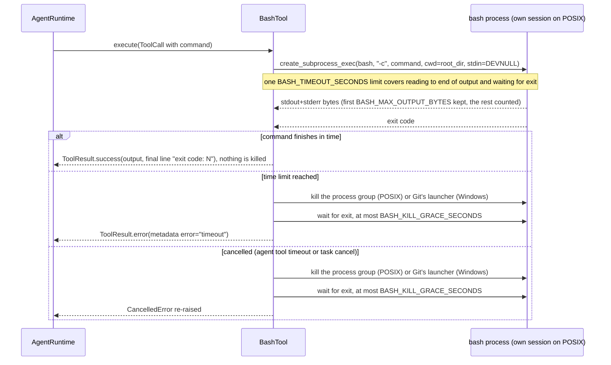

# Spec: CodingAgent — a minimal BaseAgent with seven file-system and web tools

> **TL;DR** — Add `CodingAgent`, a thin `BaseAgent` subclass that takes every `BaseAgent` keyword unchanged plus a required `root_dir` and four optional fetch keys, and pre-loads seven tools: a new minimal subprocess `BashTool` and the existing `read_lines`, `write_text`, `replace_text`, `glob`, `grep`, and one fetch tool chosen by which key was passed. The decision that matters most: the agent's own tools must actually work for the model by default, so `CodingAgent` defaults to an allow-all permission policy (a caller's policy still wins) and shows the model the text of pages a keyed provider fetched, without changing the existing fetch tools for anyone else.

## §0 User prompts

The verbatim record of every prompt lives in `docs/spec/coding-agent/request.md` §A (Prompt 1 is the original feature request; Prompt 2, below, invoked the pipeline).

### 0.1 Invoking request (verbatim)
the 7 tools sound good, and you can fetch the keys from the parameter. for bash I dont want to use the sandbox, just implement a miniamlistic subprocess bash, no default system prompt, tool names I dont care.

### 0.2 User replies during the run
_None yet. The orchestrator appends any reply the user sends during the run here verbatim, labeled with the revision it produced._

---

## Part A — Framing

## §1 Goal

Today a developer who wants a coding agent from this SDK has to assemble it by hand, and the obvious assembly does not work. There is no shell tool anywhere in `vidbyte/` (the only process spawn is the MCP stdio transport). The file tools use two different root representations (`root_dir` for glob/grep/patch, `FileSystemToolConfig.root` for read/write/replace). `BaseAgent`'s default policy allows only SAFE and READ, so a write or a shell call is returned to the model as DENIED and the loop carries on (`tests/test_agent_tool_loop.py::test_agent_denies_write_tool_by_default` pins this). The keyed fetch tools hand the model a one-line summary such as `1. https://… (5234 chars)` and keep the page text in metadata the model never sees. On the user's own Windows 11 machine, `shutil.which("bash")` resolves `C:\WINDOWS\system32\bash.EXE`, the WSL launcher, which exits 1 with "WSL2 is unable to start" (verified 2026-10-10), even though Git Bash is installed at `C:\Program Files\Git\bin\bash.exe`.

| ID | Goal (outcome) | How we will know | Source |
|---|---|---|---|
| G-1 | A developer gets a working coding agent from one constructor call: everything `BaseAgent` accepts and does, plus Bash, Read, Write, Edit, Glob, Grep, and WebFetch. | The §4 snippet runs as written; AC-1, AC-9, AC-10. | request.md §A Prompt 1 ("same settings and functionality … just add the following tools"), Prompt 2 ("the 7 tools sound good") |
| G-2 | Each of the seven tools does its job for the model without extra setup: writes, edits, and shell commands are not denied by default, and a keyed WebFetch lets the model read the page it fetched. | AC-2, AC-6, AC-7. | Prompt 1 ("has all of the tools to interact with the file system", "WebFetch (can change provide based on key)"); request.md §C constraint on default permissions |
| G-3 | Bash is a minimal, unsandboxed subprocess that cannot hang a run forever or exhaust memory, and that runs on the user's Windows machine (Git Bash) as well as on Linux and macOS. | AC-12 to AC-18, AC-22, AC-24 to AC-29. | Prompt 2 ("dont want to use the sandbox, just implement a miniamlistic subprocess bash"); request.md §C open question on Windows bash |

## §2 Objective

When this PR merges, `vidbyte` exports `CodingAgent` (from `vidbyte.agents` and the root `vidbyte` package) and `vidbyte.tools.builtins` exports a new `BashTool`. `CodingAgent(name=…, system_prompt=…, root_dir=…, [one of four fetch keys], **any BaseAgent keyword)` builds a `BaseAgent` whose catalog starts with exactly seven tools over one resolved root folder (`bash`, `read_lines`, `write_text`, `replace_text`, `glob`, `grep`, and one of `firecrawl_fetch` / `browserbase_fetch` / `parallel_extract` / `tavily_extract` / `direct_http_fetch`), followed by any tools the caller passed. Its default permission policy allows all four permission levels. A keyed fetch result shows the model every fetched page's text. `BashTool` runs one command per call as `bash -c <command>` through `asyncio.create_subprocess_exec` in the root folder, bounded by one 600-second limit that covers both reading its output and waiting for it to exit, and by a 50,000-byte capture cap. On timeout or cancellation it kills the command's process group on POSIX (on Windows it can stop only Git's bash launcher, EC-14) and then waits at most 5 more seconds, so every call returns. The public API contract and two READMEs are updated. This is the whole feature in one PR; nothing is deferred to a later slice.

## §3 Non-goals

- **NG-1** — Running Bash through `SandboxTransport` or any sandbox. — *Why not:* the user rejected it ("for bash I dont want to use the sandbox").
- **NG-2** — A default or built-in coding system prompt. — *Why not:* the user rejected it ("no default system prompt"); `system_prompt` passes to `BaseAgent` unchanged, and `BaseAgent` rejects an empty one.
- **NG-3** — Renaming or wrapping tools under stable names such as `web_fetch`, `edit`, or `read`. — *Why not:* "tool names I dont care"; the existing model-facing names are kept.
- **NG-4** — Any tool beyond the seven (web search, todo list, multi-edit, list-directory, notebook edit, patch). — *Why not:* the user accepted exactly seven.
- **NG-5** — Reading fetch API keys from environment variables. — *Why not:* the user chose constructor parameters ("you can fetch the keys from the parameter").
- **NG-6** — Linkup as a keyed WebFetch provider. — *Why not:* `LinkupFetchTool.execute` always returns a priced stub and never fetches (`fetch.py:193-196`), and `operations/clients/` has no Linkup client, so a Linkup key could not change what is fetched.
- **NG-7** — Changing what the existing fetch tools show the model for other users (`_render_fetched_pages`, `fetch.py:39-42`). — *Why not:* `vidbyte/tools/README.md` ("Priced Operation Tools") documents `output` as a compact summary and `metadata["operation_payload"]` as the application channel; every current user of those tools would start paying for full page text in context.
- **NG-8** — A persistent shell session (working directory or variables that survive between calls), background-job management, or streaming output. — *Why not:* not requested; a fresh process per call is the minimal subprocess bash.
- **NG-9** — Command allow-lists or deny-lists for Bash. — *Why not:* not requested; the agent's `PermissionPolicy` is the existing control.
- **NG-10** — A `VidbyteSDK().agents.coding(...)` entry on `AgentClient`, a declarative YAML agent type, or MCP-server exposure. — *Why not:* not requested.
- **NG-11** — Making `fork()`, `restore()`, or a cold session resume return a `CodingAgent` instance. — *Why not:* `AgentForker.fork` and `Session._restore_agent` build plain `BaseAgent`s by design; a `BaseAgent` with the same tools and policy behaves identically (CodingAgent adds no runtime behavior). See EC-20, EC-21, Q-5.
- **NG-12** — Windows CI coverage, and Windows bash sources other than Git for Windows (MSYS2, Cygwin, WSL). — *Why not:* CI runs only on ubuntu-latest; the Windows path is best-effort for the user's documented setup.
- **NG-13** — Bounding the size of `direct_http_fetch` bodies, `read_lines` file reads, or keyed page text in the model's context. — *Why not:* those are existing tools' behaviors; the repo's control for model-visible size is `ToolSettings.result_max_chars`, which the caller already has (Q-4).
- **NG-14** — A configurable Bash timeout or output cap (constructor knob or model-facing `timeout` parameter). — *Why not:* not requested; fixed constants plus the existing `ToolSettings.tool_timeout_seconds` cover it (Q-2).

## §4 Developer usage

```python
from vidbyte import CodingAgent

agent = CodingAgent(
    name="coder",
    system_prompt="You are a careful software engineer. Make the smallest change that fixes the task.",
    root_dir="my-project",            # an existing folder; every file tool and every bash command starts here
    firecrawl_api_key="fc-your-key",  # optional; which key you pass picks the WebFetch provider
    provider="openai",
    model_name="gpt-4.1",
)

print(agent.root_dir)
# the absolute path of ./my-project
print(agent.tools.names())
# ('bash', 'read_lines', 'write_text', 'replace_text', 'glob', 'grep', 'firecrawl_fetch')

reply = agent.run("Run the tests with python -m pytest -q and fix the first failure.")
print(reply.content)
```

The developer passes the same keywords they would pass to `BaseAgent` and gets an agent whose model can run shell commands, read, write, and edit files under one folder, search it by name and content, and read web pages, without assembling seven tools, two root objects, and a permission policy by hand. With no fetch key the last tool is `direct_http_fetch`; to make the agent read-only, pass `permission_policy=PermissionPolicy()` (from `vidbyte.tools.security`).

## §5 Flow diagram





Construction is where everything is validated: `CodingAgent.__init__` rejects a `root_dir` that is not an existing directory and any fetch key that is blank or supplied alongside another key, before `BaseAgent.__init__` runs and rejects an empty name or system prompt. At run time the existing `AgentRuntime._check_permission` (`runtime.py:1270`) decides each call before any tool code runs; a denial becomes a DENIED result and nothing raises. Bash state changes only inside the child process. The tool catches its own time limit; on cancellation it stops the child and then lets the cancellation propagate. In both cases the wait for the child to exit after the kill is capped by a short grace period, so the call always returns. A keyed fetch's billing metadata passes through the view untouched, so the runtime prices it exactly as it prices the bare tool.

---

## Part B — Behavior (this is the spec; everything else is framing)

## §6 Behavior

### 6.1 Invariants

- **INV-1** — A `CodingAgent` is a `BaseAgent` (`isinstance`), and the class defines only `__init__` plus private construction helpers; it never overrides `generate_reply`, `run`, `arun`, `fork`, `export_state`, `restore`, `from_run_id`, or any other `BaseAgent` method.
- **INV-2** — Every keyword `BaseAgent.__init__` accepts is accepted by `CodingAgent.__init__` with the same meaning, except that `tools` is appended after the seven coding tools and `permission_policy` defaults to allow-all.
- **INV-3** — At construction, the catalog starts with exactly seven coding tools in this order: `bash`, `read_lines`, `write_text`, `replace_text`, `glob`, `grep`, then the one WebFetch tool; valid caller tools follow in the caller's order, so right after construction the count is 7 + the number of valid caller tools. (Later `add_tool` calls or MCP attachment can change the catalog, and `BaseAgent` drops a caller item that is not a tool, `base.py:1283-1290`.)
- **INV-4** — The five root-scoped tools (`read_lines`, `write_text`, `replace_text`, `glob`, `grep`) and Bash's working directory use one absolute root, resolved once at construction; `agent.root_dir` is that path, and a later change of the process working directory never moves it.
- **INV-5** — Exactly one WebFetch tool is registered. Its provider is the provider of the one key passed (`firecrawl_api_key` → `firecrawl_fetch`, `browserbase_api_key` → `browserbase_fetch`, `parallel_api_key` → `parallel_extract`, `tavily_api_key` → `tavily_extract`); with no key it is `direct_http_fetch`.
- **INV-6** — `CodingAgent` never reads an environment variable to choose or configure the fetch provider or its key.
- **INV-7** — When the caller passes `permission_policy`, that exact object becomes `agent.permission_policy`; when the caller passes none, the policy allows SAFE, READ, WRITE, and EXECUTE.
- **INV-8** — `CodingAgent` never supplies or modifies a system prompt; `system_prompt` reaches `BaseAgent` unchanged.
- **INV-9** — `BashTool` never spawns through a shell API (`shell=True`, `asyncio.create_subprocess_shell`, `os.system`) and never touches `SandboxTransport`; it execs the resolved bash executable with the argument list `[bash, "-c", command]`.
- **INV-10** — `BashTool` keeps at most `BASH_MAX_OUTPUT_BYTES` of a command's output, whatever the command prints (plus one transient read of at most `BASH_READ_CHUNK_BYTES`, which is counted and discarded); beyond the cap it keeps reading and counting so the command is never blocked on a full pipe.
- **INV-11** — Every `bash` call returns within `BASH_TIMEOUT_SECONDS` + `BASH_KILL_GRACE_SECONDS`, on every OS. One time limit, `BASH_TIMEOUT_SECONDS`, covers reading the output to its end and waiting for the shell to exit. At the limit the tool stops the command — on POSIX by killing its whole process group, on Windows by killing Git's bash launcher, which can leave the command itself running (EC-14) — waits at most `BASH_KILL_GRACE_SECONDS` for the shell to exit, and returns an error result whose metadata `error` is `"timeout"`.
- **INV-12** — When a `BashTool` call is cancelled (the agent-level `ToolSettings.tool_timeout_seconds`, or the run's task being cancelled), the tool stops the command the same way before the cancellation leaves it — on POSIX it kills the process group even when the shell itself has already exited — waits at most `BASH_KILL_GRACE_SECONDS`, and `CancelledError` always propagates.
- **INV-13** — A command that runs to completion is a successful tool call whatever its exit code; its output ends with a line `exit code: <N>` and its metadata carries `exit_code` and `truncated`. Only "could not start" and "did not finish" are error results.
- **INV-14** — `BashTool` has `ToolPermission.EXECUTE`, so under the default `ToolErrorPolicy(retry_only_idempotent=True)` the tool-error retry policy never retries it automatically (`tool_error_policy.py:28`, `:142-147` treat only SAFE and READ as idempotent; a caller who sets `retry_only_idempotent=False` opts in to retrying every permission level).
- **INV-15** — On `win32`, `BashTool` never runs the `bash` found on `PATH` (depending on how Python was started, that is the System32 / WindowsApps WSL launcher or Git's `usr/bin/bash.exe`); it uses Git for Windows' `bin/bash.exe` found under one of the first three parent folders of the resolved `git` executable on `PATH`, or reports `bash_not_found`.
- **INV-16** — A successful keyed fetch shows the model, after the provider's summary line, every returned page's final URL followed by its full content, in payload order. Error results pass through unchanged, and the result's metadata (including the operation-usage annotation) is passed through unchanged, so usage is recorded under the same operation and provider as the bare tool.
- **INV-17** — No fetch API key value ever appears in an exception message or details, a `ToolResult` output or metadata, `export_state()`, or `card()`.
- **INV-18** — Building a `CodingAgent` performs no network request and spawns no process.
- **INV-25** — A command that finishes within the limit is never killed: after a normal completion the tool sends no signal, so a background process whose standard output and standard error were both redirected (for instance to a file) keeps running after the call.
- **INV-26** — When a stop leaves the command or a descendant running, the parent still closes its end of the output pipe before the call returns or re-raises: `_stop` always ends by closing the subprocess transport, so no transport or pipe handle outlives the call, and closing the event loop afterwards reports no `Event loop is closed` errors.

**Must not regress:**
- **INV-19** — `BaseAgent`'s own default policy stays SAFE+READ (`vidbyte/agents/base.py:185`, `vidbyte/lib/dataclasses/security.py:33`); a plain `BaseAgent` still denies writes by default (`tests/test_agent_tool_loop.py::test_agent_denies_write_tool_by_default`).
- **INV-20** — The existing fetch tools' model-visible output is unchanged for every caller that is not a `CodingAgent` (`vidbyte/tools/builtins/operations/fetch.py` is not edited).
- **INV-21** — `FileSystemToolConfig.allow_write` still defaults to `False` (`vidbyte/lib/dataclasses/filesystem.py:31`); only `CodingAgent` opts in.
- **INV-22** — A `CodingAgent` can serve as a `JevAgent` specialist, because it replies through `BaseAgent.generate_reply` (`vidbyte/agents/jev/agent.py:86-98`).
- **INV-23** — `agent.fork()` on a `CodingAgent` returns a `BaseAgent` with the same tool names and the same permission policy; tools without a clone hook, including the `_FetchedPagesView` object, are reused as the same objects (`vidbyte/agents/fork.py:43`, `:136-142`).
- **INV-24** — A `CodingAgent` built with a non-linear `runtime` (MCTS or actor) is accepted exactly as a `BaseAgent` with the same arguments, because `CodingAgent` adds no middleware.

### 6.2 Acceptance criteria

| ID | Given | When | Then | Priority | Proof |
|---|---|---|---|---|---|
| AC-1 | a clean checkout of this branch and an existing folder `my-project` | the §4 snippet runs (with an offline runner bound for the `run` line) | `agent.root_dir` is the absolute path of `my-project`, `agent.tools.names()` is exactly `('bash', 'read_lines', 'write_text', 'replace_text', 'glob', 'grep', 'firecrawl_fetch')`, and `run` completes through `BaseAgent`'s loop | P0 | `tests/features/coding_agent/test_coding_agent_acceptance.py::test_spec_snippet_builds_seven_tools_over_an_absolute_root_and_runs_through_the_loop` |
| AC-2 | a `CodingAgent` built without `permission_policy` | the model calls `bash`, `write_text`, and `replace_text` | each call executes (state `succeeded`, never `denied`), the file is written and edited under `root_dir`, and the command's output reaches the model | P0 | `tests/features/coding_agent/test_coding_agent_acceptance.py::test_default_policy_lets_the_model_write_edit_and_run_bash_under_root` |
| AC-3 | a `CodingAgent` built with `permission_policy=PermissionPolicy()` | the model calls `bash` and `write_text` | both are `denied`, no process is spawned, no file changes, and the run continues | P0 | `tests/features/coding_agent/test_coding_agent_acceptance.py::test_caller_read_only_policy_denies_bash_and_write_without_side_effects` |
| AC-4 | two fetch keys passed (any pair) | `CodingAgent(...)` is constructed | `ConfigurationError` is raised naming the parameters; neither key value appears in the message or `details` | P0 | `tests/features/coding_agent/test_coding_agent_web_fetch.py::test_two_fetch_keys_are_rejected_naming_both_parameters_but_neither_key` |
| AC-5 | one fetch key that is empty or whitespace, or not a string | construction | `ConfigurationError`; the value does not appear in the message or `details` | P0 | `tests/features/coding_agent/test_coding_agent_web_fetch.py::test_blank_or_non_string_fetch_key_is_rejected_without_echoing_it` |
| AC-6 | exactly one of the four keys, or none | construction | the last tool name is respectively `firecrawl_fetch`, `browserbase_fetch`, `parallel_extract`, `tavily_extract`, or `direct_http_fetch`, and no network call happened | P0 | `tests/features/coding_agent/test_coding_agent_web_fetch.py::test_the_supplied_key_picks_the_last_tool_without_network_or_process` |
| AC-7 | a `CodingAgent` with a Firecrawl key whose HTTP layer returns two scraped pages | the model calls `firecrawl_fetch` | the model-visible tool result contains both pages' final URLs and full markdown, and the agent's usage records the fetch under operation `fetch` and provider `firecrawl` exactly as for a bare `FirecrawlFetchTool` | P0 | `tests/features/coding_agent/test_coding_agent_acceptance.py::test_keyed_fetch_shows_every_page_to_the_model_and_bills_like_the_bare_tool`; `tests/features/coding_agent/test_coding_agent_web_fetch.py::test_keyed_fetch_sends_the_parameter_key_to_its_provider_and_shows_the_page` |
| AC-8 | a caller tool whose name equals one of the seven (for example a custom `glob`) | construction | `ToolRegistrationError` ("Tool already exists: glob") at construction | P0 | `tests/features/coding_agent/test_coding_agent_contract.py::test_caller_tool_named_like_a_coding_tool_is_rejected_at_construction` |
| AC-9 | caller `tools=[custom]` (a sequence or a `Tools` catalog) | construction | `agent.tools.names()` is the seven names followed by `custom`'s name | P0 | `tests/features/coding_agent/test_coding_agent_contract.py::test_caller_tools_follow_the_seven_coding_tools_in_caller_order` |
| AC-10 | `system_prompt=""`, or `name`/`system_prompt` omitted | construction | the same error `BaseAgent` raises (`AgentExecutionError` "Agent system_prompt is required." / `TypeError` for a missing keyword); no prompt is supplied by `CodingAgent` | P0 | `tests/features/coding_agent/test_coding_agent_contract.py::test_base_agent_identity_errors_pass_through_unchanged` |
| AC-11 | `root_dir` that does not exist, or is a file | construction | `ConfigurationError` naming the bad `root_dir` | P0 | `tests/features/coding_agent/test_coding_agent_contract.py::test_root_dir_that_is_not_an_existing_directory_is_rejected_at_construction` |
| AC-12 | a command that writes to both stdout and stderr and exits with code 3 | `BashTool` runs it | a success result whose output holds both streams and ends with `exit code: 3`, metadata `exit_code == 3` and `truncated is False` | P0 | `tests/features/coding_agent/test_bash_tool_contract.py::test_completed_command_returns_both_streams_in_order_and_its_exit_code_as_success` |
| AC-13 | a command that prints more than `BASH_MAX_OUTPUT_BYTES` bytes and then exits within the limit | `BashTool` runs it | the result keeps exactly the first `BASH_MAX_OUTPUT_BYTES` bytes of output (decoded), states how many bytes were not shown, has `truncated is True`, and still reports the real exit code | P0 | `tests/features/coding_agent/test_bash_tool_contract.py::test_large_output_keeps_the_first_bytes_counts_the_rest_and_memory_stays_bounded` |
| AC-14 | a command that does not finish within `BASH_TIMEOUT_SECONDS`, which itself started a child process (POSIX) | `BashTool` runs it | an error result with metadata `error == "timeout"` arrives within `BASH_TIMEOUT_SECONDS` + `BASH_KILL_GRACE_SECONDS`, any output captured so far is in it, and neither the command nor its child is still running | P0 | `tests/features/coding_agent/test_bash_tool_process_bounds.py::test_time_limit_kills_the_command_and_the_child_it_started`; `tests/features/coding_agent/test_bash_tool_process_bounds.py::test_command_past_the_time_limit_returns_timeout_with_output_so_far` |
| AC-15 | a long-running command (POSIX), including one whose shell has already exited and left a background child holding the output | the awaiting task is cancelled, or `ToolSettings.tool_timeout_seconds` fires first | `CancelledError` propagates out of `execute` within `BASH_KILL_GRACE_SECONDS` of the cancellation (the runtime reports its own timeout), and no process of the command's process group is still running | P0 | `tests/features/coding_agent/test_bash_tool_process_bounds.py::test_cancellation_kills_the_process_group_even_after_the_shell_has_exited`; `tests/features/coding_agent/test_bash_tool_process_bounds.py::test_agent_tool_timeout_cancels_bash_and_kills_the_background_child`; `tests/features/coding_agent/test_bash_tool_process_bounds.py::test_cancelled_call_reraises_cancellation_within_the_grace_period` |
| AC-16 | a `BashTool` built with a root folder (POSIX) | the command prints its working directory | the printed path is the root folder | P0 | `tests/features/coding_agent/test_bash_tool_contract.py::test_command_runs_in_the_root_folder_even_when_its_path_has_spaces_and_unicode` (checks a marker file written by the command, not printed `pwd` text, because Git Bash prints `/c/...` paths) |
| AC-17 | no usable bash executable (POSIX: none on `PATH`; Windows: no `git` on `PATH`, or no `bin/bash.exe` under the first three parent folders of `git`) | any `bash` call | an error result with metadata `error == "bash_not_found"` whose text says how to fix it; the run continues and the other six tools still work | P0 | `tests/features/coding_agent/test_coding_agent_acceptance.py::test_missing_bash_fails_only_the_bash_call_and_the_other_tools_keep_working`; `tests/features/coding_agent/test_bash_tool_contract.py::test_missing_bash_returns_bash_not_found_with_install_guidance` |
| AC-18 | a `bash` call whose `command` is missing, empty, whitespace-only, or not a string | the runtime validates it | a validation error result and no process is spawned | P0 | `tests/features/coding_agent/test_bash_tool_contract.py::test_bash_rejects_a_missing_blank_or_non_string_command_before_spawning` |
| AC-19 | the new source files | `python lint/run.py` runs | every rule is at or below its baseline count on `main` (S055, S052, S019, S006, S024, S039, S045, S016, S017, S025, S062, A001, A002, A006, A007, S015, C016 named explicitly) and `SDK-LINT: PASS` | P0 | gate-proven: `python lint/run.py` prints `SDK-LINT: PASS` with every listed rule at or below its baseline |
| AC-20 | the merged branch | `from vidbyte import CodingAgent`, `from vidbyte.agents import CodingAgent`, `from vidbyte.tools.builtins import BashTool` | all three import; the first two are the same object; `python scripts/generate-sdk-public-api.py --check` passes | P0 | `tests/features/coding_agent/test_coding_agent_contract.py::test_public_names_resolve_to_one_coding_agent_class_and_one_bash_tool_class`; the `--check` half is gate-proven by `python scripts/generate-sdk-public-api.py --check` (lint C016) |
| AC-21 | a `CodingAgent` and its `export_state()` | `BaseAgent.restore(state, tools=agent.tools.all())` | the restored agent has the same tool names, an allow-all policy, and no `__resume_tool_mismatch__` marker | P1 | `tests/features/coding_agent/test_coding_agent_contract.py::test_restored_state_keeps_the_seven_tools_and_the_allow_all_policy` |
| AC-22 | `sys.platform == "win32"`, `<G>/bin/bash.exe` present, a different `bash` earlier on `PATH`, and the resolved `git` at `<G>/cmd/git.exe`, `<G>/bin/git.exe`, or `<G>/mingw64/bin/git.exe` (the last is what a Python started from a Git Bash terminal sees) | `BashTool` is constructed | in all three cases it runs `<G>/bin/bash.exe`, never the `PATH` `bash` | P1 | `tests/features/coding_agent/test_bash_tool_contract.py::test_windows_lookup_runs_git_bin_bash_never_the_path_bash`; `tests/features/coding_agent/test_bash_tool_contract.py::test_windows_lookup_stops_after_three_parent_folders_of_git` (win32 simulated on a POSIX host; a real Git for Windows layout is a manual check) |
| AC-23 | a `CodingAgent` built with a fetch key | `repr(agent.export_state())`, `agent.card()`, and every `ToolResult` from a failed fetch are inspected | the key string appears in none of them | P0 | `tests/features/coding_agent/test_coding_agent_web_fetch.py::test_key_is_absent_from_exported_state_and_agent_card`; `tests/features/coding_agent/test_coding_agent_web_fetch.py::test_failed_keyed_fetch_passes_through_unchanged_and_never_carries_the_key` |
| AC-24 | a command that closes its output and then keeps running longer than `BASH_TIMEOUT_SECONDS` (POSIX: it redirects its own stdout and stderr to the null device, then sleeps) | `BashTool` runs it | an error result with metadata `error == "timeout"` arrives within `BASH_TIMEOUT_SECONDS` + `BASH_KILL_GRACE_SECONDS`, and the command is no longer running | P0 | `tests/features/coding_agent/test_bash_tool_process_bounds.py::test_command_that_closes_its_output_still_times_out_and_is_killed` |
| AC-25 | a command whose descendant leaves the process group (`setsid`) and keeps the output open longer than `BASH_TIMEOUT_SECONDS` (POSIX) | `BashTool` runs it | an error result with metadata `error == "timeout"` still arrives within `BASH_TIMEOUT_SECONDS` + `BASH_KILL_GRACE_SECONDS`; the descendant itself may keep running (EC-30) | P0 | `tests/features/coding_agent/test_bash_tool_process_bounds.py::test_setsid_descendant_holding_the_output_cannot_stretch_the_call_past_limit_plus_grace` |
| AC-26 | a command that starts a background process with both its standard output and its standard error redirected (for instance to a file) and then exits (POSIX) | `BashTool` runs it | a success result arrives as soon as the shell exits, and the background process is still running after the call | P1 | `tests/features/coding_agent/test_bash_tool_process_bounds.py::test_background_process_with_both_streams_redirected_survives_a_completed_call` |
| AC-27 | `sys.platform == "win32"` with Git for Windows, and a command that never exits | `BashTool` runs it | an error result with metadata `error == "timeout"` arrives within `BASH_TIMEOUT_SECONDS` + `BASH_KILL_GRACE_SECONDS` on both Python 3.11 and 3.13; the command itself may keep running (EC-14) | P1 | `tests/features/coding_agent/test_bash_tool_process_bounds.py::test_command_past_the_time_limit_returns_timeout_with_output_so_far` on a win32 host (Python 3.11 locally; the Python 3.13 run is manual, since CI is Linux only) |
| AC-28 | a command whose descendant outlives the stop and keeps the output open (POSIX: a `setsid` descendant; Windows: any command still running at the limit) | `BashTool` times out inside `asyncio.run(...)`, and `asyncio.run` returns | the subprocess transport is closed when the call returns, and no `Exception ignored … Event loop is closed` or `I/O operation on closed pipe` error is reported during or after loop shutdown | P1 | `tests/features/coding_agent/test_bash_tool_process_bounds.py::test_timed_out_call_closes_its_pipe_so_loop_shutdown_reports_nothing` |
| AC-29 | a command that prints without end (POSIX: `yes`) | `BashTool` runs it | the `timeout` result's output holds the first `BASH_MAX_OUTPUT_BYTES` bytes followed by a truncation line without a byte count and the time-limit line, and its metadata has `error == "timeout"` and `truncated is True` | P1 | `tests/features/coding_agent/test_bash_tool_process_bounds.py::test_endless_printer_times_out_with_the_first_bytes_and_a_truncation_marker` |

### 6.3 Edge cases and failure modes

| ID | Trigger (input + state) | System behavior | User sees | Guarded by (INV-/D-) |
|---|---|---|---|---|
| EC-1 | Two fetch keys passed, e.g. Firecrawl and Tavily. Without a guard one would be silently ignored and the developer would pay the wrong vendor. | Construction raises `ConfigurationError` listing the supplied parameter names. | A clear error at construction; no key value in it. | INV-5, INV-17, D-3 |
| EC-2 | A key read from an unset or empty variable, e.g. `firecrawl_api_key=""`. Without a guard every fetch would 401 and return "firecrawl fetch failed." | Construction raises `ConfigurationError`. `None` means "no key" and selects `direct_http_fetch`. | A clear error naming the parameter. | D-3 |
| EC-3 | A non-blank but invalid or expired key. | Each fetch call returns the existing tool's failed result (`metadata["error"] == "fetch_failed"`), billed for the attempts it spent, exactly as for a bare tool; the run continues. | The model sees the fetch failure; the developer sees failed calls in `tool_call_states`. | INV-16 (pass-through) — accepted: existing tool behavior |
| EC-4 | A caller tool named like one of the seven (`glob`, `bash`, …). | Construction raises `ToolRegistrationError` from the catalog (`catalog.py:38`, `base.py:1283-1290`). | Error at construction, not a silent replacement. | D-7 |
| EC-5 | The caller passes a stricter policy, e.g. `PermissionPolicy()`. | Write, edit, and bash calls become DENIED results; the loop continues; the model may fall back to read-only work. | `tool_call_states` shows `denied`. | INV-7 — the caller's choice |
| EC-6 | `root_dir` missing, a file, or not path-like. Without a guard every file call and every bash spawn would fail per call with differing errors (`ValueError` from code search, `ToolExecutionError` from filesystem tools, `FileNotFoundError` from spawn). | Construction raises `ConfigurationError` naming the value. | One clear error at construction. | D-8 |
| EC-7 | `root_dir` is relative and the process later calls `os.chdir`. | The root was resolved to an absolute path at construction and does not move. | Tools keep working in the original folder. | INV-4 |
| EC-8 | A command never exits (`npm run dev`, `sleep 9999`, an editor waiting on a terminal). Without a bound the run would hang forever under default settings, since `ToolSettings.tool_timeout_seconds` and `AgentLoopSettings.timeout_seconds` both default to `None`. | Stopped at `BASH_TIMEOUT_SECONDS` (or earlier by the agent-level tool timeout); error result `timeout` with captured output, returned within the grace period even when the kill cannot reach the command (EC-14, EC-30). | The model sees the timeout and the output so far. | INV-11, INV-12, D-11 |
| EC-9 | A command starts a background process that keeps the output pipe open (`server &`, or `server > log &`, where standard error still holds the pipe because the tool merges it into the same pipe). | The call waits until the time limit, then the process group, including the background process, is killed (POSIX). | A timeout result. The tool description tells the model to redirect both the standard output and the standard error of a background process (for instance to a file); such a background process is left running after a normal completion (INV-25). | INV-11 — accepted limitation, documented in the tool description |
| EC-10 | A command prints without end or prints gigabytes (`yes`, `cat` of a huge log). Without the cap memory would grow until the process is killed by the OS. | The first `BASH_MAX_OUTPUT_BYTES` are kept, the rest are read and counted, until exit or the time limit. | If the command exits within the limit: a truncated output with the omitted byte count (AC-13). If it reaches the time limit, as `yes` always does: a `timeout` result whose output ends with a truncation line without a count, with `metadata["truncated"]` set (AC-29). | INV-10, D-19 |
| EC-11 | A command reads standard input (`cat` with no file, `read`, an interactive prompt). Without closing stdin the command would wait on the parent's stdin. | stdin is the null device, so the read sees end-of-file at once. | Normal completion, usually a non-zero exit code. | D-10 |
| EC-12 | A command leaves the root (`cd ..`, absolute paths, `rm` outside the root). | Allowed: Bash is not root-scoped; only the five file tools are. | Whatever the command did. Documented in the tool description and README. | T-1 — accepted by user decision (no sandbox) |
| EC-13 | Windows, where `bash` on `PATH` is the WSL launcher (true on the user's machine). Without INV-15 every call would exit 1 with "WSL2 is unable to start". | Git for Windows' `bin/bash.exe` is used when `git` is on `PATH`; otherwise `bash_not_found`. | Working Bash with Git for Windows installed, or a clear error. | INV-15, D-13 |
| EC-14 | Windows: a command is still running at the time limit, or when the call is cancelled. Git's `bin\bash.exe` is a 47 KB launcher that starts `usr\bin\bash.exe`, and MSYS breaks the Windows parent chain, so killing the launcher — and even `taskkill /F /T` — leaves the command running (verified by the S1 review on the user's machine). Without the grace bound, Python 3.13's `Process.wait()`, which returns only after every pipe closes, would block until the orphan exits and hang the run forever. | The tool kills the launcher, waits at most `BASH_KILL_GRACE_SECONDS`, and returns the `timeout` result (or re-raises `CancelledError`). | A `timeout` result in bounded time. The command may keep running, holding files and ports, until it exits on its own. The parent's end of the output pipe is closed when the call returns (INV-26), so no pipe handle leaks and the command's next write to its output fails. | INV-11, INV-12, D-14 — accepted limitation, stated in the tool description, the `bash.py` header, and the README; Q-6 |
| EC-15 | A `command` containing a NUL byte, or longer than the OS argument limit. Without a guard `ValueError`/`OSError` would escape as an unclassified tool failure. | Error result `spawn_failed`, naming only the exception class. | A clear "could not start" error. | D-10, INV-13 |
| EC-16 | Output that is not valid UTF-8 (binary data, a legacy code page). | Decoded with replacement characters; never raises. | Readable text with replacement marks. | D-10 |
| EC-17 | A tool result is too large for the model's context: up to 50,000 bytes of bash output (about 12k tokens), an unbounded `direct_http_fetch` body (`vidbyte/tools/builtins/operations/fetch.py:215-229`, `vidbyte/sources/fetches/http.py:38-55`), a large `read_lines` file, or multi-megabyte keyed page text. | Passed to the model in full unless the caller set `ToolSettings.result_max_chars`, which truncates the model-visible copy (`runtime.py:1713-1718`, `settings/tool.py:65-78`). | The provider may reject the next request and the run ends with that error. | Accepted limitation (NG-13); control exists; Q-4 |
| EC-18 | The caller sets `ToolSettings.tool_timeout_seconds` above `BASH_TIMEOUT_SECONDS`, e.g. 1200 for a slow test suite. | Bash's own 600-second limit fires first. A smaller agent-level value fires first and cancels the call. | A `timeout` result at 600 seconds. | D-11 — accepted; Q-2 |
| EC-19 | Parallel tool calls (`max_parallel_tool_calls > 1`) run two bash commands, or bash and `write_text`, on the same files at once. | Independent processes; no locking. | Whatever order the OS gives; the model owns sequencing. | Accepted — same as any tool today |
| EC-20 | `CodingAgent.restore(state)` is called directly. | `TypeError` for the missing `root_dir`, raised by Python before any state is touched. | Use `BaseAgent.restore(state, tools=CodingAgent(...).tools.all())`, or a session cold-resume (which already calls `BaseAgent.restore`, `sessions/session.py:435`). | D-8 — accepted limitation, documented in README; Q-5 |
| EC-21 | `agent.fork()`. | A plain `BaseAgent` with the same tools (the same `_FetchedPagesView` object is reused) and the same policy. | `isinstance(child, CodingAgent)` is `False`; behavior is identical. | INV-23 — accepted (NG-11) |
| EC-22 | Caller-supplied tools with EXECUTE or WRITE permission (for example MCP-bridged tools, whose default is EXECUTE, `tools/mcp/bridge.py:35`) on a `CodingAgent` with the default policy. | They are allowed too: one policy covers the whole agent. | They run where a plain `BaseAgent` would deny them. | INV-7 — documented in README; the caller can pass a policy |
| EC-23 | Prompt-injected text in a fetched page or a repository file tells the model to run a destructive or exfiltrating command. | The command runs under the default allow-all policy. | Whatever the command did. | T-2 — accepted by user decision (no sandbox); caller policy is the control |
| EC-24 | The command kills itself or is killed by a signal before exiting. | Completion with the OS return code (negative on POSIX for a signal). | `exit code: -9` or similar. | INV-13 |
| EC-25 | The process exits at the exact moment the time limit fires, so the kill finds no process. | `ProcessLookupError` is ignored, as `McpStdioTransport.close` does. | A `timeout` result. | D-14 |
| EC-26 | Windows with an event loop that cannot spawn subprocesses (a selector loop forced by a framework). | `NotImplementedError` escapes `execute`; the runtime turns it into an `execution_error` result (`runtime.py:1287-1297`, `:1149-1157`). | An error result naming the exception type. | Accepted — default Windows loop is the proactor loop, which supports subprocesses |
| EC-27 | The agent runs with no network. | `direct_http_fetch` or the keyed tool returns its existing failure result; nothing else is affected. | A fetch failure for the model. | Existing tool behavior |
| EC-28 | A command closes its output and keeps running (`exec >/dev/null 2>&1; sleep 100000`). Without one limit over reading and waiting, reading would end at once and the wait for exit would block about 28 hours under default settings. | The single `BASH_TIMEOUT_SECONDS` limit covers the wait, so the process group is killed at the limit. | A `timeout` result. | INV-11, D-17 |
| EC-29 | The shell exits at once but leaves a background child holding the output (`python server.py &`), and the agent-level tool timeout cancels the call. Without an unconditional stop, cleanup would see a finished shell and skip the kill, leaving the server running forever in its own session. | On cancellation the tool kills the process group whether or not the shell has exited (POSIX). | `CancelledError` to the runtime, which reports its own timeout; no process is left in the group. | INV-12, D-14 |
| EC-30 | A descendant leaves the process group (`setsid`, a daemonizing server) and keeps the output open (POSIX). | At the limit the group kill does not reach it; the tool waits at most `BASH_KILL_GRACE_SECONDS` and returns. | A `timeout` result in bounded time; the descendant keeps running, but the parent's end of the pipe is closed when the call returns (INV-26), so the descendant's next write to its output fails (on POSIX usually ending it with `SIGPIPE`). | INV-11, D-14 — accepted limitation (no sandbox, NG-1) |
| EC-31 | Windows, with Python started from a Git Bash terminal (VS Code's Git Bash profile, Claude Code's shell): `shutil.which("git")` is `<G>\mingw64\bin\git.EXE` and `shutil.which("bash")` is `<G>\usr\bin\bash.EXE`. Without searching three parent folders, the lookup would find no `bin\bash.exe` and every call would return `bash_not_found`. | The lookup finds `<G>\bin\bash.exe` two folders above `mingw64\bin`. | Working Bash. | INV-15, D-13 |

**Rollback of the user action:** `CodingAgent` itself stores nothing; dropping the object undoes it. Effects of the model's tool calls (files written or edited under `root_dir`, anything a bash command did anywhere on the machine, provider charges for keyed fetches) are not undone by the SDK. The developer's undo is their version control for files and their vendor dashboard for charges; the README says so.

## §7 Requirements

**Functional**
| ID | Requirement | Priority | Source (request.md / G-) |
|---|---|---|---|
| FR-1 | Add class `CodingAgent(BaseAgent)` in a new module under `vidbyte/agents/`, exported from `vidbyte.agents` and `vidbyte`. | P0 | Prompt 1 ("create a new CodingAgent class … inside of the vidbyte/agents folder"); G-1 |
| FR-2 | `CodingAgent.__init__` accepts every `BaseAgent.__init__` keyword unchanged through `**kwargs`, including the required `name` and `system_prompt`; it supplies no system prompt. | P0 | Prompt 1 ("same settings and functionality"), Prompt 2 ("no default system prompt"); G-1 |
| FR-3 | `CodingAgent` requires keyword `root_dir: str \| Path`, rejects anything that is not an existing directory with `ConfigurationError`, resolves it once to an absolute path, and exposes it as `agent.root_dir`. | P0 | request.md §C open question "Name of the working-folder parameter"; G-1 |
| FR-4 | `CodingAgent` registers exactly the seven tools of INV-3: `BashTool(root)`, `ReadLinesTool(fs)`, `WriteTextTool(fs)`, `ReplaceTextTool(fs)`, `GlobTool(root)`, `GrepTool(root)`, and the WebFetch tool, where `fs = FileSystemToolConfig(root=root, allow_write=True)`. | P0 | Prompt 2 ("the 7 tools sound good"); request.md §C tool map; G-1, G-2 |
| FR-5 | WebFetch provider selection by key parameter: `firecrawl_api_key` → `FirecrawlFetchTool(client=FirecrawlClient(key))`; `browserbase_api_key` → `BrowserbaseFetchTool(client=BrowserbaseClient(key))`; `parallel_api_key` → `ParallelExtractTool(client=ParallelClient(key))`; `tavily_api_key` → `TavilyExtractTool(client=TavilyClient(key))`; none → `DirectHttpFetchTool()`. More than one key, or a supplied key that is not a non-blank string, raises `ConfigurationError` without the key value. | P0 | Prompt 1 ("WebFetch (can change provide based on key)"), Prompt 2 ("fetch the keys from the parameter"); G-1 |
| FR-6 | A keyed WebFetch tool is wrapped in a private delegating view so that a successful result's model-visible output carries every page's final URL and content (INV-16); spec, validation, permission, metadata, and pricing are those of the wrapped tool. | P0 | Forced by Prompt 1 "WebFetch": a fetch whose page the model cannot read does not fetch for the model (`fetch.py:39-42`, `lib/tools/formatter.py:322-333`); G-2 |
| FR-7 | Caller `tools` (a sequence or a `Tools` catalog) are appended after the seven; a duplicate name raises `ToolRegistrationError` at construction. | P0 | request.md §C open question "How the caller's own tools= combine with the seven"; G-1 |
| FR-8 | `permission_policy` defaults to `PermissionPolicy.allow_all()`; a caller-supplied policy is used unchanged. | P0 | request.md §C constraint ("must actually be permitted to run by default … still accepting a caller's stricter policy"); G-2 |
| FR-9 | Add `BashTool(BaseTool)` with model-facing name `bash`, permission EXECUTE, one required string parameter `command`; each call runs `asyncio.create_subprocess_exec(<bash>, "-c", command, cwd=root, stdin=DEVNULL, stdout=PIPE, stderr=STDOUT, start_new_session=True)` with the inherited environment and returns combined output and the exit code per INV-13. | P0 | Prompt 2 ("just implement a miniamlistic subprocess bash"); G-3 |
| FR-10 | `BashTool` applies one `BASH_TIMEOUT_SECONDS` limit to reading the output and waiting for exit together, and keeps at most `BASH_MAX_OUTPUT_BYTES`. On timeout or cancellation it stops the command (POSIX: kills its process group, even if the shell already exited; Windows: kills Git's launcher), waits at most `BASH_KILL_GRACE_SECONDS`, and then returns the timeout result or re-raises cancellation. After a normal completion it kills nothing. | P0 | request.md §C open question "timeout and output limits"; G-3; S1 review R-1, R-2 |
| FR-11 | `BashTool` resolves its executable once at construction: on POSIX `shutil.which("bash")`; on `win32`, the first existing `<P>/bin/bash.exe` where `<P>` is one of the first three parent folders of `Path(shutil.which("git")).resolve()`; otherwise none, and every call returns the `bash_not_found` error result. | P0 | request.md §C open question "which executable on Windows vs POSIX"; constraint "The user's machine is Windows 11 … Git Bash is installed there"; G-3 |
| FR-12 | `BashTool` is exported from `vidbyte.tools.builtins`. | P1 | Repo grain: every builtin tool is exported there (`vidbyte/tools/builtins/__init__.py`); request.md §C exports checklist |
| FR-13 | Document `CodingAgent` in `vidbyte/agents/README.md` (a short section plus a Key Modules bullet) and list bash in the `builtins/` line of `vidbyte/tools/README.md`. | P1 | request.md §C ("Bash is not root-scoped … Document it", "`vidbyte/agents/README.md` entries"); agentic-engineering folder-README obligation |
| FR-14 | Regenerate `contracts/sdk-public-api.json` after the root export is committed. | P0 | Lint C016 (baseline 0) |

**Non-functional**
| ID | Requirement | Priority | Target |
|---|---|---|---|
| NFR-1 | Minimal change ("just create a new CodingAgent class", "very minimalistic", "minimalistic subprocess bash"). | P0 | ≤ 2 new source files, 0 new dependencies, 0 new enums or dataclasses, 0 edits to existing tool classes, `BaseAgent`, `PermissionPolicy`, or `FileSystemToolConfig`; `CodingAgent` module ≤ 200 lines, `BashTool` module ≤ 250 lines |
| NFR-2 | Every gate green. | P0 | `python lint/run.py` ends `SDK-LINT: PASS` with no rule above its `main` count; `python scripts/run_ci.py` exits 0 (source stage with `PYTHONPATH` set to the worktree, package stage without); semgrep static policy clean |
| NFR-3 | Bash memory is bounded. | P0 | Kept output ≤ `BASH_MAX_OUTPUT_BYTES` (50,000) per call regardless of output volume |
| NFR-4 | Bash wall clock is bounded. | P0 | ≤ `BASH_TIMEOUT_SECONDS` + `BASH_KILL_GRACE_SECONDS` (605 s) per call, on every OS |
| NFR-5 | Secrets never leak through SDK surfaces. | P0 | No key value in any exception, result, `RunState`, or card (INV-17) |
| NFR-6 | Construction is side-effect free. | P1 | No network request and no process spawn while building a `CodingAgent` (INV-18) |
| NFR-7 | The work is fully enumerated ("create a checklist of all the things we have to think about/do"). | P0 | Every file, symbol, export, doc, and lint obligation the implementer needs is in §12; a reviewer can tick §12.4 line by line |
| NFR-8 | Platform coverage. | P1 | POSIX behavior verified in CI (ubuntu-latest, Python 3.11 and 3.12); Windows behavior with Git for Windows is best-effort and not CI-verified |

---

## Part C — Design

## §8 Architecture and decisions

### 8.1 Decisions
| ID | Decision | Deciding reason | Runner-up | Flips if |
|---|---|---|---|---|
| D-1 | `CodingAgent` is a thin subclass: explicit keyword-only `root_dir`, four keys, `tools`, `permission_policy`; everything else passes through `**kwargs` to `BaseAgent.__init__`. | "Same settings and functionality" without copying `BaseAgent`'s 31 parameters, which would drift; `HandoffAgent` and `ContinualTraceAgent` use the same pass-through. | Redeclare every `BaseAgent` parameter explicitly for IDE help. | The user wants a fully typed signature; or `BaseAgent` gains a parameter that must be intercepted. |
| D-2 | Tool choices: Read = `ReadLinesTool` (reads the whole file when no range is given, and ranges otherwise); Write = `WriteTextTool`; Edit = `ReplaceTextTool`; Glob = `GlobTool`; Grep = `GrepTool`. | Read/Write/Edit share one `FileSystemToolConfig` and one `allow_write` switch; `replace_text` requires exactly one match, like Claude Code's Edit; `read_lines` covers `read_text` plus ranges. | Edit = `PatchTool` (its own `root_dir`, no `allow_write`, returns a diff). | The user answers Q-1 with `PatchTool`. |
| D-3 | Fetch keys are four optional keyword parameters, `firecrawl_api_key`, `browserbase_api_key`, `parallel_api_key`, `tavily_api_key`; the one that is set picks the provider; more than one, or a blank one, is a `ConfigurationError`. | Literally "change provider based on key"; no closed-set value parameter exists, so no enum is needed; two keys fail loudly instead of resolving by a hidden precedence. | `fetch_provider: <new enum>` plus `fetch_api_key: str` (mirrors `BaseAgent`'s `provider` + `api_key`). | The user wants one provider parameter, or more fetch providers are planned. |
| D-4 | Keyed providers are Firecrawl, Browserbase, Parallel, and Tavily. | Each has a client that needs only `api_key` (`FirecrawlClient`, `BrowserbaseClient`, `ParallelClient`, `TavilyClient` in `vidbyte.tools.builtins.operations.clients`); Linkup has no client and its tool is always a stub (NG-6). | Include Linkup. | A Linkup client is added. |
| D-5 | The model sees keyed page text through `_FetchedPagesView`, a private `_ToolWrapper` subclass in the `CodingAgent` module that delegates `spec`/`validate_call`/`execute` and replaces only a successful result's `output`. | Smallest change that makes WebFetch usable without touching the fetch tools module; `_ToolWrapper` is the repo's delegating-view contract, and the runtime unwraps it before pricing (`AgentRuntime._record_operation_usage` → `ActivityToolFormatter.unwrap` → `vidbyte.tools.base._unwrap_tool`), and pricing reads only the result's metadata (`PricedOperationTool.units_used`, `mode_used`, `attempts_used`). | Edit `_render_fetched_pages` to include page text for every caller. | The user wants every keyed fetch tool to show page text by default (then the view is deleted and the fetch tools module changes). |
| D-6 | Default policy `PermissionPolicy.allow_all()`; a caller policy is used as-is. | Without it Bash, Write, and Edit are always DENIED under `BaseAgent`'s default (`PermissionPolicy.allowed` defaults to SAFE and READ); request.md §C records this as forced. | Allow exactly the four permissions the seven tools declare (identical set today). | `ToolPermission` gains a level that the coding tools must not imply. |
| D-7 | Caller tools are appended after the seven; a name collision fails at construction. | Uses the catalog's existing `ToolRegistrationError`; deterministic order; no silent override. | Let caller tools replace same-named coding tools (`Tools.add(replace=True)`). | The user asks to swap one of the seven for their own tool. |
| D-8 | `root_dir` is required, validated as an existing directory, and resolved once. Direct `CodingAgent.restore(state)` therefore raises `TypeError`; this is accepted and documented. | An agent that writes files and runs commands should not silently default to the process working directory; cold session resume already uses `BaseAgent.restore` (`Session._restore_agent`). | Default `root_dir` to the current directory so `restore` works. | The user asks for `CodingAgent.restore` (Q-5). |
| D-9 | `BashTool` lives in module `vidbyte.tools.builtins.bash` and is exported from `vidbyte.tools.builtins`. | `REPO_MAP.md` places shipped tools, including code execution, in the builtins package; it is reusable on any `BaseAgent`. | Keep it private inside the `CodingAgent` module. | The user does not want a public `BashTool`. |
| D-10 | Spawn with `asyncio.create_subprocess_exec(bash, "-c", command, cwd=root, stdin=DEVNULL, stdout=PIPE, stderr=STDOUT, start_new_session=True)`, inheriting the parent environment; decode UTF-8 with replacement. | Exactly "a minimalistic subprocess bash"; argv exec satisfies lint rule S055; merged streams keep their order under one cap; closed stdin cannot hang; inheriting the environment is what a subprocess does by default and keeps `PATH`, virtualenvs, and proxies working. | Restricted environment via `vidbyte.tools.mcp.transport.build_child_env`. | The user wants commands unable to read the developer's environment secrets (Q-3). |
| D-11 | Fixed bounds as module-level constants in the bash tool module, not configurable: `BASH_TIMEOUT_SECONDS = 600.0`, `BASH_MAX_OUTPUT_BYTES = 50_000` (the first bytes are kept), `BASH_READ_CHUNK_BYTES = 65_536` (read size while draining), and `BASH_KILL_GRACE_SECONDS = 5.0` (D-14). | Every outbound boundary in the repo carries its own timeout (S012's intent; the MCP stdio transport's `_DEFAULT_REQUEST_TIMEOUT`), and `ToolSettings.tool_timeout_seconds` defaults to `None`. The output cap goes straight into the model's context (`ToolSettings.result_max_chars` defaults to `None`), so it equals the repo's largest model-facing tool cap, the 50,000-character upper bound of `GlobTool` and `GrepTool` `max_chars` (`glob.py:44`, `grep.py:51`). Keeping the first bytes matches how `GlobTool`, `GrepTool`, and `ToolSettings.truncate` cut. The constants have one consumer, so they live in the tool module, as `CodeExecutionTool`'s `MAX_PRINT_EXPONENT` and the MCP transport's bounds do (R-5). | No tool-level timeout, relying on `ToolSettings.tool_timeout_seconds` only (`runtime-boundaries.md` warns against parallel ceilings). For the cap: keep the last bytes, where test summaries print. | The user wants a configurable timeout (Q-2), or prefers the end of long outputs. |
| D-12 | A finished command is a success result whatever its exit code; only "could not start" and "did not finish" are errors. | A failing `pytest` is information, not a tool failure; marking it an error would trip `ToolSettings.max_consecutive_failures` and pollute `tool_call_states`. | Non-zero exit = `ToolResult.error`. | The user wants failed commands counted as failed calls. |
| D-13 | Executable: POSIX `shutil.which("bash")`; Windows the first existing `<P>/bin/bash.exe` among the first three parents of `Path(shutil.which("git")).resolve()`; resolved once in `BashTool.__init__`, written flat (an early return off `win32`, then one generator expression) to stay within S024. | When Python starts from PowerShell, the `PATH` `bash` is the failing WSL launcher and `git` resolves to `<G>\cmd\git.EXE` (verified 2026-10-10); when Python starts from a Git Bash terminal, `git` resolves to `<G>\mingw64\bin\git.EXE` (S1 review). `<G>\bin\bash.exe` is one parent above `cmd` and two above `mingw64\bin`, so three parents cover `cmd`, `bin`, and `mingw64\bin`. | Use `shutil.which("bash")` everywhere. | Windows users without Git for Windows must be supported (NG-12). |
| D-14 | Stop on timeout and on cancellation, always, and never after a normal completion: on POSIX `os.killpg(process.pid, signal.SIGKILL)`, even when the shell itself has already exited; on Windows `process.kill()` while `process.returncode is None`; ignore `ProcessLookupError`; then wait for exit with `asyncio.wait_for(process.wait(), BASH_KILL_GRACE_SECONDS)` and carry on whether or not that wait finished. | `start_new_session=True` makes the shell a group leader, so one call kills its children too and the pipe closes. The group id stays valid while any member lives, and `ProcessLookupError` means the group is empty (same tolerance as `McpStdioTransport.close`). The grace bound is what makes the call return when the kill cannot reach the process holding the pipe: Git's launcher on Windows (EC-14) and `setsid` descendants on POSIX (EC-30). Python 3.13's `Process.wait()` returns only after every pipe closes (S1 review). 5 seconds matches the MCP transport's `_DEFAULT_SHUTDOWN_TIMEOUT`. | Kill the whole Windows process tree with a job object (Q-6, not built); `taskkill /F /T` does not reach the MSYS command (S1 review). | Never on POSIX (correctness); on Windows, if the user answers Q-6 yes. |
| D-15 | Bash error results set `metadata["error"]` to the strings `"bash_not_found"`, `"spawn_failed"`, `"timeout"`, following the builtins' existing convention. | Every builtin uses string codes in `metadata["error"]` (`GlobTool` "unsafe_path", `PatchTool` "empty_search", the fetch tools "fetch_failed"), and the runtime's own timeout code is `"timeout"`. | A new `str, Enum` in the `vidbyte.lib.enums` package. | A reviewer asks for an enum (then add a `bash` enums module there and export it). |
| D-16 | `CodingAgent` and `_FetchedPagesView` share one module, `vidbyte.agents.coding`; the view is private. | The view exists only so `CodingAgent`'s model can read pages; keeping it private adds no public API and leaves the fetch tools module byte-identical. It is the first tool class under `vidbyte/agents/`; it stays in the agent module rather than the tools layer because `CodingAgent` is its only consumer, and a tools-layer module would add a file and an importable name that no other code uses. | Put the view in the tools layer (a public view in the fetch tools module, or a private module beside `_CustomizedTool`). | Another feature needs the same view. |
| D-17 | Reading the output to its end and waiting for the shell to exit run as one step (`_collect`) under one `asyncio.wait_for(..., BASH_TIMEOUT_SECONDS)`. | A limit over reading alone lets a command that closes its output and keeps running block the wait for exit indefinitely (EC-28). | Separate limits for reading and for waiting. | Never (correctness). |
| D-18 | `_stop` ends by closing the subprocess transport, reached as `getattr(process, "_transport", None)` and closed when present, after the bounded wait. | When the command or a descendant outlives the kill, it keeps the pipe open, so asyncio never closes the transport itself; after `asyncio.run` (which `BaseAgent.run` uses, `base.py:924`) its finalizers print `RuntimeError: Event loop is closed`, and a long-lived service leaks one pipe handle per timed-out command (S1 review R-9, measured on 3.11 and 3.13). `asyncio.subprocess.Process` has no public close. `getattr` keeps mypy (S009) clean, where `process._transport` is an error because typeshed declares no `_transport`; the `None` default means a Python without the attribute falls back to the documented leak instead of raising inside the cancellation handler, where an exception would replace `CancelledError`. Closing a finished transport is a no-op, and `BaseSubprocessTransport.close()` only re-kills a direct child that is still running. | Spawn through `loop.subprocess_exec` with a `SubprocessStreamProtocol` factory to keep a public transport handle (a factory callback and a stream-limit constant more); or document the leak only. | A public close is added to `asyncio.subprocess.Process`, or `_transport` is removed. |
| D-19 | The `timeout` result reports truncation: when the buffer is full it adds a truncation line without a count, and its metadata carries `truncated`. | A never-ending printer always ends in a timeout, and the omitted count is a local of `_collect` that is lost when `wait_for` cancels it. Telling the model that output was cut costs one condition and makes EC-10 true, while carrying the count would need a counter that outlives `_collect` (S1 review R-10). | Weaken EC-10 so that the timeout result promises no truncation signal. | Never (contract consistency). |

### 8.2 Patterns inherited
- **Thin configured subclass with keyword pass-through** — keeps "same settings" without a second copy of the constructor — `vidbyte/agents/handoff.py:HandoffAgent.__init__`, `vidbyte/agents/continual_trace.py:ContinualTraceAgent.__init__`.
- **Fail-fast construction validation with `ConfigurationError(details=…)`** — invalid configuration fails where it enters — `vidbyte/agents/jev/agent.py:JevAgent.__init__` and `_require_metered_specialists`.
- **Delegating tool view** — changes one presentation aspect while spec, validation, permission, and pricing stay the wrapped tool's — `vidbyte/tools/base.py:_ToolWrapper`, `_CustomizedTool`; `vidbyte/tools/activity.py:_ActivityBoundTool`; fork re-wrapping in `vidbyte/agents/fork.py:AgentForker._clone_tool`.
- **Fixed executable plus argument list, never a shell string** — `vidbyte/tools/mcp/transport.py:McpStdioTransport.start` (`create_subprocess_exec`, line 168), required by S055.
- **Bounded capture of untrusted process output** — `vidbyte/tools/mcp/transport.py:_DEFAULT_STDERR_MAX_BYTES`; field guide `cli-backed-source-integrations.md` ("clip untrusted output by UTF-8 byte size").
- **Kill with `ProcessLookupError` tolerance** — `vidbyte/tools/mcp/transport.py:McpStdioTransport.close`. Its wait after `terminate()` is bounded by `_DEFAULT_SHUTDOWN_TIMEOUT`; its wait after `kill()` (`transport.py:295-296`) is not, and must not be copied.
- **Single-use bounds as module-level constants in the tool module** — `vidbyte/tools/builtins/code_execution.py:MAX_PRINT_EXPONENT`, `MAX_PRINT_INT_BITS`; `vidbyte/tools/mcp/transport.py:_DEFAULT_STDERR_MAX_BYTES`.
- **Allow-list permission policy** — `vidbyte/lib/dataclasses/security.py:PermissionPolicy.allow_all`.
- **Credential injected through a client, never discovered** — `vidbyte/tools/builtins/operations/clients/_base.py:WebOperationClient` ("never discovers a credential on its own", `vidbyte/tools/README.md`).

### 8.3 Smaller design rejected

The smallest design is a `CodingAgent` whose `__init__` only builds the seven existing-or-new tool objects and passes them to `BaseAgent` with no other change: no policy default, no view, `bash` found on `PATH`. It is about 25 lines. It fails three requirements. It fails **FR-8 / AC-2**: under `BaseAgent`'s default policy every `bash`, `write_text`, and `replace_text` call comes back DENIED (`AgentRuntime._check_permission` against `PermissionPolicy`'s SAFE+READ default), so three of the seven tools never run. It fails **FR-6 / AC-7**: with a key, the model receives only `firecrawl scrape: 1 pages.\n1. <final_url> (<n> chars)` (`_render_fetched_pages` in the fetch tools module), never the page. It fails **FR-11 / AC-22** on the user's own machine, where `PATH` `bash` is the WSL launcher that exits 1. An even smaller design, a factory function returning a `BaseAgent`, fails **FR-1** (Prompt 1 asks for "a new CodingAgent class").

### 8.4 Complexity budget
| Item | Count | Justification for each |
|---|---|---|
| New files | 2 | `vidbyte/agents/coding.py` (the requested class, FR-1); `vidbyte/tools/builtins/bash.py` (no shell tool exists, FR-9; its bounds are module-level constants, D-11). Test files are written by the S2 test author and are not part of this budget. |
| New classes/modules | 2 modules; 3 classes | Modules as in "New files". Classes: `CodingAgent` (FR-1) and private `_FetchedPagesView` (FR-6, D-5, D-16) in the agent module; `BashTool` (FR-9) in the bash tool module. |
| New dependencies | 0 | `asyncio`, `os`, `shutil`, `signal`, `sys` are stdlib. |
| New config keys | 0 env vars or settings; 5 constructor parameters; 4 constants | Parameters: `root_dir` (FR-3) and four keys (FR-5). Constants: the time limit and the output cap (FR-10), the wait bound after a kill (D-14), and one read chunk size (A007 forbids a bare literal in `read(...)`). |
| New collections/tables | 0 | Nothing is persisted. |
| New public endpoints/commands | 2 public names | `CodingAgent` (root and `vidbyte.agents`), `BashTool` (`vidbyte.tools.builtins`); model-facing tool `bash`. |

_The implementer may not exceed this budget without stopping and reporting BLOCKED._

### 8.5 Key interfaces

```python
# module vidbyte.tools.builtins.bash   (module-level constants, read at call time)
BASH_TIMEOUT_SECONDS: float = 600.0    # one limit over reading output and waiting for exit
BASH_MAX_OUTPUT_BYTES: int = 50_000    # bytes of combined output kept per command (the first bytes)
BASH_READ_CHUNK_BYTES: int = 65_536    # bytes read per drain step after the cap is reached
BASH_KILL_GRACE_SECONDS: float = 5.0   # longest wait for exit after a kill, so the call always returns

class BashTool(BaseTool):
    root_dir: Path  # absolute, resolved at construction

    def __init__(self, root_dir: str | Path) -> None: ...
        # resolves root_dir and the bash executable once (FR-11); spawns nothing
    def spec(self) -> ToolSpec: ...
        # ToolSpec(name="bash", permission=ToolPermission.EXECUTE,
        #          parameters=(ToolParameter(name="command", type="string", required=True, ...),))
    def validate_call(self, call: ToolCall) -> str | None: ...
        # base required-parameter check, then: "command" must be a non-blank str
    async def execute(self, call: ToolCall) -> ToolResult: ...

# BashTool result contract
#   success  status=SUCCESS, output = <decoded output>
#                                    [+ "\n[output truncated: <N> bytes not shown]" when truncated]
#                                    + "\nexit code: <code>"   (always the final line)
#            metadata = {"exit_code": int, "truncated": bool}
#   errors   status=ERROR, metadata["error"] in {"bash_not_found", "spawn_failed", "timeout"}
#            bash_not_found: output says how to install bash (POSIX) or Git for Windows (win32)
#            spawn_failed:   output names the exception class only, never its message
#            timeout:        output = output captured so far
#                                     [+ "\n[output truncated at <BASH_MAX_OUTPUT_BYTES> bytes]" when the buffer is full]
#                                     + a final line naming BASH_TIMEOUT_SECONDS
#                            metadata = {"error": "timeout", "truncated": bool}


# module vidbyte.agents.coding
class CodingAgent(BaseAgent):
    root_dir: Path  # absolute, resolved at construction

    def __init__(
        self,
        *,
        root_dir: str | Path,
        firecrawl_api_key: str | None = None,
        browserbase_api_key: str | None = None,
        parallel_api_key: str | None = None,
        tavily_api_key: str | None = None,
        tools: Sequence[object] | Tools = (),
        permission_policy: PermissionPolicy | None = None,
        **kwargs: Any,  # every other BaseAgent.__init__ keyword, unchanged (name, system_prompt, provider, ...)
    ) -> None: ...

class _FetchedPagesView(_ToolWrapper):   # private; not exported
    def __init__(self, tool: BaseTool) -> None: ...
    @property
    def wrapped_tool(self) -> BaseTool: ...
    def _rewrap(self, tool: BaseTool) -> BaseTool: ...
    def spec(self) -> ToolSpec: ...                      # wrapped tool's spec, unchanged
    def validate_call(self, call: ToolCall) -> str | None: ...
    async def execute(self, call: ToolCall) -> ToolResult: ...
        # success with a FetchPayload under metadata[PricedOperationTool._PAYLOAD_KEY]:
        #   dataclasses.replace(result, output=summary + "\n\n" + one block per page "<i>. <final_url>\n<content>")
        # anything else: the wrapped result, unchanged

# Model-facing tool names, in catalog order (contract):
#   "bash", "read_lines", "write_text", "replace_text", "glob", "grep",
#   then exactly one of "firecrawl_fetch" | "browserbase_fetch" | "parallel_extract" | "tavily_extract" | "direct_http_fetch"
```

## §9 Data, API, configuration, migration

### 9.1 Data model
N/A — nothing is persisted. `export_state()` already records `tool_names` and the permission values; keys and `root_dir` are not part of `RunState`, and this PR adds no field to it.

### 9.2 API and interface surface

- **`CodingAgent(...)`** (public library class). Keyword-only. Validation at the boundary, in this order: `root_dir` must be path-like and an existing directory → else `ConfigurationError("CodingAgent root_dir must be an existing directory.", details={"root_dir": <the given value as text>})`; each supplied key must be a non-blank `str` → else `ConfigurationError` naming the parameter (never the value); at most one key may be supplied → else `ConfigurationError` listing the supplied parameter names. Then `BaseAgent.__init__` applies its own validation unchanged (name, system prompt, runtime rules). A duplicate tool name raises `ToolRegistrationError` from the catalog.
- **`BashTool(root_dir)`** (public builtin) and its model-facing tool `bash` (`command: string`, required, EXECUTE). Error responses are `ToolResult.error` values as in §8.5; nothing raises out of `execute` except `CancelledError`, `NotImplementedError` from an event loop that cannot spawn (EC-26), and any other unexpected exception, which the runtime wraps (`runtime.py:1287-1297`).
- **Model-visible fetch output** for a `CodingAgent` with a key: as §8.5.
- No REST route, CLI flag, or auth surface; this is an in-process library.

### 9.3 Configuration and flags
| Variable / key | Required | Default | Purpose | Lives in |
|---|---|---|---|---|
| `BASH_TIMEOUT_SECONDS` | — (constant) | `600.0` | One limit over reading output and waiting for exit | `vidbyte/tools/builtins/bash.py` |
| `BASH_MAX_OUTPUT_BYTES` | — (constant) | `50_000` | Output kept per command (first bytes) | `vidbyte/tools/builtins/bash.py` |
| `BASH_READ_CHUNK_BYTES` | — (constant) | `65_536` | Read size while draining past the cap | `vidbyte/tools/builtins/bash.py` |
| `BASH_KILL_GRACE_SECONDS` | — (constant) | `5.0` | Longest wait for exit after a kill | `vidbyte/tools/builtins/bash.py` |
| `root_dir` | yes | — | The folder every file tool and every bash command starts in | `CodingAgent.__init__` parameter |
| `firecrawl_api_key` / `browserbase_api_key` / `parallel_api_key` / `tavily_api_key` | no (at most one) | `None` | Picks and authenticates the WebFetch provider | `CodingAgent.__init__` parameters |

No environment variables are read (INV-6). The existing `ToolSettings.tool_timeout_seconds` and `ToolSettings.result_max_chars` (via `agent_loop_settings=AgentLoopSettings(tool_settings=ToolSettings(...))`) remain the caller's agent-wide controls.

### 9.4 Migrations and compatibility
Additive only. `contracts/sdk-public-api.json` gains `"CodingAgent"`; `vidbyte.tools.builtins.__all__` gains `"BashTool"`. No existing signature, default, or output changes; no deprecation path is needed.

## §10 Security and tenancy
| ID | Attacker | Shortest path to harm | Control | Where the control sits |
|---|---|---|---|---|
| T-1 | Careless user | Points `root_dir` at `/` or their home folder, or lets the model `rm -rf` through Bash, which is not root-scoped. | File tools reject paths outside `root_dir` (`FileSystemPermissions.resolve_scoped_path`, `BaseCodeSearchTool.resolve_under_root`); the agent's `PermissionPolicy` is checked before every call (`AgentRuntime._check_permission`). Bash is unscoped by the user's decision; README and the tool description say so. | In SDK code, before tool execution (`vidbyte/agents/runtime.py`, `vidbyte/lib/tools/filesystem/permissions.py`) |
| T-2 | Hostile content (prompt injection in a fetched page or a repository file) | The model is told to run `curl … \| sh` or to delete files, and the default allow-all policy lets it. | `PermissionPolicy` passed by the caller (deny EXECUTE/WRITE); `BashTool` is EXECUTE, so the default retry policy does not retry it (INV-14). No sandbox, by the user's explicit decision (NG-1); accepted risk, stated in README. | `AgentRuntime._check_permission`; `ToolErrorPolicyMiddleware._tool_permission_allows_retry` |
| T-3 | Compromised teammate / leaked credential | A fetch key leaks through an error message, tool metadata, a checkpoint, or a trace; or a bash command reads secrets from the inherited environment and sends them out. | Keys are validated without echoing them, held only inside the provider client (`FirecrawlClient._headers` keeps the key in the request header only), and never stored on the agent, in `RunState`, or in results (INV-17). Environment exposure to Bash is accepted (D-10); Q-3 offers an allow-listed environment, default no. | `CodingAgent.__init__` validation; `WebOperationClient` (`clients/_base.py`); `RunState` export (`BaseAgent.export_state`) |
| T-4 | Another tenant | N/A — the SDK runs inside the developer's own process with the developer's own credentials; there is no multi-tenant boundary in this change. | — | — |

Secrets follow the repo's existing convention: credentials are passed explicitly to clients, never discovered (`vidbyte/tools/README.md`, "Priced Operation Tools"); S017 forbids exception text in tool results under `vidbyte/tools/`.

## §11 Codebase grounding

- **Rules read:** `AGENTS.md` in full — Repository Map (read `REPO_MAP.md` before creating files; `docs/` opaque; full gate `python scripts/run_ci.py`), Style 1 (one-level call chains, no nested functions), Style 2 (narrate main functions), Style 3 (layers; `vidbyte/lib/` at the bottom; no cycles; files well under 1,000 lines), Style 4 (validated frozen dataclasses for core I/O; enums for closed sets), Placement Rules (dataclasses in `vidbyte/lib/dataclasses/<domain>.py`, enums in `vidbyte/lib/enums/<domain>.py` and exported), Existing code (do not copy old placement as precedent). `REPO_MAP.md` entries for `vidbyte/agents/`, `vidbyte/tools/`, `vidbyte/tools/builtins/`, `vidbyte/tools/filesystem/`, `vidbyte/tools/security/`, `vidbyte/lib/constants/`, `vidbyte/lib/enums/`, `vidbyte/lib/dataclasses/`. Folder READMEs: `vidbyte/agents/README.md` (Key Modules, no File Index), `vidbyte/tools/README.md` (Key Modules, Priced Operation Tools). Lint rule sources opened: A001, A002, A005, A007, S017 (scope), S016 (scope), S025, S055, S062.
- **Field-guide entries applied:**
  - `local-ci-verification.md` — source stage with `PYTHONPATH=$(pwd)`, package stage without; `git add` new files before lint and semgrep; check S051 over the whole tree.
  - `blocking-lint-invariants.md` — never name a helper `request` (S012); A006 counts function-local imports.
  - `model-facing-tool-contracts.md` — 4–5 sentence descriptions for the tool and each parameter, no examples; shared constants under `vidbyte/lib` (the Bash bounds have one consumer, so they stay in the tool module, R-5).
  - `cli-backed-source-integrations.md` — bound process output by UTF-8 bytes, own timeout and cancellation. Its "do not expose command strings to model-facing inputs" is overridden by the user's explicit request for a Bash tool (D-10, T-2).
  - `strict-config-dataclasses.md` — size caps are generous and grounded, never tight guesses; the 50,000-byte cap is the repo's existing model-facing ceiling (D-11).
  - `runtime-boundaries.md` — do not add a parallel configurable ceiling; D-11 adds a fixed transport bound, not a setting, and keeps `ToolSettings.tool_timeout_seconds` as the configurable control.
  - `class-bound-helpers.md` — helpers are methods on `BashTool`/`CodingAgent`, not module-level free functions.
  - `agents-md-map.md` — no `REPO_MAP.md` change for a single new module.
  - `review-scope.md` — every file in the diff traces to the minimal surface.
- **Stack (from manifests):** Python `>=3.11` (`pyproject.toml`; CI runs 3.11 and 3.12; on the user's machine `python` is 3.11.0 and `py` defaults to 3.13.1), package `vidbyte-sdk` 0.2.0; asyncio subprocesses; `httpx` under `vidbyte/lib/http/transport.py`; no database; tests on pytest 8.3.5 with pytest-asyncio 1.3.0; lint via `lint/run.py` with ruff 0.16.4 and mypy 2.3.1 adapters.
- **Commands (exact, from `context/code-map.md` §1 / §3 and AGENTS.md):**
  - Install: `python -m pip install -e ".[dev]"`
  - Lint: `python lint/run.py` · one rule: `python lint/run.py --rule <ID>` · import order over the whole tree: `python -m ruff check vidbyte --config lint/ruff.toml --select I001 --no-cache`
  - Typecheck: runs inside lint as S009 — `python lint/run.py --rule S009`
  - Test (focused): `PYTHONPATH=$(pwd) python -m pytest -q tests/<file>.py`
  - Test (full): `PYTHONPATH=$(pwd) python -m pytest`
  - Full local gate: `PYTHONPATH=$(pwd) python scripts/run_ci.py --stage source`, then `python scripts/run_ci.py --stage package` with `PYTHONPATH` unset (AGENTS.md's single command is `python scripts/run_ci.py`; the split is required from a worktree by `local-ci-verification.md`)
  - Public API contract: `python scripts/generate-sdk-public-api.py` (after committing `vidbyte/__init__.py`) · verify: `python scripts/generate-sdk-public-api.py --check`
  - Remote-only checks: all CI is `workflow_dispatch` only — `gh workflow run ci.yml --ref feat/coding-agent` (ubuntu-latest, Python 3.11/3.12 source, 3.11 package) and `gh workflow run static-policy.yml --ref feat/coding-agent` (semgrep). Semgrep is not in `run_ci.py`; locally, in its own venv or pipx with `semgrep==1.170.1`: `semgrep --test --config .semgrep/typed-mapping-boundary-policy.yml .semgrep/typed-mapping-boundary-policy.py` and `semgrep scan --error --config .semgrep/typed-mapping-boundary-policy.yml vidbyte`. `agents-md-placement.yml` is also dispatch-only.
- **Baseline on clean `origin/main` (this worktree at `194921b1`, which adds only `docs/`):** `python lint/run.py` → `SDK-LINT: PASS` (run by S1, 59 s). Counts relevant here: A001 643/643, A002 682 (baseline 703, IMPROVED), A006 34/34, A007 255/255, C016 0, S008 19/19, S015 13/13, S016 50/50, S017 78 (baseline 79, IMPROVED), S019 5/5, S024 21 (baseline 25, IMPROVED), S025 261 (baseline 263, IMPROVED), S039 5/5, S045 2/2, S051 258 (baseline 259, IMPROVED), S052 0, S055 0; also IMPROVED: S001 57 (59), S009 340 (350), S010 0 (5). The IMPROVED headroom predates this PR and must not be consumed. Pytest and the package stage were not run by S0 or S1; known flake: `tests/test_mcp_stdio_transport.py::test_cancelled_waiter_does_not_break_transport` on CI Python 3.11.
- **Directory layout relevant to this change:**
  ```
  vidbyte/
    agents/            base.py, handoff.py, continual_trace.py, jev/agent.py, fork.py, __init__.py, README.md   (+ coding.py)
    tools/
      base.py          BaseTool, _ToolWrapper, _unwrap_tool
      builtins/        __init__.py, code_execution.py, code_search/{glob,grep}.py, operations/{base,fetch}.py, operations/clients/   (+ bash.py)
      filesystem/      read_lines.py, write_text.py, replace_text.py, _base_tool.py
      mcp/transport.py the only subprocess precedent
      README.md
    lib/
      dataclasses/     filesystem.py (FileSystemToolConfig), security.py (PermissionPolicy), operations.py (FetchPayload), tools.py
    __init__.py
  contracts/sdk-public-api.json
  ```
- **Nearest sibling feature (the template to copy):**
  - `vidbyte/agents/handoff.py` (`HandoffAgent`) and `vidbyte/agents/continual_trace.py` (`ContinualTraceAgent`) — copy the single-module `BaseAgent` subclass with `**kwargs` pass-through and fixed tools; do **not** copy their "Context Protocol Header" docstrings.
  - `vidbyte/agents/jev/agent.py` — copy its A001 header format (FILE / PURPOSE / ROLE IN CODEBASE / ARCHITECTURE NOTE / COMMON MODIFICATION PATTERNS / KNOWN EDGE CASES / RELATED DOCS / TESTS) and its `ConfigurationError(..., details=...)` style; do **not** copy its closed settings surface.
  - `vidbyte/tools/builtins/code_execution.py` (`CodeExecutionTool`) — copy the builtin tool shape: A001 header, module-level single-use constants (`MAX_PRINT_EXPONENT`, `MAX_PRINT_INT_BITS`), multi-sentence single-literal descriptions, narrated `execute`.
  - `vidbyte/tools/mcp/transport.py` — copy `create_subprocess_exec` argv style, bounded buffer, kill/`ProcessLookupError` handling, and the bounded wait after `terminate()` (`_DEFAULT_SHUTDOWN_TIMEOUT`), but not its unbounded `await process.wait()` after `kill()` (`transport.py:295-296`); do **not** copy its `asyncio.Lock` (S039) or its allow-listed environment (D-10).
  - `vidbyte/tools/base.py:_CustomizedTool` — copy the `_ToolWrapper` delegation shape for `_FetchedPagesView`.
- **Reusable pieces:**
  - `vidbyte/agents/base.py:BaseAgent.__init__` — owns everything except the tool list and the default policy.
  - `vidbyte/tools/builtins/code_search/glob.py:GlobTool`, `grep.py:GrepTool` — `GlobTool(root_dir)`, `GrepTool(root_dir)`, READ.
  - `vidbyte/tools/filesystem/read_lines.py:ReadLinesTool`, `write_text.py:WriteTextTool`, `replace_text.py:ReplaceTextTool` — built from one `FileSystemToolConfig(root=…, allow_write=True)`.
  - `vidbyte/tools/builtins/operations/fetch.py:FirecrawlFetchTool`, `BrowserbaseFetchTool`, `ParallelExtractTool`, `TavilyExtractTool`, `DirectHttpFetchTool` and `operations/clients/{firecrawl,browserbase,parallel,tavily}.py` clients — constructed with `client=<Client>(api_key)`.
  - `vidbyte/tools/builtins/operations/base.py:PricedOperationTool._PAYLOAD_KEY` — the documented `operation_payload` key the view reads.
  - `vidbyte/lib/dataclasses/operations.py:FetchPayload`, `FetchedPage` — `pages`, `final_url`, `content`.
  - `vidbyte/lib/dataclasses/security.py:PermissionPolicy.allow_all` (import via `vidbyte.tools.security`).
  - `vidbyte/tools/catalog.py:Tools` — `all()`, `names()`; raises `ToolRegistrationError` on duplicates.
  - `vidbyte/tools/base.py:_ToolWrapper` (already imported across packages by `vidbyte/agents/fork.py`).
  - `vidbyte/lib/errors:ConfigurationError`, `ToolExecutionError`.
- **Code-style exemplar** (`vidbyte/tools/builtins/code_execution.py`, lines 135–147):
  ```python
      async def execute(self, call: ToolCall) -> ToolResult:
          code = call.arguments.get("code", "")

          # Refuse obvious shell, file, and dynamic-evaluation requests up front with a clear error.
          blocked = self._blocked_fragment(code)
          if blocked is not None:
              return ToolResult.error(
                  self.name,
                  f"Security exception: use of '{blocked}' is forbidden in this simulated sandbox.",
              )

          # Simulate stdout by rendering each print line; other statements produce no output.
          lines = [line.strip() for line in code.split("\n") if line.strip()]
  ```
- **Domain glossary:**
  - *root* / `root_dir` — the folder the five file tools are confined to and where each bash command starts.
  - *keyed provider* — a fetch vendor reached through a `WebOperationClient` built from an API key.
  - *priced operation tool* — a `PricedOperationTool` subclass whose results carry `metadata["operation_usage"]`, which the runtime turns into billed usage.
  - *model-visible result* — the `ToolResult.output` the runtime formats into the next model request (`lib/tools/formatter.py:309-333`); metadata never reaches the model.
  - *DENIED* — `ToolCallState.DENIED`, the state of a call the permission policy rejected; the loop continues.
  - *view* — a `_ToolWrapper` subclass that delegates to one wrapped tool; the runtime unwraps views for pricing and binding.
- **Prior specs / design docs / ADRs that constrain this:** none named by the orchestrator (`docs/` is opaque per AGENTS.md).
- **Conflicts between house style and AGENTS.md / repo grain:** (1) House style wants enums for meaningful strings; every builtin uses string codes in `metadata["error"]`, and AGENTS.md's enum rule names fields, parameters, and registry keys — repo grain wins (D-15). (2) AGENTS.md Style 4 asks for dataclass inputs to core logic; `CodingAgent` follows the `HandoffAgent` keyword pass-through because the user asked for `BaseAgent`'s exact settings, and the tool I/O is already `ToolCall`/`ToolResult` dataclasses. No other conflict.

## §12 Work breakdown — everything this PR has to do

### 12.1 Feature list
| ID | Feature (capability this PR adds) | Serves | Visible to |
|---|---|---|---|
| ~~W-1~~ | ~~Named Bash bounds as shared constants.~~ (withdrawn r2: the bounds are module-level constants in the bash tool module, R-5) | — | — |
| W-2 | `BashTool`: minimal subprocess bash with bounded output and time, process-group kill, cancellation safety, and per-platform executable resolution. | FR-9, FR-10, FR-11, AC-12–AC-18, AC-22, AC-24–AC-29 | developer, model |
| W-3 | `BashTool` exported from `vidbyte.tools.builtins`. | FR-12, AC-20 | developer |
| W-4 | `CodingAgent`: root validation, seven tools, key-selected WebFetch, caller-tool merge, default allow-all policy, `**kwargs` pass-through. | FR-1–FR-5, FR-7, FR-8, AC-1–AC-6, AC-8–AC-11, AC-21, AC-23 | developer |
| W-5 | `_FetchedPagesView`: keyed fetch results show page text to the model. | FR-6, AC-7 | model |
| W-6 | `CodingAgent` exported from `vidbyte.agents` and `vidbyte`, public API contract regenerated. | FR-1, FR-14, AC-20 | developer |
| W-7 | README documentation of `CodingAgent` and `bash`. | FR-13 | developer |

### 12.2 Folder and module map
| Folder | Kind of code (per repo rules) | New? | README / header obligation | May import from |
|---|---|---|---|---|
| `vidbyte/tools/builtins/` | Shipped tool library (REPO_MAP: "code execution, code search…") | no | A001 header on `bash.py`; folder has no README — `vidbyte/tools/README.md` Key Modules `builtins/` line updated | `vidbyte.lib.*`, `vidbyte.tools.base`, `vidbyte.tools.types` (never `vidbyte.agents`) |
| `vidbyte/agents/` | Executable agent actors (REPO_MAP) | no | A001 header on `coding.py`; `vidbyte/agents/README.md` Key Modules bullet + section | `vidbyte.agents.base`, `vidbyte.tools.*` concrete submodules, `vidbyte.lib.*` |
| repo root `contracts/` | Generated public API contract | no | generated only by `scripts/generate-sdk-public-api.py` | — |

### 12.3 File-by-file actions
| # | Action | Path | Kind of code | What exactly changes (symbols, signatures, exports, registrations) | Governing standard (AGENTS.md § / placement rule / field-guide file / lint rule ID) | Serves | Phase |
|---|---|---|---|---|---|---|---|
| 1 | CREATE | `vidbyte/tools/builtins/bash.py` | tool | A001 header (FILE, PURPOSE, ROLE IN CODEBASE: exported by `vidbyte/tools/builtins/__init__.py`, used by `vidbyte/agents/coding.py`, executed by `vidbyte/agents/runtime.py`; ARCHITECTURE NOTE: argv exec, own session, one time limit over reading and waiting, bounded capture, kill on timeout or cancellation, bounded wait after the kill; FUNCTION INVENTORY; COMMON MODIFICATION PATTERNS; WHAT NOT TO DO IN THIS FILE (no shell=True, no SandboxTransport, no env filtering, no persistent session, no unbounded `process.wait()`); KNOWN EDGE CASES (the `PATH` bash on Windows can be the WSL launcher; on Windows the kill stops only Git's launcher, so the command may outlive the call; POSIX `setsid` descendants survive the group kill; background processes holding the pipe; Python 3.13 `wait()` returns only after the pipes close; when a stop leaves an orphan, the parent closes its end of the pipe); RELATED DOCS `docs/spec/coding-agent/spec.md`; TESTS). Module-level constants exactly as §8.5: `BASH_TIMEOUT_SECONDS = 600.0`, `BASH_MAX_OUTPUT_BYTES = 50_000`, `BASH_READ_CHUNK_BYTES = 65_536`, `BASH_KILL_GRACE_SECONDS = 5.0`, read as module globals at call time. `class BashTool(BaseTool)` with: `__init__(self, root_dir: str \| Path) -> None` storing `self.root_dir = Path(root_dir).resolve()` and `self._executable: str \| None` from `_find_bash()`; `@staticmethod _find_bash() -> str \| None` (D-13): off `win32`, return `shutil.which("bash")`; on `win32`, return `None` when `git` is not on `PATH`, else the first `<P>/bin/bash.exe` that is a file among `Path(git).resolve().parents[:3]`, found with one generator expression inside `next(..., None)` (no nested `if`/`for`); `spec()` → `ToolSpec(name="bash", description=<one literal, ≥ 4 sentences>, parameters=(ToolParameter(name="command", type="string", description=<one literal, ≥ 4 sentences>, required=True),), permission=ToolPermission.EXECUTE)`; `validate_call(call)` → base check, then non-blank `str` `command`; `async execute(call)` (main, narrated): no executable → `bash_not_found` result; `_spawn(command)` (catches `OSError` and `ValueError` → `spawn_failed` result naming `type(exc).__name__`); `buffer = bytearray()`; `omitted, exit_code = await asyncio.wait_for(self._collect(process, buffer), BASH_TIMEOUT_SECONDS)`; `except TimeoutError` → `await self._stop(process)`, then the `timeout` result built from the captured text, with a truncation line without a count and `metadata["truncated"] = True` when `len(buffer) >= BASH_MAX_OUTPUT_BYTES` (D-19); `except asyncio.CancelledError` → `await self._stop(process)`, then `raise`; on completion → `_render(buffer, omitted, exit_code)` success result, and nothing is killed. `_collect(process, buffer) -> tuple[int, int]` reads stdout until end of output, appending to `buffer` until it holds `BASH_MAX_OUTPUT_BYTES` and counting the rest (reads of at most `BASH_READ_CHUNK_BYTES`), then `await process.wait()`, and returns (bytes not kept, exit code); it calls no other helper. `_stop(process)`: on POSIX `os.killpg(process.pid, signal.SIGKILL)` unconditionally; on Windows `process.kill()` when `process.returncode is None`; ignore `ProcessLookupError`; then `await asyncio.wait_for(process.wait(), BASH_KILL_GRACE_SECONDS)`, ignoring its `TimeoutError`; last, `transport = getattr(process, "_transport", None)` and `transport.close()` when it is not `None`, under an `# @intent` comment that names the pipe leak it prevents (D-18). `_stop` never raises. `__all__ = ["BashTool"]`. Description content: runs one command in a fresh bash process started in the root folder; changes of directory and variables do not carry over; it is not confined to the root folder; stdout and stderr are returned together, and only the first `BASH_MAX_OUTPUT_BYTES` bytes are kept, so a long output should be filtered or written to a file and read in parts; the exit code is the last line; commands are stopped after `BASH_TIMEOUT_SECONDS` seconds; stdin is closed; a background process must redirect both its standard output and its standard error (for instance to a file), or the call waits for the time limit and the process is killed. | AGENTS.md Styles 1–2 (flat helpers: `execute` calls `_spawn`, `_collect`, `_stop`, `_render`, none of which calls another; narrated `execute`); REPO_MAP `vidbyte/tools/builtins/`; A007 (module-level UPPERCASE constants; precedent `code_execution.py:30-31`, `tools/mcp/transport.py:63-65`); S055 (argv exec only); S052 (asyncio subprocess API only in async code); S019 (explicit `CancelledError` path that cleans up and re-raises); S024 (control-flow nesting ≤ 3); S006 (no `create_task`); S039 (no `asyncio.Lock`); S045 (no async function with a timeout-named parameter); A002 (`# @intent` on `_spawn` — token "subprocess" — and on any other method whose identifiers or annotations hit a policy token); S009 (`sys.platform` branches for `os.killpg`/`signal.SIGKILL`); S016 (no builtin exceptions raised); S017 (no exception text in results); S025 + S062 (≥ 4-sentence single-literal descriptions); `model-facing-tool-contracts.md` (no examples in descriptions); `cli-backed-source-integrations.md` (byte-bounded output); `class-bound-helpers.md` (helpers are methods); D-10–D-15, D-17–D-19 | W-2, FR-9, FR-10, FR-11, INV-9–INV-15, INV-25, INV-26 | P1 |
| 2 | MODIFY | `vidbyte/tools/builtins/__init__.py` | package exports | Add `from vidbyte.tools.builtins.bash import BashTool` in sorted position (before `code_execution`); add `"BashTool"` to the literal `__all__` in its sorted position; add one Architecture bullet "Minimal subprocess bash tool from builtins.bash." to the existing header. Do not convert the header format. | S015 (`__all__` entries unique and bound); S051 (import order, checked over the whole tree); AGENTS.md "Do not rewrite untouched code" | W-3, FR-12 | P1 |
| 3 | CREATE | `vidbyte/agents/coding.py` | agent | A001 header copied in format from `vidbyte/agents/jev/agent.py` (FILE, PURPOSE, ROLE IN CODEBASE, ARCHITECTURE NOTE, FUNCTION INVENTORY, COMMON MODIFICATION PATTERNS, WHAT NOT TO DO IN THIS FILE: no `generate_reply` override, no env key lookup, no default prompt, no edits to the wrapped tools; KNOWN EDGE CASES: restore `TypeError`, fork returns `BaseAgent`, allow-all covers caller tools; RELATED DOCS `docs/spec/coding-agent/spec.md`; TESTS). Imports concrete submodules only: `vidbyte.agents.base.BaseAgent`; `vidbyte.tools.builtins.bash.BashTool`; `vidbyte.tools.builtins.code_search.glob.GlobTool`, `.grep.GrepTool`; `vidbyte.tools.filesystem.read_lines.ReadLinesTool`, `.write_text.WriteTextTool`, `.replace_text.ReplaceTextTool`; `vidbyte.tools.builtins.operations.fetch` (five fetch tools); `vidbyte.tools.builtins.operations.clients.{firecrawl,browserbase,parallel,tavily}` clients; `vidbyte.tools.builtins.operations.base.PricedOperationTool`; `vidbyte.tools.base.BaseTool, _ToolWrapper`; `vidbyte.tools.catalog.Tools`; `vidbyte.tools.security.PermissionPolicy`; `vidbyte.tools.types` (`ToolCall`, `ToolResult`, `ToolSpec`, `ToolStatus`); `vidbyte.lib.dataclasses.filesystem.FileSystemToolConfig`; `vidbyte.lib.dataclasses.operations.FetchPayload`; `vidbyte.lib.errors.ConfigurationError`. `class CodingAgent(BaseAgent)` with `__init__` exactly as §8.5 (main, narrated, `# @intent` block because it handles `permission_policy`): `root = self._resolve_root(root_dir)`; `fetch_tool = self._web_fetch_tool(...)`; `fs = FileSystemToolConfig(root=root, allow_write=True)`; `coding_tools = (BashTool(root), ReadLinesTool(fs), WriteTextTool(fs), ReplaceTextTool(fs), GlobTool(root), GrepTool(root), fetch_tool)`; `caller_tools = tools.all() if isinstance(tools, Tools) else tuple(tools)`; `self.root_dir = root`; `super().__init__(tools=(*coding_tools, *caller_tools), permission_policy=permission_policy if permission_policy is not None else PermissionPolicy.allow_all(), **kwargs)`. `@staticmethod _resolve_root(root_dir) -> Path` (FR-3, EC-6). `@staticmethod _web_fetch_tool(*, firecrawl_api_key, browserbase_api_key, parallel_api_key, tavily_api_key) -> BaseTool` with `# @intent` (token "fetch"): validate each supplied key, reject more than one, return `_FetchedPagesView(<Tool>(client=<Client>(key)))` or `DirectHttpFetchTool()`, using an explicit ordered tuple of (key, tool class, client class) — no string-keyed registry, no lambdas. `class _FetchedPagesView(_ToolWrapper)` as §8.5, reading the payload with `PricedOperationTool._PAYLOAD_KEY` (no duplicated `"operation_payload"` literal) and returning `dataclasses.replace(result, output=...)`. `__all__ = ["CodingAgent"]`. | AGENTS.md Styles 1–3 (one level of helpers, narrated `__init__`, small single-purpose classes); REPO_MAP `vidbyte/agents/`; A001 (copy `jev/agent.py`, not "Context Protocol Header"); A002 (`# @intent` near `__init__` and `_web_fetch_tool`); A006 (agents → tools/lib only; no import of the `vidbyte.tools.builtins` package root, mirroring `vidbyte/__init__.py` and `runtime.py:149`); S007 (annotations incl. `**kwargs: Any`); S051; `jev/agent.py` `ConfigurationError(details=)` style; INV-1 (no `BaseAgent` method overrides; `jev/agent.py:86-98`); NG-2, NG-5 | W-4, W-5, FR-1–FR-8, INV-1–INV-8, INV-16–INV-18 | P2 |
| 4 | MODIFY | `vidbyte/agents/__init__.py` | package exports | Add `from vidbyte.agents.coding import CodingAgent` in sorted position (after the `vidbyte.agents.codex` import block, before `context_algorithms`); add `"CodingAgent"` to the literal `__all__` (between `"CodexUsageResponse"` and `"ContinualTraceAgent"`); add one Architecture bullet "- CodingAgent: BaseAgent preloaded with seven coding tools over one root folder." Do not convert the header format. | S015; S051; AGENTS.md "Do not rewrite untouched code" | W-6, FR-1 | P2 |
| 5 | MODIFY | `vidbyte/__init__.py` | root exports | Add `CodingAgent,` to the `from vidbyte.agents import (...)` block in sorted position (after `CodexUsageResponse,`, before `FinalizationContext,`); add `"CodingAgent"` to `__all__` next to `"JevAgent"`; add `CodingAgent` to the header's "Agent exports" line. Commit this file before row 6. | S015 (every public name imported into `vidbyte/__init__.py` is in `__all__`); S051; C016 prerequisite (generator refuses while this file is uncommitted) | W-6, FR-1, AC-20 | P3 |
| 6 | MODIFY | `contracts/sdk-public-api.json` | generated contract | Regenerate with `python scripts/generate-sdk-public-api.py` after row 5 is committed; commit the result. Never hand-edit. | C016 (baseline 0); `scripts/generate-sdk-public-api.py` header "Commit the vidbyte/__init__.py … change first" | W-6, FR-14 | P3 |
| 7 | MODIFY | `vidbyte/agents/README.md` | doc | Add Key Modules bullet "- `coding.py`: `CodingAgent`, a `BaseAgent` preloaded with bash, read, write, edit, glob, grep, and one web-fetch tool over one root folder." Add a short "## Coding Agent" section (≤ 30 lines) after "## Usage": one construction example (no real keys), how the key picks the fetch provider, and these caveats: default policy allows all tools including caller tools (pass `PermissionPolicy()` for read-only); Bash is not confined to `root_dir` and runs unsandboxed with the inherited environment; a background process must redirect both its standard output and its standard error, or the call waits for the time limit and the process is killed; per-command limits of 600 s and 50,000 bytes (the first bytes are kept), and `ToolSettings.tool_timeout_seconds` / `result_max_chars` as the agent-wide controls; on `CodingAgent`, a keyed fetch returns each page's text in `output`; fork and restore return a `BaseAgent` (`BaseAgent.restore(state, tools=CodingAgent(...).tools.all())`); Windows needs Git for Windows, and on Windows a timed-out or cancelled command is not stopped (only Git's launcher is killed), so it may keep running after the call returns. | agentic-engineering folder README obligation (house-style table); request.md §C ("Document it"); `vidbyte/agents/README.md` existing section style | W-7, FR-13 | P3 |
| 8 | MODIFY | `vidbyte/tools/README.md` | doc | In "## Key Modules", extend the `builtins/` bullet to include "a minimal subprocess bash tool". In "Priced Operation Tools", add one sentence after the two-channel paragraph: `CodingAgent` wraps its keyed fetch tool so that `output` also carries each fetched page's text. No other change. | agentic-engineering folder README obligation; existing Key Modules list; CONTRIBUTING.md (update nearby documentation when behavior changes, per S1 review R-6) | W-7, FR-13 | P3 |

### 12.4 Standards checklist for this change

- [ ] Each new `.py` file (`vidbyte/agents/coding.py`, `vidbyte/tools/builtins/bash.py`) opens with a module docstring holding non-empty `FILE:`, `PURPOSE:`, `ROLE IN CODEBASE:`, `ARCHITECTURE NOTE:`, `COMMON MODIFICATION PATTERNS:`, `KNOWN EDGE CASES:`, `RELATED DOCS:`, and `TESTS:` lines, in the format of `vidbyte/agents/jev/agent.py`, never the "Context Protocol Header" format — *source:* `lint/rules/a001_agent_readable_file_headers.py` `REQUIRED_FIELDS`; agentic-engineering `file_headers.md`.
- [ ] `git add` every new file before running `python lint/run.py` or semgrep; both read only tracked files — *source:* `context/code-map.md` §1; `local-ci-verification.md`.
- [ ] A `# @intent <name>` comment, followed by the invariant and why, sits within 4 lines before to 20 lines after the `def` line of every function whose own name, body identifiers, or annotations (split on `_` and `.`) contain a policy token. In this design that is at least `CodingAgent.__init__` ("permission" from `permission_policy`), `CodingAgent._web_fetch_tool` ("fetch" in its name), `BashTool._spawn` ("subprocess" from `create_subprocess_exec`), and any `BashTool` method annotated with `asyncio.subprocess.Process`; run `python lint/run.py --rule A002` to catch the rest — *source:* `lint/rules/a002_intent_comments.py` (`IntentAnalyzer._categories`, `POLICY_TOKENS`, `INTENT_WINDOW_LINES = 20`).
- [ ] Platform branches test `sys.platform == "win32"` (not `os.name`), so mypy narrows `os.killpg` and `signal.SIGKILL`, which typeshed declares only under `if sys.platform != "win32"`, on both Windows and Linux hosts — *source:* S009 (`lint/rules/s009_staged_mypy_contracts.py`, whole-package mypy ratchet); mypy typeshed `stdlib/os/__init__.pyi:1516-1520`, `stdlib/signal.pyi`.
- [ ] No bare numeric literal in any expression or default near timeout/byte/limit/token/char/read context; use `BASH_TIMEOUT_SECONDS`, `BASH_MAX_OUTPUT_BYTES`, `BASH_READ_CHUNK_BYTES`, `BASH_KILL_GRACE_SECONDS`, defined at module level in `vidbyte/tools/builtins/bash.py`. A007 walks up from a `read(...)` call to the enclosing `while`, so `_collect`'s read loop contains no numeric literal at all (no `max(0, …)`) — *source:* `lint/rules/a007_operational_constants.py` (`OPERATIONAL_TOKENS`, `OPERATIONAL_CALLS` includes `read`).
- [ ] The `bash` tool description and the `command` parameter description are each one string literal (or one f-string) of at least 4 sentences, contain no examples, and state the behaviors listed in §12.3 row 1 — *source:* S025 (`MINIMUM_SENTENCES = 4`), S062 (no adjacent string literals), `model-facing-tool-contracts.md`.
- [ ] No `shell=True`, no `asyncio.create_subprocess_shell`, no `os.system`; the only spawn is `asyncio.create_subprocess_exec(executable, "-c", command, ...)` — *source:* S055.
- [ ] Inside `async def`, only the asyncio subprocess API is used (no `subprocess.run`/`Popen`/`os.wait*`) — *source:* S052 (ASYNC100/105/110/220/221).
- [ ] Cancellation cleanup is an explicit `except asyncio.CancelledError:` that awaits `_stop(process)` and then re-raises; there is no `except BaseException`, no bare `except`, and no `return` that could replace a propagating `CancelledError` — *source:* S019 (`lint/rules/s019_cancellation_propagation.py` repair text).
- [ ] No unbounded wait on the child: the only `process.wait()` calls are inside `_collect` (under `asyncio.wait_for(..., BASH_TIMEOUT_SECONDS)`) and inside `_stop` (under `asyncio.wait_for(..., BASH_KILL_GRACE_SECONDS)`); `_stop` runs on timeout and on cancellation, never after a normal completion — *source:* INV-11, INV-12, INV-25; S1 review R-1, R-2.
- [ ] `_stop` ends by closing the subprocess transport (`getattr(process, "_transport", None)`, closed when not `None`), so the parent never holds the pipe after the call, and `_stop` never raises (an exception there would replace a propagating `CancelledError`); no direct `process._transport` access — *source:* D-18, INV-26; S1 review R-9; S009 (typeshed's `asyncio.subprocess.Process` declares no `_transport`).
- [ ] No function nests control flow deeper than 3 levels; `_find_bash` uses an early return and one generator expression; S024 stays at its `main` count of 21 — *source:* `lint/rules/s024_maximum_control_flow_nesting.py` (`MAX_NESTING_DEPTH = 3`).
- [ ] No `asyncio.create_task`, no `asyncio.Lock`, no `typing.TypedDict`, no `typing.assert_never` — *source:* S006, S039.
- [ ] No `async def` takes a parameter named like a timeout — the limit is passed to `asyncio.wait_for` from the constant — *source:* S045.
- [ ] No builtin `Exception`/`RuntimeError`/`TypeError`/`ValueError` is raised in `vidbyte/tools/builtins/bash.py`; failures are `ToolResult.error` values — *source:* S016 (`BOUNDARY_PREFIXES`).
- [ ] No `str(exc)` or `f"{exc}"` in any result, error, or return in `vidbyte/tools/builtins/bash.py`; name `type(exc).__name__` only — *source:* S017 (`SCOPED_PREFIXES` includes `vidbyte/tools/`).
- [ ] No `print()` — *source:* A008.
- [ ] Output is decoded with an explicit encoding (`"utf-8"`, `errors="replace"`) — *source:* S041 intent; EC-16.
- [ ] Imports sorted; verify with `python -m ruff check vidbyte --config lint/ruff.toml --select I001 --no-cache` filtered to the touched paths — *source:* S051; `local-ci-verification.md`.
- [ ] `vidbyte/tools/builtins/bash.py` imports only from `vidbyte.lib.*`, `vidbyte.tools.base`, `vidbyte.tools.types`; `vidbyte/agents/coding.py` imports concrete submodules, never the `vidbyte.tools.builtins` package root; A006 stays at 34 — *source:* AGENTS.md Style 3; A006; `blocking-lint-invariants.md`.
- [ ] Call chains one level deep: `CodingAgent.__init__`, `BashTool.execute`, and `_FetchedPagesView.execute` call a flat list of their own helpers; helpers call no other helper of the same class; no nested functions or lambdas — *source:* AGENTS.md Style 1.
- [ ] `CodingAgent.__init__`, `BashTool.execute`, and `_FetchedPagesView.execute` carry short plain-English comments through the body — *source:* AGENTS.md Style 2.
- [ ] Each new file stays well under 1,000 lines (targets in NFR-1); each function ≤ ~40 lines; S008 stays at 19 — *source:* AGENTS.md Style 3; S008; house style.
- [ ] No new dataclass and no new enum. If one becomes necessary, stop and report BLOCKED (budget); it would go to `vidbyte/lib/dataclasses/<domain>.py` / `vidbyte/lib/enums/<domain>.py` with an `__init__` export — *source:* AGENTS.md Placement Rules; §8.4.
- [ ] Helpers are `@staticmethod`s or methods on `BashTool` / `CodingAgent`, not module-level free functions — *source:* `class-bound-helpers.md`.
- [ ] Every new module defines `__all__`; `vidbyte/agents/__init__.py`, `vidbyte/tools/builtins/__init__.py`, and `vidbyte/__init__.py` import and list the new names exactly once — *source:* S015.
- [ ] Commit `vidbyte/__init__.py`, then run `python scripts/generate-sdk-public-api.py`, then commit `contracts/sdk-public-api.json`; `--check` passes — *source:* C016; generator header.
- [ ] `CodingAgent` overrides no `BaseAgent` method (only `__init__`) — *source:* INV-1; `vidbyte/agents/jev/agent.py:86-98`.
- [ ] `vidbyte/tools/builtins/operations/fetch.py`, `vidbyte/tools/filesystem/*`, `vidbyte/tools/builtins/code_search/*`, `vidbyte/agents/base.py`, `vidbyte/lib/dataclasses/security.py`, and `vidbyte/lib/dataclasses/filesystem.py` are byte-identical to `main` — *source:* INV-19–INV-21; NFR-1.
- [ ] No fetch key value is placed in any message, `details`, metadata, attribute, or log — *source:* INV-17; T-3.
- [ ] `ConfigurationError` is raised with a `details=` mapping, in the style of `vidbyte/agents/jev/agent.py` — *source:* repo precedent.
- [ ] No rule count rises above its `main` count, and the IMPROVED headroom on `main` (A002, S001, S009, S010, S017, S024, S025, S051) is not consumed; never run `--update-baseline`, never edit `lint/baseline.json`, never add `noqa` — *source:* `vidbyte-gates.md` lint rules; §11 baseline.
- [ ] Full gate: `PYTHONPATH=$(pwd) python scripts/run_ci.py --stage source` passes, then `python scripts/run_ci.py --stage package` passes with `PYTHONPATH` unset; semgrep scan in its own environment is clean — *source:* AGENTS.md; `local-ci-verification.md`.
- [ ] `REPO_MAP.md` is not edited (no new folder) — *source:* AGENTS.md Repository Map; `agents-md-map.md`.
- [ ] Nothing outside the conversation is built: no env-var key lookup, default prompt, tool renaming, Bash allow/deny lists, sandbox, persistent shell, extra tools, or config knobs — *source:* request.md §C; hard rule (scope is the conversation).

### 12.5 Non-code actions

- `vidbyte/agents/README.md` — Key Modules bullet and "## Coding Agent" section (row 7) — *source:* agentic-engineering folder README obligation; request.md §C.
- `vidbyte/tools/README.md` — `builtins/` line mentions bash, and "Priced Operation Tools" says `CodingAgent` shows page text (row 8) — *source:* agentic-engineering folder README obligation.
- `contracts/sdk-public-api.json` — regenerated (row 6) — *source:* C016.
- Exports: `vidbyte/agents/__init__.py`, `vidbyte/__init__.py`, `vidbyte/tools/builtins/__init__.py` (rows 2, 4, 5) — *source:* S015; repo grain.
- `REPO_MAP.md` — no change: the map is folder-level and no folder is added — *source:* AGENTS.md; `agents-md-map.md`.
- `llms.txt`, `artifacts/file_index.md` — no change: neither is maintained per feature (`JevAgent` is absent from `llms.txt`), and AGENTS.md has no update rule for them.
- `vidbyte/lib/constants/` — no change: the four Bash bounds have one consumer and live in `vidbyte/tools/builtins/bash.py` (REPO_MAP: lib constants are for values needed in two places; R-5).
- Root `README.md` — no change: it has sections for only some agents (`JevAgent`, the Codex harness agent, `ContinualTraceAgent`; `HandoffAgent` has none), `vidbyte/agents/README.md` is the home for agent modules, and the user asked for a minimal change (R-6).
- `.env.example` — none: keys come only from parameters.
- Design doc under `docs/design/` — none: AGENTS.md has no per-feature design-doc rule; this spec is the design record.
- Lint baseline ratchet — none.
- Remote CI: dispatch `ci.yml` and `static-policy.yml` on `feat/coding-agent` once pushed (S5/S6) — *source:* code-map §1; workspace memory (CI is manual).

### 12.6 Phases and dependency order

**P1 — Bash tool** (ships: `from vidbyte.tools.builtins import BashTool` works on any `BaseAgent`): rows 1, 2
**P2 — CodingAgent** (ships: `from vidbyte.agents import CodingAgent` with all seven tools and the fetch view): rows 3, 4
**P3 — Root export, contract, docs** (ships: `from vidbyte import CodingAgent`, C016 green, READMEs): rows 5, 6, 7, 8

**Dependency order:** 1 → 2; 1 → 3 → 4 → 5 → (commit) → 6. **Independent:** 7 and 8 (after 1 and 3 exist, so the text matches the code). Each phase leaves the package importable and the existing tests passing.

## §13 Test seams (facts for the test author — no tests here)

- **Framework:** pytest 8.3.5 and pytest-asyncio 1.3.0; `pyproject.toml` sets `testpaths=["tests"]`, `addopts=["--strict-config","--strict-markers"]`, `asyncio_default_fixture_loop_scope="function"`. Three styles coexist: `unittest.IsolatedAsyncioTestCase` (`tests/test_code_search_tools.py`), `unittest.TestCase` with `asyncio.run` (`tests/test_filesystem_tools.py`), and module-level `@pytest.mark.asyncio` functions with `monkeypatch` (`tests/test_web_operation_client_retry.py`).
- **Layout and naming:** flat `tests/test_<area>.py`; feature packs under `tests/features/<feature>/` (prior art `tests/features/sdk_operation_costs/`). A001 scans `tests/`, so every new test module needs the FILE/PURPOSE/… header (compliant precedents: `tests/test_restore_permission_policy.py`, `tests/test_web_operation_client_retry.py`), and must be `git add`-ed before lint.
- **Prior art to copy:**
  - `tests/test_agent_tool_loop.py` — `ToolCallingRunner` + `FakeResponse` script real OpenAI-shaped `function_call` items through `BaseAgent`'s loop; `reply.metadata["tool_call_states"]` reports `"denied"`/`"succeeded"`/`"failed"` per call; `test_agent_denies_write_tool_by_default` is the default-deny precedent.
  - `tests/test_jev_agent.py` — root-versus-package export identity and `inspect.signature` pinning.
  - `tests/test_mcp_stdio_transport.py` — real subprocesses, with a `sys.platform == "win32"` branch (line 419).
  - `tests/test_web_operation_client_retry.py` — `monkeypatch.setattr(HttpTransport, "_send_once", fake)` and patched `asyncio.sleep`; because the patch is on the class, it also covers clients `CodingAgent` builds internally from a key.
  - `tests/test_restore_permission_policy.py`, `tests/test_agent_fork_isolation.py` — `export_state`/`restore` and fork patterns.
- **Fixtures / factories:** `tests/agent_test_support.py` — `build_test_agent(*args, runner=..., agent_type=CodingAgent, **options)` constructs any `BaseAgent` subclass with offline defaults (`provider="openai"`, `model_name="gpt-4.1-mini"`) and binds the runner into `_runner_cache`; `bind_test_runner(agent, runner)` for an existing agent. `CodingAgent` accepts these options through `**kwargs`.
- **Real seams (do not mock):** real temporary directories for `root_dir`; real `bash` subprocesses on Linux (CI ubuntu-latest has bash); `BaseAgent`/`AgentRuntime` permission checks and `ToolsFormatter`. `tests/agent_test_support.py` forbids monkeypatching `BaseAgent.__init__` and making provider calls. Contract seams this spec fixes: `vidbyte/tools/builtins/bash.py` defines `BASH_TIMEOUT_SECONDS`, `BASH_MAX_OUTPUT_BYTES`, `BASH_READ_CHUNK_BYTES`, and `BASH_KILL_GRACE_SECONDS` at module level and reads them at call time, so patching `vidbyte.tools.builtins.bash.<NAME>` changes the bound a call uses; the executable is resolved in `BashTool.__init__` from `shutil.which` and `sys.platform` as read at construction time. A `CodingAgent`'s WebFetch tool is `agent.tools.all()[6]`; for a keyed provider it is a view whose public `wrapped_tool` property returns the priced tool, and `agent.fork()` reuses that same view object.
- **Platform facts:** the developer machine is Windows 11 with Git for Windows (`C:\Program Files\Git\bin\bash.exe`) and a failing WSL launcher first on `PATH`; CI is Linux only. Process-group behavior (`os.killpg`, `start_new_session`) exists only on POSIX. asyncio's `Process.wait()` returns at process exit on Python 3.11.0 but only after every pipe closes on 3.13 (S1 review); 3.12 was not measured. A process that still holds the output after the kill therefore needs to be one the kill cannot reach (POSIX: a `setsid` descendant) for the grace bound to be observable, and on CI's Python 3.11 `wait()` returns at shell exit even then, so AC-25 is an upper bound there. Without the transport close (D-18), such an orphan makes asyncio print `Exception ignored … RuntimeError: Event loop is closed` after `asyncio.run` returns (pytest reports it as `PytestUnraisableExceptionWarning`); pytest here has no `filterwarnings = error`, so those reports do not fail a run by themselves. `BaseAgent.run` is `asyncio.run(...)` (`vidbyte/agents/base.py:924`), so the loop is closed after every sync run. From PowerShell, `shutil.which("git")` is `<G>\cmd\git.EXE` and `shutil.which("bash")` is the WSL launcher; from a Git Bash terminal they are `<G>\mingw64\bin\git.EXE` and `<G>\usr\bin\bash.EXE`. `<G>\bin\bash.exe` is a launcher for `<G>\usr\bin\bash.exe`; killing it, or `taskkill /F /T`, leaves the command running. Known CI flake: `tests/test_mcp_stdio_transport.py::test_cancelled_waiter_does_not_break_transport` on Python 3.11.
- **Per-area config:** none beyond `pyproject.toml`.
- **Run one file:** `PYTHONPATH=$(pwd) python -m pytest -q tests/<file>.py` · **Run all:** `PYTHONPATH=$(pwd) python -m pytest`

## §14 Agent boundaries
- **Always:** work only inside the worktree; build exactly §12.3 in §12.6 order; `git add` new files before lint; run the touched lint rules (`--rule A001`, `A002`, `A006`, `A007`, `S009`, `S015`, `S016`, `S017`, `S019`, `S024`, `S025`, `S039`, `S045`, `S052`, `S055`, `S062`, `C016`) and then `python lint/run.py` after each phase; run the new tests after each work item; run the full gate (§11) before pushing; commit `vidbyte/__init__.py` before regenerating the contract; cite `W-`/`FR-`/`D-` IDs in commit messages.
- **Ask first (stop and report BLOCKED):** touching any file not in §12.3; exceeding §8.4 (a third new file, a new enum or dataclass, a new dependency); editing `fetch.py`, any filesystem or code-search tool, `BaseAgent`, `PermissionPolicy`, or `FileSystemToolConfig`; changing a `BASH_*` value; adding any public name beyond `CodingAgent` and `BashTool`; modifying any test file, including the ones S2 wrote.
- **Never:** commit real API keys or secrets (examples use placeholders like `fc-your-key`); delete, skip, xfail, or weaken a test; raise a lint baseline, run `--update-baseline`, or add a suppression or `noqa`; use `shell=True`, `create_subprocess_shell`, `os.system`, or `SandboxTransport`; read environment variables for keys; add a default system prompt, tool renaming, Bash allow/deny lists, a persistent shell, or extra tools; read anything under `docs/` except `docs/spec/coding-agent/`; push to `main`.

## §15 Assumptions and open questions
**Assumptions** (stand unless the user corrects them):
- **A-1** — "WebFetch" means the model can read the fetched page, as with Claude Code's WebFetch, so the keyed summary-only output must be extended for `CodingAgent` (D-5). — *If wrong:* delete `_FetchedPagesView` and pass the bare keyed tool; FR-6, AC-7, INV-16 go away.
- **A-2** — Windows users have Git for Windows installed in its standard layout (`git.exe` in `<G>\cmd`, `<G>\bin`, or `<G>\mingw64\bin`, and `<G>\bin\bash.exe`), as on the user's machine. A scoop or `git.portable` shim `git.exe` is a small executable, not a symlink, so `Path.resolve()` does not follow it and such installs get `bash_not_found` (S1 review, not reproduced here). — *If wrong:* Bash returns `bash_not_found` there; D-13 needs another lookup.
- **A-3** — Commands may inherit the developer's full environment, secrets included. — *If wrong:* answer Q-3 yes; Bash uses `build_child_env`.
- **A-4** — 600 seconds, 50,000 bytes (the first bytes kept), and a 5-second wait after a kill are acceptable fixed bounds. — *If wrong:* change the constants in the bash tool module, or answer Q-2.
- **A-5** — `read_lines` is an acceptable Read (whole file without a range). — *If wrong:* swap in `ReadTextTool`; tool name changes to `read_text`.
- **A-6** — `root_dir` is the right name and should be required. — *If wrong:* rename across §4/§8.5/§12 or add a default (reopens D-8).
- **A-7** — A finished command with a non-zero exit code is a successful tool call (D-12). — *If wrong:* return `ToolResult.error` for non-zero exits.
- **A-8** — Four key parameters (D-3) are preferred over a provider enum plus one key. — *If wrong:* replace them with `fetch_provider` + `fetch_api_key` and add one enum in `vidbyte/lib/enums/`.
- **A-9** — On Windows it is acceptable that a timed-out or cancelled command keeps running after the call returns (EC-14), given the user's "minimalistic subprocess bash" with no sandbox. — *If wrong:* answer Q-6 yes.

**Open questions** (max 5 blocking):
| ID | Question | Blocking? | Default if unanswered |
|---|---|---|---|
| Q-1 | Edit tool: `ReplaceTextTool` (exact-once replace, shares the file config) or `PatchTool` (search-block patch returning a diff)? | non-blocking | `ReplaceTextTool` |
| Q-2 | Add a configurable Bash timeout or output cap (constructor parameter or model-facing `timeout`)? | non-blocking | No — fixed constants; agent-wide `ToolSettings.tool_timeout_seconds` remains |
| Q-3 | Run Bash with an allow-listed environment (`build_child_env`) so commands cannot read the developer's secrets? | non-blocking | No — inherit the environment |
| Q-4 | Give `CodingAgent` a default model-visible output cap (`ToolSettings.result_max_chars`) to protect the context window? | non-blocking | No — caller configures `agent_loop_settings` |
| Q-5 | Add `CodingAgent.restore(state, root_dir=..., <key>=...)` so a restore returns a `CodingAgent`? | non-blocking | No — use `BaseAgent.restore(state, tools=...)` |
| Q-6 | On Windows, kill the whole process tree with a job object on timeout or cancellation, so a timed-out command does not keep running? | non-blocking | No — only Git's launcher is killed; the call still returns within the grace bound (EC-14, A-9) |

## §16 Review log
| Round | ID | Severity | Section | Finding (one line) | Disposition | Change made / reason |
|---|---|---|---|---|---|---|
| r1-1 | R-1 | Blocker | §8.1 D-14, INV-11, INV-12, EC-14, G-3 | On Windows the kill stops only Git's launcher; on Python 3.13 the unbounded post-kill `wait()` then hangs the run forever. | accepted (Q-6 for the tree kill) | Added `BASH_KILL_GRACE_SECONDS = 5.0`; `_stop`'s wait is bounded and the call returns either way (D-14). INV-11/INV-12/EC-14 restated for Windows; README and `bash.py` header caveats added (row 1, row 7). New AC-25 (POSIX `setsid` descendant) and AC-27 (Windows), EC-30. Q-6 (job object) and A-9 added, default no. |
| r1-2 | R-2 | Major | §12.3 row 2, §5, INV-11, INV-12 | The limit covered only reading output; the wait for exit was unbounded, and the cancel path skipped a group whose leader had exited. | accepted | New D-17: `_collect` reads and waits under one `asyncio.wait_for`. `_stop` runs unconditionally on timeout and cancellation (POSIX `killpg` even after the leader exited), never after completion (INV-25). AC-15 extended; AC-24, AC-26, EC-28, EC-29 added; §5 sequence and checklist updated. |
| r1-3 | R-3 | Major | §8.1 D-13, FR-11, INV-15, AC-22 | The Windows lookup returns `bash_not_found` when Python starts from a Git Bash terminal (`git` in `mingw64\bin`). | accepted | Lookup checks `bin/bash.exe` under the first three parents of the resolved `git`, written flat (D-13, FR-11, INV-15, row 1). AC-22 now covers `cmd`, `bin`, and `mingw64\bin`; EC-31 added; A-2 updated. |
| r1-4 | R-4 | Major | §8.1 D-11, NFR-3, EC-17 | A 1,000,000-byte output cap is about 20× the repo's largest model-facing cap; `max_file_bytes` is a scan threshold, not an output cap. | accepted | `BASH_MAX_OUTPUT_BYTES = 50_000`, the `GlobTool`/`GrepTool` `max_chars` upper bound; D-11 rationale rewritten; NFR-3, EC-17, A-4, README numbers updated. Kept the first bytes (repo truncation convention); "keep the last bytes" recorded as D-11's runner-up. |
| r1-5 | R-5 | Minor | §8.4, §12.3 row 1 | `vidbyte/lib/constants/bash.py` is not forced; the bounds have one consumer. | accepted | Constants moved to module level in `vidbyte/tools/builtins/bash.py`; row 1 deleted and rows renumbered 1–8; W-1 withdrawn; budget is 2 files; §9.3, §11, §12.2, §12.5, §13 updated. The test seam (`vidbyte.tools.builtins.bash.<NAME>`) is unchanged. |
| r1-6 | R-6 | Minor | §8.1 D-16, §12.3 rows 8–9, §12.5 | `_FetchedPagesView` is the first tool class in `vidbyte/agents/`, and the tools README would still promise summary-only fetch output. | accepted | D-16 explains why the agent module wins (single private consumer). Row 7 (agents README) gains the page-text caveat; row 8 adds one sentence to the tools README "Priced Operation Tools". §12.5 records "no change" for the root README with the reason. |
| r1-7 | R-7 | Minor | §6.1 INV-3, INV-14, §6.3 EC-21 | Three statements were stronger than the code. | accepted | INV-3: "at construction, for valid tool objects". INV-14: "under the default `retry_only_idempotent=True`". EC-21 and INV-23: the same view object is reused. §13 notes the fork fact. |
| r1-8 | R-8 | Minor | §11, §12.4, §14 | S024 (nesting ≤ 3) is missing from the lint lists, and `main` has unclaimed headroom there. | accepted | S024 21 (baseline 25) added to §11 with the other IMPROVED rules (S001, S009, S010); S024 added to AC-19, §14, and a §12.4 line. Also fixed the S052 code list (ASYNC100/105/110/220/221) from the reviewer's VERIFIED CLAIMS. |
| r2-1 | R-9 | Major | §8.1 D-14, §12.3 row 1, EC-14, EC-30 | When the command outlives the kill, `_stop` returns with the pipe transport open: `Event loop is closed` tracebacks after `agent.run()` and a leaked pipe handle. | accepted | New D-18 and INV-26: `_stop` ends by closing the transport via `getattr(process, "_transport", None)` (mypy-clean; a missing attribute degrades to the documented leak instead of raising inside the cancel handler). Row 1, a §12.4 line, EC-14, EC-30, new AC-28, and §13 updated. Also corrected the §8.2 and §11 citation of `McpStdioTransport.close`: its post-kill wait (`transport.py:295-296`) is unbounded and must not be copied. |
| r2-2 | R-10 | Minor | §6.3 EC-10, §8.5, §12.3 row 1 | EC-10 promised an omitted-byte count, but a never-ending printer always ends in a `timeout` result with no truncation signal. | accepted (marker chosen over weakening EC-10) | New D-19: the timeout result adds a truncation line without a count and `metadata["truncated"]` when the buffer is full. This was chosen because the model needs to know the output was cut, and it costs one condition while the count would need a counter outliving `_collect`. EC-10 now distinguishes exit from timeout; §8.5 contract, row 1, AC-13 ("exits within the limit"), and new AC-29 updated. |
| r2-3 | R-11 | Minor | §12.3 row 1, EC-9, AC-26 | With `stderr=STDOUT`, redirecting only a background process's "output" still holds the pipe, so the call waits 600 s and the process is killed. | accepted | Text only: the tool description content (row 1), EC-9, AC-26, INV-25, and the README caveat (row 7) now say to redirect both standard output and standard error. |

## §17 Revision history
| Revision | Date | Stage | Summary |
|---|---|---|---|
| r1 | 2026-10-10 | S1 spec | Initial spec |
| r2 | 2026-10-10 | S1 review round 1 | Bash always returns (one limit over read and wait, bounded wait after kill, unconditional stop); Windows git-relative lookup covers three parents; output cap 50,000 bytes; constants moved into the bash tool module (2 new files); Windows limitation stated (Q-6, A-9); wording fixes R-6 to R-8. |
| r3 | 2026-10-10 | S1 review round 2 | `_stop` closes the subprocess transport (D-18, INV-26, AC-28); the timeout result reports truncation (D-19, AC-29); background processes must redirect both streams; A-2 scoop boundary; §8.2/§11 MCP citation corrected. Status approved. |
