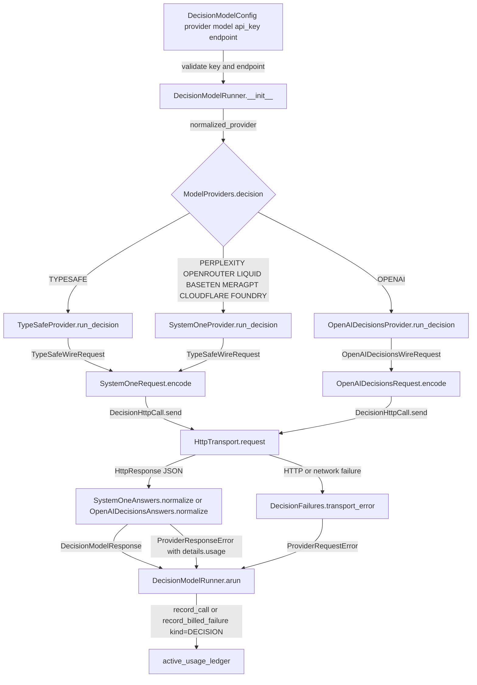
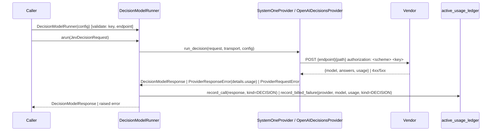

# Spec: Add more decision model providers beyond TypeSafe Jev

> **TL;DR** — `DecisionModelConfig` / `DecisionModelRunner` gain eight more hosted decision-model services in direct (own API key) mode — Perplexity, OpenRouter, Liquid AI, Baseten (Mercury Decide), meraGPT, Cloudflare Clef, Microsoft Foundry, and OpenAI's Decisions API — each with credential resolution, endpoint rules, pricebook rows, typed failures, and `UsageKind.DECISION` metering; Vercel AI Gateway and self-hosted System One servers are reached by endpoint override. The decision that matters most: there is one adapter per **wire** (System One, OpenAI Decisions), not one per vendor, and TypeSafe's adapter is rebuilt on the shared System One pieces so its managed-gateway path and every existing Jev test stay byte-identical.

## §0 User prompts

_The verbatim record of what the user asked lives in `docs/spec/decision-model-providers/request.md` (every prompt in order, the handoff block if one exists, and the structured conversation notes). Reproduced here, verbatim, is the single prompt that invoked the pipeline. Every later section is the author's interpretation; this block is the ground truth it is checked against._

### 0.1 Invoking request (verbatim)

```
Can you take a look at the JevAgent inside of the vidbyte-sdk/, and then take a look at the actual decision model that we are using. i want to add more decision models that we offer besides just jev (there has been alot recently to copy what jev does, even at some of the frontier labs). Do some research, find out preferable like 10+ decision model providers that we can add; and then think through pricebook, api keys, and actual full-scope implementation of the different decision model providers.
```

_The prompt's final sentence (an instruction to re-run the request through a different command) is elided here on the orchestrator's instruction: it is an out-of-pipeline experiment, not part of the feature, and must not appear in the spec, tests, or code. The full text is in `request.md` §A._

### 0.2 User replies during the run
_None yet. The orchestrator appends any reply the user sends during the run here verbatim, labeled with the revision it produced._

---

## Part A — Framing

## §1 Goal

Today the SDK has exactly one decision model: TypeSafe's Jev. `DECISION_SUPPORTED_PROVIDERS` is `frozenset({ModelProvider.TYPESAFE})` (`vidbyte/lib/dataclasses/model_configs.py:336`), `ModelProviders.decision` holds a one-entry dict (`vidbyte/providers/__init__.py:93`), and `DecisionModelConfig.model` defaults to the Jev-specific `JEV_DEFAULT_MODEL`. Since Jev launched, nine hosted services have shipped the same product shape — the research catalog (`context/provider-research.md` §2–§5) verifies eight of them on two wires, seven of them byte-compatible with TypeSafe's own System One body — and none of them is reachable from the SDK.

| ID | Goal (outcome) | How we will know | Source |
|---|---|---|---|
| G-1 | A developer selects a decision-model provider other than Jev by changing one field of `DecisionModelConfig` and gets the same `DecisionModelResponse` (one `JevAnswer` per question, metered in the ledger) | `DECISION_SUPPORTED_PROVIDERS` holds nine members; the §4 snippet runs against Perplexity and OpenAI over scripted transports (AC-1) | request.md §A "i want to add more decision models that we offer besides just jev" |
| G-2 | Every shipped provider is complete, not a stub: an `api_key` / env-var credential path, a default endpoint or an explicit endpoint rule, a priced or explicitly unpriced pricebook entry, typed failures that name the vendor and the fix, and `UsageKind.DECISION` metering | one row per provider in §9.1 and §9.3; AC-2 … AC-13 | request.md §A "think through pricebook, api keys, and actual full-scope implementation"; §D weighted words |
| G-3 | The SDK reaches the ten-plus hosted decision services the research found that speak a verified wire | nine first-class `ModelProvider` members (TypeSafe + eight) plus two documented endpoint-override recipes (Vercel AI Gateway, self-hosted System One servers) = eleven reachable services | request.md §A "10+"; `context/provider-research.md` §2 rows R, 1–9, 11 |
| G-4 | Nothing changes for today's Jev users: `JevAgent`, `JevRuntimeSettings`, and a bare `DecisionModelConfig()` behave exactly as before | every `tests/test_jev_*.py` passes unmodified; TypeSafe wire bodies and error strings are byte-identical (INV-21 … INV-26) | request.md §C "existing configurations must keep working unchanged" |

## §2 Objective

When this PR merges, `vidbyte-sdk` contains: six new `ModelProvider` members (`PERPLEXITY`, `CLOUDFLARE`, `FOUNDRY`, `LIQUID`, `BASETEN`, `MERAGPT`) registered in every parity map, runner catalog, usage-class binding, and pricing table; a per-provider decision default-model map on `ProviderModelRegistry`; a `DecisionModelConfig` that accepts nine providers in direct mode (TypeSafe plus the six new members plus the existing `OPENAI` and `OPENROUTER`), resolves the model per provider, resolves key and endpoint at runner construction, and still rejects managed mode for anything but TypeSafe; three provider modules under `vidbyte/providers/` — `decisions.py` (the HTTP-call record and failure mapper every decision adapter shares), `systemone.py` (the System One wire: request builder, answer normalizer, `SystemOneProvider` serving seven hosts through `SystemOneHost` rows), and `openai_decisions.py` (the OpenAI Decisions wire and `OpenAIDecisionsProvider`) — with `typesafe.py` rebuilt on the shared pieces and keeping only what is TypeSafe-specific (managed gateway headers and run context, `/models`, run close); `ModelProviders.decision` routing nine providers to three adapter classes; `OpenRouterUsage` parsing the decisions usage shape; and the providers README, `REPO_MAP.md`, and the Jev skill updated. This is a single-PR slice; the follow-ups it deliberately leaves are listed as non-goals and `Q-` items.

## §3 Non-goals

- **NG-1** — Vidbyte-managed mode (`DecisionModelMode.VIDBYTE_MANAGED`) for any provider other than TypeSafe — *Why not:* the managed gateway lives in the backend repository, which this PR does not touch (orchestrator decision; request.md §C). Stated limitation; see Q-1.
- **NG-2** — Running `JevAgent` (preflight, done, compute questions) on a non-TypeSafe decision provider — *Why not:* `JevRuntimeSettings.__post_init__` accepts only an exact `DecisionModelConfig` in `VIDBYTE_MANAGED` mode (`vidbyte/agents/jev/settings.py:265-285`, pinned by `tests/test_jev_managed_gateway.py`), and NG-1 keeps managed mode TypeSafe-only. New providers reach standalone `DecisionModelRunner` / `DecisionModelHelper` callers. See Q-2.
- **NG-3** — Deriving decisions from chat models' token log-probabilities (research groups C, C′, D, E) or self-reported confidences (group F) — *Why not:* no provider in those groups documents calibration; top-k caps (20, or 5) bound choice/score cardinality; Gemini logprobs are deprecated for 3.x; the repo has no logprob handling precedent and the research shows cross-vendor probabilities are not comparable (0.50 vs 0.82 on the same predicate). See Q-7.
- **NG-4** — Together AI Tev1 (research group G) — *Why not:* it answers with one option letter over a chat wire, its calibration is "not comprehensively evaluated", and its license is "being finalized".
- **NG-5** — Image inputs (`images[]` on Cloudflare/Liquid, `input_image` parts on OpenAI) — *Why not:* `JevDecisionRequest.state` is text or JSON; no caller shape exists for images.
- **NG-6** — OpenRouter routing preferences (`provider`, `session_id`, `user`, `trace`) — *Why not:* not part of the decision contract; `DecisionModelConfig` has no slot for them.
- **NG-7** — Client-side enforcement of per-vendor caps (1–64 questions on Cloudflare, 1–128 on Perplexity, 262,144-token input, 4,096-token meraGPT cap) — *Why not:* every vendor returns a 4xx the shared mapper already rewrites; a local cap table would drift from vendor docs. The one silent case (Cloudflare state truncation) is documented in EC-16 and the README.
- **NG-8** — Model-list endpoints for hosts that publish none (every host but TypeSafe) — *Why not:* nothing to call; `alist_models()` raises a typed `ProviderConfigurationError` instead (INV-17).
- **NG-9** — A `ModelProvider.VERCEL` member — *Why not:* see D-8; Vercel AI Gateway is reached through the OpenAI Decisions adapter with an endpoint override (documented recipe). See Q-3.
- **NG-10** — A generic "self-hosted System One" member without authentication — *Why not:* `ProviderModelRegistry.resolve_api_key` requires a key for every member; a self-hosted server at `http://host/v1/systemone` is already reachable with `DecisionModelConfig(provider=ModelProvider.TYPESAFE, endpoint="http://host/v1", api_key="unused")` (documented recipe; its cost resolves to TypeSafe's rows, which the README states).
- **NG-11** — Renaming `DecisionModelMode.TYPESAFE` to `DIRECT` or adding an alias — *Why not:* D-13; tests and `skills/jev-agent/SKILL.md:139` pin the name.
- **NG-12** — Fixing the pre-existing stale `score_noul` attributions in `REPO_MAP.md:374`, `skills/jev-agent/SKILL.md:46`, and `vidbyte/lib/jev/done/expert_depth.py:5` — *Why not:* unrelated to this change (code-map §4 gaps); see Q-6.
- **NG-13** — Honouring `Retry-After` in `HttpTransport` — *Why not:* transport behaviour is shared by every provider and is out of this change's scope; the existing backoff applies.
- **NG-14** — Per-request pricing shapes — *Why not:* every shipped vendor prices per input token; `ModelPricing` already covers that (code-map §4 (h)).
- **NG-15** — Any change to the Vidbyte backend repository, to existing tests, or to `lint/baseline.json` — *Why not:* orchestrator constraints.

## §4 Developer usage

```python
from vidbyte.lib.config import DecisionModelConfig
from vidbyte.lib.dataclasses.jev import JevDecisionRequest, JevOption, JevQuestion
from vidbyte.lib.enums import JevQuestionType, ModelProvider
from vidbyte.lib.runners.decision import DecisionModelRunner

request = JevDecisionRequest(
    state="Customer: my order arrived broken and support ignored two emails.",
    questions=(
        JevQuestion(name="refund", question_type=JevQuestionType.NOUL, instructions="Should this customer receive a refund?"),
        JevQuestion(name="team", question_type=JevQuestionType.CHOICE, instructions="Which team owns the next step?", options=(JevOption("billing"), JevOption("logistics"), JevOption("support"))),
    ),
)

# Direct mode is the default. The key comes from PERPLEXITY_API_KEY when api_key is omitted;
# the model comes from the registry's decision default (pplx-decider-v1.1-27b).
perplexity = DecisionModelRunner(DecisionModelConfig(provider=ModelProvider.PERPLEXITY))
response = await perplexity.arun(request)
response.answer("refund").noul        # P(yes), a float in [0, 1]
response.answer("team").choice        # "billing" | "logistics" | "support"
response.provider, response.model     # (ModelProvider.PERPLEXITY, "pplx-decider-v1.1-27b")

# The same request on OpenAI's Decisions wire; the model defaults to gpt-6-luna.
openai = DecisionModelRunner(DecisionModelConfig(provider=ModelProvider.OPENAI))
response = await openai.arun(request)
response.answer("refund").probabilities   # {"true": p, "false": 1 - p}

# Tenant-scoped hosts take the tenant base URL explicitly; omitting it fails at construction.
cloudflare = DecisionModelRunner(DecisionModelConfig(provider=ModelProvider.CLOUDFLARE, model="clef-flash", endpoint="https://api.cloudflare.com/client/v4/accounts/<ACCOUNT_ID>/ai"))
```

The developer changes `provider` (and, for tenant-scoped hosts, `endpoint`) and nothing else: the same `JevDecisionRequest`, the same `JevAnswer` records, the same `DecisionModelHelper.score_noul`, and the same usage ledger. They no longer have to pick a model per provider, hand-build a vendor body, or map vendor errors; every call is still recorded with `UsageKind.DECISION`.

## §5 Flow diagram





Validation happens twice before any network call: `DecisionModelConfig.__post_init__` checks shape (provider membership, mode/provider pairing, model fill, bounds) and `DecisionModelRunner.__init__` calls `config.validate()`, which resolves the key and the endpoint (INV-4). State changes only in the ledger: `DecisionModelRunner.arun` records every success and every billed failure (INV-11). Failures are caught in exactly one guarded `try` per adapter call: configuration errors pass through typed, normalization failures keep the billed usage, HTTP failures are rewritten by `DecisionFailures.transport_error` with the host's name and env var, and anything unanticipated becomes a `ProviderResponseError` (never a bare exception); cancellation propagates untouched.

---

## Part B — Behavior (this is the spec; everything else is framing)

## §6 Behavior

### 6.1 Invariants

- **INV-1** — Every `ModelProvider` member in `DECISION_SUPPORTED_PROVIDERS` is accepted by `DecisionModelConfig.__post_init__`; any other member raises `UnsupportedProviderError` whose message lists the supported values sorted (`baseten, cloudflare, foundry, liquid, meragpt, openai, openrouter, perplexity, typesafe`) and whose `details["provider"]` names the rejected one — the request's "more decision models … besides just jev" is realized here as a nine-member set, never a one-member set with special cases.
- **INV-2** — `DecisionModelConfig(provider=P)` with `model` omitted (None) always resolves `model` to `ProviderModelRegistry.DECISION_DEFAULT_MODELS[P]` during `__post_init__`; after construction `config.model` is never None and never blank, and `resolved_model() -> str` is the typed reader every production call site uses (`SystemOneRequest.build`, `OpenAIDecisionsRequest.build`, `DecisionModelRunner.arun` / `model_name`, and `TypeSafeProvider.run_decision` as the `fallback` argument to `SystemOneAnswers.model`); it raises `ConfigurationError` only on the unreachable None.
- **INV-3** — `DecisionModelMode.VIDBYTE_MANAGED` is accepted only with `provider` normalizing to `ModelProvider.TYPESAFE`; any other provider in managed mode raises `ConfigurationError` at construction, before any credential is read.
- **INV-4** — Direct mode never sends a request without a resolved key and endpoint: `DecisionModelRunner.__init__` calls `config.validate()`, which resolves the key (explicit `api_key` wins over the env var named in `ProviderModelRegistry.API_KEY_ENV_VARS`) and the endpoint (explicit `endpoint` wins over `DEFAULT_ENDPOINTS`); either failure is a `ConfigurationError` raised before any HTTP call.
- **INV-5** — The API key travels only in the `authorization` header, never in a URL, a log line, an error message, or `repr`; the header value is `"<scheme> <key>"` where scheme is the host's `DecisionAuthScheme` value (`Bearer` for every host except Baseten, `Api-Key` for Baseten).
- **INV-6** — Every System One host receives the body `{model, state, questions: {name: {type, instructions, criteria?}}}` exactly as TypeSafe receives it today, with one documented exception: a host whose `SystemOneHost.noul_criteria_required` is true (OpenRouter) always receives `criteria: {"true": <description or null>, "false": <description or null>}` on noul questions instead of omitting `criteria`.
- **INV-7** — OpenAI receives exactly `{model, input, questions: [{type, name, instructions, choices?|levels?}]}` with questions in request order, `noul → "predicate"` (no options), `choice → "choice"` with `choices: [{value, description?}]`, `score → "score"` with `levels: [{label, description?}]` lowest first.
- **INV-8** — Every successful call returns a `DecisionModelResponse` with exactly one `JevAnswer` per requested question, keyed by question name, on every wire (System One's `answers` map, OpenAI's `answers` array matched by `name`); a missing, extra, duplicate, mistyped, or malformed answer (a probability outside [0, 1], a distribution over the wrong labels or not summing to one — every `ConfigurationError` raised by `JevProbability.require` or `JevAnswer` validation is wrapped by the normalizer) raises `ProviderResponseError`, never a partial result and never a bare `ConfigurationError`.
- **INV-9** — Noul answers normalize identically on every wire: `noul = P(yes)`, `probabilities = {"true": p, "false": 1 - p}`, `choice = "true"` iff `p >= JEV_NOUL_YES_THRESHOLD`, `confidence = None`, `score = None`.
- **INV-10** — A normalization failure after a billed call carries the vendor's usage mapping in `ProviderResponseError.details["usage"]`, so `DecisionModelRunner.arun` records it through `record_billed_failure(..., kind=UsageKind.DECISION)` (today's `@intent billed-calls-stay-billable-on-bad-answers`, now shared by every adapter).
- **INV-11** — Every decision call, success or billed failure, is recorded exactly once through `DecisionModelRunner.arun` with `UsageKind.DECISION`; no adapter reads or writes the ledger.
- **INV-12** — `DecisionModelResponse.provider` equals `config.normalized_provider()` for every adapter, so the ledger prices each record with that provider's `usage_class()` and `PROVIDER_PRICING` block.
- **INV-13** — HTTP failures on every adapter are rewritten by one shared mapper using the status table TypeSafe uses today (401, 422, 429, 529 and ≥500, 408, no response, other), naming the host's display name and its env var; the raised `ProviderRequestError` keeps `status_code`, the ≤500-char `response_excerpt`, and `provider=<ModelProvider value>`.
- **INV-14** — A retried decision POST (`retry_count > 0`) always passes a fresh `uuid4().hex` idempotency key to the transport; the key is sent as a request header only on the managed TypeSafe path (unchanged behaviour).
- **INV-15** — Every adapter call passes `timeout_seconds=config.timeout_seconds`, `retry_count=config.retry_count`, `backoff_seconds=JEV_RETRY_BACKOFF_SECONDS`, `retry_status_codes=JEV_RETRY_STATUS_CODES`, and `max_response_bytes=JEV_MAX_RESPONSE_BYTES` to `HttpTransport.request`.
- **INV-16** — Cancellation and any other `BaseException` that is not an `Exception` propagates through every adapter untouched.
- **INV-17** — `list_models` and `close_run` on an adapter or host without that capability raise `ProviderConfigurationError` naming the host and the reason; they never return an empty tuple or silently succeed.
- **INV-18** — A pricing row exists only for a rate stated on a first-party vendor page; providers without one (Liquid, Baseten, meraGPT) have an empty `PROVIDER_PRICING` block with a dated comment, and their ledger records carry `cost_usd=None` while still being recorded (not counted as unaccounted, because usage parsed).
- **INV-19** — OpenRouter decision usage is priced from `usage.cost` when present (existing `OpenRouterUsage.reported_cost` precedence) and its token counts parse from the System One keys `input_tokens` / `output_tokens` as well as the chat keys.
- **INV-20** — Every new `ModelProvider` member appears in all three S014 parity maps and its `DEFAULT_PROVIDER_MODELS` entry appears in both runner catalogs as `RUNNER_TYPE_DECISION`; `ModalityDetector.detect_modality` returns `AUTO` for each such default, so `ProviderModelRegistry._resolve_from_environment` never activates a decision-only provider as a text provider.
- **INV-27** — `DecisionModelResponse.model` is the pricebook key (`UsageTracker._record` prices `response.model`), so it is always an id the pricebook can match for the request the caller made: hosts whose echoed `model` the vendor documents (`SystemOneHost.model_from_request=False`: TypeSafe, Perplexity) report the echo and raise `ProviderResponseError` when it is absent (today's TypeSafe rule); every other System One host (`model_from_request=True`: OpenRouter, Liquid, Baseten, meraGPT, Cloudflare, Foundry) and the OpenAI Decisions adapter report `config.resolved_model()` and ignore any echo.
- **INV-28** — A `SystemOneProvider` or `OpenAIDecisionsProvider` built for provider P refuses a per-call `config` whose `normalized_provider()` is not P with `ProviderConfigurationError(provider=P.value)` before any URL or header is built; `TypeSafeProvider._config_for` is unchanged.

**Must not regress:**
- **INV-21** — `DecisionModelConfig()` still means direct TypeSafe (the "actual decision model" in use today): `mode is DecisionModelMode.TYPESAFE`, `model == "jev-latest"`, key from `TYPESAFE_API_KEY`, endpoint `https://api.typesafe.ai/v1` (`vidbyte/lib/dataclasses/model_configs.py:342-375`; pinned by `tests/test_jev_managed_gateway.py:78-83,132`).
- **INV-22** — `JevRuntimeSettings` still accepts only an exact `DecisionModelConfig` in `VIDBYTE_MANAGED` mode (`vidbyte/agents/jev/settings.py:265-285`), and `JevAgent` keeps sending `X-Vidbyte-Run-Id` through `TypeSafeManagedRunContext` (`vidbyte/providers/typesafe.py:77-93`, `vidbyte/lib/jev/managed.py`).
- **INV-23** — TypeSafe wire bodies (including `criteria` omitted on optionless noul and `{name: null}` on choice), headers, transport kwargs, idempotency behaviour, error messages (for example `TypeSafe rejected the API key (401); check TYPESAFE_API_KEY or DecisionModelConfig.api_key`), managed redaction, and answer normalization are byte-identical before and after the refactor (`tests/test_jev_agent.py::TypeSafeProviderContractTests`, `tests/test_jev_managed_gateway.py`).
- **INV-24** — `vidbyte.providers.typesafe.TypeSafeProvider.run_decision` remains an attribute at that import path with the same keyword-only signature (`tests/test_jev_usage_ledger.py:33` patches it). `vidbyte.providers.typesafe._TypeSafeCallBuilder(parser).decision(config, request, *, run_id=None) -> DecisionHttpCall` keeps its name, its positional `(config, request)` order, and a `repr` that omits headers (`DecisionHttpCall.headers` stays `field(repr=False)`): `tests/test_jev_managed_gateway.py:37,138-140` imports it directly and asserts the Vidbyte key is absent from `repr(call)`.
- **INV-25** — `DecisionModelHelper.arun` / `score_noul` / `noul_passes` (`vidbyte/lib/jev/decision.py`) work unchanged over any provider's answers; `DecisionModelRunner.model_name()` still returns the configured model id (`config.resolved_model()`, equal to `config.model` after construction).
- **INV-26** — `vidbyte.__all__` is unchanged (lint C016 stays at zero findings).

### 6.2 Acceptance criteria

| ID | Given | When | Then | Priority | Proof |
|---|---|---|---|---|---|
| AC-1 | a clean checkout of this branch | the §4 snippet runs | it produces exactly the shown result | P0 | `tests/features/decision_model_providers/test_decision_acceptance.py::DeveloperUsageTests::test_section_4_snippet_runs_over_scripted_transports`; `::test_changing_the_provider_changes_nothing_else` |
| AC-2 | `PERPLEXITY_API_KEY` set, no `api_key`, a scripted transport answering with a System One body `{model: "pplx-decider-v1.1-27b", answers: {...}, usage: {input_tokens, output_tokens}}` | `DecisionModelRunner(DecisionModelConfig(provider=ModelProvider.PERPLEXITY)).arun(request)` | the transport saw `POST https://api.perplexity.ai/v1/decisions`, header `authorization: Bearer <key>`, body `{model: "pplx-decider-v1.1-27b", state, questions}` byte-equal to the TypeSafe body for the same request; the response has one `JevAnswer` per question, `provider is ModelProvider.PERPLEXITY`, `model == "pplx-decider-v1.1-27b"` | P0 | `tests/features/decision_model_providers/test_decision_systemone_wire.py::SystemOneRequestTests::test_perplexity_body_is_byte_equal_to_the_typesafe_body` |
| AC-3 | a Baseten config with an explicit key | `arun` | the URL is `https://inference.baseten.co/v1/decisions`, the header is `authorization: Api-Key <key>`, the body model is `inception/mercury-decide` | P0 | `tests/features/decision_model_providers/test_decision_systemone_wire.py::SystemOneRequestTests::test_each_host_posts_the_typesafe_body_to_its_documented_url` (BASETEN subtest) |
| AC-4 | an OpenRouter config and a noul question without options | `arun` | the URL is `https://openrouter.ai/api/v1/systemone`, the body model is `typesafe/jev-1.13`, and the noul question carries `criteria: {"true": null, "false": null}`; a usage of `{input_tokens: 300, output_tokens: 2, cost: 0.0000126}` yields a ledger record with `cost_usd == 0.0000126` | P0 | `tests/features/decision_model_providers/test_decision_systemone_wire.py::SystemOneRequestTests::test_openrouter_always_sends_noul_criteria_while_other_hosts_keep_typesafe_behaviour`; `test_decision_usage_metering.py::PricingTests::test_openrouter_reported_cost_wins_and_system_one_usage_keys_parse` |
| AC-5 | an OpenAI config and a request with one noul, one choice (3 options), and one score (3 levels) question | `arun` | the transport saw `POST https://api.openai.com/v1/decisions` with body `{model: "gpt-6-luna", input: <state string>, questions: [{type: "predicate", name, instructions}, {type: "choice", name, instructions, choices: [{value}, ...]}, {type: "score", name, instructions, levels: [{label}, ...]}]}`; the answers array (any order) normalizes to three `JevAnswer`s keyed by name, the predicate `probability` becomes a noul answer per INV-9, choice `probabilities[{value, probability}]` becomes a label-keyed distribution, score keeps `score` and a label-keyed distribution | P0 | `tests/features/decision_model_providers/test_decision_openai_wire.py::OpenAIRequestTests::test_body_is_the_documented_decisions_request_in_question_order`; `::OpenAIAnswerTests::test_answers_array_in_any_order_normalizes_by_name` |
| AC-6 | an OpenAI response whose answer for one question has `type: "refusal"` and a `usage` object | `arun` | `ProviderResponseError` naming that question is raised with `details["usage"]` equal to the response usage, and the ledger holds one record with `failed=True`, `kind=UsageKind.DECISION`, `provider="openai"` | P0 | `tests/features/decision_model_providers/test_decision_openai_wire.py::OpenAIAnswerTests::test_refusal_answer_raises_a_billed_error_naming_the_question`; `test_decision_usage_metering.py::LedgerBehaviourTests::test_billed_failures_are_recorded_once_with_their_usage` |
| AC-7 | `DecisionModelConfig(provider=ModelProvider.CLOUDFLARE)` (no `endpoint`) with `CLOUDFLARE_API_TOKEN` set | `DecisionModelRunner(config)` | `ConfigurationError` with the message `No default endpoint registered for provider 'cloudflare'. Pass endpoint explicitly with the provider's base URL.` is raised before any transport call; the same holds for `ModelProvider.FOUNDRY`; passing `endpoint="https://api.cloudflare.com/client/v4/accounts/abc/ai"` yields the URL `https://api.cloudflare.com/client/v4/accounts/abc/ai/run/@cf/cloudflare/clef` and body model `clef` | P0 | `tests/features/decision_model_providers/test_decision_config.py::ResolutionTests::test_tenant_scoped_hosts_require_an_explicit_endpoint`; `test_decision_systemone_wire.py::SystemOneRequestTests::test_each_host_posts_the_typesafe_body_to_its_documented_url` (CLOUDFLARE subtest) |
| AC-8 | `DecisionModelConfig(provider=ModelProvider.PERPLEXITY, mode=DecisionModelMode.VIDBYTE_MANAGED)` | construction | `ConfigurationError` is raised naming managed mode and TypeSafe; no env var is read | P0 | `tests/features/decision_model_providers/test_decision_config.py::ProviderGuardTests::test_managed_mode_is_typesafe_only_and_reads_no_env_var` |
| AC-9 | `DecisionModelConfig(provider="gemini")` | construction | `UnsupportedProviderError` whose message lists the nine supported values in sorted order and whose `details["provider"] == "gemini"` | P0 | `tests/features/decision_model_providers/test_decision_config.py::ProviderGuardTests::test_unsupported_provider_lists_the_nine_supported_values_sorted`; `test_decision_contract.py::ProviderCatalogTests::test_supported_set_is_the_nine_keys_of_the_decision_default_map` |
| AC-10 | a Perplexity runner and a transport answering 401 with an error envelope | `arun` | `ProviderRequestError` with `status_code == 401`, `provider == "perplexity"`, and message starting `Perplexity decision request failed: Perplexity rejected the API key (401); check PERPLEXITY_API_KEY or DecisionModelConfig.api_key.` | P0 | `tests/features/decision_model_providers/test_decision_failures.py::StatusMappingTests::test_error_envelope_objects_and_the_401_prefix`; `::test_http_statuses_map_to_host_named_messages` |
| AC-11 | any System One or OpenAI runner with `retry_count=2, timeout_seconds=30.0` | `arun` | `transport.request` was called once with `retry_count=2`, `timeout_seconds=30.0`, `backoff_seconds=JEV_RETRY_BACKOFF_SECONDS`, `retry_status_codes=JEV_RETRY_STATUS_CODES`, `max_response_bytes=JEV_MAX_RESPONSE_BYTES`, and a 32-character hex `idempotency_key`; with `retry_count=0` the key is `None` | P0 | `tests/features/decision_model_providers/test_decision_systemone_wire.py::SystemOneRequestTests::test_transport_kwargs_and_a_fresh_idempotency_key_on_every_host`; `test_decision_openai_wire.py::OpenAIRequestTests::test_transport_kwargs_and_a_fresh_idempotency_key_on_openai` |
| AC-12 | successful calls reporting `usage: {input_tokens: 1_000_000, output_tokens: 0}`, each scripted response carrying the `model` value §9.1's "echoed `model`" column documents for its host — TypeSafe and Perplexity echo the request id; the Cloudflare response echoes `@cf/cloudflare/clef` (an id no pricing row matches); the Foundry response carries no `model`; the OpenAI response echoes an id that differs from the request | the ledger prices them | Cloudflare `clef-flash` → `cost_usd == 0.038`, `clef` → `0.24`; Perplexity → `0.02`; Foundry `microsoft-decision-1` → `0.042`; OpenAI `gpt-6-luna` → `0.10`; Liquid `d1`, Baseten `inception/mercury-decide`, meraGPT `sd-1` → a record exists with `cost_usd is None` and the ledger's unaccounted count is unchanged; every record's `model` equals the request model for the `model_from_request` hosts and for OpenAI (`response.model == "gpt-6-luna"` despite the differing echo) and equals the echo for TypeSafe and Perplexity (INV-27) | P0 | `tests/features/decision_model_providers/test_decision_usage_metering.py::PricingTests::test_every_host_is_priced_from_the_pricebook_key` |
| AC-13 | a Perplexity runner | `alist_models()` or `aclose_run("r1")` | `ProviderConfigurationError` naming Perplexity; the transport was never called | P0 | `tests/features/decision_model_providers/test_decision_failures.py::CapabilityAndGuardTests::test_list_models_and_close_run_raise_without_a_transport_call` |
| AC-14 | `TYPESAFE_API_KEY` set | `DecisionModelConfig()` and every existing `tests/test_jev_*.py` | model is `jev-latest`, the URL is `https://api.typesafe.ai/v1/systemone`, and every existing Jev test passes without modification (negative: nothing about TypeSafe changed) | P0 | `tests/features/decision_model_providers/test_decision_config.py::TypeSafeDefaultTests::test_default_config_is_direct_typesafe_with_the_same_values`; `test_decision_regression_typesafe.py::TypeSafeRunnerTests::test_default_runner_still_posts_to_typesafe_with_the_echoed_version`; `::test_typesafe_messages_are_the_shared_template_for_typesafe`; existing `tests/test_jev_*.py` unmodified (395 passed with the area command on 2026-10-10) |
| AC-15 | `JevRuntimeSettings(decision=DecisionModelConfig(provider=ModelProvider.PERPLEXITY))` | construction | `ConfigurationError` from the existing managed-only rule, message unchanged (negative: `JevAgent` does not gain other providers) | P0 | `tests/features/decision_model_providers/test_decision_regression_typesafe.py::AgentBoundaryTests::test_jev_runtime_settings_still_rejects_direct_configs` |
| AC-16 | the branch with `git add -A` staged | `python lint/run.py` | the final line is `SDK-LINT: PASS` (exit code 0); no baseline count grows — in particular S009 stays at 350 with no new mypy finding in `model_configs.py`, `decision.py`, `typesafe.py`, `systemone.py`, or `openai_decisions.py`; `python lint/run.py --rule S014` reports zero findings with the six new members | P0 | not a test: `git add -A` then `python lint/run.py` must end `SDK-LINT: PASS`, and `python lint/run.py --rule S014` must report zero findings (S3/S4 verification; S2 baseline on 2026-10-10 with the pack staged: `SDK-LINT: PASS`) |
| AC-17 | an OpenAI config and a noul question whose `JevOption("true", description="...")` carries a description | `arun` | `ConfigurationError` naming the question is raised before any transport call (predicate questions have no criteria slot; descriptions are never silently dropped) | P1 | `tests/features/decision_model_providers/test_decision_openai_wire.py::OpenAIRequestTests::test_noul_option_descriptions_are_refused_before_any_call` |
| AC-18 | a System One host's response whose `answers` lacks one requested name or adds an unknown one, with a `usage` object | `arun` | `ProviderResponseError` listing `missing [...]` and `unexpected [...]` with `details["usage"]`, and the host's display name (not "TypeSafe") in the message | P0 | `tests/features/decision_model_providers/test_decision_systemone_wire.py::SystemOneAnswerTests::test_answer_mismatch_names_the_host_and_keeps_the_billed_usage` |
| AC-19 | `ModelProviders.decision(baseten_config)` and a Perplexity `DecisionModelConfig` | `run_decision(request=..., transport=..., config=perplexity_config)` | `ProviderConfigurationError` with `provider == "baseten"` whose message names `perplexity`; the transport was never called; and the mirror case — an OpenAI adapter given a Perplexity config — raises with `provider == "openai"` | P1 | `tests/features/decision_model_providers/test_decision_failures.py::CapabilityAndGuardTests::test_adapter_refuses_a_config_for_another_provider_before_any_call` |

### 6.3 Edge cases and failure modes

| ID | Trigger (input + state) | System behavior | User sees | Guarded by (INV-/D-) |
|---|---|---|---|---|
| EC-1 | `provider="gemini"` (a `ModelProvider` member with no decision adapter) | `__post_init__` rejects before reading any env var | `UnsupportedProviderError: DecisionModelRunner supports: baseten, cloudflare, …, typesafe.` | INV-1 |
| EC-2 | `model=""` or `model="  "` | rejected at construction (existing check, now after the default fill) | `ConfigurationError: model must be non-empty.` | INV-2 |
| EC-3 | `provider=PERPLEXITY, mode=VIDBYTE_MANAGED` | rejected at construction; without the guard the Vidbyte key would be sent to Perplexity's host | `ConfigurationError` naming managed mode as TypeSafe-only | INV-3, D-9 |
| EC-4 | `provider=CLOUDFLARE` or `FOUNDRY` without `endpoint` | `DEFAULT_ENDPOINTS` holds `""`; `config.validate()` → `resolve_endpoint` raises at runner construction; without the guard a placeholder URL would 404 after the first call | `ConfigurationError: No default endpoint registered for provider 'cloudflare'. Pass endpoint explicitly with the provider's base URL.` | INV-4, D-7 |
| EC-5 | env var unset and no `api_key` | existing registry error at runner construction | `ConfigurationError: Missing API key for provider perplexity. Pass api_key or set PERPLEXITY_API_KEY.` | INV-4 |
| EC-6 | OpenRouter + optionless noul question | builder emits `criteria: {"true": null, "false": null}`; without it OpenRouter rejects the body ("criteria must contain both true and false keys") | the call succeeds | INV-6, A-5 |
| EC-7 | OpenAI + noul question with option descriptions | refused before the call; without the guard the descriptions would be silently dropped and the answer would ignore the caller's criteria | `ConfigurationError` naming the question and suggesting moving the criteria into `instructions` | D-11, AC-17 |
| EC-8 | OpenAI + structured `state` (Mapping or tuple) or structured `instructions` | serialized to JSON text for `input` / `instructions`; without it OpenAI returns 400 for a non-string `input` | the call succeeds; the vendor sees the JSON text | D-11 |
| EC-9 | vendor answers for the wrong names, extra names, a wrong `type` tag, or probabilities over the wrong labels, or a probability outside [0, 1] (a predicate `probability` of 1.5) | `ProviderResponseError` with the billed usage (the normalizer wraps the `ConfigurationError` from `JevProbability.require` / `JevAnswer` validation into `self.error(...)`, as `_TypeSafeAnswerNormalizer._answer` does today); without it a partial or mislabeled result would be returned as success | message lists `missing`/`unexpected` or the offending field; ledger records a billed failure | INV-8, INV-10 |
| EC-10 | OpenAI answer `type: "refusal"` | `ProviderResponseError` with usage; without it the normalizer would read a missing `probability` and raise a less specific error | message names the refused question | AC-6 |
| EC-11 | OpenAI score `probabilities[]` entries lack `label` | the normalizer uses `value` as the level index into the question's option names; both absent → `ProviderResponseError` | a label-keyed distribution, or a typed error | A-8 |
| EC-12 | vendor 429 after the configured retries (Perplexity: 10 rps per org) | transport retried per `JEV_RETRY_STATUS_CODES` with backoff; the mapper rewrites the final error; `Retry-After` is not read (NG-13) | `ProviderRequestError: Perplexity decision request failed: Perplexity's rate limit was exceeded (429) after 2 retries; back off or raise DecisionModelConfig.retry_count. …` | INV-13 |
| EC-13 | vendor 5xx / 529 / 408, or no response (network failure, timeout) | same path as EC-12 with the status-specific reason | the status-specific message with the host's name | INV-13 |
| EC-14 | non-JSON body (Perplexity returns HTML on a 504) | `HttpResponseParser.parse_json_response` raises `ProviderRequestError` with the excerpt; the mapper rewrites it as "overloaded or failing (504)" | typed error with the truncated excerpt | INV-13 |
| EC-15 | a response larger than `JEV_MAX_RESPONSE_BYTES` (16,000,000) | the transport refuses it; the mapper rewrites the error | `ProviderRequestError` | INV-15 |
| EC-16 | Cloudflare `state` longer than its 65,536-token window | Cloudflare silently truncates the state; the SDK cannot detect it; answers reflect the truncated state | a normal-looking answer; the README and EC-16 warn; no guard (NG-7) | T-6, A-14 |
| EC-17 | Liquid reports `output_tokens: 0` on every call | `JevUsage` prices input only; output rate is irrelevant | correct cost | INV-18 |
| EC-18 | vendor response without `usage` | `DecisionModelResponse.usage=None`; the ledger counts the call as unaccounted (existing `_record` rule) instead of dropping it | a record is absent but `unaccounted_call_count` increments | existing `@intent every-call-is-recorded-or-counted` |
| EC-19 | vendor response without a non-blank `model` string | TypeSafe and Perplexity (`model_from_request=False`): `ProviderResponseError` with usage (today's rule); every other host and OpenAI: the echo is ignored and `response.model = config.resolved_model()` | a typed error naming the host, or a normal response priced on the request id | INV-27 |
| EC-20 | `SystemOneProvider(decision_config=config)` constructed directly for a provider without a `HOSTS` row | `ProviderConfigurationError` at construction; without it a `KeyError` would escape on the first call | typed error | D-5, S016 |
| EC-21 | two runners for different providers inside one `usage_ledger_scope()` | each record keeps its own provider and model; pricing resolves per record | correct per-provider costs | INV-12 |
| EC-22 | `JevAgentSettings(provider="perplexity", model_name="pplx-decider-v1.1-27b")` | settings accept it (modality `AUTO`); the first runner build refuses it through the existing `_refuse_decision_runner` (`vidbyte/lib/runners/utility.py:84-92`) because `PROVIDER_DEFAULT_RUNNER_TYPE_MAP["perplexity"]` is `decision` | `ConfigurationError: Model 'pplx-decider-v1.1-27b' is a decision model and cannot drive an agent loop; call it through DecisionModelRunner.` | D-14, Q-5 |
| EC-23 | Vercel recipe without an explicit `api_key` | key resolution falls back to `OPENAI_API_KEY`, which Vercel rejects | `ProviderRequestError … OpenAI rejected the API key (401); check OPENAI_API_KEY or DecisionModelConfig.api_key.` — the README recipe says to pass `api_key` | T-1, D-8 |
| EC-24 | endpoint override with a trailing slash (Perplexity 404s on `/decisions/`) | `resolve_endpoint` strips the trailing slash (existing) | the call succeeds | existing `ProviderModelRegistry.resolve_endpoint` |
| EC-25 | task cancelled mid-call | `CancelledError` propagates through the adapter and the runner untouched; nothing is recorded | cancellation | INV-16 |
| EC-26 | `DECISION_DEFAULT_MODELS` lacks a provider that `ModelProviders.decision` lists (drift) | `DecisionModelConfig` rejects the provider (INV-1) because the supported set derives from the map; the factory entry is unreachable rather than half-working | `UnsupportedProviderError` | D-6 |
| EC-27 | a host echoes a `model` that is not a pricebook key (Cloudflare `@cf/cloudflare/clef`, a Foundry deployment name, a versioned Liquid id) | `response.model` is `config.resolved_model()` for `model_from_request` hosts, so `ModelPricingRegistry.resolve` matches the row the caller selected; without the rule the paid call would record `cost_usd=None` | correct `cost_usd` | INV-27, D-17 |
| EC-28 | a `SystemOneProvider` built for Baseten receives `run_decision(config=<Perplexity config>)` through the public per-call seam | `_config_for` raises `ProviderConfigurationError(provider="baseten")` naming both providers before any URL or header is built; without it `Api-Key <perplexity key>` would be posted to Perplexity's host and surface as a vendor 401/404; `OpenAIDecisionsProvider._config_for` applies the same guard | typed error | INV-28 |

**Rollback of the user action:** a direct decision call has no vendor-side state (no managed runs, no stored sessions); nothing to undo except the vendor's charge, which the ledger has already recorded. The developer reverts by changing `provider` back; no persisted SDK state exists.

## §7 Requirements

**Functional**
| ID | Requirement | Priority | Source (request.md / G-) |
|---|---|---|---|
| FR-1 | Add `ModelProvider.PERPLEXITY`, `CLOUDFLARE`, `FOUNDRY`, `LIQUID`, `BASETEN`, `MERAGPT` (values `perplexity`, `cloudflare`, `foundry`, `liquid`, `baseten`, `meragpt`) with entries in `DEFAULT_PROVIDER_MODELS`, `API_KEY_ENV_VARS`, `DEFAULT_ENDPOINTS`, both runner catalogs, `PROVIDER_DEFAULT_RUNNER_TYPE_MAP`, and `_usage_class_map()` (→ `JevUsage`) | P0 | G-1, G-2, G-3; request §A "more … besides just jev", "10+" |
| FR-2 | Add `ProviderModelRegistry.DECISION_DEFAULT_MODELS` (nine providers) and `decision_default_model(provider)`; `DECISION_SUPPORTED_PROVIDERS` derives from its keys | P0 | G-1 |
| FR-3 | `DecisionModelConfig.model` becomes `str \| None = None` and is filled from `DECISION_DEFAULT_MODELS` in `__post_init__`, with `resolved_model() -> str` as the typed reader every production call site uses; managed mode is rejected for non-TypeSafe providers; `validate()` resolves both key and endpoint | P0 | G-1, G-4; request §C "api keys" |
| FR-4 | Pricebook: rows for Perplexity (`pplx-decider-v1.1-27b`, `pplx-decider-v1-27b` at 0.02/0.0), Cloudflare (`clef` 0.24/0.0, `clef-flash` 0.038/0.0), Foundry (`microsoft-decision-1` 0.042/0.0), OpenAI (`gpt-6-luna` 0.10/0.0); empty blocks with dated comments for Liquid, Baseten, meraGPT; `PRICING_AS_OF = "2026-10-10"`; each block cites its first-party URL | P0 | G-2; request §A "pricebook" |
| FR-5 | `OpenRouterUsage.from_usage_payload` parses `input_tokens` / `output_tokens` when the chat keys are absent, keeping `cost` precedence | P0 | G-2 (OpenRouter decisions usage) |
| FR-6 | Create `vidbyte/providers/decisions.py` with `DecisionHttpCall` (the retrying, bounded, timed HTTP call record) and `DecisionFailures` (status-to-message mapper and unexpected-error wrapper) used by all three decision adapters | P0 | G-2; INV-13 … INV-16 |
| FR-7 | Create `vidbyte/providers/systemone.py` with `SystemOneHost` rows for eight hosts, `SystemOneRequest` (builder + encoder honouring `noul_criteria_required`), `SystemOneAnswers` (normalizer with host-named messages), and `SystemOneProvider` serving seven hosts in direct mode | P0 | G-1, G-2, G-3 |
| FR-8 | Rebuild `TypeSafeProvider` on the shared pieces, deleting its private duplicates, keeping its public surface, managed-gateway behaviour, `/models`, and run close unchanged | P0 | G-4 |
| FR-9 | Create `vidbyte/providers/openai_decisions.py` with `OpenAIDecisionsRequest` (predicate/choice/score builder, JSON-text serialization, refusal of noul descriptions), `OpenAIDecisionsAnswers` (array-by-name normalizer, `probability` scalar, `probabilities[]` arrays, `refusal`), and `OpenAIDecisionsProvider` (`provider = ModelProvider.OPENAI`) | P0 | G-1, G-2, G-3 |
| FR-10 | `ModelProviders.decision` routes TYPESAFE → `TypeSafeProvider`, OPENAI → `OpenAIDecisionsProvider`, the other seven → `SystemOneProvider`; its return annotation names the three classes; `vidbyte.providers.__all__` exports the two new classes | P0 | G-1 |
| FR-11 | `list_models` / `close_run` on `SystemOneProvider` and `OpenAIDecisionsProvider` raise `ProviderConfigurationError` without a network call | P0 | INV-17 |
| FR-12 | Add `SystemOneHost` (and the OpenAI wire records `OpenAIDecisionsWireQuestion`, `OpenAIDecisionsWireRequest`) to `vidbyte/lib/dataclasses/jev.py` and `DecisionAuthScheme` to `vidbyte/lib/enums/jev.py` (D-18), exported | P0 | AGENTS.md placement rules |
| FR-13 | Add the wire literals (`PERPLEXITY_DECISIONS_PATH`, `BASETEN_DECISIONS_PATH`, `CLOUDFLARE_CLEF_PATH`, `FOUNDRY_SYSTEMONE_PATH`, `OPENAI_DECISIONS_PATH`, `OPENAI_DECISIONS_PREDICATE_TYPE`, `OPENAI_DECISIONS_REFUSAL_TYPE`) to `vidbyte/lib/constants/jev.py` | P0 | AGENTS.md "New JEV code" |
| FR-14 | `ProviderModelRegistry.get_default_endpoint`'s error becomes `No default endpoint registered for provider '{p}'. Pass endpoint explicitly with the provider's base URL.` — the existing sentence kept verbatim as the prefix (tenant-scoped hosts) | P1 | EC-4 |
| FR-15 | Documentation: providers README (Key Modules, Endpoint And Auth Matrix, Official Provider Documentation rows, Usage Key Divergence rows, Vercel and self-hosted recipes, tenant endpoint examples, Cloudflare truncation note), `REPO_MAP.md` JEV table rows, `skills/jev-agent/SKILL.md:47,98,139`, and the headers of `vidbyte/lib/runners/decision.py`, `vidbyte/lib/dataclasses/jev.py`, `vidbyte/agents/pricing/typesafe.py`, `vidbyte/lib/enums/decision_model.py`, `vidbyte/lib/dataclasses/model_configs.py`, `vidbyte/lib/enums/model_provider.py` | P1 | CONTRIBUTING.md "Update nearby documentation …"; AGENTS.md "Repository Map" |
| FR-16 | Every decision call keeps flowing through `DecisionModelRunner.arun` and its ledger hooks; the runner changes only in its header text, its type annotation, and the two `config.model` reads that become `resolved_model()` | P0 | request §C "Every decision call must keep being metered" |

**Non-functional**
| ID | Requirement | Priority | Target |
|---|---|---|---|
| NFR-1 | No new runtime dependency; HTTP only through `vidbyte.lib.http` (`httpx` stays behind `HttpTransport`) | P0 | `pyproject.toml` dependencies unchanged; lint S011 at 0 |
| NFR-2 | Lint ratchet holds: `python lint/run.py` exits 0 and ends with `SDK-LINT: PASS`; no `lint/baseline.json` count grows (S009 staged mypy contracts at 350 included); S014, S011, S012, S056, C004, C005, C016 stay at 0 | P0 | AC-16 |
| NFR-3 | Layering: the three new provider modules import only `vidbyte.lib.*` and `vidbyte.providers.*` (A006 forbids `vidbyte.agents` from `vidbyte/providers/`) | P0 | `python lint/run.py --rule A006` unchanged at 34 |
| NFR-4 | One HTTP round trip per decision on every adapter; no model-list, preflight, or discovery call is added | P1 | AC-11 (`transport.request` called exactly once) |
| NFR-5 | Credentials never appear in URLs, `repr`, log lines, or error messages; response excerpts stay ≤500 chars; managed-key redaction unchanged | P0 | INV-5, INV-23 |
| NFR-6 | Every pricing row and README documentation row carries its first-party URL and the retrieval date `2026-10-10` | P1 | §12.3 rows 8 and 18 |
| NFR-7 | Each new module's `run_decision` keeps the single guarded `try` shape with the same five typed branches as `TypeSafeProvider.run_decision` (readability parity; S008/S024 bounds unchanged) | P1 | review |
| NFR-8 | Full-scope completeness ("actual full-scope implementation"): each of the nine providers ships all five parts of G-2 — credential path, endpoint rule, pricebook entry (priced or explicitly unpriced), host-named typed failures, and `UsageKind.DECISION` metering — with no stub, placeholder, or "phase 2" marker in code or docs; nine first-class providers plus the two endpoint-override recipes reach the eleven services the request's "10+" asked for | P0 | §9.1 has one complete row per provider; AC-2 … AC-13; §12.3 has no TODO or NotImplementedError |

---

## Part C — Design

## §8 Architecture and decisions

### 8.1 Decisions
| ID | Decision | Deciding reason | Runner-up | Flips if |
|---|---|---|---|---|
| D-1 | One adapter per **wire**, not per vendor: `SystemOneProvider` serves seven hosts through `SystemOneHost` rows; `OpenAIDecisionsProvider` serves OpenAI (and Vercel by endpoint override) | the research (§4 group A/B) shows the bodies are byte-identical within a group; seven vendor classes would be seven copies of one builder and one normalizer | one subclass per vendor as `compatible.py` does for text | a host diverges from its group in body or answer shape beyond a boolean flag — then it gets its own builder/normalizer pair |
| D-2 | The System One pieces TypeSafe owns today (`_TypeSafePayloadBuilder` + `_TypeSafeJsonBody`, `_TypeSafeAnswerNormalizer`) move to `systemone.py` under public names (`SystemOneRequest`, `SystemOneAnswers`) parameterized by host; `TypeSafeProvider` imports them and keeps only managed-gateway, `/models`, and run-close code | no duplication; the TypeSafe tests pin behaviour (bodies, messages), not private class names | `SystemOneProvider` imports the underscore classes from `typesafe.py` | any `TypeSafeProviderContractTests` assertion changes for a reason other than an import path — then stop and report |
| D-3 | The wire-agnostic plumbing (`DecisionHttpCall`, `DecisionFailures`) lives in its own module `decisions.py` | three adapters use it; naming it `SystemOne*` and importing it into the OpenAI module would misname it | keep it inside `systemone.py` | the reviewer prefers two new files over three — fold it into `systemone.py` unchanged |
| D-4 | Host variance is one frozen `SystemOneHost` record (`display_name`, `path`, `auth_scheme`, `noul_criteria_required`) held in `SystemOneProvider.HOSTS`; base URLs stay in `ProviderModelRegistry.DEFAULT_ENDPOINTS`; path literals are constants in `vidbyte/lib/constants/jev.py` next to `JEV_SYSTEMONE_PATH` | four parallel dicts would drift; the adapter owns its wire paths the way `openai.py` owns `/responses`; constants/jev.py already owns wire literals | path/auth maps as `ProviderModelRegistry` ClassVars | the AGENTS placement review wants the host table in a registry — move `HOSTS` to `vidbyte/lib/registries/` without changing its shape |
| D-5 | `SystemOneProvider.provider` is an instance attribute set from `decision_config.normalized_provider()`; a provider without a `HOSTS` row raises `ProviderConfigurationError` at construction | `DecisionModelRunner.arun` reads `self._provider.provider` for billed failures; the factory always passes the config | one class per provider with a class attribute | a `Protocol` for decision adapters is introduced that requires class attributes — add thin subclasses then |
| D-6 | Decision defaults live in a new `ProviderModelRegistry.DECISION_DEFAULT_MODELS` map; `DEFAULT_PROVIDER_MODELS` keeps the text default for OpenAI (`gpt-5.6-sol`) and OpenRouter (`openrouter/auto`); `DECISION_SUPPORTED_PROVIDERS` is `frozenset(DECISION_DEFAULT_MODELS)` | OpenAI's and OpenRouter's registry defaults are text models; S014 ties `DEFAULT_PROVIDER_MODELS` to the runner catalogs, so decision models for text providers cannot live there | reuse `DEFAULT_PROVIDER_MODELS` and special-case OpenAI/OpenRouter in the config | S014 is extended with a decision-default parity check — add the map to `PARITY_MAPS` instead of hand-checking |
| D-7 | Tenant-scoped hosts (Cloudflare, Foundry) carry an empty string in `DEFAULT_ENDPOINTS`; `ProviderModelRegistry.get_default_endpoint` already raises on a falsy value, and `DecisionModelConfig.validate()` now resolves the endpoint so the failure lands at runner construction with a message that says to pass `endpoint` | no honest global default exists for either host; a placeholder base URL would fail with a 404 after the first call | `CLOUDFLARE_ACCOUNT_ID` env var plus a path template | users ask for env-var tenant resolution — add an `ENDPOINT_ENV_VARS` map in the registry |
| D-8 | No `ModelProvider.VERCEL`; Vercel AI Gateway is reached through `OpenAIDecisionsProvider` with `endpoint="https://ai-gateway.vercel.sh/v1"`, an explicit `api_key`, and `model="openai/gpt-6-luna-decisions"` (README recipe) | Vercel's model id starts with `gpt-`, so `ModalityDetector.detect_modality` reports `TEXT`, `_resolve_from_environment` would activate Vercel as a text provider when `AI_GATEWAY_API_KEY` is set, and no text adapter exists for it; the gateway documents "the same request and response format as OpenAI" | a member plus a modality exception | Vercel adds gateway-only decision parameters, or users need `AI_GATEWAY_API_KEY` auto-resolution (Q-3) |
| D-9 | Microsoft Foundry ships as a System One host with `Bearer` auth and `FOUNDRY_API_KEY`; an Entra access token is passed as `api_key`; the caller supplies the resource endpoint | the official sample sends `Authorization: Bearer <token>` to a path that is literally `/providers/microsoft/v1/systemone`; the user asked for "10+" and Foundry is a frontier-lab product | defer Foundry to a follow-up | the implementer finds Foundry needs a different header name — `DecisionAuthScheme` gains a member and the row changes |
| D-10 | Pricing rows exist only where a first-party page states the rate; Liquid, Baseten, and meraGPT ship with empty pricing blocks and `cost_usd=None` records | `vidbyte/providers/README.md` "Adding A Provider" step 3: "Omit the model rather than guessing" | third-party hub prices (systemonemodels.org) | a first-party pricing page appears (Q-4) |
| D-11 | On the OpenAI wire, `str` content passes through; Mapping/tuple content (`state`, `instructions`, option descriptions) is JSON-encoded with `json.dumps(JevJson.thaw(value), ensure_ascii=False)`; noul questions whose options carry descriptions are refused with `ConfigurationError` | `input` and `instructions` are strings on that wire; predicate questions have no criteria slot, and silently dropping criteria would change answers | fold "True when … / False when …" into `instructions` | users ask for folding — then it becomes a documented transformation with its own INV |
| D-12 | The OpenAI pricing row is `"gpt-6-luna": ModelPricing(input_per_million=0.10, output_per_million=0.0)` per the Decisions guide | the SDK's only path to `gpt-6-luna` is the Decisions adapter: the model is absent from the text runner catalog, so text usage cannot be priced through this row | `(0.10, 0.50)` mirroring the chat price page | `gpt-6-luna` joins the text catalog — then split pricing by zeroing `output_tokens` in the decisions adapter's usage and price output at 0.50 |
| D-13 | `DecisionModelMode.TYPESAFE` keeps its name and value and is documented as the direct (own-key) mode for every provider | tests and `skills/jev-agent/SKILL.md:139` pin it; an alias adds public surface for no behaviour | add `DIRECT = "typesafe"` alias | the user asks for the alias (NG-11) |
| D-14 | Decision-only providers are refused for agents at runner build by the existing `_refuse_decision_runner` (runner type `decision`), not at `JevAgentSettings` construction | smallest change; the error is typed and names `DecisionModelRunner`; the settings-level check exists only for TypeSafe today | generalize the two `is ModelProvider.TYPESAFE` checks in `vidbyte/agents/jev/settings.py` | the reviewer wants parity with the TypeSafe early check (Q-5) |
| D-15 | `DecisionModelConfig.model` becomes `str \| None = None`, is filled in `__post_init__` with `object.__setattr__` (precedent `vidbyte/lib/dataclasses/failure.py:95-106`), and gains `resolved_model() -> str`, which every production reader calls (`SystemOneRequest.build`, `OpenAIDecisionsRequest.build`, `DecisionModelRunner.arun` / `model_name`, and `TypeSafeProvider.run_decision` as the `fallback` argument to `SystemOneAnswers.model`) | the default depends on `provider`, so the field cannot carry a literal default; mypy does not narrow a declared `str \| None` field after `__post_init__`, so the typed accessor is what keeps S009 at 350 (the three `str`-typed readers today: `typesafe.py:106`, `decision.py:52,73`; `JevRuntimeSettings` reads no `.model`) | a `""` sentinel keeping `model: str` | the reviewer prefers the sentinel — then EC-2 becomes "an empty string selects the default" and `resolved_model()` is dropped |
| D-16 | Catalog entries for slashed vendor ids carry both spellings in the bare runner map (`inception/mercury-decide` for S014, `mercury-decide` for strict agent validation's `_catalog_name`) | `ProviderModelRegistry._catalog_name` strips everything before the first `/` unless the id starts with `openrouter/`, and `tests/test_agent_settings_validation.py::test_accepts_every_text_provider_default_model` builds settings from every `DEFAULT_PROVIDER_MODELS` entry | a slash-free default such as `mercury-decide` that Baseten may not accept | Baseten documents a slash-free id — drop the alias row |
| D-17 | `DecisionModelResponse.model` is the pricebook key, so each `SystemOneHost` row says whether the vendor's echoed `model` is trusted (`model_from_request=False`: TypeSafe, Perplexity) or the request id is reported (`True`: every other System One host; the OpenAI adapter always reports the request id) | `UsageTracker._record` prices `response.model`; the research documents a response `model` only for TypeSafe and Perplexity (§3.2), Foundry's body `model` is the caller's deployment name (§3.3), Cloudflare's echo is undocumented (§3.4), and OpenAI documents only per-answer `name` echoes (§3.1) — pricing on an unknown echo silently records `cost_usd=None` | always trust the echo and rely on `resolve`'s prefix fallback | a vendor documents a versioned echo — flip its flag and add the versioned pricing rows (`provider-api-contracts.md`) |
| D-18 | `DecisionAuthScheme` lives in `vidbyte/lib/enums/jev.py` beside the other JEV enums, as the host records live in `dataclasses/jev.py` and the path literals in `constants/jev.py`; `DecisionModelMode` stays in `enums/decision_model.py`, where `docs/design/jev-managed-gateway-credentials.md` placed it | AGENTS.md "New JEV code" routes a JEV enum to `enums/jev.py` and `REPO_MAP.md:372` lists that file for "every JEV enum"; `docs/design/agents-md-jev-and-type-placement.md` says existing out-of-place definitions "are not precedent", so `DecisionModelMode`'s file is not a reason to add a second enum there; `dataclasses/jev.py` already imports `vidbyte.lib.enums.jev` (no new edge) | `enums/decision_model.py` next to `DecisionModelMode` | the placement workflow relocates it — follow the bot, update rows 2, 3 and the checklist |

### 8.2 Patterns inherited
- Capability factory with a provider-to-class dict and `_build_provider` selection — `vidbyte/providers/__init__.py:ModelProviders.embedding`, `ModelProviders.decision`.
- Supported-provider frozenset checked in `__post_init__` with `UnsupportedProviderError` naming the supported values — `vidbyte/lib/dataclasses/model_configs.py:EMBEDDING_SUPPORTED_PROVIDERS` / `EmbeddingModelConfig.validate`.
- Declarative per-provider registry maps as `ClassVar` dicts with classmethod resolvers — `vidbyte/lib/registries/models.py:ProviderModelRegistry.DEFAULT_ENDPOINTS`, `resolve_api_key`, `resolve_endpoint` (field guide `declarative-config-resolution.md`).
- Typed wire records in `vidbyte/lib/dataclasses/jev.py`, JSON encoding in the provider — `TypeSafeWireRequest` + `_TypeSafeJsonBody.encode` (`@intent wire-shape-owned-by-provider`).
- One guarded `try` per provider call with typed branches and a status-to-message map — `vidbyte/providers/typesafe.py:TypeSafeProvider.run_decision` (`@intent one-guarded-decision-call`), `_TypeSafeFailures.transport_error` (`@intent http-failures-name-cause-and-fix`); field guide `provider-api-contracts.md`.
- Billed usage riding on normalization errors — `_TypeSafeAnswerNormalizer.error` (`@intent billed-calls-stay-billable-on-bad-answers`).
- One usage class per response shape, bound per provider in `_usage_class_map()` — `vidbyte/agents/pricing/compatible.py:ChatCompletionUsage`, `vidbyte/lib/enums/model_provider.py:_usage_class_map`.
- Provider-reported cost beating table math — `vidbyte/agents/pricing/openrouter.py:OpenRouterUsage.cost_usd`.
- Frozen, slotted, validated dataclasses that fill derived fields with `object.__setattr__` — `vidbyte/lib/dataclasses/failure.py:95-106`, `jev.py:JevQuestion.__post_init__` (field guide `strict-config-dataclasses.md`).
- Dated, URL-cited pricing blocks — `vidbyte/lib/registries/pricing.py:155-165` (field guide `operation-pricebook-rates.md`).
- Static helper classes as the unit of organisation — `JevJson` (exported through `__all__`) and `_TypeSafeCallBuilder` (module-private; `typesafe.py:502` exports only `TypeSafeManagedRunContext` and `TypeSafeProvider`, and `tests/test_jev_managed_gateway.py:37` imports the builder directly) (field guide `class-bound-helpers.md`).

### 8.3 Smaller design rejected
"Add the six `ModelProvider` members with their registry rows and route every System One host through today's `TypeSafeProvider`, relying on `endpoint` overrides." It fails FR-9/INV-7 (OpenAI's wire is a different body and answer array), INV-5 (Baseten needs `Api-Key`), INV-6 (OpenRouter requires noul criteria TypeSafe omits), INV-13 (every error would say "TypeSafe … TYPESAFE_API_KEY" to a Perplexity user), and INV-22 (the managed-run context variable and `X-Vidbyte-Run-Id` logic would run for other hosts). The still-smaller "members and pricing only, no adapters" fails G-2 ("actual full-scope implementation").

### 8.4 Complexity budget
| Item | Count | Justification for each |
|---|---|---|
| New files | 3 | `vidbyte/providers/decisions.py` (shared HTTP call + failure mapper, three users), `vidbyte/providers/systemone.py` (System One wire + seven-host adapter), `vidbyte/providers/openai_decisions.py` (OpenAI Decisions wire + adapter). No new test-support or doc files; `docs/spec/` is the pipeline's own folder. |
| New classes/modules | 12 (4 relocated, 8 new) | relocated under public names: `DecisionHttpCall` (was `_TypeSafeHttpCall`), `SystemOneRequest` (was `_TypeSafePayloadBuilder` + `_TypeSafeJsonBody`), `SystemOneAnswers` (was `_TypeSafeAnswerNormalizer`), `DecisionFailures` (the direct-mode half of `_TypeSafeFailures`); new: `DecisionAuthScheme` (enum), `SystemOneHost`, `OpenAIDecisionsWireQuestion`, `OpenAIDecisionsWireRequest` (records), `SystemOneProvider`, `OpenAIDecisionsRequest`, `OpenAIDecisionsAnswers`, `OpenAIDecisionsProvider` |
| New dependencies | 0 | everything goes through `vidbyte.lib.http` |
| New config keys | 6 env vars + 1 registry map + 7 constants | `PERPLEXITY_API_KEY`, `CLOUDFLARE_API_TOKEN`, `FOUNDRY_API_KEY`, `LIQUID_API_KEY`, `BASETEN_API_KEY`, `MERAGPT_API_KEY` (one per member, required by S014); `DECISION_DEFAULT_MODELS`; the path/type literals of FR-13 |
| New collections/tables | 2 | `SystemOneProvider.HOSTS` (8 rows); six new `PROVIDER_PRICING` blocks (three of them empty) |
| New public endpoints/commands | 0 | library-only change |

_The implementer may not exceed this budget without stopping and reporting BLOCKED._

### 8.5 Key interfaces

```python
# vidbyte/lib/enums/model_provider.py — new members (values are the lowercase names)
class ModelProvider(str, Enum):
    ...
    TYPESAFE = "typesafe"
    PERPLEXITY = "perplexity"
    CLOUDFLARE = "cloudflare"
    FOUNDRY = "foundry"
    LIQUID = "liquid"
    BASETEN = "baseten"
    MERAGPT = "meragpt"

# vidbyte/lib/enums/jev.py — a JEV enum (D-18); re-exported from vidbyte.lib.enums
class DecisionAuthScheme(str, Enum):
    BEARER = "Bearer"      # authorization: Bearer <key>
    API_KEY = "Api-Key"    # authorization: Api-Key <key>  (Baseten)

# vidbyte/lib/dataclasses/jev.py — frozen, slotted, validated
@dataclass(frozen=True, slots=True)
class SystemOneHost:
    display_name: str                       # "Perplexity"; used in every message
    path: str                               # "/decisions"; appended to the resolved endpoint
    auth_scheme: DecisionAuthScheme = DecisionAuthScheme.BEARER
    noul_criteria_required: bool = False    # True only for OpenRouter
    model_from_request: bool = False        # True when the echoed `model` is undocumented or caller-chosen; response.model = config.resolved_model()

@dataclass(frozen=True, slots=True)
class OpenAIDecisionsWireQuestion:
    type: str                               # "predicate" | "choice" | "score"
    name: str
    instructions: str                       # already serialized text
    options: tuple[JevOption, ...] = ()     # choices (value=name) or levels (label=name), lowest first

@dataclass(frozen=True, slots=True)
class OpenAIDecisionsWireRequest:
    model: str
    input: str                              # already serialized text
    questions: tuple[OpenAIDecisionsWireQuestion, ...]

# vidbyte/lib/registries/models.py
class ProviderModelRegistry:
    DECISION_DEFAULT_MODELS: ClassVar[dict[ModelProvider, str]]   # 9 providers (see §9.1)
    @classmethod
    def decision_default_model(cls, provider: ModelProvider | str) -> str: ...   # ConfigurationError when absent

# vidbyte/lib/dataclasses/model_configs.py
DECISION_SUPPORTED_PROVIDERS: frozenset[ModelProvider] = frozenset(ProviderModelRegistry.DECISION_DEFAULT_MODELS)

@dataclass(frozen=True, slots=True)
class DecisionModelConfig:
    provider: ModelProvider | str = ModelProvider.TYPESAFE
    model: str | None = None                # filled from DECISION_DEFAULT_MODELS in __post_init__
    api_key: str | None = field(default=None, repr=False)
    endpoint: str | None = None
    timeout_seconds: float = JEV_DEFAULT_TIMEOUT_SECONDS
    retry_count: int = JEV_DEFAULT_RETRY_COUNT
    mode: DecisionModelMode = DecisionModelMode.TYPESAFE
    def validate(self) -> None: ...         # resolves api key AND endpoint
    def resolved_model(self) -> str: ...    # the filled model as str; ConfigurationError on the unreachable None (typed reader, S009)

# vidbyte/providers/decisions.py
@dataclass(frozen=True, slots=True)
class DecisionHttpCall:                     # field-for-field the former _TypeSafeHttpCall
    method: str
    url: str
    headers: Mapping[str, str] = field(repr=False)
    timeout_seconds: float
    json_body: Mapping[str, object] | None = None
    retry_count: int = JEV_NO_RETRIES
    idempotency_key: str | None = None
    async def send(self, transport: HttpTransport) -> HttpResponse: ...

class DecisionFailures:
    @staticmethod
    def transport_error(exc: ProviderRequestError, *, operation: str, provider: ModelProvider, label: str, config: DecisionModelConfig | None) -> ProviderRequestError: ...
    @staticmethod
    def unexpected(exc: Exception, *, operation: str, provider: ModelProvider, usage: Mapping[str, Any] | None, message: str | None = None) -> ProviderResponseError: ...
        # message, when given, replaces str(exc) in f"{provider.value} {operation} failed with an unexpected {type(exc).__name__}: {message}"; None -> str(exc).
        # details["usage"] = dict(usage) when usage is not None. The managed TypeSafe branch does not call this (its label "vidbyte" is not a ModelProvider value; row 12).

# vidbyte/providers/systemone.py
class SystemOneRequest:
    @staticmethod
    def build(config: DecisionModelConfig, request: JevDecisionRequest, *, host: SystemOneHost) -> TypeSafeWireRequest: ...
    @staticmethod
    def question(question: JevQuestion, *, host: SystemOneHost) -> TypeSafeWireQuestion: ...
    @staticmethod
    def criteria(question: JevQuestion, *, host: SystemOneHost) -> JevContent | None: ...
    @staticmethod
    def encode(wire: TypeSafeWireRequest) -> dict[str, object]: ...

class SystemOneAnswers:
    def __init__(self, usage: Mapping[str, Any] | None, *, provider: ModelProvider, label: str) -> None: ...
    def normalize(self, request: JevDecisionRequest, parsed: Mapping[str, Any]) -> Mapping[str, JevAnswer]: ...   # ConfigurationError from JevProbability.require / JevAnswer -> self.error(...) (INV-8)
    def model(self, parsed: Mapping[str, Any], *, host: SystemOneHost, fallback: str) -> str: ...   # echo required when not host.model_from_request; else fallback (INV-27)
    def error(self, message: str) -> ProviderResponseError: ... # attaches details["usage"]

class SystemOneProvider:
    HOSTS: ClassVar[Mapping[ModelProvider, SystemOneHost]]       # 8 rows incl. TYPESAFE
    provider: ModelProvider                                      # instance attribute from the config
    def __init__(self, *, decision_config: DecisionModelConfig | None = None, response_parser: HttpResponseParser | None = None, **_: Any) -> None: ...
    async def run_decision(self, *, request: JevDecisionRequest, transport: HttpTransport, config: DecisionModelConfig | None = None) -> DecisionModelResponse: ...
    async def list_models(self, *, transport: HttpTransport, config: DecisionModelConfig | None = None) -> tuple[JevModelCard, ...]: ...   # raises ProviderConfigurationError
    async def close_run(self, *, run_id: str, transport: HttpTransport, config: DecisionModelConfig | None = None) -> None: ...          # raises ProviderConfigurationError
    def _config_for(self, config: DecisionModelConfig | None) -> DecisionModelConfig: ...   # per-call config wins; another provider's config raises ProviderConfigurationError (INV-28)

# vidbyte/providers/openai_decisions.py
class OpenAIDecisionsRequest:
    @staticmethod
    def build(config: DecisionModelConfig, request: JevDecisionRequest) -> OpenAIDecisionsWireRequest: ...   # ConfigurationError on noul option descriptions
    @staticmethod
    def text(value: JevContent, *, field_name: str) -> str: ...   # str passthrough; JSON text otherwise
    @staticmethod
    def encode(wire: OpenAIDecisionsWireRequest) -> dict[str, object]: ...

class OpenAIDecisionsAnswers:
    def __init__(self, usage: Mapping[str, Any] | None) -> None: ...
    def normalize(self, request: JevDecisionRequest, parsed: Mapping[str, Any]) -> Mapping[str, JevAnswer]: ...   # ConfigurationError from JevProbability.require / JevAnswer -> self.error(...) (INV-8)
    def error(self, message: str) -> ProviderResponseError: ...

class OpenAIDecisionsProvider:
    provider = ModelProvider.OPENAI
    def __init__(self, *, decision_config: DecisionModelConfig | None = None, response_parser: HttpResponseParser | None = None, **_: Any) -> None: ...
    async def run_decision(self, *, request: JevDecisionRequest, transport: HttpTransport, config: DecisionModelConfig | None = None) -> DecisionModelResponse: ...
    async def list_models(self, *, transport: HttpTransport, config: DecisionModelConfig | None = None) -> tuple[JevModelCard, ...]: ...   # raises
    async def close_run(self, *, run_id: str, transport: HttpTransport, config: DecisionModelConfig | None = None) -> None: ...          # raises
    def _config_for(self, config: DecisionModelConfig | None) -> DecisionModelConfig: ...   # as SystemOneProvider; provider="openai" (INV-28)

# vidbyte/providers/__init__.py
class ModelProviders:
    @staticmethod
    def decision(config: DecisionModelConfig) -> TypeSafeProvider | SystemOneProvider | OpenAIDecisionsProvider: ...

# vidbyte/agents/pricing/openrouter.py
class OpenRouterUsage(ChatCompletionUsage):
    @classmethod
    def from_usage_payload(cls, payload: Mapping[str, Any]) -> "OpenRouterUsage | None": ...   # also reads input_tokens/output_tokens
```

## §9 Data, API, configuration, migration

### 9.1 Data model

No persisted entities change. The in-memory records and catalog rows this PR adds:

**`SystemOneHost`** (frozen, slotted; validated in `__post_init__`: `display_name` non-blank, `path` starts with `/`, `auth_scheme` is a `DecisionAuthScheme`). Lifecycle: module constant, immutable. **`OpenAIDecisionsWireQuestion` / `OpenAIDecisionsWireRequest`** (frozen, slotted; `type` must be one of `predicate|choice|score`, `name`/`instructions`/`model`/`input` non-blank, `questions` non-empty tuple). Built per call, discarded after encoding.

**`SystemOneProvider.HOSTS` rows and the registry catalog** (every value is a literal in code; "retrieved" means the research read it on 2026-10-10):

| `ModelProvider` | `display_name` | `DEFAULT_ENDPOINTS` (base) | `path` (constant) | `auth_scheme` | `API_KEY_ENV_VARS` | `DECISION_DEFAULT_MODELS` | `noul_criteria_required` | echoed `model` (research §3.x) → `model_from_request` | `PROVIDER_PRICING` (in / out per 1M) | Adapter |
|---|---|---|---|---|---|---|---|---|---|---|
| `TYPESAFE` | TypeSafe | `https://api.typesafe.ai/v1` (existing) | `JEV_SYSTEMONE_PATH` = `/systemone` | BEARER | `TYPESAFE_API_KEY` (existing) | `jev-latest` (= `JEV_DEFAULT_MODEL`) | False | documented (`model`, e.g. `jev-1.13.0`; `tests/test_jev_agent.py` pins it) → False | existing rows 0.042 / 0.0 | `TypeSafeProvider` |
| `PERPLEXITY` | Perplexity | `https://api.perplexity.ai/v1` | `PERPLEXITY_DECISIONS_PATH` = `/decisions` | BEARER | `PERPLEXITY_API_KEY` | `pplx-decider-v1.1-27b` | False | documented (`model` in the response; alias vs versioned id unstated, A-13) → False | `pplx-decider-v1.1-27b`, `pplx-decider-v1-27b`: 0.02 / 0.0 (https://docs.perplexity.ai/api-reference/decisions-post, https://docs.perplexity.ai/getting-started/pricing) | `SystemOneProvider` |
| `OPENROUTER` | OpenRouter | `https://openrouter.ai/api/v1` (existing) | `JEV_SYSTEMONE_PATH` = `/systemone` | BEARER | `OPENROUTER_API_KEY` (existing) | `typesafe/jev-1.13` | **True** | undocumented → True | `{}` (existing; `usage.cost` wins) | `SystemOneProvider` |
| `LIQUID` | Liquid AI | `https://api.liquid.ai/decisions/v1` | `JEV_SYSTEMONE_PATH` | BEARER | `LIQUID_API_KEY` | `d1` | False | undocumented → True | `{}` — no first-party price (https://docs.liquid.ai/lfm/models/d1) | `SystemOneProvider` |
| `BASETEN` | Baseten | `https://inference.baseten.co/v1` | `BASETEN_DECISIONS_PATH` = `/decisions` | **API_KEY** | `BASETEN_API_KEY` | `inception/mercury-decide` | False | undocumented → True | `{}` — no first-party price (https://www.baseten.co/library/mercury-decide/) | `SystemOneProvider` |
| `MERAGPT` | meraGPT | `https://meragpt.com/v1` | `JEV_SYSTEMONE_PATH` | BEARER | `MERAGPT_API_KEY` | `sd-1` | False | undocumented (response shape unverified, A-9) → True | `{}` — no first-party price (https://meragpt.com/docs) | `SystemOneProvider` |
| `CLOUDFLARE` | Cloudflare | `""` — caller passes `https://api.cloudflare.com/client/v4/accounts/<ACCOUNT_ID>/ai` | `CLOUDFLARE_CLEF_PATH` = `/run/@cf/cloudflare/clef` | BEARER | `CLOUDFLARE_API_TOKEN` (A-4) | `clef` | False | undocumented → True | `clef`: 0.24 / 0.0; `clef-flash`: 0.038 / 0.0 (https://developers.cloudflare.com/workers-ai/platform/pricing/) | `SystemOneProvider` |
| `FOUNDRY` | Microsoft Foundry | `""` — caller passes the resource endpoint (`{AZURE_ENDPOINT}`) | `FOUNDRY_SYSTEMONE_PATH` = `/providers/microsoft/v1/systemone` | BEARER | `FOUNDRY_API_KEY` (A-3) | `microsoft-decision-1` | False | body `model` is the caller's deployment name (research §3.3); echo undocumented → True — the pricing row matches only when the deployment is named `microsoft-decision-1`; any other deployment name records `cost_usd=None` (README states this; Q-9) | `microsoft-decision-1`: 0.042 / 0.0 (https://techcommunity.microsoft.com/blog/azure-ai-foundry-blog/introducing-microsoft-decision-1-in-microsoft-foundry-for-decision-and-classific/4562742; A-3) | `SystemOneProvider` |
| `OPENAI` | OpenAI | `https://api.openai.com/v1` (existing) | `OPENAI_DECISIONS_PATH` = `/decisions` | BEARER | `OPENAI_API_KEY` (existing) | `gpt-6-luna` | n/a (predicate) | undocumented (research §3.1 documents only per-answer `name` echoes) → n/a: the adapter reports `config.resolved_model()` | `gpt-6-luna`: 0.10 / 0.0 (https://developers.openai.com/api/docs/guides/decisions; D-12) | `OpenAIDecisionsProvider` |

`DEFAULT_PROVIDER_MODELS` (S014 parity, text-catalog view) for the six new members equals their `DECISION_DEFAULT_MODELS` value; OpenAI and OpenRouter keep their existing text defaults.

**Pricing key (INV-27, D-17):** `UsageTracker._record` prices `response.model`, so the "echoed `model`" column decides what `DecisionModelResponse.model` carries: the vendor's echo where it is documented (TypeSafe, Perplexity — `model_from_request=False`; a missing echo is an error as today), otherwise `config.resolved_model()` (every other System One host, and the OpenAI adapter). For those hosts the pricing row is therefore keyed by the id the caller sends, which is the §9.1 default or the caller's `model`.

**Runner catalogs** (`vidbyte/lib/constants/runners.py`), all `RUNNER_TYPE_DECISION`:
- qualified: `perplexity/pplx-decider-v1.1-27b`, `perplexity/pplx-decider-v1-27b`, `cloudflare/clef`, `cloudflare/clef-flash`, `foundry/microsoft-decision-1`, `liquid/d1`, `baseten/inception/mercury-decide`, `meragpt/sd-1`, `meragpt/state-decider-1`
- bare: `pplx-decider-v1.1-27b`, `pplx-decider-v1-27b`, `clef`, `clef-flash`, `microsoft-decision-1`, `d1`, `inception/mercury-decide`, `mercury-decide` (catalog-name alias, D-16), `sd-1`, `state-decider-1`
- `PROVIDER_DEFAULT_RUNNER_TYPE_MAP`: `perplexity`, `cloudflare`, `foundry`, `liquid`, `baseten`, `meragpt`
- `MODEL_PREFIX_RUNNER_TYPE_MAP`: `pplx-decider-`, `microsoft-decision-`, `mercury-decide`
- OpenAI's `gpt-6-luna` and OpenRouter's `typesafe/jev-1.13` are deliberately **not** catalogued: `DecisionModelConfig` does not run strict catalog validation, and `gpt-6-luna` is also a chat model whose text use must not be refused as "decision".

**Usage-class bindings** (`_usage_class_map()`): the six new members → `JevUsage` (System One usage shape `{input_tokens, output_tokens}`); OpenAI stays `OpenAIUsage`; OpenRouter stays `OpenRouterUsage` (extended per FR-5).

**Answer-kind support matrix** (what each host answers; the SDK raises `ProviderResponseError` on any shape outside this table):

| Wire | noul | choice | score | Notes |
|---|---|---|---|---|
| System One (8 hosts) | `answers.<name>.noul` = P(yes) | `choice`, `probabilities{option}`, `confidence` | `score`, `legend{index}`, `probabilities{index}`, `confidence` — index-keyed, mapped onto labels | identical to TypeSafe; Foundry's noul/score are A-3 |
| OpenAI Decisions | `predicate` → `probability` scalar | `choice`, `probabilities[{value, probability}]`, `confidence` | `score`, `probabilities[{value, label, probability}]`, `confidence` | answers array matched by `name`; `refusal` → error (A-8) |

### 9.2 API and interface surface

Public library surface (no HTTP endpoints or CLI):
- `ModelProvider` gains six members (visible through `ProviderModelRegistry.get_supported_providers()` and every `for p in ModelProvider` loop: `vidbyte/lib/dataclasses/agent_descriptor.py:238`, `continual_trace_descriptor.py:112`, `handoff_agent_descriptor.py:120`, `vidbyte/tools/builtins/fork/fork.py:254,426` — these build provider lists and need no change).
- `DecisionModelConfig(provider=…, model=None, api_key=…, endpoint=…, timeout_seconds=…, retry_count=…, mode=…)`: `model` optional; validation at the boundary per §6.1; errors `UnsupportedProviderError` / `ConfigurationError`.
- `ModelProviders.decision(config)` returns one of three adapter classes; `ProviderSelectionError` for a provider the factory lacks (unreachable while INV-1 holds).
- `DecisionModelRunner` unchanged: `arun`, `alist_models`, `aclose_run`, `model_name`.
- `vidbyte.providers.__all__` adds `SystemOneProvider`, `OpenAIDecisionsProvider`; `vidbyte.lib.enums.__all__` adds `DecisionAuthScheme`; `vidbyte.lib.dataclasses.jev.__all__` adds the three records; `vidbyte.lib.constants.jev.__all__` adds the FR-13 names.
- Error responses: every failure is one of `ConfigurationError`, `UnsupportedProviderError`, `ProviderConfigurationError`, `ProviderRequestError` (with `status_code`, `response_excerpt`), `ProviderResponseError` (with `details["usage"]` when billed).

### 9.3 Configuration and flags
| Variable / key | Required | Default | Purpose | Lives in |
|---|---|---|---|---|
| `PERPLEXITY_API_KEY` | when `provider=PERPLEXITY` and no `api_key` | — | bearer key | `ProviderModelRegistry.API_KEY_ENV_VARS` |
| `CLOUDFLARE_API_TOKEN` | when `provider=CLOUDFLARE` and no `api_key` | — | bearer API token (A-4) | same |
| `FOUNDRY_API_KEY` | when `provider=FOUNDRY` and no `api_key` | — | bearer key or Entra access token (A-3) | same |
| `LIQUID_API_KEY` | when `provider=LIQUID` and no `api_key` | — | bearer key (`liquid_…`) | same |
| `BASETEN_API_KEY` | when `provider=BASETEN` and no `api_key` | — | `Api-Key` header value | same |
| `MERAGPT_API_KEY` | when `provider=MERAGPT` and no `api_key` | — | bearer key | same |
| `OPENAI_API_KEY`, `OPENROUTER_API_KEY`, `TYPESAFE_API_KEY` | existing | — | existing | same |
| `DecisionModelConfig.endpoint` | **required** for CLOUDFLARE and FOUNDRY; optional elsewhere | registry default | tenant base URL / proxy | `DecisionModelConfig` |
| `DecisionModelConfig.model` | no | `DECISION_DEFAULT_MODELS[provider]` | vendor model id | `DecisionModelConfig` |
| `ProviderModelRegistry.DECISION_DEFAULT_MODELS` | code constant | §9.1 | per-provider decision default | `vidbyte/lib/registries/models.py` |
| `PRICING_AS_OF` | code constant | `"2026-10-10"` | pricebook freshness stamp | `vidbyte/lib/registries/pricing.py` |

### 9.4 Migrations and compatibility
No data migrations. Compatibility notes: (1) `DecisionModelConfig.model` widens to `str | None` and `resolved_model() -> str` is the typed reader; `DecisionModelResponse.model` for the `model_from_request` hosts and OpenAI is the request id, not an echo (INV-27); positional construction `DecisionModelConfig(ModelProvider.TYPESAFE, "jev-latest", key, endpoint, 30.0, 1)` (`tests/test_jev_managed_gateway.py:127`) is unchanged; (2) `DECISION_SUPPORTED_PROVIDERS` grows from one to nine members and the `UnsupportedProviderError` message lists them sorted; (3) `ModelProviders.decision`'s return annotation becomes a union; (4) `ProviderModelRegistry.get_default_endpoint`'s message gains a trailing instruction; (5) six new enum members appear in provider enumerations; (6) `OpenRouterUsage` accepts an additional usage shape; (7) nothing in `vidbyte.__all__`, `DecisionModelMode`, `JevRuntimeSettings`, or the backend contract changes. No deprecation path is needed.

## §10 Security and tenancy
| ID | Attacker | Shortest path to harm | Control | Where the control sits |
|---|---|---|---|---|
| T-1 | Careless user | sets `endpoint` to the wrong host (or forgets `api_key` on the Vercel recipe, EC-23) and sends a vendor key to another server | keys only ever ride in the `authorization` header, never in URLs; the README recipes name the exact `endpoint` and say to pass `api_key`; `endpoint` is a developer-supplied constant, never request data | SDK (`DecisionFailures`, README) — client-side; the SDK has no server |
| T-2 | Hostile user | an application interpolates user input into `DecisionModelConfig.endpoint` or `state`; the SDK forwards `state` verbatim to the vendor | `state` is data, never interpreted by the SDK; `endpoint` is config, documented as trusted; the SDK bounds response size (`JEV_MAX_RESPONSE_BYTES`) and never evaluates vendor output | application boundary (out of SDK scope); SDK transport bounds |
| T-3 | Compromised teammate / leaked credential | a vendor key leaks through `repr`, logs, or an error excerpt | `api_key` is `field(repr=False)`; headers are `repr=False` on `DecisionHttpCall`; error messages name the env var, never its value; excerpts are vendor bodies truncated to 500 chars; managed-key redaction (`vb_live_…`) stays in `_TypeSafeFailures`; keys resolve from env vars per the repo's existing convention (`ProviderModelRegistry.resolve_api_key`) | SDK (`vidbyte/lib/dataclasses/model_configs.py`, `vidbyte/providers/decisions.py`) |
| T-4 | Another tenant | N/A for direct mode: every call uses the caller's own vendor key against the vendor's own tenancy; the Vidbyte managed gateway (the only multi-tenant path) is unchanged and TypeSafe-only (INV-3, INV-22) | INV-3 prevents a Vidbyte key from being sent to a third-party host | SDK config validation |
| T-5 | Malicious or broken vendor response | oversized or malformed JSON, answers for wrong questions, probabilities that do not sum to one | bounded body, strict normalization (`JevAnswer` validates distributions and sums within `JEV_PROBABILITY_SUM_TOLERANCE`), typed errors; no dynamic evaluation | SDK (`SystemOneAnswers`, `OpenAIDecisionsAnswers`, `JevAnswer.__post_init__`) |
| T-6 | Silent vendor truncation (integrity) | Cloudflare truncates long `state`; a decision is made on partial context without an error | documented in README and EC-16; no SDK guard (NG-7) | documentation only |
| T-7 | Pricing drift | a vendor changes a rate; the ledger under- or over-reports cost | dated `PRICING_AS_OF`, URL-cited rows, unverified rates omitted rather than guessed (D-10) | `vidbyte/lib/registries/pricing.py` |

Auth on every new endpoint or command: none added (library only). Tenant isolation: not applicable to direct mode (caller's own vendor account). Secrets: env vars through `ProviderModelRegistry.resolve_api_key`; PII: `state` is forwarded to the chosen vendor exactly as today for TypeSafe.

## §11 Codebase grounding

- **Rules read:** `AGENTS.md` — "Repository Map" (`REPO_MAP.md` JEV table must be updated; `python scripts/run_ci.py` is the full gate), the four coding-style principles (smallest change, narrated main functions, call chains one level deep, frozen validated dataclasses), "Placement Rules" (every new dataclass in `vidbyte/lib/dataclasses/<domain>.py`; every new enum or member in `vidbyte/lib/enums/<domain>.py` exported from `__init__.py`, "no exceptions"), "New JEV code" (records → `jev.py`, enum members → `enums/jev.py`, constants → `constants/jev.py`; never create `types.py`/`enums.py`/`constants.py` under `agents/jev` or `lib/jev`), "Existing code" (keep the file's header style). `CONTRIBUTING.md` (install, verification commands, "Update nearby documentation when behavior, imports, package assets, or examples change"). `lint/README.md` and `lint/rules/README.md` (ratchet; rule catalogue). `vidbyte/providers/README.md` ("Contract Invariants" 1–5; "Adding A Provider" 1–5). `vidbyte/lib/registries/README.md`. `.semgrep/README.md` (typed-mapping boundary policy, tracked files only). `tests/features/sdk_model_usage/{FEATURE.md,README.md}` (feature-pack format).
- **Field-guide entries applied:** `C:/Users/422mi/vidbyte-repos/field-guide/vidbyte-sdk/provider-api-contracts.md` — mirror the vendor reference exactly, price the versioned model id, one guarded try per call with a status map, never catch `BaseException`; `operation-pricebook-rates.md` — cite the vendor's own pricing page, never guess a rate; `strict-config-dataclasses.md` — validate on the dataclass, bounds in constants; `blocking-lint-invariants.md` — A006 counts function-local imports, A003 diagnostic fields, S060/S039 ban `dict[str, Any]`/TypedDict at seams, S012 `request`-named helpers must pass a timeout; `local-ci-verification.md` — `PYTHONPATH=$(pwd) python scripts/run_ci.py --stage source`, package stage without `PYTHONPATH`, `git add -A` before semgrep/lint because both scan tracked files only; `declarative-config-resolution.md` — registries are `ClassVar` maps with classmethods; `class-bound-helpers.md` — static helper classes exported via `__all__`; `jev-capability-layout.md` — agent code calls `DecisionModelHelper`, not the runner; lib reaches usage classes via `ModelProvider.usage_class()`; `review-scope.md` — review only what the spec names.
- **Stack (from manifests):** Python `>=3.11` (`pyproject.toml:10`), `httpx>=0.27` behind `vidbyte/lib/http/transport.py`; tests: `unittest.TestCase` / `IsolatedAsyncioTestCase` run under `pytest==8.3.5` + `pytest-asyncio==1.3.0` (`pyproject.toml:48-49`), `testpaths = ["tests"]`, `addopts = ["--strict-config", "--strict-markers"]`; no database.
- **Commands (exact, from `context/code-map.md` §1 / `CONTRIBUTING.md` / `lint/README.md`):**
  - Install: `python -m pip install -e ".[dev]"`
  - Lint: `python lint/run.py` (focused: `python lint/run.py --rule S014`; JSON: `--format json`; never `--update-baseline` in this PR)
  - Typecheck: no separate command; staged mypy contracts run inside `python lint/run.py` (rule S009, `lint/rules/s009_staged_mypy_contracts.py`)
  - Test (focused): `python -m pytest tests/test_jev_agent.py -q`
  - Test (full): `python -m pytest -q`
  - Full local gate: `PYTHONPATH=$(pwd) python scripts/run_ci.py --stage source` (lint, `compileall`, `scripts/check_context_write_paths.py`, `scripts/check_context_primitive_introductions.py`, `scripts/check_reasoning_trace_contracts.py`, pytest), then `python scripts/run_ci.py` (adds the package stage) — final lint line must read `SDK-LINT: PASS`
  - Remote-only checks: `.github/workflows/static-policy.yml` (`pip install semgrep==1.170.1`; `semgrep --test --config .semgrep/typed-mapping-boundary-policy.yml`; `semgrep scan --error --config .semgrep/typed-mapping-boundary-policy.yml vidbyte`), `.github/workflows/agents-md-placement.yml` (Codex-backed placement review), `.github/workflows/actionlint.yml`
- **Baseline on clean `origin/main`:** not measured in S1 (gates are not run at this stage by instruction). The accepted ratchet counts are in `lint/baseline.json`: A001 643, A002 703, A003 36, A006 34, A007 255, S010 5, S015 13, S016 50, S060 32, S062 889; S011, S012, S014, S042, S056, C004, C005, C016 at 0. New code must not raise any of them.
- **Directory layout relevant to this change:**
  ```
  vidbyte/
    lib/
      constants/jev.py          wire literals, limits, status codes (JEV_SYSTEMONE_PATH, JEV_RETRY_STATUS_CODES, …)
      constants/runners.py      qualified/bare runner catalogs (S014)
      dataclasses/jev.py        JevQuestion, JevAnswer, TypeSafeWireRequest, JevModelCard  (4,435 lines)
      dataclasses/model_configs.py   DecisionModelConfig, DECISION_SUPPORTED_PROVIDERS
      enums/model_provider.py   ModelProvider + _usage_class_map()
      enums/jev.py              JevQuestionType, … + DecisionAuthScheme (new, D-18)
      enums/decision_model.py   DecisionModelMode
      registries/models.py      ProviderModelRegistry (DEFAULT_PROVIDER_MODELS, API_KEY_ENV_VARS, DEFAULT_ENDPOINTS)
      registries/pricing.py     ModelPricing, PROVIDER_PRICING, PRICING_AS_OF
      runners/decision.py       DecisionModelRunner (ledger hooks)
      runners/types.py          DecisionModelResponse
      jev/decision.py           DecisionModelHelper
      jev/managed.py            JevManagedRun (TypeSafe managed runs)
      http/{transport,parser}.py HttpTransport.request, HttpResponseParser.bearer_headers/parse_json_response
    providers/
      __init__.py               ModelProviders.decision factory
      typesafe.py               TypeSafeProvider (502 lines today)
      decisions.py              NEW shared call record + failure mapper
      systemone.py              NEW System One wire + SystemOneProvider
      openai_decisions.py       NEW OpenAI Decisions wire + OpenAIDecisionsProvider
      README.md                 External Contract tables
    agents/pricing/{typesafe,openrouter,openai}.py   JevUsage, OpenRouterUsage, OpenAIUsage
  tests/test_jev_agent.py, test_jev_managed_gateway.py, test_jev_usage_ledger.py, test_model_registry.py, test_agent_pricing.py, test_agent_settings_validation.py
  ```
- **Nearest sibling feature (the template to copy):** `vidbyte/providers/typesafe.py` (the only decision adapter: header, one-guarded-try shape, builder/encoder/normalizer split, failure mapper) and `vidbyte/providers/__init__.py:ModelProviders.embedding` + `vidbyte/lib/dataclasses/model_configs.py:EmbeddingModelConfig` (the two-provider capability pattern: supported frozenset, factory dict, `UnsupportedProviderError`). Copy the header fields, the `@intent` comments, the `except` ladder, and the registry-row comment style from `pricing.py:155-165`.
- **Reusable pieces:** `vidbyte/lib/http/parser.py:HttpResponseParser.bearer_headers` — builds `{"authorization": "Bearer …", "content-type": "application/json"}`; the Baseten header is the same dict with the scheme swapped. `HttpResponseParser.parse_json_response(response, provider=…)` — non-2xx → `ProviderRequestError` with the envelope message. `vidbyte/lib/http/transport.py:HttpTransport.request` — retries, backoff, `max_response_bytes`, `idempotency_key` guard (S056). `vidbyte/lib/dataclasses/jev.py:JevJson.thaw/content`, `JevProbability.require/frozen_distribution`, `JevValidation.error/describe` — content freezing and validation helpers. `vidbyte/lib/registries/models.py:ProviderModelRegistry.resolve_api_key/resolve_endpoint/get_api_key_env_var`. `vidbyte/agents/pricing/typesafe.py:JevUsage` — parses `{input_tokens, output_tokens}` for every System One host. `vidbyte/lib/runners/decision.py:DecisionModelRunner.arun` — ledger hooks (unchanged). `vidbyte/lib/constants/jev.py` — `JEV_RETRY_STATUS_CODES`, `JEV_STATUS_*`, `JEV_NOUL_*`, `JEV_MAX_RESPONSE_BYTES`, `JEV_RETRY_BACKOFF_SECONDS`, `JEV_NO_RETRIES`.
- **Code-style exemplar** (`vidbyte/providers/typesafe.py:139-152`):
  ```python
  class _TypeSafeHttpCall:
      """One fully resolved HTTP call to the TypeSafe API; headers stay out of repr because they carry the key."""

      method: str
      url: str
      headers: Mapping[str, str] = field(repr=False)
      timeout_seconds: float
      json_body: Mapping[str, object] | None = None
      retry_count: int = JEV_NO_RETRIES
      idempotency_key: str | None = None

      async def send(self, transport: HttpTransport) -> HttpResponse:
          # Sends this call with TypeSafe's bounded body size, retry statuses, and backoff.
          return await transport.request(method=self.method, url=self.url, headers=self.headers, json_body=self.json_body, timeout_seconds=self.timeout_seconds, retry_count=self.retry_count, backoff_seconds=JEV_RETRY_BACKOFF_SECONDS, retry_status_codes=JEV_RETRY_STATUS_CODES, max_response_bytes=JEV_MAX_RESPONSE_BYTES, idempotency_key=self.idempotency_key)
  ```
- **Domain glossary:** *System One wire* — TypeSafe's `POST /systemone` body/answer schema, served identically by Perplexity, OpenRouter, Liquid, Baseten, meraGPT, Cloudflare, Foundry (research §4 group A). *OpenAI Decisions wire* — OpenAI's `POST /v1/decisions` schema (`input`, `questions[]`, `predicate`, answers array; group B). *noul* — yes/no question answered with P(yes), no confidence (`JevQuestionType.NOUL`); *choice* — pick one of 2–255 options with a distribution and a confidence; *score* — ordered 2–10 levels with a weighted index. *direct mode* — `DecisionModelMode.TYPESAFE`: the caller's own vendor key against the vendor host (any provider after this PR). *managed mode* — `DecisionModelMode.VIDBYTE_MANAGED`: Vidbyte gateway, TypeSafe only. *host* — one `SystemOneHost` row: a vendor serving the System One wire. *pricebook* — `PROVIDER_PRICING` rows plus the `ProviderUsage` subclasses. *ledger* — `active_usage_ledger()`; `UsageKind.DECISION` records.
- **Prior specs / design docs / ADRs that constrain this:** `docs/spec/decision-model-providers/request.md`, `context/code-map.md`, `context/provider-research.md` (the three documents the orchestrator named). Design docs under `docs/design/` are referenced by file headers (`jev-agent-scaffold.md`, `jev-managed-gateway-credentials.md`, `jev-run-usage-ledger.md`) but were not opened in S1 (out of the allowed reading set).
- **Conflicts between house style and AGENTS.md:** none found. The one tension — house style's "no new file when an existing one fits" versus AGENTS.md's "well below 1,000 lines" with `jev.py` at 4,435 lines — is resolved in AGENTS.md's favour: "New JEV code" explicitly routes JEV records to `jev.py`, so the three records go there (D-4) and no new dataclass file is created.

## §12 Work breakdown — everything this PR has to do

### 12.1 Feature list
| ID | Feature (capability this PR adds) | Serves | Visible to |
|---|---|---|---|
| W-1 | Six new decision providers in the catalog (enum members, registry parity, runner catalogs, usage-class bindings) | FR-1, FR-2, AC-9, AC-16 | developer |
| W-2 | Per-provider decision defaults and a provider-aware `DecisionModelConfig` (model fill, managed-mode guard, key + endpoint validation) | FR-2, FR-3, FR-14, AC-7, AC-8, AC-9, AC-14, AC-15 | developer |
| W-3 | Pricebook rows and usage parsing for the new hosts (verified rates, explicit unpriced blocks, OpenRouter decisions usage) | FR-4, FR-5, AC-4, AC-12 | developer / operator (cost reports) |
| W-4 | Shared decision plumbing: `DecisionHttpCall`, `DecisionFailures` | FR-6, AC-10, AC-11 | developer (error messages) |
| W-5 | System One adapter serving seven hosts, with TypeSafe rebuilt on the same pieces | FR-7, FR-8, FR-11, FR-12, FR-13, AC-2, AC-3, AC-4, AC-13, AC-14, AC-18, AC-19 | developer |
| W-6 | OpenAI Decisions adapter | FR-9, FR-11, FR-12, FR-13, AC-5, AC-6, AC-17 | developer |
| W-7 | Factory routing and exports | FR-10, AC-1 | developer |
| W-8 | Documentation: README matrix and recipes, REPO_MAP, skill, headers | FR-15 | developer |

### 12.2 Folder and module map

| Folder | Kind of code (per repo rules) | New? | README / header obligation | May import from |
|---|---|---|---|---|
| `vidbyte/lib/enums/` | closed enums only, no behaviour imports (`decision_model.py` header: "imports no provider or agent behavior") | no | A001 7-field headers on `jev.py` and `decision_model.py` (exist); `__init__.py` export | `vidbyte/lib/constants`, stdlib; `_usage_class_map` may import `vidbyte.agents.pricing` at call time only (sanctioned A006 edge) |
| `vidbyte/lib/constants/` | literal constants; no payload construction or pricing (`runners.py` header "WHAT NOT TO DO") | no | A001 header (exists on `jev.py`, `runners.py`); explicit `__all__` (S015) | stdlib only |
| `vidbyte/lib/dataclasses/` | frozen slotted validated records; `jev.py` "must not import model_configs"; S060 bans `dict[str, Any]` in signatures | no | A001 header (exists); `__all__` | `vidbyte/lib/constants`, `vidbyte/lib/enums`, `vidbyte/lib/errors`, `vidbyte/lib/registries` (model_configs only) |
| `vidbyte/lib/registries/` | declarative `ClassVar` maps + classmethods (S021) | no | Context-Protocol header (exists); `README.md` cache-pricing table (no change: no cache tiers) | `vidbyte/lib/constants`, `vidbyte/lib/enums`, `vidbyte/lib/errors`, `vidbyte/lib/agents/modality_detector` |
| `vidbyte/providers/` | one module per wire/vendor speaking HTTP through `vidbyte.lib.http` only (S011); transport injected (README invariant 3); no `vidbyte.agents` import (A006) | 3 new modules | A001 7-field header on each new module; `README.md` "Key Modules" + "Endpoint And Auth Matrix" + "Official Provider Documentation" rows; `__all__` on every module (S015) | `vidbyte/lib/*`, sibling `vidbyte/providers/*` |
| `vidbyte/agents/pricing/` | `ProviderUsage` subclasses; the only place cost math may live (C005) | no | Context-Protocol / A001 headers (exist) | `vidbyte/lib/registries/pricing`, `vidbyte/agents/pricing/base` |
| `vidbyte/lib/runners/` | thin pass-through runners | no | A001 header on `decision.py` (exists; text update) | `vidbyte/providers`, `vidbyte/lib/*` |
| repo root / `skills/` | docs | no | `REPO_MAP.md` JEV table (AGENTS.md "Repository Map"); `skills/jev-agent/SKILL.md` | — |

### 12.3 File-by-file actions
| # | Action | Path | Kind of code | What exactly changes (symbols, signatures, exports, registrations) | Governing standard (AGENTS.md § / placement rule / field-guide file / lint rule ID) | Serves | Phase |
|---|---|---|---|---|---|---|---|
| 1 | MODIFY | `vidbyte/lib/enums/model_provider.py` | enum | Add members after `TYPESAFE` (line 45): `PERPLEXITY = "perplexity"`, `CLOUDFLARE = "cloudflare"`, `FOUNDRY = "foundry"`, `LIQUID = "liquid"`, `BASETEN = "baseten"`, `MERAGPT = "meragpt"`. In `_usage_class_map()` (lines 62-78) add the six members → `JevUsage` and extend the comment ("every System One host reports input/output-only decision usage"). `__all__` unchanged. | AGENTS.md "Placement Rules" (enum members in `enums/<domain>.py`); S014 parity (`ENUM_FILE`); A006 (keep the call-time import); `jev-capability-layout.md` (usage class via `usage_class()`) | W-1, FR-1 | P1 |
| 2 | MODIFY | `vidbyte/lib/enums/jev.py` | enum | Add `class DecisionAuthScheme(str, Enum)` with `BEARER = "Bearer"`, `API_KEY = "Api-Key"` after `JevQuestionType` (line 17 block); add `"DecisionAuthScheme"` to `__all__` (line 312); header PURPOSE (line 3): add "and the decision-host authorization schemes (`DecisionAuthScheme`)"; ROLE (line 4): replace `vidbyte/providers/typesafe.py` with `vidbyte/providers/systemone.py` (every System One host) and name `vidbyte/providers/openai_decisions.py` for the OpenAI wire. | AGENTS.md "New JEV code" (JEV enum members → `enums/jev.py`); `REPO_MAP.md:372` ("Every JEV enum"); D-18; A001 (header exists); S015 | W-5, FR-12 | P1 |
| 3 | MODIFY | `vidbyte/lib/enums/__init__.py` | package export | Add `DecisionAuthScheme` to the `from vidbyte.lib.enums.jev import (…)` block (line 73); add `"DecisionAuthScheme"` to `__all__` next to `"DecisionModelMode"` (line 158; the list is not strictly sorted, so adjacency is the rule). | AGENTS.md "Placement Rules" ("exported from `__init__.py`"); S015 | W-5, FR-12 | P1 |
| 4 | MODIFY | `vidbyte/lib/constants/jev.py` | constants | Add, next to `JEV_SYSTEMONE_PATH` / `JEV_MODELS_PATH`: `PERPLEXITY_DECISIONS_PATH = "/decisions"`, `BASETEN_DECISIONS_PATH = "/decisions"`, `CLOUDFLARE_CLEF_PATH = "/run/@cf/cloudflare/clef"`, `FOUNDRY_SYSTEMONE_PATH = "/providers/microsoft/v1/systemone"`, `OPENAI_DECISIONS_PATH = "/decisions"`, `OPENAI_DECISIONS_PREDICATE_TYPE = "predicate"`, `OPENAI_DECISIONS_REFUSAL_TYPE = "refusal"`; each with a one-line vendor-doc URL comment; add all to `__all__`. | AGENTS.md "New JEV code" (constants → `constants/jev.py`); S015; A007 (no bare numerics added) | W-5, W-6, FR-13 | P1 |
| 5 | MODIFY | `vidbyte/lib/dataclasses/jev.py` | dataclass | After `TypeSafeWireRequest` (line 415) add `SystemOneHost`, `OpenAIDecisionsWireQuestion`, `OpenAIDecisionsWireRequest` as in §8.5 (including `SystemOneHost.model_from_request: bool = False`; `DecisionAuthScheme` comes from the existing `vidbyte.lib.enums.jev` import at line 63 — no new import edge) with `__post_init__` validation via `JevValidation.error` (non-blank strings, `path.startswith("/")`, `auth_scheme` membership, `type in {"predicate", "choice", "score"}`, non-empty `questions` tuple); add the three names to `__all__` (line 4210); update header line 4 (ROLE IN CODEBASE) to name `vidbyte/providers/systemone.py` and `openai_decisions.py` alongside `typesafe.py` as the builders of wire records. | AGENTS.md "New JEV code" (records → `jev.py`); `strict-config-dataclasses.md`; S060 (typed fields, no `dict[str, Any]`); S027/S005 (immutable defaults); A001 | W-5, W-6, FR-12 | P1 |
| 6 | MODIFY | `vidbyte/lib/registries/models.py` | registry | `DEFAULT_PROVIDER_MODELS` += 6 rows (§9.1); `API_KEY_ENV_VARS` += 6 rows; `DEFAULT_ENDPOINTS` += 6 rows (`CLOUDFLARE: ""`, `FOUNDRY: ""` with a comment: tenant-scoped, caller passes `endpoint`); add `DECISION_DEFAULT_MODELS: ClassVar[dict[ModelProvider, str]]` (9 rows; `TYPESAFE` uses `JEV_DEFAULT_MODEL` imported from `vidbyte.lib.constants.jev`) and `@classmethod decision_default_model(cls, provider) -> str` (raises `ConfigurationError(f"No decision model registered for provider '{p}'.")`, same shape as `default_model`); change `get_default_endpoint`'s message to `f"No default endpoint registered for provider '{p_enum.value}'. Pass endpoint explicitly with the provider's base URL."` (the existing sentence stays verbatim as the prefix; one text for EC-4, AC-7, FR-14 and this row)``. Header "Architecture"/"Key Functions" lines list the new map and method. | `declarative-config-resolution.md`; `class-bound-helpers.md`; S021; S014 (`REGISTRY_FILE`, `PARITY_MAPS`); A002 (`provider`-named classmethod needs `# @intent`) | W-1, W-2, FR-1, FR-2, FR-14 | P1 |
| 7 | MODIFY | `vidbyte/lib/constants/runners.py` | constants | `MODEL_PROVIDER_RUNNER_TYPE_MAP` += the 9 qualified keys of §9.1 (after line 168, `RUNNER_TYPE_DECISION`); `MODEL_RUNNER_TYPE_MAP` += the 10 bare keys (after line 300); `PROVIDER_DEFAULT_RUNNER_TYPE_MAP` += 6 provider keys (after line 329); `MODEL_PREFIX_RUNNER_TYPE_MAP` += `"pplx-decider-"`, `"microsoft-decision-"`, `"mercury-decide"` (after line 357). KNOWN EDGE CASES header line notes the `mercury-decide` catalog-name alias (D-16). | `runners.py` header "COMMON MODIFICATION PATTERNS: Add a model to both qualified and bare maps"; S014 (`RUNNER_FILE`); `tests/test_agent_settings_validation.py:104-110` (every default must build) | W-1, FR-1 | P1 |
| 8 | MODIFY | `vidbyte/lib/registries/pricing.py` | config (pricebook) | `PRICING_AS_OF = "2026-10-10"`; add blocks after the TypeSafe block (line 165): `PERPLEXITY` (2 rows, 0.02/0.0), `CLOUDFLARE` (`clef` 0.24/0.0, `clef-flash` 0.038/0.0), `FOUNDRY` (`microsoft-decision-1` 0.042/0.0), `LIQUID: {}`, `BASETEN: {}`, `MERAGPT: {}`, each preceded by a dated comment in the style of lines 155-160 citing the first-party URL in §9.1 (and, for the empty blocks, "no first-party pricing page found on 2026-10-10; omitted rather than guessed"); add `"gpt-6-luna": ModelPricing(input_per_million=0.10, output_per_million=0.0)` to the `OPENAI` block with a comment naming the Decisions guide and D-12. | `vidbyte/providers/README.md` "Adding A Provider" step 3; `operation-pricebook-rates.md` (vendor URLs); `provider-api-contracts.md` (price the versioned id); C005 (no cost math here) | W-3, FR-4 | P1 |
| 9 | MODIFY | `vidbyte/lib/dataclasses/model_configs.py` | dataclass (config) | `DECISION_SUPPORTED_PROVIDERS = frozenset(ProviderModelRegistry.DECISION_DEFAULT_MODELS)` (line 336); `DecisionModelConfig.model: str \| None = None` (line 346); `__post_init__` order: provider membership (message uses `sorted(p.value for p in DECISION_SUPPORTED_PROVIDERS)`) → mode type → **new** `if self.mode is DecisionModelMode.VIDBYTE_MANAGED and provider is not ModelProvider.TYPESAFE: raise ConfigurationError("VIDBYTE_MANAGED decision mode is available only for provider typesafe.")` → managed endpoint ban → **new** `if self.model is None: object.__setattr__(self, "model", ProviderModelRegistry.decision_default_model(provider))` → non-empty model → timeout → retry; `validate()` becomes `self.resolved_api_key(); self.resolved_endpoint()`; add `def resolved_model(self) -> str` returning `self.model` and raising `ConfigurationError("DecisionModelConfig.model was not resolved.")` when it is None (unreachable after `__post_init__`; the typed accessor is what keeps S009 at 350 — no production reader touches `config.model` directly); the class docstring states why the field is `str \| None` (the default depends on `provider`, so no literal default exists — the documented exception `strict-config-dataclasses.md` asks for); drop the `JEV_DEFAULT_MODEL` import; update the class docstring and header "Architecture" line ("calibrated decision models: TypeSafe Jev and every other System One or OpenAI Decisions host"); add `# @intent` lines for the two new branches. | `strict-config-dataclasses.md`; AGENTS.md coding-style principle 4 (validated frozen dataclasses); precedent `failure.py:95-106` for `object.__setattr__`; A002; S060; `tests/test_jev_managed_gateway.py` (positional construction unchanged) | W-2, FR-3 | P3 |
| 10 | MODIFY | `vidbyte/agents/pricing/openrouter.py` | service (usage parser) | `from_usage_payload`: when `super().from_usage_payload(payload)` returns None, build the usage from `input_tokens` / `output_tokens` / `total_tokens` via `cls.coerce_int` (return None when all three are absent), then `replace(..., reported_cost=cls._cost_or_none(payload))`; header KNOWN EDGE CASES line documents the decisions usage shape. | C005 (cost math stays here); "one class per response shape" (`compatible.py:71-74` comment); A002 (`price`/`pricing` tokens → `# @intent`) | W-3, FR-5 | P1 |
| 11 | MODIFY | `vidbyte/agents/pricing/typesafe.py` | doc (header only) | Header PURPOSE/ROLE lines: "Parses System One decision usage — TypeSafe Jev and every host bound to it in `_usage_class_map()` (Perplexity, Cloudflare, Foundry, Liquid, Baseten, meraGPT)"; class docstring likewise. No code change. | A001; CONTRIBUTING.md docs rule | W-3, FR-15 | P1 |
| 12 | CREATE | `vidbyte/providers/decisions.py` | service (shared HTTP plumbing) | A001 header (FILE/PURPOSE/ROLE IN CODEBASE/ARCHITECTURE NOTE/COMMON MODIFICATION PATTERNS/KNOWN EDGE CASES/RELATED DOCS/TESTS). `DecisionHttpCall` = today's `_TypeSafeHttpCall` verbatim (fields, `send`, same transport kwargs). `DecisionFailures.transport_error(exc, *, operation, provider, label, config)` = today's direct-mode branch of `_TypeSafeFailures.transport_error` with `"TypeSafe"` → `label` and `TYPESAFE_API_KEY` → `ProviderModelRegistry.get_api_key_env_var(provider)`; `provider=provider.value` on the error. `DecisionFailures.unexpected(exc, *, operation, provider, usage, message=None)` (`provider: ModelProvider` on both mappers; `.value` is applied inside — R-4) = today's `_TypeSafeFailures.unexpected` direct-mode branch: the text is `f"{provider.value} {operation} failed with an unexpected {type(exc).__name__}: {message if message is not None else str(exc)}"` — `message`, when given, replaces `str(exc)` verbatim; when None, `str(exc)` is used — and `details["usage"] = dict(usage)` when usage is not None (S2-2; the test pack pins both forms). No production caller passes `message` today: the managed TypeSafe branch keeps its code verbatim inside `_TypeSafeFailures.unexpected` (regex redaction of `vb_live_…` and the literal `vidbyte` label, which is not a `ModelProvider` value), so row 14's delegation is the direct-mode branch only (INV-23); the keyword is the seam for any caller that must pre-process `str(exc)`. `__all__ = ["DecisionFailures", "DecisionHttpCall"]`. | A001; A002 (`send`, `transport_error`, `provider` identifiers → `# @intent` within the window); S010 (async transport from async `send`); S012 (`timeout_seconds` passed); S056 (idempotency key forwarded); S016 (typed errors only); A006 (`vidbyte.lib` imports only); S015; S062; `provider-api-contracts.md` | W-4, FR-6 | P2 |
| 13 | CREATE | `vidbyte/providers/systemone.py` | service (System One adapter) | A001 header. `SystemOneRequest` = today's `_TypeSafePayloadBuilder` + `_TypeSafeJsonBody` with a `host` keyword: `build` reads `config.resolved_model()`, never `config.model`; `criteria()` returns `MappingProxyType({JEV_NOUL_TRUE: None, JEV_NOUL_FALSE: None})` (or the option descriptions) for noul when `host.noul_criteria_required`, else today's behaviour. `SystemOneAnswers(usage, *, provider, label)` = today's `_TypeSafeAnswerNormalizer` with `"TypeSafe"` → `label` in every message and `provider=provider.value` on errors — including `_answer`'s `except ConfigurationError as exc: raise self.error(f"{label} answer for {question.name!r} was malformed: {exc.message}") from exc` around the per-type dispatch (`typesafe.py:320-321` today), so an out-of-range `noul`, a bad distribution, or a `JevAnswer` validation failure is a `ProviderResponseError` carrying the parsed usage (INV-8/EC-9, S2-1) — plus `model(parsed, *, host, fallback)`: when `host.model_from_request` is False it is today's inline `model` check from `run_decision` (non-blank echo or `self.error(...)`); when True it returns `fallback` (= `resolved.resolved_model()`) and ignores the echo (INV-27). `SystemOneProvider.HOSTS` = 8 `SystemOneHost` rows per §9.1 including each row's `model_from_request` (paths from `vidbyte.lib.constants.jev`). `SystemOneProvider.__init__` stores config/parser, sets `self.provider = decision_config.normalized_provider()` and `self._host = HOSTS[self.provider]`, raising `ProviderConfigurationError(..., provider=...)` when the config is None or the row is missing or `mode is VIDBYTE_MANAGED`. `run_decision`: one guarded try — `resolved = self._config_for(config)`; `idempotency_key = uuid.uuid4().hex if resolved.retry_count > JEV_NO_RETRIES else None`; headers = `self._parser.bearer_headers(key)` with `authorization` rewritten to `f"{host.auth_scheme.value} {key}"`; url `f"{resolved.resolved_endpoint()}{host.path}"`; `DecisionHttpCall(... ).send(transport)`; `parse_json_response(response, provider=self.provider.value)`; usage/answers/model via `SystemOneAnswers`; return `DecisionModelResponse(provider=self.provider, ...)`; except ladder: `ProviderResponseError` re-raise; `(ProviderConfigurationError, ConfigurationError)` re-raise; `ProviderRequestError` → `DecisionFailures.transport_error(..., label=host.display_name)` `from exc`; `Exception` → `DecisionFailures.unexpected(...)` `from exc`. `list_models` / `close_run` raise `ProviderConfigurationError(f"{label} publishes no model-list endpoint; pass DecisionModelConfig.model explicitly.")` / `(f"{label} decisions have no managed runs to close.")`. `_config_for(config)` returns `config or self._decision_config` and raises `ProviderConfigurationError(f"{label} adapter received a config for provider '{other}'.", provider=self.provider.value)` when `resolved.normalized_provider() is not self.provider` (INV-28, EC-28, AC-19). `__all__ = ["SystemOneAnswers", "SystemOneProvider", "SystemOneRequest"]`. | A001; A002 (`run_decision`, `build(config, request)`, `normalize(request, …)`, `_config_for` → `# @intent`); S010; S012; S016 (no builtin raises); S008/S024 (keep the ladder flat); A006; S015; S062; README "Contract Invariants" 1–5 (`response_parser` injectable, transport injected, `ProviderConfigurationError` carries `provider`); `provider-api-contracts.md` | W-5, FR-7, FR-11 | P2 |
| 14 | MODIFY | `vidbyte/providers/typesafe.py` | service (TypeSafe adapter) | Delete `_TypeSafePayloadBuilder`, `_TypeSafeJsonBody`, `_TypeSafeHttpCall`, `_TypeSafeAnswerNormalizer`, and the direct-mode bodies of `_TypeSafeFailures.transport_error` / `unexpected`; import `DecisionHttpCall`, `DecisionFailures` from `vidbyte.providers.decisions` and `SystemOneAnswers`, `SystemOneProvider`, `SystemOneRequest` from `vidbyte.providers.systemone`; `_TYPESAFE_HOST = SystemOneProvider.HOSTS[ModelProvider.TYPESAFE]`. `_TypeSafeCallBuilder.decision` builds `SystemOneRequest.encode(SystemOneRequest.build(config, request, host=_TYPESAFE_HOST))` and returns a `DecisionHttpCall` (managed headers unchanged); the builder's name, its `(config, request, *, run_id=None)` signature, and the header-free `repr` of the returned call are pinned by `tests/test_jev_managed_gateway.py:37,138-140` (INV-24); `close_run`/`models` return `DecisionHttpCall`. `_TypeSafeFailures.transport_error` keeps the managed branch and delegates direct mode to `DecisionFailures.transport_error(exc, operation=operation, provider=ModelProvider.TYPESAFE, label="TypeSafe", config=config)`; `_TypeSafeFailures.unexpected` keeps the redaction/`"vidbyte"` label for managed and delegates to `DecisionFailures.unexpected`. `run_decision` uses `SystemOneAnswers(usage, provider=ModelProvider.TYPESAFE, label="TypeSafe")` and its `model(parsed, host=_TYPESAFE_HOST, fallback=resolved.resolved_model())` (TypeSafe's row has `model_from_request=False`, so the echo stays required and the message is unchanged); signature, `provider = ModelProvider.TYPESAFE`, `TypeSafeManagedRunContext`, `list_models`, `close_run`, `_config_for`, `__all__` unchanged. Header ARCHITECTURE NOTE rewritten: "the System One wire lives in `vidbyte/providers/systemone.py`; this module owns only what is TypeSafe-specific (managed gateway headers and run context, `/models`, run close)". | INV-23/INV-24 (byte-identical behaviour, same import path); A001; A002 intents retained; S016; `tests/test_jev_agent.py`, `tests/test_jev_managed_gateway.py`, `tests/test_jev_managed_runs.py`, `tests/test_jev_usage_ledger.py` must pass unmodified | W-5, FR-8 | P2 |
| 15 | CREATE | `vidbyte/providers/openai_decisions.py` | service (OpenAI Decisions adapter) | A001 header. `OpenAIDecisionsRequest.text(value, *, field_name)` (str passthrough; else `json.dumps(JevJson.thaw(value), ensure_ascii=False)`); `build(config, request)` → `OpenAIDecisionsWireRequest(model=config.resolved_model(), input=text(request.state), questions=(question(q) for q in request.questions))` where `question()` maps `NOUL` → `OPENAI_DECISIONS_PREDICATE_TYPE` and raises `ConfigurationError(f"OpenAI predicate questions take instructions only; question {name!r} carries true/false criteria — move them into its instructions.")` when any noul option has a description, `CHOICE` → `"choice"` with `options=question.options`, `SCORE` → `"score"` with `options=question.options`; `encode(wire)` → `{"model", "input", "questions": [{"type", "name", "instructions", "choices": [{"value": o.name, "description": text(o.description)}…]} | {"levels": [{"label": o.name, "description": …}]}]}` omitting `description` when None and omitting `choices`/`levels` on predicate. `OpenAIDecisionsAnswers(usage)`: `normalize(request, parsed)` requires `parsed["answers"]` to be a list; indexes entries by `name` (duplicate or non-string name → error); requires exactly the requested names; per question: `type == OPENAI_DECISIONS_REFUSAL_TYPE` → `self.error(f"OpenAI refused question {name!r}.")`; expected wire type mismatch → error; predicate → `JevProbability.require(raw["probability"])` → noul answer per INV-9; choice → `probabilities` list of `{value, probability}` → dict keyed by `value` over exactly `option_names()` (reuse the missing/unexpected message shape) + `choice` + `confidence`; score → list of `{value, label, probability}` → dict keyed by `label` (fallback `option_names()[int(value)]`) + `score` + `confidence`; every per-question branch runs inside `except ConfigurationError as exc: raise self.error(f"OpenAI answer for {name!r} was malformed: {exc.message}") from exc`, so a `JevProbability.require` rejection (a predicate `probability` of 1.5) or a `JevAnswer` validation failure is a `ProviderResponseError` carrying the parsed usage, never a bare `ConfigurationError` (INV-8/EC-9; S2-1 — the test pack's reading); `error(message)` as in `SystemOneAnswers` with label `"OpenAI"`, `provider="openai"`; no `model()` method — the adapter sets `DecisionModelResponse.model = resolved.resolved_model()` because the response-level `model` echo is undocumented (research §3.1; INV-27). `OpenAIDecisionsProvider`: `provider = ModelProvider.OPENAI`; `__init__` as TypeSafe's; `_config_for` as row 13: `config or self._decision_config`, raising `ProviderConfigurationError(f"OpenAI adapter received a config for provider '{other}'.", provider="openai")` when `resolved.normalized_provider() is not ModelProvider.OPENAI` (INV-28, AC-19); `run_decision` same guarded ladder as row 13, url `f"{resolved.resolved_endpoint()}{OPENAI_DECISIONS_PATH}"`, bearer headers; `list_models`/`close_run` raise as in row 13; `__all__ = ["OpenAIDecisionsAnswers", "OpenAIDecisionsProvider", "OpenAIDecisionsRequest"]`. | A001; A002; S010; S012; S016; S008/S024; A006; S015; S062; README "Contract Invariants"; `provider-api-contracts.md` ("mirror the vendor api reference exactly") | W-6, FR-9, FR-11 | P3 |
| 16 | MODIFY | `vidbyte/providers/__init__.py` | service (factory) + export | Import `OpenAIDecisionsProvider` and `SystemOneProvider`; `decision()` return annotation `TypeSafeProvider \| SystemOneProvider \| OpenAIDecisionsProvider`; `providers` dict = `{TYPESAFE: TypeSafeProvider, OPENAI: OpenAIDecisionsProvider, PERPLEXITY: SystemOneProvider, OPENROUTER: SystemOneProvider, LIQUID: SystemOneProvider, BASETEN: SystemOneProvider, MERAGPT: SystemOneProvider, CLOUDFLARE: SystemOneProvider, FOUNDRY: SystemOneProvider}`; extend the `@intent decision-capability-is-its-own-factory` comment; add both classes to `__all__`. | S015; A006; README "Key Modules" | W-7, FR-10 | P3 |
| 17 | MODIFY | `vidbyte/lib/runners/decision.py` | runner (two reads) + doc (header) | Line 52: `ledger.record_billed_failure(self._provider.provider, self._config.resolved_model(), …)`; line 73: `model_name()` returns `self._config.resolved_model()` (R-1; both reads were `self._config.model`). Header line 6: "wire handling to `vidbyte/providers/systemone.py`, `openai_decisions.py`, and `typesafe.py` (TypeSafe-specific)"; if `self._provider` carries a type annotation, widen it to the union. Ledger hooks, `arun` flow, and `aclose_run` unchanged. | A001; S009 (no new mypy finding); CONTRIBUTING.md docs rule; FR-16 | W-7, FR-3, FR-15, FR-16 | P3 |
| 18 | MODIFY | `vidbyte/providers/README.md` | doc | "Key Modules" (line 41): add `typesafe.py`, `decisions.py`, `systemone.py`, `openai_decisions.py` with one-line roles. "Endpoint And Auth Matrix" (line 72): rows for TypeSafe, Perplexity, OpenRouter (decisions), Liquid, Baseten (`Authorization: Api-Key`), meraGPT, Cloudflare (tenant endpoint), Microsoft Foundry (tenant endpoint), OpenAI (`/decisions`). "Official Provider Documentation" (line 85): one row per new host with the URLs of §9.1, under a sub-note `retrieved: 2026-10-10`. "Usage Key Divergence" (line 538): one row per decision host — TypeSafe, Perplexity, Liquid (`output_tokens` always 0), Baseten, meraGPT: `usage` / `input_tokens` / `output_tokens` / — ; OpenRouter (decisions): the same plus `cost` (USD); Cloudflare and Foundry: "undocumented (research §3.3–3.4)"; OpenAI (Decisions): `usage` / `input_tokens` / `output_tokens` (A-2) — and a fourth numbered consequence: decision calls are priced on `DecisionModelResponse.model`, which is the request id for every host whose echo is undocumented (INV-27). New subsection "Decision providers" after "Adding A Provider": the Vercel AI Gateway recipe (`provider=OPENAI, endpoint="https://ai-gateway.vercel.sh/v1", api_key=<AI_GATEWAY_API_KEY>, model="openai/gpt-6-luna-decisions"`), the self-hosted System One recipe (NG-10, cost caveat), the tenant endpoint examples for Cloudflare and Foundry (the Foundry example states that `model` is the deployment name and that the `microsoft-decision-1` pricing row applies only when the deployment carries that name), the OpenRouter noul-criteria rule, the Cloudflare silent-truncation note (EC-16), and "hosts without a model-list endpoint raise on `alist_models()`". | README "Adding A Provider" step 1 ("record, in the tables above …"); CONTRIBUTING.md docs rule; NFR-6 | W-8, FR-15 | P4 |
| 19 | MODIFY | `REPO_MAP.md` | doc | JEV File Locations table (lines 375-376): change the TypeSafe adapter row to "TypeSafe-specific adapter (managed gateway headers, `/models`, run close)"; add rows "System One wire and the seven-host `SystemOneProvider` → `vidbyte/providers/systemone.py`", "OpenAI Decisions wire and `OpenAIDecisionsProvider` → `vidbyte/providers/openai_decisions.py`", "Shared decision HTTP call and failure mapping → `vidbyte/providers/decisions.py`", "Decision default models per provider → `vidbyte/lib/registries/models.py` (`DECISION_DEFAULT_MODELS`)"; the usage-pricing row becomes "System One usage pricing (`JevUsage`, bound to TypeSafe and the six System One hosts)". | AGENTS.md "Repository Map" ("JEV File Locations table must be regenerated when wrong") | W-8, FR-15 | P4 |
| 20 | MODIFY | `skills/jev-agent/SKILL.md` | doc | Line 47 (the "alone owns" sentence; line 46, the stale `score_noul` attribution, is not touched — NG-12/Q-6): "`vidbyte/providers/systemone.py` owns System One wire serialization and normalization for every System One host; `vidbyte/providers/typesafe.py` adds only TypeSafe's managed-gateway, model-list, and run-close behaviour; `vidbyte/providers/openai_decisions.py` owns the OpenAI Decisions wire." Line 98: "keep provider wire shapes in `vidbyte/providers/systemone.py` / `openai_decisions.py`". Line 139 block: add one sentence that `DecisionModelConfig(provider=ModelProvider.PERPLEXITY)` and the other §9.1 providers work the same way in direct mode. | CONTRIBUTING.md docs rule; code-map §4 gap ("headers name typesafe.py as sole wire owner") | W-8, FR-15 | P4 |
| 21 | MODIFY | `vidbyte/lib/enums/decision_model.py` | doc (header + docstring) | Header PURPOSE/ROLE/KNOWN EDGE CASES and the `DecisionModelMode` docstring: `TYPESAFE` is the direct (own-key) mode for every decision provider; `VIDBYTE_MANAGED` is TypeSafe-only. No code change; `DecisionModelMode` stays here (D-18). | A001; CONTRIBUTING.md docs rule; `docs/design/jev-managed-gateway-credentials.md` (placed the enum here) | W-8, FR-15 | P4 |

Rows that touch no production behaviour: 11, 18, 19, 20, 21 (row 17 now carries the two one-line `resolved_model()` reads, R-1). No file outside this table may change (tests are written by S3; `lint/baseline.json` never).

### 12.4 Standards checklist for this change

- [ ] Every new enum member lives in `vidbyte/lib/enums/<domain>.py` — `ModelProvider` members in `model_provider.py`, `DecisionAuthScheme` (a JEV enum) in `jev.py` — and `DecisionAuthScheme` is exported from `vidbyte/lib/enums/__init__.py` — *source:* AGENTS.md "Placement Rules" ("no exceptions") and "New JEV code" (JEV enum → `enums/jev.py`); `REPO_MAP.md:372`; D-18.
- [ ] No new mypy finding in the production package: every `DecisionModelConfig.model` read goes through `resolved_model() -> str`, and S009 stays at 350 — *source:* lint S009 (`lint/rules/s009_staged_mypy_contracts.py`, `lint/mypy.ini`); R-1.
- [ ] Every new dataclass (`SystemOneHost`, `OpenAIDecisionsWireQuestion`, `OpenAIDecisionsWireRequest`) lives in `vidbyte/lib/dataclasses/jev.py`, is `@dataclass(frozen=True, slots=True)`, validates in `__post_init__`, and is listed in `__all__` — *source:* AGENTS.md "Placement Rules", "New JEV code", coding-style principle 4; `strict-config-dataclasses.md`.
- [ ] New constants live in `vidbyte/lib/constants/jev.py` with explicit `__all__`; no numeric literal sits near `timeout`/`retry`/`token`/`status`/`limit` identifiers outside UPPERCASE constants — *source:* AGENTS.md "New JEV code"; lint A007; S015.
- [ ] No file named `types.py`, `enums.py`, or `constants.py` is created under `vidbyte/agents/jev/` or `vidbyte/lib/jev/` — *source:* AGENTS.md "New JEV code".
- [ ] Each new module (`decisions.py`, `systemone.py`, `openai_decisions.py`) opens with the 7-field header `FILE / PURPOSE / ROLE IN CODEBASE / ARCHITECTURE NOTE / COMMON MODIFICATION PATTERNS / KNOWN EDGE CASES / RELATED DOCS / TESTS` — *source:* lint A001 (`REQUIRED_FIELDS`); AGENTS.md "Existing code" for modified files (keep their header style).
- [ ] Every new or moved function whose name or identifiers contain `provider`, `request`, `transport`, `send`, `fetch`, `pricing`, `price`, `retry`, `backoff`, or `attempt` carries a `# @intent <slug>` comment within 4 lines before / 20 lines after its `def` — *source:* lint A002 (`POLICY_TOKENS`, `INTENT_WINDOW_LINES`).
- [ ] Main functions (`run_decision`, `normalize`, `build`, `transport_error`) are narrated with plain-English comments; call chains stay one level deep (`run_decision` → builder/encoder/normalizer, never deeper) — *source:* AGENTS.md coding-style principles 2–3.
- [ ] No module under `vidbyte/providers/` or `vidbyte/lib/` imports `vidbyte.agents` at module or function level (only `TYPE_CHECKING` is exempt); the `_usage_class_map()` call-time import stays the single sanctioned edge — *source:* lint A006; `blocking-lint-invariants.md`.
- [ ] No new exception class; every raise in providers and runners is a `vidbyte.lib.errors` type (`ConfigurationError`, `ProviderConfigurationError`, `ProviderRequestError`, `ProviderResponseError`, `UnsupportedProviderError`); `ProviderConfigurationError` carries `provider=self.provider.value` — *source:* lint S016 (`BOUNDARY_PREFIXES`, `BUILTINS`); A003 not triggered; README "Contract Invariants" 4.
- [ ] Async `HttpTransport.request` is awaited only from `async` methods; no sync transport is introduced — *source:* lint S010.
- [ ] Every `transport.request` call passes `timeout_seconds`; any retried POST passes `idempotency_key` — *source:* lint S012, S056; `blocking-lint-invariants.md`.
- [ ] No `httpx` import outside `vidbyte/lib/http/` — *source:* lint S011; README "Contract Invariants" 3.
- [ ] No `dict[str, Any]` or `TypedDict` in `vidbyte/lib/dataclasses/` signatures; provider encoders return `dict[str, object]` as today — *source:* lint S060, S039; `.semgrep/typed-mapping-boundary-policy.yml`.
- [ ] No adjacent string-literal concatenation; long messages are single f-strings — *source:* lint S062.
- [ ] Cost arithmetic only in `vidbyte/agents/pricing/`; `pricing.py` holds rates only — *source:* lint C005; `operation-pricebook-rates.md`.
- [ ] Every pricing row is verified against the vendor's first-party page, cited in a dated comment; unverified vendors get `{}` with the reason — *source:* `vidbyte/providers/README.md` "Adding A Provider" 3; D-10.
- [ ] S014 parity: every `ModelProvider` member is in `DEFAULT_PROVIDER_MODELS`, `API_KEY_ENV_VARS`, `DEFAULT_ENDPOINTS`; every default model is in the qualified map as `<provider>/<model>` and its model part in the bare map — *source:* lint S014 (`PARITY_MAPS`, lines 40-64).
- [ ] `tests/test_agent_settings_validation.py::test_accepts_every_text_provider_default_model` keeps passing: each new default model is catalogued under its own provider and detects as `ModelModality.AUTO` — *source:* that test; `ProviderModelRegistry._catalog_name`; D-16.
- [ ] Every module has an explicit `__all__` listing exactly its public names — *source:* lint S015.
- [ ] `vidbyte.__all__` unchanged — *source:* lint C016.
- [ ] Functions stay within the complexity and nesting bounds (`run_decision` mirrors the existing ladder; normalizers dispatch per question type) — *source:* lint S008, S024.
- [ ] No test file is created, modified, or deleted by the implementer; `lint/baseline.json` is never edited — *source:* orchestrator constraints; `review-scope.md`.
- [ ] `git add -A` before `python lint/run.py` and semgrep so the new files are scanned — *source:* `local-ci-verification.md`; `lint/core/discovery.py` ("git ls-files is the authority").
- [ ] Each modified header/README names the new modules; `REPO_MAP.md` JEV table updated — *source:* AGENTS.md "Repository Map"; CONTRIBUTING.md.

### 12.5 Non-code actions

- Add four module bullets to "Key Modules" and nine rows each to "Endpoint And Auth Matrix", "Official Provider Documentation", and "Usage Key Divergence" (R-10) in `vidbyte/providers/README.md`; add the "Decision providers" subsection with the two recipes and tenant endpoint examples — *source:* README "Adding A Provider" step 1; CONTRIBUTING.md.
- Update the JEV File Locations table in `REPO_MAP.md` (rows per §12.3 row 19) — *source:* AGENTS.md "Repository Map".
- Update `skills/jev-agent/SKILL.md` lines 47, 98, 139 (line 46, the stale `score_noul` attribution, is left for Q-6) — *source:* CONTRIBUTING.md ("examples change").
- Update headers of `vidbyte/lib/runners/decision.py` (line 6), `vidbyte/lib/dataclasses/jev.py` (line 4), `vidbyte/lib/enums/jev.py` (lines 3-4, R-13), `vidbyte/agents/pricing/typesafe.py`, `vidbyte/lib/enums/decision_model.py`, `vidbyte/lib/dataclasses/model_configs.py`, `vidbyte/lib/enums/model_provider.py` (`_usage_class_map` comment), `vidbyte/lib/registries/models.py` — *source:* A001; CONTRIBUTING.md.
- Exports: `DecisionAuthScheme` (defined in `vidbyte/lib/enums/jev.py`) in `vidbyte/lib/enums/__init__.py`; `SystemOneProvider`, `OpenAIDecisionsProvider` in `vidbyte/providers/__init__.py`; new names in the `__all__` of `constants/jev.py`, `dataclasses/jev.py`, and each new module — *source:* AGENTS.md "Placement Rules"; S015.
- `PRICING_AS_OF` → `"2026-10-10"` — *source:* README "Adding A Provider" step 3.
- `vidbyte/lib/registries/README.md`: no change — the cache-pricing citation table covers cache tiers, and none of the new hosts publishes one (same reason TypeSafe is absent) — *source:* that README's own scope statement.
- `llms.txt`, root `README.md`, `artifacts/file_index.md`: no change — none lists provider modules or decision providers (grep for `typesafe` on 2026-10-10 found no rows) — *source:* grep at `base_commit`.
- `.env.example`, changelog: the repo has neither (not present at `base_commit`).
- Lint baseline: never edited; if `python lint/run.py` reports a genuine IMPROVED count, report it in the implementation report rather than ratcheting in this PR — *source:* orchestrator constraint; `lint/README.md`.
- `docs/spec/decision-model-providers/` (request, context, spec, reports) ships in the PR — *source:* request.md §C "Does the research document ship in the PR? — Yes".

### 12.6 Phases and dependency order

**P1 — Catalog** (ships: the six members exist in every parity map, runner catalog, pricing table, usage binding, constant, record, and enum, but are selectable nowhere: `DECISION_SUPPORTED_PROVIDERS` is unchanged (`{TYPESAFE}`; row 9 is P2), so `DecisionModelConfig` still rejects the new members while `DECISION_DEFAULT_MODELS` may already list all nine. Rows 1, 6 and 7 land together because S014 requires every default in the runner catalog and `tests/test_agent_settings_validation.py:104-110` builds settings from every `DEFAULT_PROVIDER_MODELS` entry. Exit condition: `python lint/run.py --rule S014` clean and every existing test passing): rows 1, 2, 3, 4, 5, 6, 7, 8, 10, 11.
**P2 — Config, shared plumbing, and the System One wire** (ships: row 9 first — `DecisionModelConfig` accepts nine providers and exposes `resolved_model()` — then `decisions.py`, `systemone.py`, and `typesafe.py` rebuilt on them; until P3 a non-TypeSafe config passes config validation and gets the typed `ProviderSelectionError` from `ModelProviders.decision`; `tests/test_jev_agent.py`, `test_jev_managed_gateway.py`, `test_jev_managed_runs.py`, `test_jev_usage_ledger.py` pass unmodified): rows 9, 12, 13, 14.
**P3 — Factory, OpenAI wire, runner reads** (ships: all nine providers usable through `DecisionModelRunner`; AC-1 … AC-19 satisfiable): rows 15, 16, 17.
**P4 — Docs** (ships: README matrix, REPO_MAP, skill, enum docstring): rows 18, 19, 20, 21.

**Dependency order:** P1 → P2 → P3 → P4. Within P1, row 1 precedes rows 6, 7, 8, and rows 1, 6, 7 land in one commit (S014 and the settings test). Row 6 (`DECISION_DEFAULT_MODELS`) precedes row 9; row 9 (`resolved_model()`) precedes rows 13, 14, 15, 17, which call it. Row 4 (constants) precedes rows 13 and 15. Row 12 precedes 13, 14, 15. **Independent:** rows 10 and 11 (pricing/usage parsers) are independent of rows 12–17; rows 18–21 are independent of each other.

## §13 Test seams (facts for the test author — no tests here)

- **Framework:** `unittest.TestCase` and `unittest.IsolatedAsyncioTestCase` classes collected by `pytest==8.3.5` with `pytest-asyncio==1.3.0` (`pyproject.toml:48-49,78-80`; `--strict-config --strict-markers`; `testpaths = ["tests"]`). No `conftest.py` exists at `base_commit`.
- **Layout and naming:** flat `tests/test_<area>.py`; Jev files are `tests/test_jev_*.py`; feature packs live under `tests/features/<pack>/{FEATURE.md, README.md, test_*.py}` with the section format of `tests/features/sdk_model_usage/FEATURE.md` (High-Level Feature Description, Contract, Actors, Inputs, Observable Outcomes, State Transitions, Invariants, External Dependencies, Known Failure Modes, Historical Regressions, Test Suite Map, Omitted Testing Strategies) and a README with Folder Description / File Index / Logs. Test comments use the bracket tags seen in `tests/test_jev_agent.py` (`# [Edge Case]`, `# [Silent Failure]`, `# [Hidden Assumption]`).
- **Prior art to copy:** `tests/test_jev_agent.py` (`ScriptedTransport` with `async request(**kwargs)` recording `method/url/headers/json_body` and replaying `HttpResponse | BaseException`; helpers `_question`, `_score_question`, `_score_answer`, `_response`, `_choice_body`, `_runner(*responses, **config)` building `DecisionModelRunner(DecisionModelConfig(api_key=API_KEY, **config), transport=transport)`; `TypeSafeProviderContractTests` pins body shape, retry kwargs, idempotency key, status messages). `tests/test_jev_managed_gateway.py` (config defaults, positional construction, repr hides keys, `JevRuntimeSettings` managed-only rule). `tests/test_jev_usage_ledger.py` (`_RUN_DECISION = "vidbyte.providers.typesafe.TypeSafeProvider.run_decision"` patch target; `usage_ledger_scope()`; `record_billed_failure(ModelProvider.TYPESAFE, "jev-latest", _usage(5, 0), kind=UsageKind.DECISION)` at line 213). `tests/test_model_registry.py` (env-var patching with `patch.dict(os.environ, …)`; `get_supported_providers()` loop). `tests/test_agent_pricing.py:100-180` (usage-class dispatch, `OpenRouterUsage` cost precedence, registry strictness). `tests/test_agent_settings_validation.py:104-110` (iterates `DEFAULT_PROVIDER_MODELS`). `tests/test_embedding_runner.py` (`FakeTransport` for the sync two-provider runner).
- **Fixtures / factories:** none shared; each file builds its own scripted transport and request helpers. `tests/agent_test_support.py` (`build_test_agent`, `bind_test_runner`) is for `BaseAgent` fixtures, not needed here.
- **Real seams (do not mock):** `DecisionModelConfig` validation, `ProviderModelRegistry` resolution, `JevAnswer` / `JevQuestion` validation, `HttpResponseParser.parse_json_response`, `ModelPricingRegistry.resolve`, `UsageTracker` arithmetic — all pure and fast; the only external boundary is `HttpTransport.request`, replaced by a scripted transport passed to `DecisionModelRunner(config, transport=…)`. Env vars are set with `patch.dict(os.environ, {...})`.
- **Observable facts for the new code:** request URL/headers/body are recorded by the scripted transport's `requests` list; retry/backoff/idempotency kwargs arrive as keyword arguments to `request(**kwargs)`; ledger records are read through `active_usage_ledger()` inside `usage_ledger_scope()`; billed failures carry `details["usage"]`; `DecisionModelResponse.provider` is the enum member; `ModelProviders.decision(config)` returns the adapter class to assert routing; `SystemOneProvider.HOSTS` is a plain mapping to assert the catalog; `ProviderModelRegistry.DECISION_DEFAULT_MODELS` / `DECISION_SUPPORTED_PROVIDERS` are importable constants; `DecisionModelConfig(...).resolved_model()` returns the filled model; `DecisionModelResponse.model` is the pricebook key per INV-27 (the echo for TypeSafe/Perplexity, the request id elsewhere); `SystemOneHost.model_from_request` is readable on each `HOSTS` row.
- **Per-area config:** none beyond `pyproject.toml`; async tests use `IsolatedAsyncioTestCase` (not the pytest-asyncio marker).
- **Run one file:** `python -m pytest tests/test_jev_agent.py -q` · **Run all:** `python -m pytest -q` (or `PYTHONPATH=$(pwd) python scripts/run_ci.py --stage source` for lint + tests together).

## §14 Agent boundaries
- **Always:** keep every edit inside the worktree `C:/Users/422mi/vidbyte-repos/worktrees/vidbyte-sdk-decision-model-providers`; build exactly the §12.3 rows in §12.6 order; cite `FR-`/`AC-`/`W-` IDs in commit messages; run `git add -A` then `python lint/run.py` and the focused Jev tests after each phase; run `PYTHONPATH=$(pwd) python scripts/run_ci.py --stage source` before pushing; keep TypeSafe behaviour byte-identical (INV-23); keep `response_parser` and `transport` injectable (README invariants 2–3); end commit messages with the attribution line the environment prescribes.
- **Ask first (stop and report BLOCKED):** any change beyond the §8.4 budget (a fourth new file, a new dependency, a new env var); touching any file not in §12.3; changing a public contract not listed in §9.2 (including `DecisionModelMode`, `JevRuntimeSettings`, `DecisionModelRunner` signatures, `vidbyte.__all__`); any `TypeSafeProviderContractTests` assertion that would need to change; adding a `ModelProvider.VERCEL` member or a self-hosted member; adding pricing rows without a first-party source; generalizing the `JevAgentSettings` TypeSafe refusal (Q-5); **modifying any test file**; editing `lint/baseline.json`; any backend-repository change.
- **Never:** commit secrets or real API keys (scripted tests use placeholder keys like `"typesafe-test-key"`); delete, skip, or weaken failing tests; raise lint baselines or add `# noqa` / `type: ignore` suppressions (S035/S037/S038); push to `main`; implement anything not in §12; redo the web research; include the elided sentence of the invoking prompt anywhere in the repo.

## §15 Assumptions and open questions

**Assumptions** (stand unless the user corrects them):
- **A-1** — Perplexity's input rate is $0.02 per 1M tokens as its API reference and pricing page state, not the $0.04 in its launch tweet (research §6 item 1). — *If wrong:* edit two `PROVIDER_PRICING` rows.
- **A-2** — OpenAI's `/v1/decisions` response carries `usage: {input_tokens, output_tokens, total_tokens?}` in the Responses shape that `OpenAIUsage` parses, with `output_tokens` reported as 0 (research §3.1 "usage not described in the guide"; GitHub issue reports `output_tokens = 0`). — *If wrong:* `OpenAIDecisionsProvider` maps the actual keys onto that shape before returning `usage`; the pricing row stands.
- **A-3** — Microsoft Foundry accepts `Authorization: Bearer <FOUNDRY_API_KEY or Entra token>` on `/providers/microsoft/v1/systemone`, serves noul and score answers in the System One shape, and the caller's resource endpoint is the `{AZURE_ENDPOINT}` of the official sample (research §3.3, §6 item 4). — *If wrong:* `DecisionAuthScheme` gains a member and/or the Foundry row changes; worst case Foundry moves to Q-8 (follow-up) without touching other hosts.
- **A-4** — The Cloudflare token env var is `CLOUDFLARE_API_TOKEN` (Cloudflare's tooling-wide convention); the Clef page's curl placeholder is `{CLOUDFLARE_AUTH_TOKEN}` (research §3.4). — *If wrong:* one string in `API_KEY_ENV_VARS` and the README.
- **A-5** — OpenRouter accepts `null` values inside noul `criteria` (its reference requires the keys `true` and `false`; choice criteria already accept `null` descriptions on every System One host). — *If wrong:* `SystemOneRequest.criteria` sends the option names (`"true"`, `"false"`) as descriptions for that host.
- **A-6** — OpenRouter's decisions `usage` carries `input_tokens`, `output_tokens`, and `cost` (research §3.5). — *If wrong:* `OpenRouterUsage.from_usage_payload` reads the actual keys.
- **A-7** — Vercel AI Gateway's `/v1/decisions` is wire-identical to OpenAI's, including the answers array and usage (research §3.9, "same request and response format as OpenAI"). — *If wrong:* Q-3 flips to a dedicated member with its own normalizer.
- **A-8** — OpenAI score `probabilities[]` entries carry `value` (level index), `label`, and `probability`; choice entries carry `value` (the choice value) and `probability` (research §3.1). — *If wrong:* the key mapping in `OpenAIDecisionsAnswers` changes; the `JevAnswer` shape does not.
- **A-9** — meraGPT returns the System One response shape `{model, answers, usage}` (its docs say "the typesafe-sdk works against it unchanged"; response shape unverified, research §3.8). — *If wrong:* meraGPT's row is removed from `HOSTS` and the catalog (follow-up), leaving the other hosts intact.
- **A-10** — Baseten's `/v1/decisions` takes the System One body with `model: "inception/mercury-decide"` and `Authorization: Api-Key <key>` (research §3.7). — *If wrong:* path, model id, or scheme change in one row.
- **A-11** — OpenAI treats `choices[].description` and `levels[].description` as optional, so they are omitted when a `JevOption` has none (research §3.1 shows them present; optionality unverified). — *If wrong:* send `""` for absent descriptions.
- **A-12** — Foundry's `Accept: application/json` header is optional; the SDK sends the same two headers to every System One host (`authorization`, `content-type`). — *If wrong:* add `accept` to non-TypeSafe hosts only (TypeSafe header equality is pinned by tests).
- **A-13** — TypeSafe and Perplexity echo a non-blank `model` string in every response (TypeSafe's is pinned by tests; research §3.2 says Perplexity's response "also has `model`"), and Perplexity's echo equals or extends the request id (a versioned suffix), so `ModelPricingRegistry.resolve`'s longest-prefix fallback prices it. No other host's echo is relied on (INV-27, D-17). — *If wrong for Perplexity:* flip its `model_from_request` to True (one `HOSTS` cell) — nothing else changes.
- **A-14** — Every System One host accepts structured (object/array) `state` as TypeSafe does (Perplexity and Cloudflare document string/object/array). — *If wrong:* that host gets the OpenAI-style text serialization behind a `SystemOneHost` flag.
- **A-15** — Unpriced records (`cost_usd=None`) for Liquid, Baseten, and meraGPT are acceptable to ledger consumers; the ledger already stores `cost_usd=None` without marking corruption. — *If wrong:* Q-4.
- **A-16** — `gpt-6-luna` is absent from the text runner catalog at `base_commit` (grep on 2026-10-10 found no `gpt-6` in `runners.py`, `pricing.py`, `model_modality.py`), so pricing it at output 0.0 cannot under-bill chat usage. — *If wrong:* D-12 flips.

**Open questions** (max 5 blocking):
| ID | Question | Blocking? | Default if unanswered |
|---|---|---|---|
| Q-1 | Should the Vidbyte-managed gateway proxy the new providers (backend work) in a follow-up? | non-blocking | no — not built here; direct mode only (NG-1) |
| Q-2 | Should `JevRuntimeSettings` / `JevAgent` accept a non-TypeSafe decision provider? | non-blocking | no — managed-only stays (NG-2); standalone runner callers get the new providers |
| Q-3 | Add a first-class `ModelProvider.VERCEL` (with `AI_GATEWAY_API_KEY` auto-resolution) instead of the endpoint-override recipe? | non-blocking | no — recipe only (D-8) |
| Q-4 | Add third-party-hub prices for Liquid d1 ($0.04), Baseten Mercury Decide ($0.02 via OpenRouter snippet), meraGPT sd-1 ($0.03)? | non-blocking | no — omit until a first-party page exists (D-10); records carry `cost_usd=None` |
| Q-5 | Generalize the two `JevAgentSettings` / `JevRunBriefSettings` early refusals of `ModelProvider.TYPESAFE` to every decision-only provider? | non-blocking | no — the runner-level refusal already covers them (D-14, EC-22) |
| Q-6 | Fix the stale `score_noul` attributions in `REPO_MAP.md:374`, `skills/jev-agent/SKILL.md:46`, `vidbyte/lib/jev/done/expert_depth.py:5` in this PR? | non-blocking | no — unrelated (NG-12); this change rewrites SKILL.md line 47 and leaves the stale line 46 untouched |
| Q-7 | Should a follow-up spec cover logprob-derived decisions from chat models (OpenAI, DeepSeek, Cerebras, Together) with an explicit "uncalibrated" flag? | non-blocking | no — not planned (NG-3) |
| Q-8 | Should Microsoft Foundry be deferred until its auth header and noul/score wire are verified against a live resource (A-3)? | non-blocking | no — ship it per D-9; the implementer records what the docs say at implementation time in the README row |
| Q-9 | Add a Foundry deployment-name → catalog-model mapping (or a `pricing_model` config field) so the `microsoft-decision-1` row prices deployments with other names? | non-blocking | no — not built; callers name the deployment `microsoft-decision-1` or accept `cost_usd=None` (documented in §9.1 and the README recipe) |

## §16 Review log
| Round | ID | Severity | Section | Finding (one line) | Disposition | Change made / reason |
|---|---|---|---|---|---|---|
| 1 | R-1 | Major | §7, §8.1, §8.5, §12.3 | `model: str or None` adds three S009 mypy findings (350 → 353); NFR-2/AC-16 unsatisfiable | applied with change | `resolved_model() -> str` added to row 9 and §8.5; readers switched in rows 13, 15, 17 (this spec's numbering for the reviewer's "row 14/15"); `JevRuntimeSettings` reads no `.model` (grep), so three readers, not five (D-15 corrected); AC-16/NFR-2 name S009; docstring exception required; row 9 moved P3 → P2 so `resolved_model()` exists before `systemone.py` calls it |
| 1 | R-2 | Major | §9.1, AC-12, §15 A-13 | pricebook keyed by the request id while the ledger prices the echoed `model`; Foundry/Cloudflare calls would record `cost_usd=None` | applied with change | `SystemOneHost.model_from_request` (§8.5, §9.1 column, `HOSTS` rows), INV-27, D-17, EC-27, EC-19 rewritten, AC-12 Given/Then, A-13 narrowed to TypeSafe/Perplexity, Foundry deployment-name limitation in §9.1 and README row 18, Q-9; change: OpenAI also reports the request id because research §3.1 documents only per-answer `name` echoes, not a response `model` |
| 1 | R-3 | Minor | AC-16, NFR-2, §11 | `AGENT-LINT: PASS` is not printed; the runner prints `SDK-LINT: PASS` | applied | literal replaced in all three places; exit code 0 added |
| 1 | R-4 | Minor | INV-24, §8.2, §8.5 | `_TypeSafeCallBuilder` test pin missing; `__all__` claim wrong; `unexpected(provider: str)` vs `ModelProvider` | applied | INV-24 pins name, positional order and header-free `repr`; §8.2 corrected to module-private; `unexpected(provider: ModelProvider)` in §8.5 and row 12; row 14 restates the pin |
| 1 | R-5 | Minor | §12.3 row 2, FR-12 | `DecisionAuthScheme` placed in `enums/decision_model.py` against "New JEV code" | applied (option 1) | moved to `vidbyte/lib/enums/jev.py` (row 2); import block in row 3; FR-12, §12.2, §12.4, §12.5 updated; new doc-only row 21 keeps the `DecisionModelMode` docstring change; D-18 records the rule and why `DecisionModelMode` stays (the credentials design doc placed it; the placement design note says legacy placements are not precedent) |
| 1 | R-6 | Minor | EC-4, §12.3 row 6 | two texts for one `get_default_endpoint` error | applied | one sentence with today's prefix verbatim in EC-4, AC-7, FR-14, row 6 |
| 1 | R-7 | Minor | §12.3 row 13 | a per-call config for another provider goes through the constructed host's path and scheme | applied | `_config_for` provider check in row 13 and §8.5; INV-28; EC-28; AC-19 (W-5) |
| 1 | R-8 | Minor | §12.6 P1 | the P1 sentence referenced a derivation that happens in a later phase | applied with change | reviewer's wording adopted; additionally row 9 moved to P2 (R-1 dependency) and the P2/P3 ship notes and dependency order rewritten |
| 1 | R-9 | Minor | §12.3 row 20, FR-15, §12.5, Q-6 | SKILL.md line 46 cited; the sentence is on line 47 | applied | line 47 cited everywhere; line 46 stated as untouched |
| 1 | R-10 | Minor | §12.3 row 18, FR-15, §12.5 | README "Usage Key Divergence" rows missing | applied | one row per decision host plus a fourth numbered consequence added to row 18; FR-15 and §12.5 name the section |
| 2 | R-11 | Major | §8.5, §11 | §8.5 still filed `DecisionAuthScheme` under `enums/decision_model.py`; §11 layout had no `enums/jev.py` line | applied | §8.5 comment now `vidbyte/lib/enums/jev.py — a JEV enum (D-18); re-exported from vidbyte.lib.enums`; §11 layout gained the `enums/jev.py` line |
| 2 | R-12 | Minor | INV-28, §8.5, §12.3 row 15, AC-19, EC-28 | the R-7 per-call provider guard was missing from `OpenAIDecisionsProvider` | applied | INV-28 names both adapters; `_config_for` added to the §8.5 OpenAI block and to row 15 with the `provider="openai"` message; AC-19 gains the mirror case; EC-28 notes the shared guard |
| 2 | R-13 | Minor | §12.3 row 2, §12.5 | `enums/jev.py` header not in the update list; its ROLE line goes stale after P2 | applied | row 2 updates PURPOSE (line 3) and ROLE (line 4) to name `DecisionAuthScheme`, `systemone.py` and `openai_decisions.py`; §12.5 header bullet lists `enums/jev.py` |
| 2 | R-14 | Minor | INV-25, INV-2, D-15 | r1 wording on `config.model` readers survived r2; reader list omitted `TypeSafeProvider.run_decision` | applied | INV-25 restated on `resolved_model()`; INV-2 and D-15 list four readers |
| S2 | S2-1 | Clarification | §12.3 rows 13, 15; INV-8; EC-9; §8.5 | row 15 was silent on wrapping `ConfigurationError` from `JevProbability.require`; tests encode probability 1.5 → `ProviderResponseError` with usage | applied — the tests' reading matches INV-8/EC-9 | both normalizers wrap `ConfigurationError` from `JevProbability.require` and `JevAnswer` validation into `self.error(f"{label} answer for {name!r} was malformed: {exc.message}")` exactly as `_TypeSafeAnswerNormalizer._answer` does today (`typesafe.py:320-321`); stated in rows 13 and 15, INV-8, EC-9 and the §8.5 `normalize` comments |
| S2 | S2-2 | Clarification | §8.5; §12.3 row 12 | `DecisionFailures.unexpected(message=...)` semantics were unstated | applied with change — the tests' reading matches | `message` replaces `str(exc)` in `f"{provider.value} {operation} failed with an unexpected {type(exc).__name__}: …"`, None → `str(exc)`; change to the coordinator's framing: the managed TypeSafe branch cannot route through it (its label `vidbyte` is not a `ModelProvider` value and `provider: ModelProvider` is frozen), so `_TypeSafeFailures.unexpected` keeps that branch verbatim (INV-23) and no production caller passes `message` today; the keyword stays as the test-bound seam |

## §17 Revision history
| Revision | Date | Stage | Summary |
|---|---|---|---|
| r1 | 2026-10-10 | S1 spec | Initial spec |
| r2 | 2026-10-10 | S1 revision (review round 1) | R-1 … R-10 applied: `resolved_model()` typed reader (S009); `SystemOneHost.model_from_request`, echoed-`model` column, INV-27/D-17/EC-27; `SDK-LINT: PASS`; `_TypeSafeCallBuilder` pin and `provider: ModelProvider`; `DecisionAuthScheme` → `enums/jev.py` (D-18, row 21); one endpoint message; `_config_for` provider check (INV-28/EC-28/AC-19); P1–P3 wording and row 9 → P2; SKILL.md:47; Usage Key Divergence rows. Status stays draft pending the scoped round 2. |
| r3 | 2026-10-10 | S1 revision (review round 2) — approved | R-11 … R-14 applied: §8.5/§11 file `DecisionAuthScheme` under `enums/jev.py`; `OpenAIDecisionsProvider._config_for` guard (INV-28, row 15, AC-19, EC-28); `enums/jev.py` header obligation (row 2, §12.5); reader wording (INV-2, INV-25, D-15). Review cap reached; `status: approved`. |
| r4 | 2026-10-10 | S1 clarification (S2 silences) — approved | S2-1: both normalizers wrap `ConfigurationError` from `JevProbability.require` / `JevAnswer` into `self.error(...)` (rows 13, 15, INV-8, EC-9, §8.5); S2-2: `DecisionFailures.unexpected(message=)` replaces `str(exc)`, the managed TypeSafe branch stays verbatim (row 12, §8.5). No design change; `status: approved` kept. |
